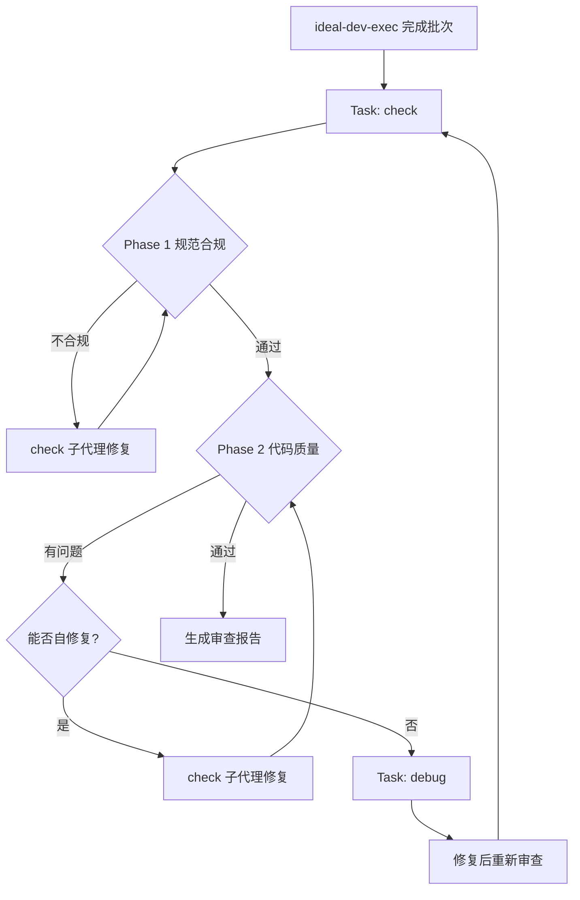
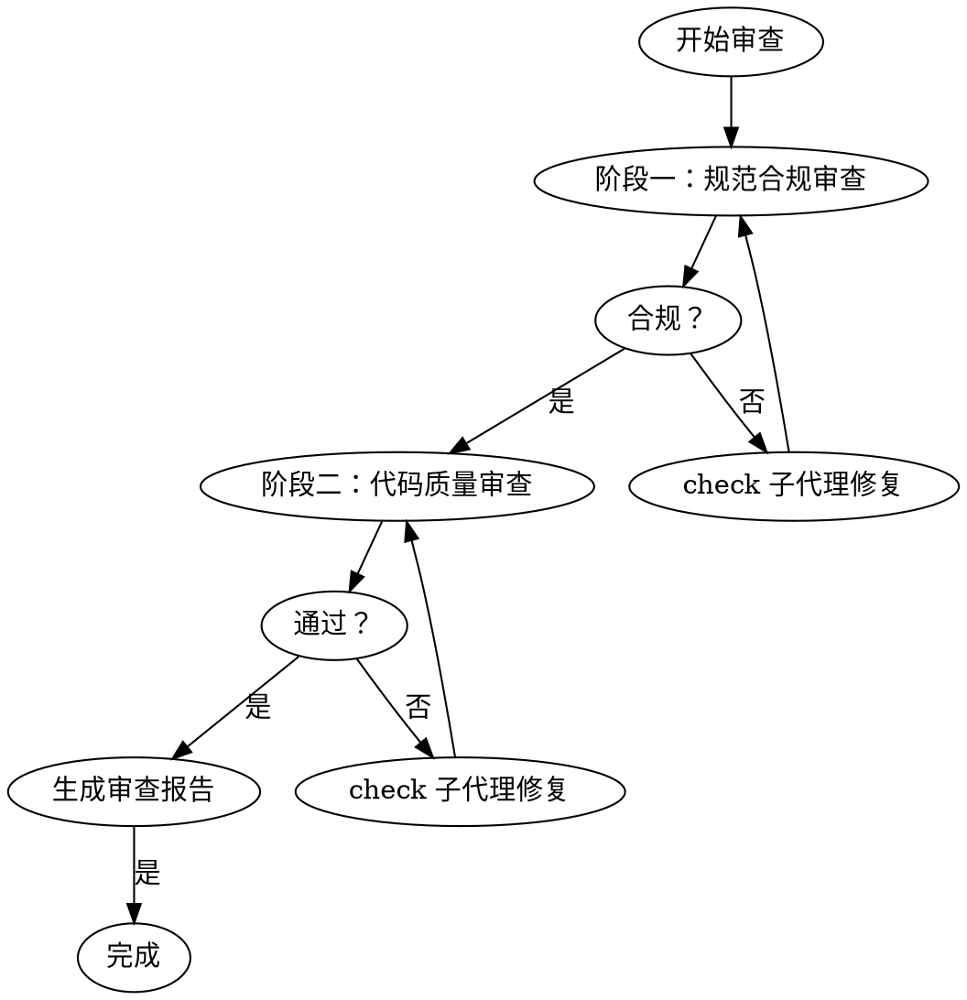

# ideal-code-review（代码审查）

## Overview

两阶段代码审查 skill，由 ideal-dev-exec 批次完成后自动调用。

**两阶段**：
1. 规范合规审查（是否按计划实现）
2. 代码质量审查（风格、性能、安全）

## Agents

本 Skill 通过 Task 工具调用以下子代理：

| Agent | 角色 | 用途 |
|-------|------|------|
| check | 代码检查工程师 | 两阶段审查、自我修复、验证 |

**调用方式**：通过 Task 工具调用，Hook 自动注入 jsonl 配置的上下文。

```markdown
Task(
    subagent_type: "check",
    prompt: "执行两阶段代码审查：规范合规 + 代码质量",
    model: "opus"
)
```

## When to Use

**自动调用**：
- ideal-dev-exec 每批次完成后
- ideal-dev-exec 最终验证后

**手动调用**：
- P10 代码评审阶段
- 合并前验证
- 修复复杂 bug 后

## Output

| 输出 | 路径 |
|------|------|
| 审查报告 | `docs/迭代/{需求名称}/P9.1-代码审查.md` |

---

## HARD GATE

```
╔══════════════════════════════════════════════════════════════════╗
║  NO CODE QUALITY REVIEW BEFORE SPEC COMPLIANCE PASS              ║
╚══════════════════════════════════════════════════════════════════╝
```

**必须先通过规范合规审查，才能进行代码质量审查。**

---

## Ralph Loop 配合



---

## Workflow



---

## Phase 1: Spec Compliance Review

### 目的

确认实现符合 P5 编码计划。

### 审查清单

```markdown
## 规范合规审查

### 功能实现
- [ ] 实现了计划中指定的所有功能？
- [ ] 没有遗漏计划中的功能？

### 范围控制
- [ ] 没有添加计划外的功能？
- [ ] 没有删除计划中的功能？

### 文件范围
- [ ] 只修改了计划中指定的文件？
- [ ] 没有意外的文件变更？

### 测试覆盖
- [ ] 测试覆盖了计划中的验证标准？
- [ ] 测试遵循 TDD 流程（先失败后通过）？

### 接口契约
- [ ] 接口签名符合计划？
- [ ] 数据结构符合计划？
```

### 不合规处理

```
规范审查失败
    │
    ▼
记录不合规项：
- 缺失功能: {list}
- 额外功能: {list}
- 文件偏差: {list}
    │
    ▼
调用 check 子代理修复
    │
    ▼
重新审查
```

---

## Phase 2: Code Quality Review

### 前置条件

**只有在 Phase 1 通过后才进行。**

### 审查清单

```markdown
## 代码质量审查

### 代码风格
- [ ] 命名清晰、一致？
- [ ] 代码格式符合项目规范？
- [ ] 注释适当、有意义？

### 可读性
- [ ] 逻辑清晰，易于理解？
- [ ] 函数/方法长度合理？
- [ ] 嵌套层次合理？

### 性能
- [ ] 无明显的性能问题？
- [ ] 无不必要的循环/递归？
- [ ] 资源使用合理？

### 安全
- [ ] 无安全隐患？
- [ ] 输入验证完整？
- [ ] 敏感数据处理正确？

### 可维护性
- [ ] 代码重复度低？
- [ ] 依赖关系清晰？
- [ ] 易于扩展？
```

### 问题分级

| 级别 | 说明 | 处理方式 |
|------|------|----------|
| Critical | 必须立即修复 | 阻断，立即修复 |
| Important | 应该修复 | 继续前修复 |
| Minor | 可选改进 | 记录，后续处理 |

### 有问题处理

```
质量审查有问题
    │
    ▼
记录问题：
- Critical: {list}
- Important: {list}
- Minor: {list}
    │
    ▼
Critical/Important 必须修复
    │
    ▼
调用 check 子代理修复
    │
    ▼
重新审查
```

---

## Review Report Format

### 文件路径

`docs/迭代/{需求名称}/P9.1-代码审查.md`

### 报告模板

```markdown
# P9.1-代码审查

## 概述

| 项目 | 内容 |
|------|------|
| 需求名称 | {requirement_name} |
| 审查日期 | {date} |
| 审查范围 | Batch {n} / 全部 |
| 审查人 | Claude Code |

---

## 阶段一：规范合规审查

### 功能实现

| 计划功能 | 实现状态 | 备注 |
|----------|----------|------|
| {feature} | ✅ 已实现 | - |

### 范围控制

| 检查项 | 状态 |
|--------|------|
| 无计划外功能 | ✅ / ❌ |
| 无遗漏功能 | ✅ / ❌ |
| 文件范围正确 | ✅ / ❌ |

**合规结论**: ✅ 通过 / ❌ 不合规

---

## 阶段二：代码质量审查

### 问题清单

| 级别 | 问题描述 | 文件位置 | 状态 |
|------|----------|----------|------|
| Critical | {description} | {file}:{line} | 待修复 |
| Important | {description} | {file}:{line} | 待修复 |
| Minor | {description} | {file}:{line} | 记录 |

### 质量评分

| 维度 | 评分 (1-5) | 说明 |
|------|------------|------|
| 代码风格 | {score} | {comment} |
| 可读性 | {score} | {comment} |
| 性能 | {score} | {comment} |
| 安全 | {score} | {comment} |
| 可维护性 | {score} | {comment} |

**质量结论**: ✅ 通过 / ❌ 需修复

---

## 审查结论

| 阶段 | 结果 |
|------|------|
| 规范合规 | ✅ 通过 |
| 代码质量 | ✅ 通过 |

**最终结论**: ✅ 审查通过

---

## 后续行动

| 行动项 | 负责人 | 状态 |
|--------|--------|------|
| {action} | Claude | 待执行 |
```

---

## Receiving Feedback Principles

### 核心原则

> Verify before implementing. Ask before assuming. Technical correctness over social comfort.

### 响应模式

```
1. READ: 完整阅读反馈，不反应
2. UNDERSTAND: 用自己的话重述要求（或询问）
3. VERIFY: 对照代码库现实检查
4. EVALUATE: 对此代码库技术上合理？
5. RESPOND: 技术确认或有理由反驳
6. IMPLEMENT: 一次一项，每项测试
```

### 禁止响应

- "You're absolutely right!"（明确违反 CLAUDE.md）
- "Great point!" / "Excellent feedback!"（表演性）
- "Let me implement that now"（验证前）

### 何时反驳

| 场景 | 说明 |
|------|------|
| 破坏现有功能 | 建议会导致其他功能失效 |
| 缺乏上下文 | 审查者不了解完整背景 |
| 违反 YAGNI | 建议添加未使用的功能 |
| 技术不正确 | 对此技术栈/项目不适用 |
| 遗留原因 | 存在历史/兼容性约束 |
| 架构冲突 | 与架构师决策冲突 |

---

## Quality Checklist

**Phase 1 完成**：
- [ ] 检查了所有计划功能
- [ ] 验证了文件范围
- [ ] 确认了测试覆盖

**Phase 2 完成**：
- [ ] 检查了代码风格
- [ ] 评估了可读性
- [ ] 评估了性能
- [ ] 评估了安全
- [ ] 评估了可维护性

**报告完成**：
- [ ] 生成了审查报告
- [ ] 记录了所有问题
- [ ] 明确了后续行动

---

## Integration with ideal-dev-exec

**ideal-dev-exec Step 5 自动调用**：

```markdown
### Step 5: 两阶段审查（每批次后）

#### 调用 check 子代理

```
Task(
    subagent_type: "check",
    prompt: "执行两阶段代码审查：规范合规 + 代码质量",
    model: "opus"
)
```

1. 生成审查报告
2. 写入 `docs/迭代/{需求}/P9.1-代码审查.md`
3. 根据审查结果决定是否继续
```

---

## References

- `references/templates/review-report-template.md` - 审查报告模板
