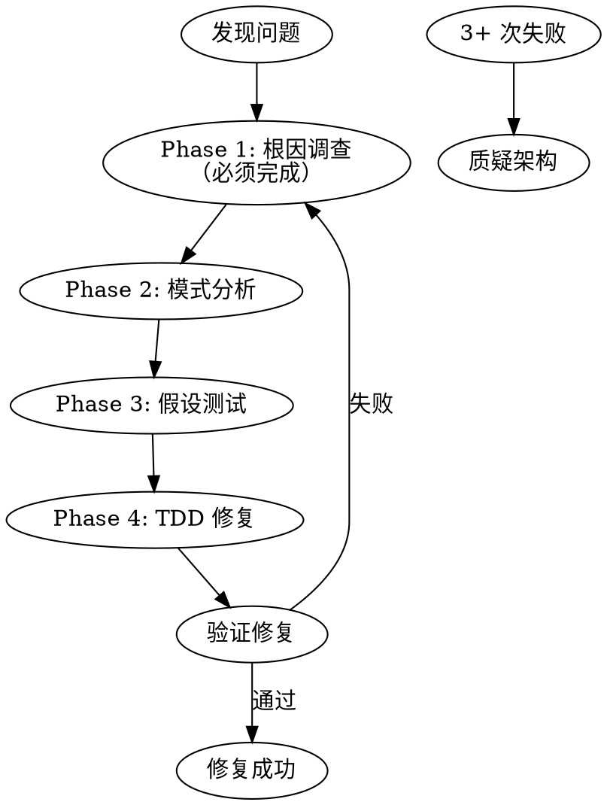

# ideal-debugging（系统化调试）

## Overview

系统化调试 skill，实现根因分析驱动的 bug 修复流程。

**不在 16 阶段中** - 任何阶段遇到 bug 时独立调用。

## Agents

本 Skill 调用以下角色能力：

| Agent | 角色 | 用途 |
|-------|------|------|
| dev | 开发工程师 | 根因分析、TDD 修复 |

请先阅读：`.claude/agents/dev.md`

## HARD GATE

```
╔══════════════════════════════════════════════════════════════════╗
║  NO FIXES WITHOUT ROOT CAUSE INVESTIGATION FIRST                  ║
╚══════════════════════════════════════════════════════════════════╝
```

**在完成 Phase 1 之前，禁止提出任何修复方案。**

## When to Use

- 测试失败（单元测试、集成测试、E2E 测试）
- 运行时错误
- 意外行为（实际输出与预期不符）
- 性能问题
- 任何需要调试的场景

## Trigger Points

| 触发场景 | 调用方式 |
|----------|----------|
| ideal-dev-exec 批次执行中失败 | 自动调用 |
| P11 测试执行发现 bug | 自动调用 |
| 任何阶段发现 bug | 手动调用 |

## Workflow



---

## Phase 1: Root Cause Investigation（必须完成）

**在提出任何修复前，必须完成此阶段。**

### 1.1 仔细阅读错误消息

```
□ 完整阅读错误消息和堆栈跟踪
□ 识别错误类型（TypeError, ReferenceError, AssertionError 等）
□ 定位错误发生位置（文件、行号、函数）
□ 记录错误上下文
```

### 1.2 一致地复现

```
□ 确定复现步骤
□ 多次执行确认稳定性
□ 记录复现条件（输入、状态、环境）
□ 确认是否随机/间歇性
```

### 1.3 检查最近变更

```bash
# 查看最近提交
git log --oneline -10

# 查看变更内容
git diff HEAD~5..HEAD

# 查看特定文件变更
git log -p -- path/to/file
```

### 1.4 收集证据

```
□ 检查相关日志
□ 检查数据库状态
□ 检查 API 请求/响应
□ 检查内存/CPU 状态
□ 检查并发情况
```

### 1.5 追踪数据流

```
□ 从输入到输出的完整路径
□ 识别数据转换点
□ 识别状态变更点
□ 识别边界条件
```

**Phase 1 输出**：
- 根因假设（最可能的原因）
- 证据支持
- 置信度（1-10）

---

## Phase 2: Pattern Analysis

### 2.1 找到工作示例

```
□ 搜索代码库中类似功能的正确实现
□ 识别成功路径
□ 对比成功和失败场景
```

### 2.2 对比参考

| 维度 | 成功场景 | 失败场景 |
|------|----------|----------|
| 输入 | {input} | {input} |
| 状态 | {state} | {state} |
| 输出 | {output} | {output} |

### 2.3 识别差异

```
□ 输入差异
□ 前置条件差异
□ 环境差异
□ 时序差异
```

### 2.4 理解依赖

```
□ 识别依赖组件
□ 检查依赖状态
□ 验证依赖版本
□ 检查依赖配置
```

---

## Phase 3: Hypothesis and Testing

### 3.1 形成单一假设

**一次只测试一个假设。**

```
假设: {单一、具体的根因假设}
预期: 如果假设正确，修改 {X} 应该解决问题
```

### 3.2 最小测试

```bash
# 编写最小复现测试
# 确认测试失败（验证假设）
```

### 3.3 验证后再继续

```
□ 假设验证结果
□ 如果失败，形成新假设
□ 如果成功，进入 Phase 4
```

### 3.4 诚实面对不确定性

```
如果不知道原因，明确说"不知道"，而不是猜测。
```

---

## Phase 4: Implementation (TDD)

### 4.1 创建失败测试用例

```markdown
**测试名称**: test_{bug_description}
**测试目的**: 复现 bug 并验证修复
**预期失败**: {failure_reason}
```

### 4.2 实现单一修复

**原则**：
- 最小修改
- 单一目的
- 不重构（除非是根因）

### 4.3 验证修复

```bash
# 运行新测试
{test_command}

# 运行相关测试
{related_test_command}

# 运行完整测试套件
{full_test_command}
```

### 4.4 如果修复无效

**返回 Phase 1**，重新调查。

---

## Red Flags: When to Stop and Question Architecture

**3+ 次修复失败后，停止调试，质疑架构设计。**

### 红旗模式

| 红旗 | 说明 |
|------|------|
| 共享状态耦合 | 每次修复在不同地方揭示新的共享状态问题 |
| 大规模重构 | 修复需要"大规模重构"才能工作 |
| 症状转移 | 每次修复在其他地方产生新症状 |
| 循环依赖 | 修复 A 导致 B 失败，修复 B 导致 A 失败 |

### 遇到红旗时

```
停止调试
    │
    ▼
报告架构问题：
- 当前症状
- 尝试过的修复
- 红旗模式
- 建议的架构调整
    │
    ▼
等待架构决策
```

---

## Output

**不落盘** - 调试过程只在执行时输出，不创建文档。

**输出格式**：

```markdown
## 调试报告

### 问题
{问题描述}

### 根因
{根因分析结果}

### 修复
{修复内容}

### 验证
{验证结果}
```

---

## Quality Checklist

**Phase 1 完成检查**：
- [ ] 完整阅读错误消息
- [ ] 成功复现问题
- [ ] 检查了最近变更
- [ ] 收集了相关证据
- [ ] 追踪了数据流
- [ ] 形成了根因假设

**Phase 4 完成检查**：
- [ ] 创建了失败测试用例
- [ ] 实现了最小修复
- [ ] 新测试通过
- [ ] 相关测试通过
- [ ] 完整测试套件通过

---

## Common Mistakes

| 错误 | 正确做法 | HARD GATE |
|------|----------|-----------|
| 直接修改代码 | 先完成 Phase 1 | ⚠️ 必须调查根因 |
| 猜测修复 | 形成假设并测试 | - |
| 修改多处 | 单一最小修复 | - |
| 忽略红旗 | 3 次失败后质疑架构 | - |
| 跳过测试 | 必须有失败测试 | ⚠️ TDD 铁律 |

---

## Integration with ideal-dev-exec

**ideal-dev-exec 遇到失败时自动调用**：

```markdown
### Step 4.4 错误处理

遇到任务失败时：
1. 暂停批次
2. 调用 ideal-debugging
3. 等待调试完成
4. 根据调试结果继续或等待介入
```

---

## References

- `references/debugging-checklist.md` - 调试检查清单（可选）
