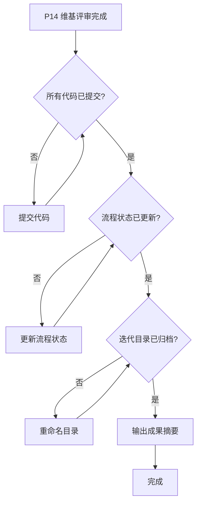

# ideal-delivery（P15 成果提交）

## Overview

完成迭代交付的最后一步：代码提交、状态更新、目录归档、成果摘要。

**核心原则**：先提交代码，再更新状态，最后归档。

**违反以下任何规则 = 违反 skill 精神**：
- 代码未提交就标记完成
- 跳过状态文件更新
- 忘记重命名迭代目录

---

## When to Use



### 触发条件

| 条件 | 说明 |
|------|------|
| P14 完成 | 维基评审通过 |
| 用户请求 | "标记完成"、"提交成果"、"归档" |
| 所有测试通过 | P11 测试评审已完成 |

### 不适用场景

- 开发未完成 → 返回 P9
- 测试未通过 → 返回 P11
- 维基未更新 → 返回 P13

---

## 成果提交清单

### 必须完成的动作

| 序号 | 动作 | 验证方式 |
|------|------|----------|
| 1 | 提交所有代码变更 | `git status` 显示 clean |
| 2 | 推送到远程仓库 | `git log` 确认推送成功 |
| 3 | 更新流程状态文件 | YAML 中 `status: completed` |
| 4 | 重命名迭代目录 | `[进行中]` → `[已完成]` |
| 5 | 提交状态更新 | 再次 commit & push |

---

## Step-by-Step Process

### Step 1: 验证前置条件

**检查项**：

```bash
# 检查当前阶段
cat docs/迭代/*/流程状态.md | grep current_phase
# 应该显示 current_phase: P14 或 P15

# 检查测试状态
cat docs/迭代/*/流程状态.md | grep -E "test|P11|P12"
# 应该显示 completed

# 检查维基状态
cat docs/迭代/*/流程状态.md | grep -E "wiki|P13|P14"
# 应该显示 completed 或 skipped
```

**如果前置条件不满足**：
- 报告缺少哪些阶段
- 询问用户是否继续（可能需要跳过某些阶段）

### Step 2: 提交代码变更

**IRON LAW: 必须先提交代码再更新状态**

```bash
# 检查未提交的变更
git status

# 如果有变更，提交
git add -A
git commit -m "feat: {需求名称} 开发完成"
git push origin {branch}
```

**提交消息格式**：

```
feat: {需求名称} 迭代完成

- 完成功能列表
- 测试覆盖情况
- 文档更新情况
```

**验证提交成功**：

```bash
git status
# 应该显示: nothing to commit, working tree clean
```

### Step 3: 更新流程状态

**修改 `docs/迭代/{需求名称}/流程状态.md`**：

```yaml
---
current_phase: P15
status: completed
requirement_name: {需求名称}
created_date: {创建日期}
completed_date: {完成日期}
stories_dir: docs/迭代/{需求名称}/stories/
---
```

**添加完成记录**：

```markdown
## 迭代完成

✅ {需求名称} 于 {日期} 完成

### 成果清单
- 代码提交：{commit hash}
- 测试覆盖：{测试数量} 个用例，{通过率}% 通过
- 文档更新：{文档列表}
```

### Step 4: 重命名迭代目录

**目录命名规范**：

```
原名称：docs/迭代/YYYY-MM-DD-[进行中]-{需求名称}/
新名称：docs/迭代/YYYY-MM-DD-[已完成]-{需求名称}/
```

**执行重命名**：

```bash
# 查找进行中的目录
ls docs/迭代/ | grep "\[进行中\]"

# 重命名
mv "docs/迭代/YYYY-MM-DD-[进行中]-{需求名称}" "docs/迭代/YYYY-MM-DD-[已完成]-{需求名称}"
```

### Step 5: 提交状态更新

**将状态更新提交到仓库**：

```bash
git add -A
git commit -m "chore: 标记 {需求名称} 需求迭代完成"
git push origin {branch}
```

### Step 6: 输出成果摘要

**摘要内容**：

```markdown
## 成果提交完成

### 迭代信息
- 需求名称：{名称}
- 开发周期：{开始日期} ~ {结束日期}
- 代码分支：{分支名}

### 交付成果
- 代码提交：{commit 数量} commits
- 功能实现：{功能列表}
- 测试覆盖：{测试数量} 个测试用例
- 文档更新：{文档列表}

### 代码变更
- 修改文件：{文件数量} 个
- 新增代码：{行数} 行
- 删除代码：{行数} 行

### 相关链接
- GitLab MR：{URL}
- 需求文档：docs/迭代/{需求名称}/P1-需求文档.md
- 技术方案：docs/迭代/{需求名称}/P3-技术方案.md

---

✅ 迭代已完成，可进行上线部署。
```

---

## Quality Checklist

- [ ] 前置条件已验证（P14 完成）
- [ ] 所有代码变更已提交
- [ ] 代码已推送到远程仓库
- [ ] 流程状态文件已更新
- [ ] 迭代目录已重命名
- [ ] 状态更新已提交推送
- [ ] 成果摘要已输出

---

## Common Mistakes

| 错误 | 正确做法 |
|------|----------|
| 代码未提交就标记完成 | 必须先 `git status` 确认 clean |
| 忘记推送到远程 | commit 后必须 push |
| 跳过流程状态更新 | 必须更新 YAML 中的 status |
| 忘记重命名目录 | `[进行中]` 必须改为 `[已完成]` |
| 成果摘要过于简单 | 包含完整的交付信息和链接 |
| 状态更新未提交 | 目录重命名后需要再次 commit |

## Red Flags - 立即停止

如果发现自己正在做以下事情，立即停止：

- "代码应该都提交了"（未验证 git status）
- "状态更新不重要"（必须更新）
- "目录名不用改"（必须重命名）
- "先标记完成，代码稍后提交"（必须先提交代码）
- "摘要简单写写就行"（必须完整）

**所有这些都意味着：停止，返回遵循规则。**

---

## 后续步骤

P15 完成后：

1. **CI/CD 自动触发**：如果配置了自动化流水线
2. **上线部署**：手动或自动部署到生产环境
3. **需求归档**：迭代目录已标记为 `[已完成]`

如果需要回退：
- 重新打开迭代目录（`[已完成]` → `[进行中]`）
- 创建新的分支修复问题
- 走正常的开发流程
