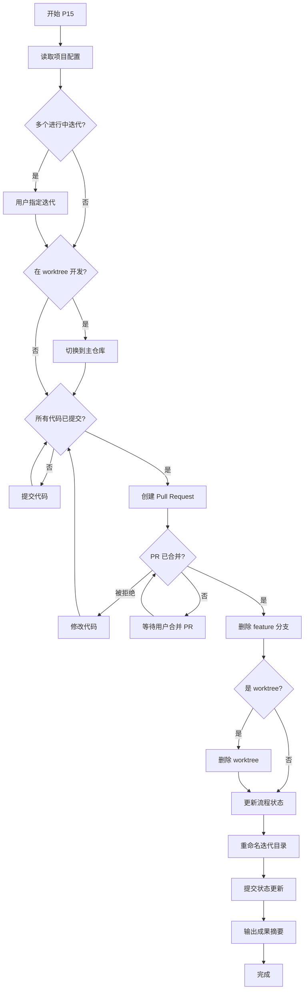
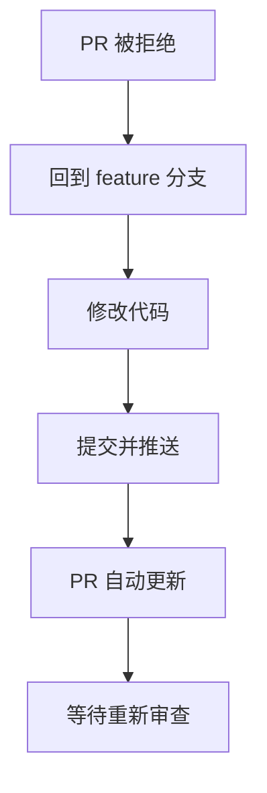

# ideal-delivery（P15 成果提交）

## Overview

完成迭代交付的最后一步：创建 PR、清理 worktree、更新状态、目录归档、成果摘要。

**核心原则**：先提交代码，再创建 PR，最后归档。

**违反以下任何规则 = 违反 skill 精神**：
- 直接合并到主分支（必须通过 PR）
- 代码未提交就标记完成
- 跳过状态文件更新
- 忘记重命名迭代目录
- worktree 未清理

---

## When to Use



### 触发条件

| 条件 | 说明 |
|------|------|
| P14 完成 | 维基评审通过 |
| 用户请求 | "标记完成"、"提交成果"、"归档" |
| 所有测试通过 | P11 测试评审已完成 |

### 不适用场景

- 开发未完成 → 返回 P9
- 测试未通过 → 返回 P11
- 维基未更新 → 返回 P13

---

## 成果提交清单

### 必须完成的动作

| 序号 | 动作 | 验证方式 |
|------|------|----------|
| 0 | 读取项目配置 | 确认主分支名 |
| 1 | 确定目标迭代 | 如有多个，用户已指定 |
| 2 | 提交所有代码变更 | `git status` 显示 clean |
| 3 | 创建 Pull Request | PR URL 可访问 |
| 4 | 等待 PR 合并 | PR 状态为 merged |
| 5 | 删除 feature 分支 | 分支已删除 |
| 6 | 删除 worktree（如适用） | worktree 目录已删除 |
| 7 | 更新流程状态文件 | YAML 中 `status: completed` |
| 8 | 重命名迭代目录 | `[进行中]` → `[已完成]` |
| 9 | 提交状态更新 | 再次 commit & push |

---

## Step-by-Step Process

### Step 0: 读取项目配置

**IRON LAW: 必须先读取项目配置，获取关键参数**

```bash
# 检查项目配置文件是否存在
cat .claude/project-config.md
```

**从项目配置中提取**：

| 配置项 | 配置文件中的位置 | 默认值 |
|--------|------------------|--------|
| 主分支名 | `默认分支` | main |
| 功能分支前缀 | `功能分支前缀` | feature/ |

**如果配置文件不存在**：
- 询问用户主分支名称（通常是 main 或 master）
- 询问功能分支前缀（通常是 feature/ 或空）

**将配置值存储为变量**：
- `{主分支名}` - 用于后续所有 git 操作
- `{功能分支前缀}` - 用于识别 feature 分支

### Step 1: 验证前置条件

**流程状态文件位置**：`docs/迭代/{YYYY-MM-DD}-[进行中]-{需求名称}/流程状态.md`

**文件格式**：Markdown 文件，包含 YAML frontmatter

```yaml
---
current_phase: P14
status: in_progress
requirement_name: {需求名称}
created_date: {创建日期}
stories_dir: docs/迭代/{需求名称}/stories/
---
```

**检查进行中迭代**：

```bash
# 找到进行中的迭代目录
ls docs/迭代/ | grep "\[进行中\]"
```

**⚠️ 如果有多个进行中迭代**：
- 列出所有进行中的迭代目录
- 询问用户要完成哪一个迭代
- 将选中的迭代路径存储为 `{迭代目录}` 变量

**验证命令**：

```bash
# 检查当前阶段（读取 frontmatter）
head -10 {迭代目录}/流程状态.md
# current_phase 应该是 P14 或 P15

# 检查阶段进度表中的测试和维基状态
cat {迭代目录}/流程状态.md | grep -E "P11|P12|P13|P14"
# 应该显示 ✅ completed 或 ⏭️ skipped
```

**如果前置条件不满足**：
- 报告缺少哪些阶段
- 询问用户是否继续（可能需要跳过某些阶段）

### Step 2: 检查开发环境

**IRON LAW: 必须在主仓库操作，不能在 worktree 中创建 PR**

```bash
# 检查是否在 worktree 中
git worktree list

# 当前路径是否在 worktree 目录下
pwd | grep worktree
```

**如果当前在 worktree 中**：

```bash
# 记录当前分支名
CURRENT_BRANCH=$(git branch --show-current)

# 切换到主仓库
cd {主仓库路径}

# 确保在主仓库
git worktree list
# 应该看到主仓库和 worktree 的列表
```

### Step 3: 提交代码变更

**IRON LAW: 必须先提交代码再创建 PR**

```bash
# 检查未提交的变更
git status

# 如果有变更，提交
git add -A
git commit -m "feat: {需求名称} 开发完成"
git push origin {feature-branch}
```

**提交消息格式**：

```
feat: {需求名称} 迭代完成

- 完成功能列表
- 测试覆盖情况
- 文档更新情况
```

**验证提交成功**：

```bash
git status
# 应该显示: nothing to commit, working tree clean
```

### Step 4: 创建 Pull Request

**IRON LAW: 禁止直接合并到主分支，必须通过 PR**

**方式一：使用 GitHub CLI 创建 PR**

```bash
# 创建 PR
gh pr create --title "feat: {需求名称}" --body "$(cat <<'EOF'
## 变更概述

{需求描述}

## 变更内容

- {变更项 1}
- {变更项 2}
- ...

## 测试情况

- 测试用例：{数量} 个
- 通过率：{百分比}%

## 检查清单

- [x] 代码已自测
- [x] 测试用例已通过
- [x] 文档已更新
EOF
)"
```

**方式二：在网页上手动创建 PR**

1. 推送分支后，GitHub 会显示创建 PR 的链接
2. 访问链接，填写 PR 标题和描述
3. 点击 "Create pull request"

**暂停等待用户合并 PR**：

```
Pull Request 已创建：{PR-URL}

请审查并合并 PR。合并后告诉我"已合并"，我将继续完成归档工作。
```

**注意**：GitHub PR 不会自动合并，需要你手动点击 "Merge" 按钮。

### Step 5: 合并后清理

**IRON LAW: PR 合并后必须删除 feature 分支和 worktree**

```bash
# 切换到主分支（使用 Step 0 中获取的主分支名）
git checkout {主分支名}

# 拉取最新代码
git pull origin {主分支名}

# 删除已合并的 feature 分支
git branch -d {feature-branch}
git push origin --delete {feature-branch}
```

**如果使用了 worktree，删除 worktree**：

```bash
# 查看所有 worktree
git worktree list

# 删除 worktree
git worktree remove {worktree路径}

# 验证删除成功
git worktree list
# 应该不再显示该 worktree

# 可选：删除 worktree 目录（如果还存在）
rm -rf {worktree路径}
```

### Step 6: 更新流程状态

**⚠️ 注意**：此步骤中涉及目录路径的更新，必须同步修改。

**修改 `{迭代目录}/流程状态.md`**：

更新 YAML frontmatter：

```yaml
---
current_phase: P15
status: completed
requirement_name: {需求名称}
created_date: {创建日期}
stories_dir: docs/迭代/{需求名称}/stories/
---
```

更新阶段进度表中的 P15 行：

```markdown
| P15 成果提交 | ✅ completed | {日期} | {备注} |
```

在文件末尾添加完成记录：

```markdown
## 迭代完成

✅ {需求名称} 于 {日期} 完成
```

**⚠️ 重要：stories_dir 路径更新**

由于 Step 7 会重命名目录，`stories_dir` 中的路径会失效。有两个选择：

1. **方案 A（推荐）**：先重命名目录（Step 7），再更新流程状态文件，确保 stories_dir 使用新路径
2. **方案 B**：在 stories_dir 中使用相对路径 `./stories/`，不依赖目录名

### Step 7: 重命名迭代目录

**目录命名规范**：

```
原名称：docs/迭代/YYYY-MM-DD-[进行中]-{需求名称}/
新名称：docs/迭代/YYYY-MM-DD-[已完成]-{需求名称}/
```

**执行重命名**：

```bash
# 查找进行中的目录
ls docs/迭代/ | grep "\[进行中\]"

# 重命名
mv "docs/迭代/YYYY-MM-DD-[进行中]-{需求名称}" "docs/迭代/YYYY-MM-DD-[已完成]-{需求名称}"
```

### Step 8: 提交状态更新

**将状态更新提交到仓库**：

```bash
git add -A
git commit -m "chore: 标记 {需求名称} 需求迭代完成"
git push origin {主分支名}
```

### Step 9: 输出成果摘要

**摘要内容**：

```markdown
## 成果提交完成

### 迭代信息
- 需求名称：{名称}
- 开发周期：{开始日期} ~ {结束日期}
- 代码分支：{分支名}（已删除）
- Pull Request：{PR-URL}（已合并）

### 交付成果
- 代码提交：{commit 数量} commits
- 功能实现：{功能列表}
- 测试覆盖：{测试数量} 个测试用例
- 文档更新：{文档列表}

### 代码变更
- 修改文件：{文件数量} 个
- 新增代码：{行数} 行
- 删除代码：{行数} 行

### 清理工作
- [x] Feature 分支已删除
- [x] Worktree 已删除（如适用）
- [x] 迭代目录已归档

### 相关链接
- Pull Request：{PR-URL}
- 需求文档：docs/迭代/{需求名称}/P1-需求文档.md
- 技术方案：docs/迭代/{需求名称}/P3-技术方案.md

---

✅ 迭代已完成，可进行上线部署。
```

---

## Quality Checklist

- [ ] 项目配置已读取（主分支名、功能分支前缀）
- [ ] 进行中迭代已确定（如有多个，用户已指定）
- [ ] 前置条件已验证（P14 完成）
- [ ] 已切换到主仓库（不在 worktree 中操作）
- [ ] 所有代码变更已提交
- [ ] Pull Request 已创建
- [ ] Pull Request 已合并
- [ ] Feature 分支已删除
- [ ] Worktree 已删除（如适用）
- [ ] 流程状态文件已更新（含 stories_dir 路径）
- [ ] 迭代目录已重命名
- [ ] 状态更新已提交推送
- [ ] 成果摘要已输出

---

## Common Mistakes

| 错误 | 正确做法 |
|------|----------|
| 直接合并到主分支 | 必须创建 Pull Request |
| 在 worktree 中创建 PR | 切换到主仓库再操作 |
| 忘记删除 feature 分支 | PR 合并后必须删除 |
| 忘记删除 worktree | 合并后必须清理 worktree |
| 代码未提交就标记完成 | 必须先 `git status` 确认 clean |
| 跳过流程状态更新 | 必须更新 YAML 中的 status |
| 忘记重命名目录 | `[进行中]` 必须改为 `[已完成]` |
| 成果摘要过于简单 | 包含完整的交付信息和链接 |
| 状态更新未提交 | 目录重命名后需要再次 commit |

## Red Flags - 立即停止

如果发现自己正在做以下事情，立即停止：

- "直接合并到 main 吧，更快"（必须通过 PR）
- "worktree 不用删"（必须清理）
- "分支留着以后用"（必须删除 feature 分支）
- "代码应该都提交了"（未验证 git status）
- "状态更新不重要"（必须更新）
- "目录名不用改"（必须重命名）
- "先标记完成，代码稍后提交"（必须先提交代码）

**所有这些都意味着：停止，返回遵循规则。**

---

## 后续步骤

P15 完成后：

1. **CI/CD 自动触发**：如果配置了自动化流水线
2. **上线部署**：手动或自动部署到生产环境
3. **需求归档**：迭代目录已标记为 `[已完成]`

如果需要回退：
- 重新打开迭代目录（`[已完成]` → `[进行中]`）
- 创建新的分支修复问题
- 走正常的开发流程

---

## Troubleshooting

### PR 被拒绝或需要修改

**场景**：PR 审查后发现问题，需要修改代码

**处理流程**：



**操作步骤**：

```bash
# 1. 切换回 feature 分支
git checkout {feature-branch}

# 2. 如果在 worktree 开发，切换到 worktree
cd {worktree路径}

# 3. 修改代码后提交
git add -A
git commit -m "fix: 根据审查意见修改"
git push origin {feature-branch}

# 4. PR 会自动更新，等待重新审查
```

### 合并冲突

**场景**：PR 合并时发现与主分支有冲突

**处理流程**：

```bash
# 1. 确保在 feature 分支
git checkout {feature-branch}

# 2. 拉取最新的主分支
git fetch origin {主分支名}

# 3. 变基到主分支
git rebase origin/{主分支名}

# 4. 解决冲突
# - 查看冲突文件：git status
# - 手动编辑冲突文件
# - 标记已解决：git add <冲突文件>

# 5. 继续变基
git rebase --continue

# 6. 强制推送（变基后需要）
git push origin {feature-branch} --force-with-lease
```

### 中断恢复

**场景**：在某个步骤中断，需要恢复进度

**恢复检查清单**：

| 检查项 | 命令 | 判断 |
|--------|------|------|
| 代码是否已提交 | `git status` | working tree clean = 已提交 |
| PR 是否已创建 | `gh pr list --head {branch}` | 有输出 = 已创建 |
| PR 是否已合并 | `gh pr view {PR号}` | state: MERGED = 已合并 |
| 分支是否已删除 | `git branch -a \| grep {branch}` | 无输出 = 已删除 |
| 目录是否已重命名 | `ls docs/迭代/` | 无 [进行中] = 已重命名 |

**根据检查结果确定当前阶段**：

- 代码未提交 → 从 Step 3 继续
- PR 未创建 → 从 Step 4 继续
- PR 未合并 → 等待用户合并后从 Step 5 继续
- 分支未删除 → 从 Step 5 继续
- 目录未重命名 → 从 Step 7 继续

### 小项目直接在主分支开发

**场景**：小项目没有使用分支策略，直接在主分支开发

**判断条件**：
- 项目只有一个开发者
- 没有配置 CI/CD
- 用户明确表示不需要 PR 流程

**简化流程**：

```bash
# 1. 确保在主分支
git checkout {主分支名}

# 2. 提交所有变更
git add -A
git commit -m "feat: {需求名称} 开发完成"
git push origin {主分支名}

# 3. 跳过 PR 创建和分支删除步骤
# 4. 继续执行 Step 6-9（更新状态、重命名目录、输出摘要）
```

**⚠️ 注意**：使用简化流程前必须确认用户同意，否则应遵循完整 PR 流程。

