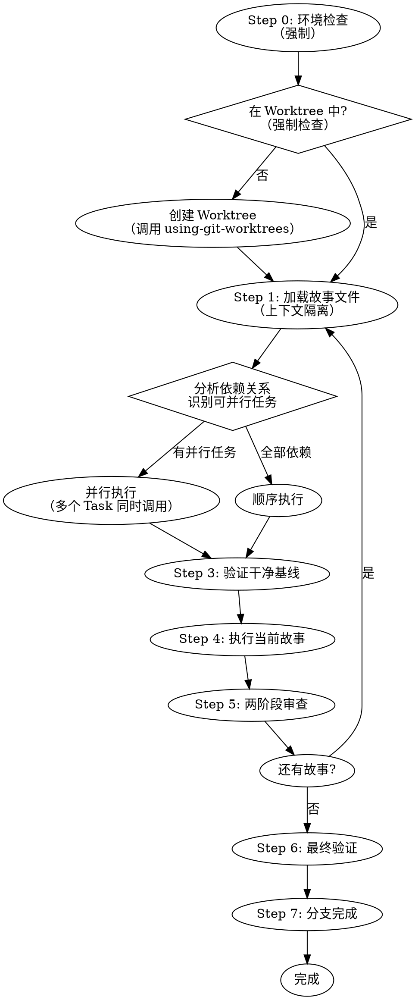
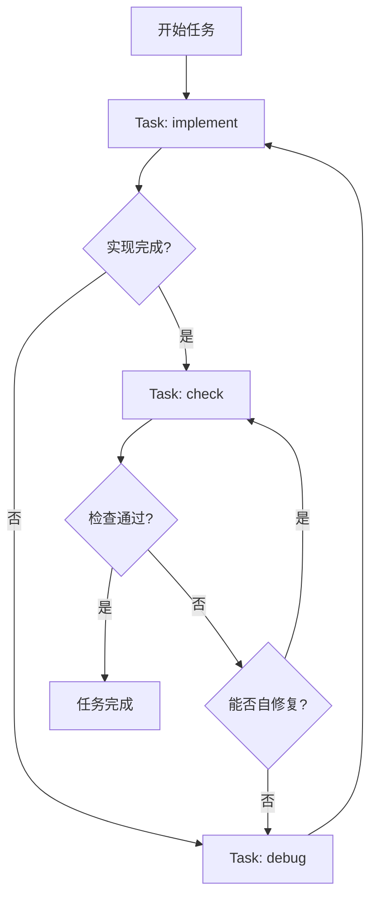

# ideal-dev-exec（P9 开发执行）

## Overview

执行编码计划，按 TDD 模式开发代码，创建 Git 分支和 Merge Request。

**核心原则**：
1. **强制环境隔离**：必须在 worktree 中执行开发
2. **并行优先**：无依赖的任务必须并行执行
3. **TDD 铁律**：测试先行，验证后完成

## Agents

本 Skill 通过 Task 工具调用以下子代理：

| Agent | 角色 | 用途 |
|-------|------|------|
| implement | 代码实现工程师 | 代码实现、TDD 开发 |
| check | 代码检查工程师 | 代码检查、自我修复、验证 |
| debug | 调试工程师 | 根因分析、问题调试 |

**调用方式**：通过 Task 工具调用，Hook 自动注入 jsonl 配置的上下文。

```markdown
Task(
    subagent_type: "implement",
    prompt: "实现 XXX 功能，上下文已自动注入",
    model: "opus"
)
```

## When to Use

- P8 用例评审已通过
- 需要执行 P5-编码计划.md 中的任务
- 需要创建代码和 MR

## Prerequisites

- `docs/迭代/{需求名称}/P5-编码计划.md` 存在
- `docs/迭代/{需求名称}/stories/index.md` 存在（推荐）
- `docs/迭代/{需求名称}/流程状态.md` 中 P8 状态为 completed

## Input

| 输入 | 路径 | 说明 |
|------|------|------|
| 故事索引 | `docs/迭代/{需求名称}/stories/index.md` | 当前故事和依赖关系 |
| 当前故事 | `docs/迭代/{需求名称}/stories/0XX-*.md` | 任务和验收标准（推荐） |
| 编码计划 | `docs/迭代/{需求名称}/P5-编码计划.md` | 完整计划（备用） |
| 测试用例 | `docs/迭代/{需求名称}/P7-测试用例.md` | 参考用例设计 |

## Output

| 输出 | 路径 | 说明 |
|------|------|------|
| 代码 | `src/` 或项目指定位置 | 实现代码 |
| 测试代码 | `tests/` 或项目指定位置 | 测试代码 |
| Git 分支 | Git 仓库 | 开发分支 |
| Merge Request | Gitea | MR 链接 |

---

## HARD GATES

```
╔══════════════════════════════════════════════════════════════════╗
║  NO PRODUCTION CODE WITHOUT A FAILING TEST FIRST                  ║
║  NO COMPLETION CLAIMS WITHOUT FRESH VERIFICATION EVIDENCE         ║
║  NO FIXES WITHOUT ROOT CAUSE INVESTIGATION FIRST                  ║
║  NO DEVELOPMENT WITHOUT WORKTREE ISOLATION                        ║
║  NO SEQUENTIAL EXECUTION OF INDEPENDENT TASKS                     ║
╚══════════════════════════════════════════════════════════════════╝
```

**HARD GATE 1: TDD Iron Law**

在测试前写实现代码 → 删除代码，重新开始

**HARD GATE 2: Verification Before Completion**

声称任何状态前：
1. IDENTIFY: 什么命令证明此声明？
2. RUN: 执行完整命令（新鲜、完整）
3. READ: 完整输出，检查退出码
4. VERIFY: 输出确认声明？
5. ONLY THEN: 做出声明

**HARD GATE 3: Debugging**

遇到 bug/测试失败时，提出修复前必须完成根因调查。

**HARD GATE 4: Worktree Isolation (新增)**

在主仓库直接开发 → 停止，必须先创建 worktree

**HARD GATE 5: Parallel Execution (新增)**

无依赖任务顺序执行 → 必须改为并行

---

## Workflow



---

## Ralph Loop 执行机制

### 核心循环



### 子代理职责

| 子代理 | 职责 | 调用时机 |
|--------|------|----------|
| implement | 纯代码实现 | 每个任务开始时 |
| check | 代码检查和自修复 | implement 完成后 |
| debug | 根因分析和调试 | check 失败且无法自修复 |

### Hook 自动注入

通过 jsonl 配置，Hook 会自动为 Task 调用注入上下文：

```json
{
  "subagent_type": "implement",
  "context_files": [
    "docs/迭代/{需求}/stories/current.md",
    ".claude/agents/implement.md"
  ],
  "context_dirs": [
    "src/"
  ]
}
```

---

## Step-by-Step Process

### Step 0: 环境检查（强制）

**此步骤是强制的，不可跳过。**

#### 0.1 检查是否在 Worktree 中

执行以下命令检查当前环境：

```bash
git worktree list
```

分析输出：
- 如果当前路径在 worktree 列表中 → 继续执行
- 如果不在 worktree 中 → **必须创建 worktree**

#### 0.2 创建 Worktree（如果需要）

**如果不在 worktree 中，必须调用 `using-git-worktrees` Skill**：

```
Skill(
    skill: "using-git-worktrees",
    args: "{需求名称}"
)
```

**红名单 - 停止并创建 Worktree**：
- 当前在主仓库根目录
- 当前在 main/master 分支
- 当前路径不在 `git worktree list` 输出中

**不创建 Worktree 的情况**：
- 当前已在 worktree 中
- 用户明确要求跳过（需记录原因）

#### 0.3 读取项目配置

1. 读取 `.claude/project-config.md`
2. 获取 Git 配置：
   - 默认分支
   - 分支前缀
3. 获取执行配置：
   - 测试命令
   - 构建命令
4. 如配置项缺失，使用默认值

**默认值**:
| 配置项 | 默认值 |
|--------|--------|
| default_branch | main |
| branch_prefix.feature | feature/ |
| branch_prefix.fix | fix/ |
| branch_prefix.refactor | refactor/ |
| test_command | npm test |
| build_command | npm run build |

---

### Step 1: 加载故事文件并分析依赖（上下文隔离 + 并行分析）

**重要**：此步骤同时完成上下文加载和并行执行分析。

#### 1.1 读取故事索引

```
docs/迭代/{需求名称}/stories/index.md
```

从索引中提取：
- 故事列表和状态
- **依赖关系图**（用于并行分析）
- 当前应执行的故事

#### 1.2 分析并行执行机会

**解析依赖关系**：


**判断规则**：
| 条件 | 执行策略 |
|------|----------|
| 多个故事无依赖 | **parallel** - 必须并行执行 |
| 故事间有依赖 | **sequential** - 按依赖顺序执行 |
| 混合依赖 | **hybrid** - 按拓扑层级分批执行 |

**拓扑层级示例**：
```
第 1 层（可并行）: Story 001（无依赖）
第 2 层（可并行）: Story 002, 003, 004（都只依赖 001）
第 3 层: Story 005（依赖 002, 003, 004）
```

#### 1.3 加载当前故事文件

```
docs/迭代/{需求名称}/stories/0XX-*.md
```

故事文件包含：
- **上下文**：相关需求和技术方案片段
- **任务清单**：具体开发任务
- **验收标准**：完成条件

**上下文边界**：
- ✅ 只加载当前故事文件的内容
- ❌ 不要加载整个 P1/P3/P5 文档
- ✅ 故事文件已包含所需的上下文片段

---

### Step 2: 验证干净基线

**必须验证**：开发前确保基线测试通过

```bash
# 运行项目测试
{test_command}

# 预期：所有测试通过（exit 0）
```

**如果基线失败**：
1. 报告失败原因
2. 等待人工介入
3. 不继续开发

---

### Step 3: 并行执行调度（强制）

**此步骤是强制的 - 无依赖任务必须并行执行。**

#### 3.1 识别执行策略

基于 Step 1.2 的依赖分析，选择执行策略：

| 策略 | 条件 | 实现 |
|------|------|------|
| `team-parallel` | 2+ 个无依赖任务 | **多个 Task 并行调用** |
| `subagent-sequential` | 全部有依赖 | 单 Task 顺序调用 |
| `hybrid` | 混合依赖 | 按拓扑层级分批执行 |

#### 3.2 并行执行实现

**当存在可并行任务时，必须使用以下方式之一**：

**方式 1：使用 dispatching-parallel-agents Skill（推荐）**

```
Skill(
    skill: "dispatching-parallel-agents",
    args: "Story 002, Story 003, Story 004"
)
```

**方式 2：多个 Task 同时调用**

```markdown
在单个消息中同时调用多个 Task：

Task(subagent_type: "implement", prompt: "执行 Story 002...")
Task(subagent_type: "implement", prompt: "执行 Story 003...")
Task(subagent_type: "implement", prompt: "执行 Story 004...")
```

**红名单 - 禁止顺序执行独立任务**：
- 有多个无依赖故事但只调用一个 Task
- 故事标注为 `parallel` 但仍顺序执行
- 未分析依赖关系就顺序执行所有任务

#### 3.3 拓扑层级执行

对于混合依赖，按层级执行：

```
第 1 批（并行）: Story 001
    ↓ 等待完成
第 2 批（并行）: Story 002, 003, 004
    ↓ 等待全部完成
第 3 批: Story 005
    ↓
...
```

---

### Step 4: 执行当前故事

**调用 implement 子代理执行任务**：

```
Task(
    subagent_type: "implement",
    prompt: "执行故事文件中的任务清单，遵循 TDD 铁律",
    model: "opus"
)
```

**执行当前故事的任务**：

1. **阅读任务清单**：从故事文件获取具体任务
2. **TDD 循环**（对每个任务）：
   - 🔴 红：编写失败的测试
   - 🟢 绿：编写最小实现让测试通过
   - 🔵 重构：优化代码结构
   - ✅ 提交：通过验证后标记任务完成

3. **验收检查**：完成后对照故事文件的验收标准验证

**完成后更新故事状态**：
- 更新故事文件的"实现笔记"
- 勾选完成的任务和验收标准
- 将故事状态改为 `completed`

#### 4.1 执行模式

| 模式 | 触发条件 | 实现 |
|------|----------|------|
| team-parallel | Batch 内 2+ 个 parallel 任务 | 多 Task 并行调用 |
| subagent-sequential | 单一 sequential 链 | 单 Task 顺序调用 |
| hybrid | 混合依赖 | 按拓扑层级分批执行 |

#### 4.2 TDD 循环（每个任务）

**RED 阶段：**
1. 编写失败的测试用例
2. 运行测试，**确认失败**
3. 确认失败原因是正确的

**GREEN 阶段：**
1. 编写**最小代码**使测试通过
2. 运行测试，**确认通过**
3. 不要过度实现

**REFACTOR 阶段：**
1. 清理代码
2. **保持测试通过**
3. 提交代码

#### 4.3 并行执行规则

1. 同一层级的 parallel 任务可同时启动
2. 等待所有同层任务完成后再启动下一层
3. 每个任务完成后验证测试通过
4. 任务失败时暂停，等待人工介入

#### 4.4 错误处理

| 错误类型 | 处理方式 |
|----------|----------|
| 单任务失败 | 暂停批次，**调用 debug 子代理** |
| 依赖失败 | 跳过依赖此任务的所有后续任务 |
| 超时 | 标记超时，报告进度，等待介入 |

**遇到失败时调用 debug 子代理**：

```
Task(
    subagent_type: "debug",
    prompt: "任务执行失败，进行根因分析和调试",
    model: "opus"
)
```

---

### Step 5: 两阶段审查

**每个故事完成后执行审查**：（每批次后）

**调用 check 子代理**：

```
Task(
    subagent_type: "check",
    prompt: "执行两阶段代码审查：规范合规 + 代码质量",
    model: "opus"
)
```

```
批次完成
    │
    ▼
调用 check 子代理
    │
    ├── 阶段一：规范合规审查
    │   └── 不合规 → 修复 → 重新审查
    │
    ├── 阶段二：代码质量审查
    │   └── 有问题 → 修复 → 重新审查
    │
    └── 生成审查报告
        └── docs/迭代/{需求}/P9.1-代码审查.md
```

#### 5.1 规范合规审查（Phase 1）

**目的**：确认实现符合 P5 编码计划

**审查清单**：
- [ ] 实现了计划中指定的功能？
- [ ] 没有添加计划外的功能？
- [ ] 文件范围符合计划？
- [ ] 测试覆盖了计划中的验证标准？

#### 5.2 代码质量审查（Phase 2）

**目的**：确认代码质量符合标准

**审查清单**：
- [ ] 代码风格符合项目规范？
- [ ] 无明显的性能问题？
- [ ] 无安全隐患？
- [ ] 代码可读性良好？

---

### Step 6: 最终验证

**所有批次完成后必须验证**：

```bash
# 1. 运行完整测试套件
{test_command}

# 2. 预期：所有测试通过
# 3. 记录输出作为完成证据
```

**验证清单**：
- [ ] 所有测试通过（有输出证据）
- [ ] 所有任务已完成
- [ ] 两阶段审查通过
- [ ] 代码已提交

---

### Step 7: 分支完成

**展示 4 个选项**：

| 选项 | 说明 | 合并 | 推送 | 清理 Worktree |
|------|------|------|------|----------------|
| 1. 本地合并 | 合并到基础分支 | ✓ | - | ✓ |
| 2. 创建 PR | 推送并创建 MR | - | ✓ | ✓（MR 关闭后） |
| 3. 保持原样 | 稍后处理 | - | - | - |
| 4. 丢弃工作 | 放弃此开发 | - | - | ✓（强制） |

**执行选择后**：
1. 更新流程状态
2. 清理资源（如适用）
3. 输出最终报告

---

## Git Branch Strategy

从 `project-config.md` 读取分支配置：

```
{default_branch}
  └── {branch_prefix.feature}{需求名称}
        └── [开发提交]
```

**分支命名（可配置）**:
- 功能开发：`{branch_prefix.feature}{需求名称}`
- Bug 修复：`{branch_prefix.fix}{需求名称}`
- 重构：`{branch_prefix.refactor}{需求名称}`

---

## Commit Message Format

```
{type}({scope}): {subject}

{body}
```

**类型：**
| 类型 | 说明 |
|------|------|
| `feat` | 新功能 |
| `fix` | Bug 修复 |
| `refactor` | 重构 |
| `test` | 测试 |
| `docs` | 文档 |

---

## Progress Tracking

使用 TodoWrite 跟踪：
- 每个 Batch 作为一个阶段
- 每个任务作为一个 todo item
- 完成时立即标记

**批次报告格式**：
```markdown
## Batch {n} 完成

| 任务 | 状态 | 耗时 | 备注 |
|------|------|------|------|
| M1 | ✅ 完成 | 28min | - |
| M2 | ✅ 完成 | 22min | - |

**批次耗时**: 28min（并行执行）
**累计进度**: 2/5 模块完成
```

---

## Quality Checklist

每个任务完成时验证：

- [ ] 测试先写且先失败
- [ ] 最小代码使测试通过
- [ ] 所有测试通过（有输出证据）
- [ ] 代码已提交
- [ ] 规范合规审查通过
- [ ] 代码质量审查通过

---

## Common Mistakes

| 错误 | 正确做法 | HARD GATE |
|------|----------|-----------|
| 先写代码再写测试 | 必须先写测试 | ⚠️ HARD GATE 1: 删除代码，重新开始 |
| 测试没有先失败 | 确认测试正确性 | ⚠️ 验证失败原因 |
| 无证据声称完成 | 必须有验证输出 | ⚠️ HARD GATE 2: 不允许声称 |
| 一次实现多个功能 | 每次只实现一个小功能 | - |
| 跳过审查 | 每批次必须审查 | ⚠️ 必须通过两阶段审查 |
| 未分析根因就修复 | 必须先调查根因 | ⚠️ HARD GATE 3 |
| **在主仓库直接开发** | 必须在 worktree 中开发 | ⚠️ HARD GATE 4: 停止，创建 worktree |
| **无依赖任务顺序执行** | 必须并行执行 | ⚠️ HARD GATE 5: 改为并行调用 |

### Worktree 违规的红名单

以下情况**必须停止并创建 worktree**：
- 当前在主仓库根目录
- 当前在 main/master 分支
- `git worktree list` 不包含当前路径
- 跳过 Step 0 环境检查

**不创建 worktree 的唯一例外**：
- 用户明确要求跳过（需记录原因到流程状态.md）

### 并行执行违规的红名单

以下情况**必须改为并行执行**：
- 故事索引标注为 `parallel` 但顺序执行
- 多个故事无依赖但只调用一个 Task
- 未分析依赖关系就顺序执行所有任务
- 在单个响应中只调用一个 Task 处理多个独立故事

**正确的并行实现**：
```markdown
✅ 单个消息中同时调用多个 Task：
Task(subagent_type: "implement", prompt: "执行 Story 002...")
Task(subagent_type: "implement", prompt: "执行 Story 003...")
Task(subagent_type: "implement", prompt: "执行 Story 004...")
```

---

## Debugging Flow

遇到 bug 或测试失败时，调用 debug 子代理：

```
Task(
    subagent_type: "debug",
    prompt: "执行系统化调试：Phase 1 根因调查 → Phase 2 模式分析 → Phase 3 假设测试 → Phase 4 TDD 修复",
    model: "opus"
)
```

**调试流程**：
```
Phase 1: 根因调查（修复前必须完成）
    │
    ├─ 1. 仔细阅读错误消息
    ├─ 2. 一致地复现
    ├─ 3. 检查最近变更
    ├─ 4. 收集证据
    └─ 5. 追踪数据流
    │
    ▼
Phase 2: 模式分析
    │
    ├─ 1. 找到工作示例
    ├─ 2. 对比参考
    └─ 3. 识别差异
    │
    ▼
Phase 3: 假设和测试
    │
    ├─ 1. 形成单一假设
    ├─ 2. 最小测试
    └─ 3. 验证后再继续
    │
    ▼
Phase 4: 实现（遵循 TDD）
    │
    ├─ 1. 创建失败测试用例
    ├─ 2. 实现单一修复
    └─ 3. 验证修复
```

**3+ 修复失败后**：停止，质疑架构设计

**详细流程见 ideal-debugging skill**

---

## Skill Dependencies

**本 skill 通过 Task 工具调用以下子代理**：

| 子代理 | 触发时机 | 用途 |
|--------|----------|------|
| implement | 每个任务开始 | 代码实现 |
| check | implement 完成后 | 两阶段代码审查 |
| debug | 任务失败时 | 系统化调试 |

---

## References

- `references/execution-strategy.md` - 执行策略详情
- `references/progress-tracking.md` - 进度跟踪
- **ideal-code-review** - 两阶段代码审查 skill
- **ideal-debugging** - 系统化调试 skill

---

## Next Steps

开发执行后：
1. 进入 P10 代码评审阶段
2. 评审通过后调用 `ideal-test-exec` 执行测试
