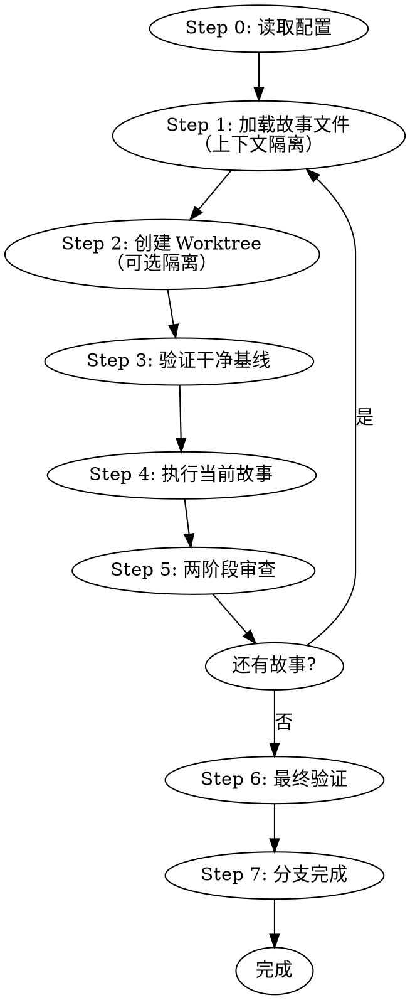

# ideal-dev-exec（P9 开发执行）

## Overview

执行编码计划，按 TDD 模式开发代码，创建 Git 分支和 Merge Request。

## Agents

本 Skill 调用以下角色能力：

| Agent | 角色 | 用途 |
|-------|------|------|
| dev | 开发工程师 | 代码实现、TDD 开发、调试 |

请先阅读：`.claude/agents/dev.md`

## When to Use

- P8 用例评审已通过
- 需要执行 P5-编码计划.md 中的任务
- 需要创建代码和 MR

## Prerequisites

- `docs/迭代/{需求名称}/P5-编码计划.md` 存在
- `docs/迭代/{需求名称}/stories/index.md` 存在（推荐）
- `docs/迭代/{需求名称}/流程状态.md` 中 P8 状态为 completed

## Input

| 输入 | 路径 | 说明 |
|------|------|------|
| 故事索引 | `docs/迭代/{需求名称}/stories/index.md` | 当前故事和依赖关系 |
| 当前故事 | `docs/迭代/{需求名称}/stories/0XX-*.md` | 任务和验收标准（推荐） |
| 编码计划 | `docs/迭代/{需求名称}/P5-编码计划.md` | 完整计划（备用） |
| 测试用例 | `docs/迭代/{需求名称}/P7-测试用例.md` | 参考用例设计 |

## Output

| 输出 | 路径 | 说明 |
|------|------|------|
| 代码 | `src/` 或项目指定位置 | 实现代码 |
| 测试代码 | `tests/` 或项目指定位置 | 测试代码 |
| Git 分支 | Git 仓库 | 开发分支 |
| Merge Request | Gitea | MR 链接 |

---

## HARD GATES

```
╔══════════════════════════════════════════════════════════════════╗
║  NO PRODUCTION CODE WITHOUT A FAILING TEST FIRST                  ║
║  NO COMPLETION CLAIMS WITHOUT FRESH VERIFICATION EVIDENCE         ║
║  NO FIXES WITHOUT ROOT CAUSE INVESTIGATION FIRST                  ║
╚══════════════════════════════════════════════════════════════════╝
```

**HARD GATE 1: TDD Iron Law**

在测试前写实现代码 → 删除代码，重新开始

**HARD GATE 2: Verification Before Completion**

声称任何状态前：
1. IDENTIFY: 什么命令证明此声明？
2. RUN: 执行完整命令（新鲜、完整）
3. READ: 完整输出，检查退出码
4. VERIFY: 输出确认声明？
5. ONLY THEN: 做出声明

**HARD GATE 3: Debugging**

遇到 bug/测试失败时，提出修复前必须完成根因调查。

---

## Workflow



---

## Step-by-Step Process

### Step 0: 读取项目配置

1. 读取 `.claude/project-config.md`
2. 获取 Git 配置：
   - 默认分支
   - 分支前缀
3. 获取执行配置：
   - 测试命令
   - 构建命令
   - 是否使用 worktree 隔离
4. 如配置项缺失，使用默认值

**默认值**:
| 配置项 | 默认值 |
|--------|--------|
| default_branch | main |
| branch_prefix.feature | feature/ |
| branch_prefix.fix | fix/ |
| branch_prefix.refactor | refactor/ |
| test_command | npm test |
| build_command | npm run build |
| use_worktree | false |

---

### Step 1: 加载故事文件（上下文隔离）

<!-- AGENT: dev -->
你现在扮演开发工程师角色。请阅读 `.claude/agents/dev.md` 了解 TDD 铁律和开发原则。

**重要**：上下文隔离是提高开发质量的关键。

**加载步骤**：

1. **读取故事索引**
   ```
   docs/迭代/{需求名称}/stories/index.md
   ```
   - 确认当前应执行的故事
   - 检查前置依赖是否完成

2. **加载当前故事文件**
   ```
   docs/迭代/{需求名称}/stories/0XX-*.md
   ```

   故事文件包含：
   - **上下文**：相关需求和技术方案片段（只加载这些，不要加载完整文档）
   - **任务清单**：具体开发任务
   - **验收标准**：完成条件

3. **上下文边界**
   - ✅ 只加载当前故事文件的内容
   - ❌ 不要加载整个 P1/P3/P5 文档
   - ✅ 故事文件已包含所需的上下文片段

**如果故事文件不存在**：
- 回退到加载完整 P5-编码计划.md
- 提示用户建议在 P5 阶段生成故事文件
<!-- END AGENT -->

---

### Step 2: 创建 Worktree（可选隔离）

**何时使用 Worktree**：
- 需要并行开发多个需求
- 需要隔离开发环境
- 主分支有未提交的变更

**Worktree 创建流程**：

```bash
# 1. 检测项目名
PROJECT_NAME=$(basename "$(git rev-parse --show-toplevel)")

# 2. 确定目录
# 优先级：.worktrees/ > worktrees/ > ~/.config/ideal/worktrees/
if [ -d ".worktrees" ]; then
    LOCATION=".worktrees"
elif [ -d "worktrees" ]; then
    LOCATION="worktrees"
else
    LOCATION="$HOME/.config/ideal/worktrees"
fi

# 3. 创建 worktree
BRANCH_NAME="${branch_prefix.feature}${需求名称}"
git worktree add "$LOCATION/$BRANCH_NAME" -b "$BRANCH_NAME"

# 4. 切换到 worktree
cd "$LOCATION/$BRANCH_NAME"
```

**安全验证**：

对于项目本地目录（.worktrees 或 worktrees）：
```bash
# 必须验证目录被忽略
git check-ignore -q .worktrees || echo ".worktrees/" >> .gitignore
```

---

### Step 3: 验证干净基线

**必须验证**：开发前确保基线测试通过

```bash
# 运行项目测试
{test_command}

# 预期：所有测试通过（exit 0）
```

**如果基线失败**：
1. 报告失败原因
2. 等待人工介入
3. 不继续开发

---

### Step 4: 执行当前故事

<!-- AGENT: dev -->
你现在扮演开发工程师角色。请阅读 `.claude/agents/dev.md` 了解 TDD 流程。

**执行当前故事的任务**：

1. **阅读任务清单**：从故事文件获取具体任务
2. **TDD 循环**（对每个任务）：
   - 🔴 红：编写失败的测试
   - 🟢 绿：编写最小实现让测试通过
   - 🔵 重构：优化代码结构
   - ✅ 提交：通过验证后标记任务完成

3. **验收检查**：完成后对照故事文件的验收标准验证

**完成后更新故事状态**：
- 更新故事文件的"实现笔记"
- 勾选完成的任务和验收标准
- 将故事状态改为 `completed`
<!-- END AGENT -->

#### 4.1 执行模式

| 模式 | 触发条件 | 实现 |
|------|----------|------|
| team-parallel | Batch 内 2+ 个 parallel 任务 | 多 Task 并行调用 |
| subagent-sequential | 单一 sequential 链 | 单 Task 顺序调用 |
| hybrid | 混合依赖 | 按拓扑层级分批执行 |

#### 4.2 TDD 循环（每个任务）

**RED 阶段：**
1. 编写失败的测试用例
2. 运行测试，**确认失败**
3. 确认失败原因是正确的

**GREEN 阶段：**
1. 编写**最小代码**使测试通过
2. 运行测试，**确认通过**
3. 不要过度实现

**REFACTOR 阶段：**
1. 清理代码
2. **保持测试通过**
3. 提交代码

#### 4.3 并行执行规则

1. 同一层级的 parallel 任务可同时启动
2. 等待所有同层任务完成后再启动下一层
3. 每个任务完成后验证测试通过
4. 任务失败时暂停，等待人工介入

#### 4.4 错误处理

| 错误类型 | 处理方式 |
|----------|----------|
| 单任务失败 | 暂停批次，**调用 ideal-debugging** |
| 依赖失败 | 跳过依赖此任务的所有后续任务 |
| 超时 | 标记超时，报告进度，等待介入 |

**遇到失败时自动调用 ideal-debugging**：

```
任务失败
    │
    ▼
暂停批次
    │
    ▼
调用 ideal-debugging
    │
    ├── Phase 1: 根因调查
    ├── Phase 2: 模式分析
    ├── Phase 3: 假设测试
    └── Phase 4: TDD 修复
    │
    ▼
修复成功？
    ├── 是 → 继续批次
    └── 否 → 等待人工介入
```

---

### Step 5: 两阶段审查

**每个故事完成后执行审查**：（每批次后）

**自动调用 ideal-code-review skill**

```
批次完成
    │
    ▼
调用 ideal-code-review
    │
    ├── 阶段一：规范合规审查
    │   └── 不合规 → 修复 → 重新审查
    │
    ├── 阶段二：代码质量审查
    │   └── 有问题 → 修复 → 重新审查
    │
    └── 生成审查报告
        └── docs/迭代/{需求}/P9.1-代码审查.md
```

#### 5.1 规范合规审查（ideal-code-review Phase 1）

**目的**：确认实现符合 P5 编码计划

**审查清单**（详见 ideal-code-review skill）：
- [ ] 实现了计划中指定的功能？
- [ ] 没有添加计划外的功能？
- [ ] 文件范围符合计划？
- [ ] 测试覆盖了计划中的验证标准？

#### 5.2 代码质量审查（ideal-code-review Phase 2）

**目的**：确认代码质量符合标准

**审查清单**（详见 ideal-code-review skill）：
- [ ] 代码风格符合项目规范？
- [ ] 无明显的性能问题？
- [ ] 无安全隐患？
- [ ] 代码可读性良好？

---

### Step 6: 最终验证

**所有批次完成后必须验证**：

```bash
# 1. 运行完整测试套件
{test_command}

# 2. 预期：所有测试通过
# 3. 记录输出作为完成证据
```

**验证清单**：
- [ ] 所有测试通过（有输出证据）
- [ ] 所有任务已完成
- [ ] 两阶段审查通过
- [ ] 代码已提交

---

### Step 7: 分支完成

**展示 4 个选项**：

| 选项 | 说明 | 合并 | 推送 | 清理 Worktree |
|------|------|------|------|----------------|
| 1. 本地合并 | 合并到基础分支 | ✓ | - | ✓ |
| 2. 创建 PR | 推送并创建 MR | - | ✓ | ✓（MR 关闭后） |
| 3. 保持原样 | 稍后处理 | - | - | - |
| 4. 丢弃工作 | 放弃此开发 | - | - | ✓（强制） |

**执行选择后**：
1. 更新流程状态
2. 清理资源（如适用）
3. 输出最终报告

---

## Git Branch Strategy

从 `project-config.md` 读取分支配置：

```
{default_branch}
  └── {branch_prefix.feature}{需求名称}
        └── [开发提交]
```

**分支命名（可配置）**:
- 功能开发：`{branch_prefix.feature}{需求名称}`
- Bug 修复：`{branch_prefix.fix}{需求名称}`
- 重构：`{branch_prefix.refactor}{需求名称}`

---

## Commit Message Format

```
{type}({scope}): {subject}

{body}
```

**类型：**
| 类型 | 说明 |
|------|------|
| `feat` | 新功能 |
| `fix` | Bug 修复 |
| `refactor` | 重构 |
| `test` | 测试 |
| `docs` | 文档 |

---

## Progress Tracking

使用 TodoWrite 跟踪：
- 每个 Batch 作为一个阶段
- 每个任务作为一个 todo item
- 完成时立即标记

**批次报告格式**：
```markdown
## Batch {n} 完成

| 任务 | 状态 | 耗时 | 备注 |
|------|------|------|------|
| M1 | ✅ 完成 | 28min | - |
| M2 | ✅ 完成 | 22min | - |

**批次耗时**: 28min（并行执行）
**累计进度**: 2/5 模块完成
```

---

## Quality Checklist

每个任务完成时验证：

- [ ] 测试先写且先失败
- [ ] 最小代码使测试通过
- [ ] 所有测试通过（有输出证据）
- [ ] 代码已提交
- [ ] 规范合规审查通过
- [ ] 代码质量审查通过

---

## Common Mistakes

| 错误 | 正确做法 | HARD GATE |
|------|----------|-----------|
| 先写代码再写测试 | 必须先写测试 | ⚠️ 删除代码，重新开始 |
| 测试没有先失败 | 确认测试正确性 | ⚠️ 验证失败原因 |
| 无证据声称完成 | 必须有验证输出 | ⚠️ 不允许声称 |
| 一次实现多个功能 | 每次只实现一个小功能 | - |
| 跳过审查 | 每批次必须审查 | ⚠️ 必须通过两阶段审查 |
| 未分析根因就修复 | 必须先调查根因 | ⚠️ HARD GATE 3 |

---

## Debugging Flow

遇到 bug 或测试失败时：

```
Phase 1: 根因调查（修复前必须完成）
    │
    ├─ 1. 仔细阅读错误消息
    ├─ 2. 一致地复现
    ├─ 3. 检查最近变更
    ├─ 4. 收集证据
    └─ 5. 追踪数据流
    │
    ▼
Phase 2: 模式分析
    │
    ├─ 1. 找到工作示例
    ├─ 2. 对比参考
    └─ 3. 识别差异
    │
    ▼
Phase 3: 假设和测试
    │
    ├─ 1. 形成单一假设
    ├─ 2. 最小测试
    └─ 3. 验证后再继续
    │
    ▼
Phase 4: 实现（遵循 TDD）
    │
    ├─ 1. 创建失败测试用例
    ├─ 2. 实现单一修复
    └─ 3. 验证修复
```

**3+ 修复失败后**：停止，质疑架构设计

**详细流程见 ideal-debugging skill**

---

## Skill Dependencies

**本 skill 自动调用以下 skills**：

| Skill | 触发时机 | 用途 |
|-------|----------|------|
| ideal-code-review | 每批次完成后 | 两阶段代码审查 |
| ideal-debugging | 任务失败时 | 系统化调试 |

---

## References

- `references/execution-strategy.md` - 执行策略详情
- `references/progress-tracking.md` - 进度跟踪
- **ideal-code-review** - 两阶段代码审查 skill
- **ideal-debugging** - 系统化调试 skill

---

## Next Steps

开发执行后：
1. 进入 P10 代码评审阶段
2. 评审通过后调用 `ideal-test-exec` 执行测试
