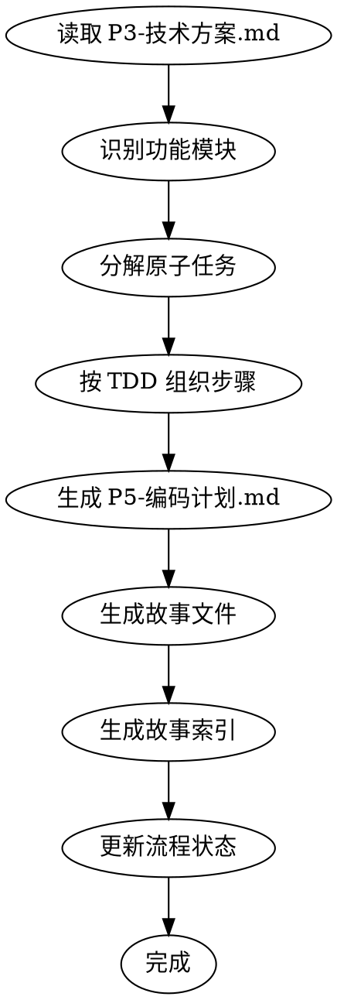
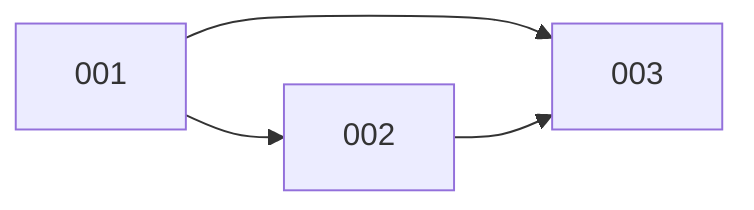

# ideal-dev-plan（P5 编码计划生成）

## Overview

将技术方案分解为可执行的原子任务，按 TDD 模式组织任务步骤。

## Agents

本 Skill 通过 Task 工具调用以下子代理：

| Agent | 角色 | 用途 |
|-------|------|------|
| architect | 架构师 | 模块依赖分析、技术方案拆解 |
| pm | 产品经理 | 任务优先级、验收标准定义 |

**调用方式**：通过 Task 工具调用，Hook 自动注入 jsonl 配置的上下文。

```markdown
Task(
    subagent_type: "architect",
    prompt: "将技术方案分解为模块和任务，按 TDD 模式组织",
    model: "opus"
)
```

## When to Use

- P4 方案评审已通过
- 需要生成 P5-编码计划.md
- 需要将技术方案转化为开发任务

## Prerequisites

- `docs/迭代/{需求名称}/P3-技术方案.md` 存在
- `docs/迭代/{需求名称}/流程状态.md` 中 P4 状态为 completed

## Input

| 输入 | 路径 | 说明 |
|------|------|------|
| 技术方案 | `docs/迭代/{需求名称}/P3-技术方案.md` | 包含架构、模块、接口设计 |

## Output

| 输出 | 路径 | 说明 |
|------|------|------|
| 编码计划 | `docs/迭代/{需求名称}/P5-编码计划.md` | 模块和任务清单 |
| 故事索引 | `docs/迭代/{需求名称}/stories/index.md` | 故事文件索引 |
| 故事文件 | `docs/迭代/{需求名称}/stories/0XX-*.md` | 原子化故事文件 |
| 流程状态更新 | `docs/迭代/{需求名称}/流程状态.md` | current_phase 更新为 P5 |

## Workflow



## Task Format

每个任务包含以下内容：

```markdown
## 任务 {id}: {任务名称}

**目标**: {一句话描述}

**步骤**:
1. [ ] 编写失败测试
2. [ ] 运行确认失败
3. [ ] 实现最小代码
4. [ ] 运行确认通过
5. [ ] 提交代码

**验证标准**: {如何验证完成}
```

任务步骤遵循 TDD 铁律：
- NO PRODUCTION CODE WITHOUT A FAILING TEST FIRST
- NO COMPLETION CLAIMS WITHOUT FRESH VERIFICATION EVIDENCE

## Plan Header Format

每个计划文档**必须**以以下头部开始：

```markdown
# P5-编码计划

> **For Claude:** REQUIRED SUB-SKILL: Use ideal-dev-exec to implement this plan task-by-task.

**Goal:** {一句话描述构建什么}

**Architecture:** {2-3 句关于方法}

**Tech Stack:** {关键技术/库}

---
```

**执行交接**：

计划完成后提供两个选项：
1. **Subagent-Driven (当前会话)** - 每任务派遣子代理，任务间两阶段审查
2. **Parallel Session (独立会话)** - 使用 ideal-dev-exec 批量执行

## Task Granularity

**原则**: 每个任务 2-5 分钟可完成

| 任务类型 | 示例 |
|----------|------|
| 太大 | "实现用户登录功能" |
| 合适 | "编写登录表单验证测试" |
| 太小 | "创建测试文件" |

## TDD Organization

每个任务遵循 RED-GREEN-REFACTOR：

1. **RED**: 编写失败的测试
2. **GREEN**: 编写最小代码使测试通过
3. **REFACTOR**: 优化代码

## Module Dependencies

识别模块间依赖，确定执行顺序：

```
M1 (无依赖) ─┬─> M3 (依赖 M1, M2)
M2 (无依赖) ─┘

执行顺序: M1, M2 (并行) → M3
```

## Dependency Analysis（新增）

### 依赖识别

1. 分析模块间调用关系
2. 识别共享资源（数据库、API、配置）
3. 确定执行顺序约束

### 依赖图生成

使用 Mermaid flowchart 格式生成依赖图：
- 每个模块为节点
- 箭头表示依赖方向（A --> B 表示 B 依赖 A）
- 使用 subgraph 分组可并行模块

### 执行策略标注

| 策略 | 条件 | 说明 |
|------|------|------|
| parallel | 无依赖 | 可与其他 parallel 任务同时执行 |
| sequential | 有依赖 | 必须等待依赖完成后执行 |

### 时间优化

计算：
1. 串行总时间 = 所有模块时间之和
2. 并行优化时间 = 按拓扑层级累加最大时间
3. 节省时间 = 串行时间 - 并行时间

## Step-by-Step Process

### Step 1: 读取技术方案

1. 读取 `P3-技术方案.md`
2. 提取功能模块清单
3. 理解模块间依赖关系

### Step 2: 分解模块

**调用 architect 子代理**：

```
Task(
    subagent_type: "architect",
    prompt: "分解技术方案为模块，标注依赖关系和可并行任务",
    model: "opus"
)
```

分解模块时：
1. 每个模块对应一组任务
2. 模块按依赖关系排序
3. 标注可并行的模块
4. 确保模块粒度适中（遵循 YAGNI 原则）

### Step 3: 分解任务

**调用 pm 子代理**：

```
Task(
    subagent_type: "pm",
    prompt: "将模块分解为原子任务，定义验收标准，按 MVP 思维排序",
    model: "opus"
)
```

分解任务时：
1. 将每个模块分解为 3-7 个任务
2. 每个任务粒度 2-5 分钟
3. 确保任务可独立验证
4. 为每个任务定义清晰的验收标准

### Step 4: 组织 TDD 步骤

1. 每个任务包含测试步骤
2. 明确测试失败条件
3. 定义最小实现范围

### Step 5: 生成文档

1. 填充模板
2. 添加模块总览表
3. 写入 `P5-编码计划.md`

### Step 6: 生成故事文件（上下文工程化）

**调用 architect 子代理**：

```
Task(
    subagent_type: "architect",
    prompt: "生成故事文件，实现上下文隔离，每个故事包含完整上下文",
    model: "opus"
)
```

**目的**：将编码计划拆分成独立的故事文件，实现上下文隔离。

**拆分原则**：
1. 每个故事可独立开发和测试
2. 故事之间依赖关系明确
3. 每个故事包含完整上下文（只引用相关片段）
4. 故事粒度：1-4 小时可完成

**故事文件格式**：

```markdown
---
story_id: {ID}
title: {标题}
status: pending
depends_on: [依赖故事ID]
---

# Story {ID}: {标题}

## 上下文

### 需求来源
> 来源：P1-需求文档.md#{章节}

{相关需求片段，而非完整文档}

### 技术方案
> 来源：P3-技术方案.md#{章节}

{相关技术方案片段}

### 相关代码

已完成的依赖模块：
- `path/to/module.ts` - 说明（Story xxx）

## 任务清单

- [ ] 任务 1
- [ ] 任务 2
  - [ ] 子任务 2.1

## 验收标准

### 功能验收
- [ ] 验收项 1
- [ ] 验收项 2

### 代码质量
- [ ] 测试覆盖率 > 80%
- [ ] 无 Lint 警告

## 实现笔记

<!-- 由 Claude 在执行过程中填写 -->
```

**执行步骤**：
1. 创建目录：`docs/迭代/{需求名称}/stories/`
2. 为每个模块生成故事文件：`001-xxx.md`, `002-xxx.md`, ...
3. 生成故事索引：`index.md`

### Step 7: 生成故事索引

生成 `docs/迭代/{需求名称}/stories/index.md`：

```markdown
---
requirement: {需求名称}
total_stories: N
completed: 0
current: 001
---

# 故事索引

## 概览

| 故事 | 标题 | 状态 | 依赖 |
|------|------|------|------|
| [001](001-xxx.md) | xxx | ⏳ 待开始 | - |
| [002](002-xxx.md) | xxx | ⏳ 待开始 | 001 |

## 依赖关系



## 执行顺序

1. 001-xxx
2. 002-xxx（可与 003 并行）
3. 003-xxx
```

### Step 8: 更新状态

更新 `流程状态.md`：
- current_phase: P5
- status: completed
- stories_dir: `docs/迭代/{需求名称}/stories/`

## Document Structure

生成的编码计划包含：

| 章节 | 内容 |
|------|------|
| 模块总览 | 模块清单、任务数、优先级 |
| 执行顺序 | 并行/串行关系 |
| 模块详情 | 每个模块的任务列表 |
| 验证计划 | 完整流程验证步骤 |

## Quality Checklist

- [ ] 所有功能模块都有对应任务
- [ ] 任务粒度合理（2-5 分钟）
- [ ] 每个任务包含 TDD 步骤
- [ ] 模块依赖关系正确
- [ ] 包含验证标准

## Common Mistakes

| 错误 | 正确做法 |
|------|----------|
| 任务过大 | 继续分解直到 2-5 分钟 |
| 缺少测试步骤 | 每个任务必须包含测试 |
| 忽略依赖 | 明确标注模块间依赖 |
| 无验证标准 | 每个任务定义完成条件 |

## References

- `references/templates/plan-template.md` - 计划模板（含依赖图）
- `references/examples/example-plan.md` - 完整示例
