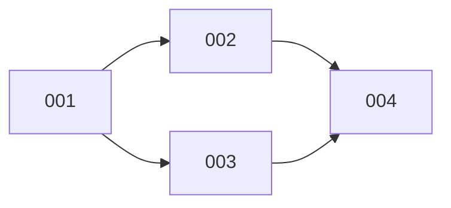

# 故事索引

## 概览

| 故事 | 标题 | 状态 | 依赖 |
|------|------|------|------|
| [001](001-{story-title}.md) | {故事标题} | ⏳ 待开始 | - |
| [002](002-{story-title}.md) | {故事标题} | ⏳ 待开始 | 001 |
| ... | ... | ... | ... |

## 依赖关系

## 执行顺序

### 可并行执行

- **Layer 1**: 001（无依赖）
- **Layer 2**: 002, 003（依赖 001，可并行）
- **Layer 3**: 004（依赖 002, 003）

### 推荐执行顺序

1. 001-{story-title}
2. 002-{story-title}（可与 003 并行）
3. 003-{story-title}
4. 004-{story-title}

## 状态图例

| 图标 | 状态 | 说明 |
|------|------|------|
| ⏳ | pending | 待开始 |
| 🔄 | in_progress | 进行中 |
| ✅ | completed | 已完成 |
| 🚫 | blocked | 被阻塞 |
