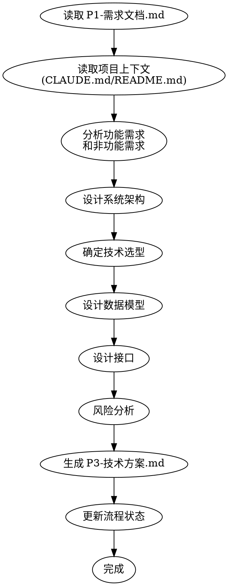

# ideal-dev-solution（P3 技术方案生成）

## Overview

基于需求文档自动生成技术方案，包含系统架构、技术选型、数据模型、接口设计和风险分析。

## Agents

本 Skill 调用以下角色能力：

| Agent | 角色 | 用途 |
|-------|------|------|
| architect | 架构师 | 系统架构设计、技术选型、风险评估 |

请先阅读：`.claude/agents/architect.md`

## When to Use

- P2 需求评审已通过
- 需要生成 P3-技术方案.md
- 需要将需求转化为技术设计

## Prerequisites

- `docs/迭代/{需求名称}/P1-需求文档.md` 存在
- `docs/迭代/{需求名称}/流程状态.md` 中 P2 状态为 completed

## Input

| 输入 | 路径 | 说明 |
|------|------|------|
| 需求文档 | `docs/迭代/{需求名称}/P1-需求文档.md` | 包含功能需求、非功能需求、验收标准 |
| 项目上下文 | `CLAUDE.md` 或 `README.md` | 项目背景、技术栈、约束条件 |

## Output

| 输出 | 路径 | 说明 |
|------|------|------|
| 技术方案 | `docs/迭代/{需求名称}/P3-技术方案.md` | 完整的技术设计文档 |
| 流程状态更新 | `docs/迭代/{需求名称}/流程状态.md` | current_phase 更新为 P3 |

## Workflow

## Step-by-Step Process

### Step 0: 项目调研（新增）

#### 0.1 读取项目配置

1. 读取 `.claude/project-config.md`
2. 获取项目类型（项目元信息.项目类型）
3. 如文件不存在，使用默认类型 `development`

#### 0.2 加载调研清单

根据项目类型加载对应清单：
- development → `references/research-checklists/development.md`
- documentation → `references/research-checklists/documentation.md`
- specification → `references/research-checklists/specification.md`
- research → `references/research-checklists/research.md`

#### 0.3 执行调研

1. 按清单逐项检查项目
2. 收集技术栈信息
3. 收集最佳实践信息
4. 记录发现和约束条件

#### 0.4 更新配置

将调研结果写入 `project-config.md` 的技术栈和最佳实践区块（如果为空）。

### Step 1: 读取输入

1. 读取 `P1-需求文档.md`，提取：
   - 功能需求清单
   - 非功能需求
   - 验收标准
   - 约束条件

2. 读取项目上下文（`CLAUDE.md` 或 `README.md`），了解：
   - 项目目标
   - 现有技术栈
   - 团队规模
   - 已有模块

### Step 2: 分析需求

<!-- AGENT: architect -->
你现在扮演架构师角色。请阅读 `.claude/agents/architect.md` 了解：
- 角色定义：需求驱动、简单优先、权衡取舍
- 思维方式：先理解业务需求，再设计技术方案
- 输出规范：技术方案文档结构、ADR 格式

分析需求时：
1. **功能分解**：将功能需求分解为模块
2. **依赖识别**：识别模块间的依赖关系
3. **优先级排序**：根据业务价值确定实现顺序
<!-- END AGENT -->

### Step 3: 设计架构

<!-- AGENT: architect -->
以架构师视角设计系统架构：
1. **架构模式选择**：单体/微服务/分层架构（遵循简单优先原则）
2. **组件划分**：定义核心组件及其职责
3. **架构图绘制**：使用 Mermaid 格式

参考 architect.md 中的"输出规范"章节，确保架构图清晰。
<!-- END AGENT -->

### Step 4: 技术选型

<!-- AGENT: architect -->
以架构师视角进行技术选型：

1. **评估候选技术**：列出 2-3 个候选方案
2. **对比分析**：使用 architect.md 中的"技术选型评估框架"
   - 功能满足度（30%）
   - 团队熟悉度（25%）
   - 社区活跃度（15%）
   - 性能表现（15%）
   - 学习成本（10%）
   - 长期维护成本（5%）
3. **确定方案**：给出推荐及理由

每个技术选型都应有 ADR 记录。
<!-- END AGENT -->

### Step 5: 数据设计

<!-- AGENT: architect -->
设计数据模型：
1. **核心实体识别**：提取业务核心实体
2. **关系设计**：定义实体间关系
3. **ER 图绘制**：使用 Mermaid erDiagram 格式
4. **数据流设计**：描述数据流转过程
<!-- END AGENT -->

### Step 6: 接口设计

<!-- AGENT: architect -->
设计 API 接口：
1. **内部接口**：模块间的调用接口
2. **外部接口**：与外部系统的集成接口
3. **接口规范**：输入、输出、错误处理

遵循 RESTful 设计原则，确保接口清晰一致。
<!-- END AGENT -->

### Step 7: 风险分析

<!-- AGENT: architect -->
进行风险评估：

1. **风险识别**：列出潜在风险
2. **影响评估**：评估风险影响程度和发生概率
3. **应对措施**：制定风险缓解策略

参考 architect.md 中的质量检查清单，确保覆盖：
- 技术风险
- 性能风险
- 安全风险
<!-- END AGENT -->

### Step 8: 生成文档

1. 填充模板 `references/templates/solution-template.md`
2. 应用正式学术风格（参考 `ideal-requirement` 的 writing-style.md）
3. 写入 `docs/迭代/{需求名称}/P3-技术方案.md`

### Step 9: 更新状态

更新 `流程状态.md`：
- current_phase: P3
- status: completed

## Document Structure

生成的技术方案包含以下章节：

| 章节 | 内容 |
|------|------|
| 一、方案概述 | 设计目标、核心原则、技术栈选型 |
| 二、系统架构 | 架构图、目录结构 |
| 三、功能模块设计 | 模块总览、详细设计 |
| 四、数据模型 | 核心数据模型、数据流 |
| 五、接口设计 | 内部接口、外部接口 |
| 六、风险分析与应对 | 风险项、应对策略 |
| 七、实施计划 | 阶段划分、依赖关系 |
| 八、参考资料 | 相关文档链接 |

## Quality Checklist

- [ ] 架构图清晰展示系统结构
- [ ] 技术选型有明确的理由
- [ ] 所有功能需求都有对应的技术方案
- [ ] 非功能需求（性能、安全等）有解决方案
- [ ] 风险分析覆盖主要风险项
- [ ] 文档路径正确

## Common Mistakes

| 错误 | 正确做法 |
|------|----------|
| 架构过于复杂 | 遵循 YAGNI 原则，只设计当前需要的功能 |
| 技术选型无理由 | 每个选择都应有明确的理由和对比 |
| 忽略非功能需求 | 安全性、性能、可用性都需考虑 |
| 风险分析敷衍 | 识别真实风险并制定可执行的应对措施 |

## References

- `references/templates/solution-template.md` - 技术方案模板
- `references/examples/example-solution.md` - 完整示例

## Next Steps

技术方案生成后：
1. 进入 P4 方案评审阶段
2. 评审通过后调用 `ideal-dev-plan` 生成编码计划
