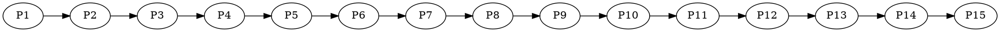
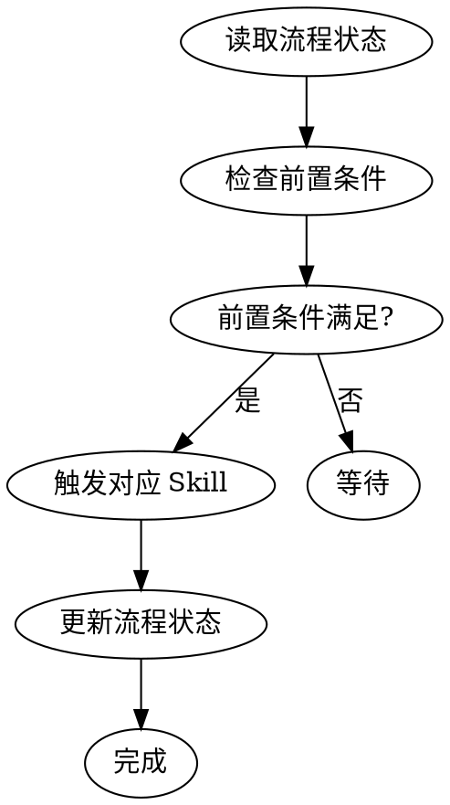

# ideal-flow-control（流程状态管理）

## Overview

统一管理 15 阶段流程的状态，验证前置条件，触发阶段流转。

**核心职责**：
1. 管理流程状态文件的读写
2. 处理评审阶段的通过检测
3. P2 评审通过后询问是否启用 YOLO 模式
4. 触发下一执行阶段的 Skill

## When to Use

- 需要读取当前流程状态
- 需要更新阶段状态
- 需要验证阶段前置条件
- 需要触发下一阶段
- **用户完成评审并说"通过"/"approved"时**
- **需要询问是否启用 YOLO 模式时**

## Flow State File

**位置：** `docs/迭代/{需求名称}/流程状态.md`

**格式：**
```yaml
---
requirement_name: {需求名称}
current_phase: P1-P15
status: pending|in_progress|completed|blocked|revision
created_at: {创建时间}
updated_at: {更新时间}
---

## 阶段状态

### 规划阶段
| 阶段 | 状态 | 更新时间 |
|------|------|----------|
| P1 需求编写 | ✅ completed | {时间} |
| P2 需求评审 | ⏳ pending | - |
...
```

## Phase Definitions

| 阶段组 | 阶段 | 执行者 | 触发条件 |
|--------|------|--------|----------|
| 规划阶段 | P1-P4 | Claude + 人工 | 需求启动 |
| 准备阶段 | P5-P8 | Claude + 人工 | P4 通过 |
| 执行阶段 | P9-P12 | Claude + 人工 | P8 通过 |
| 收尾阶段 | P13-P15 | Claude + 人工 | P12 通过 |

## 阶段类型

| 类型 | 阶段 | 说明 | 触发方式 |
|------|------|------|----------|
| **执行阶段** | P1, P3, P5, P7, P9, P11, P13, P15 | Claude 执行具体工作 | 调用对应 Skill |
| **评审阶段** | P2, P4, P6, P8, P10, P12, P14 | 用户评审确认 | 用户说"通过"后触发 ideal-flow-control |

## State Values

| 状态 | 说明 |
|------|------|
| `pending` | 待执行 |
| `in_progress` | 进行中 |
| `completed` | 已完成 |
| `blocked` | 已阻塞 |
| `revision` | 需要修改 |

## Phase Transition Rules



**前置条件：**

| 阶段 | 前置条件 | Skill |
|------|----------|-------|
| P1 | 无 | ideal-requirement |
| P3 | P2 completed | ideal-dev-solution |
| P5 | P4 completed | ideal-dev-plan |
| P7 | P6 completed | ideal-test-case |
| P9 | P8 completed | ideal-dev-exec |
| P11 | P10 completed | ideal-test-exec |
| P13 | P12 completed | ideal-wiki |

## Workflow



## 评审通过处理流程

当用户对评审阶段说"通过"/"approved"时，执行以下流程：

```mermaid
flowchart TD
    A[用户说"通过"] --> B[读取流程状态]
    B --> C{当前阶段?}
    C -->|P2| D[更新 P2 = approved]
    C -->|P4/P6/P8/P10/P12/P14| E[更新对应阶段 = approved]
    D --> F{询问是否启用 YOLO 模式?}
    F -->|是| G[调用 ideal-yolo skill]
    F -->|否| H[触发 P3: ideal-dev-solution]
    E --> I[触发下一执行阶段 Skill]
    G --> J[YOLO 模式自动执行 P3-P14]
    J --> K[P15 等待用户确认]
```

### P2 评审通过后的特殊处理

**IRON LAW: P2 评审通过后必须询问是否启用 YOLO 模式**

```markdown
📋 P2 需求评审已通过！

是否启用 YOLO 模式自动执行后续阶段？

**YOLO 模式说明**：
- 启用后，P3-P14 将自动执行，无需人工评审
- AI 会自动进行阶段评审并记录审计日志
- 熔断机制：连续失败、测试失败、重复错误时自动暂停
- P15 成果提交仍需您确认

请选择：
1. 启用 YOLO 模式
2. 继续传统人工评审流程
```

**用户选择处理**：

| 选择 | 处理方式 |
|------|----------|
| 启用 YOLO 模式 | 调用 `ideal-yolo` skill，自动执行 P3-P14 |
| 继续传统流程 | 触发 P3: `ideal-dev-solution`，等待用户逐阶段评审 |

## Step-by-Step Process

### Step 1: 读取流程状态

1. 读取 `docs/迭代/{需求名称}/流程状态.md`
2. 解析 YAML front matter
3. 获取 current_phase 和各阶段状态

### Step 2: 验证前置条件

根据 current_phase 检查：

| 当前阶段 | 需要验证 |
|----------|----------|
| P1 | 无 |
| P3 | P2 = completed |
| P5 | P4 = completed |
| P7 | P6 = completed |
| P9 | P8 = completed |
| P11 | P10 = completed |
| P15 | P14 = completed |

### Step 3: 触发 Skill

根据阶段调用对应的 skill：

| 阶段 | Skill | 说明 |
|------|-------|------|
| P1 | ideal-requirement | 需求编写 |
| P3 | ideal-dev-solution | 技术方案 |
| P5 | ideal-dev-plan | 计划生成 |
| P7 | ideal-test-case | 测试用例 |
| P9 | ideal-dev-exec | 开发执行 |
| P11 | ideal-test-exec | 测试执行 |
| P13 | ideal-wiki | 维基更新 |
| P15 | ideal-delivery | 成果提交 |
| **YOLO** | ideal-yolo | 自动执行 P3-P14 |

### Step 4: 更新流程状态

1. 更新 current_phase
2. 更新当前阶段状态为 completed
3. 更新 updated_at 时间戳

## API

### 读取当前阶段

```
读取 流程状态.md → 返回 current_phase
```

### 更新阶段状态

```
更新 流程状态.md:
  - {阶段} = {新状态}
  - updated_at = {当前时间}
```

### 验证前置条件

```
验证 {阶段} 前置条件:
  - 检查前置阶段状态
  - 返回 True/False
```

## Quality Checklist

- [ ] 流程状态文件格式正确
- [ ] 前置条件已验证
- [ ] 状态更新正确
- [ ] 时间戳已更新

## Common Mistakes

| 错误 | 正确做法 |
|------|----------|
| 跳过阶段验证 | 必须验证前置条件 |
| 状态值错误 | 使用标准状态值 |
| 忘记更新时间戳 | 每次更新都更新 updated_at |
| P2 通过后未询问 YOLO 模式 | 必须询问用户是否启用 YOLO 模式 |
| 直接触发下一阶段而跳过评审 | 评审阶段必须等待用户确认"通过" |

## YOLO 模式集成

### 调用 ideal-yolo skill

当用户选择启用 YOLO 模式时：

```markdown
Skill(
    skill: "ideal-yolo",
    args: "--state-file docs/迭代/{需求名称}/流程状态.md"
)
```

### ideal-yolo skill 职责

| 职责 | 说明 |
|------|------|
| 状态管理 | 更新 `yolo_mode.enabled: true` |
| 自动执行 | 依次执行 P3-P14 阶段 |
| 自动评审 | AI 自动进行阶段评审 |
| 审计日志 | 记录执行过程到 `yolo-logs/` |
| 熔断检测 | 检测异常并自动暂停 |
| 中断恢复 | 支持从中断点继续执行 |

### YOLO 模式下的流程状态

```yaml
yolo_mode:
  enabled: true
  status: in_progress    # pending | in_progress | paused | completed | error
  start_time: "2026-02-24T10:00:00Z"
  last_update: "2026-02-24T10:30:00Z"
  completed_phases: [P3, P4, P5]
  current_attempt: 1
```

## References

- `references/flow-state-spec.md` - 流程状态规范

## Scripts

- `scripts/flow-state.py` - 状态管理脚本
