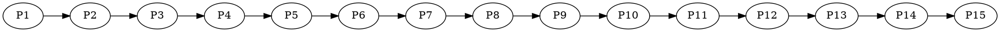
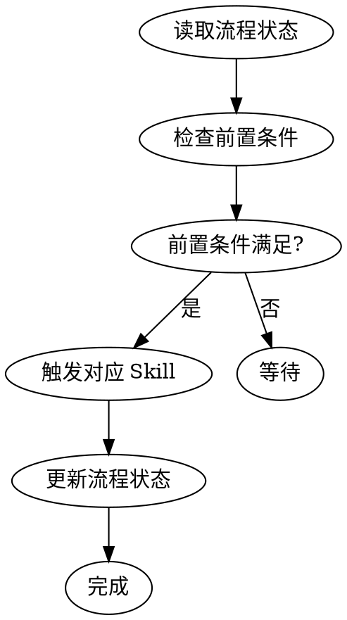

# ideal-flow-control（流程状态管理）

## Overview

统一管理 15 阶段流程的状态，验证前置条件，触发阶段流转。

## When to Use

- 需要读取当前流程状态
- 需要更新阶段状态
- 需要验证阶段前置条件
- 需要触发下一阶段

## Flow State File

**位置：** `docs/迭代/{需求名称}/流程状态.md`

**格式：**
```yaml
---
requirement_name: {需求名称}
current_phase: P1-P15
status: pending|in_progress|completed|blocked|revision
created_at: {创建时间}
updated_at: {更新时间}
---

## 阶段状态

### 规划阶段
| 阶段 | 状态 | 更新时间 |
|------|------|----------|
| P1 需求编写 | ✅ completed | {时间} |
| P2 需求评审 | ⏳ pending | - |
...
```

## Phase Definitions

| 阶段组 | 阶段 | 执行者 | 触发条件 |
|--------|------|--------|----------|
| 规划阶段 | P1-P4 | Claude + 人工 | 需求启动 |
| 准备阶段 | P5-P8 | Claude + 人工 | P4 通过 |
| 执行阶段 | P9-P12 | Claude + 人工 | P8 通过 |
| 收尾阶段 | P13-P15 | Claude + 人工 | P12 通过 |

## State Values

| 状态 | 说明 |
|------|------|
| `pending` | 待执行 |
| `in_progress` | 进行中 |
| `completed` | 已完成 |
| `blocked` | 已阻塞 |
| `revision` | 需要修改 |

## Phase Transition Rules



**前置条件：**

| 阶段 | 前置条件 | Skill |
|------|----------|-------|
| P1 | 无 | ideal-requirement |
| P3 | P2 completed | ideal-dev-solution |
| P5 | P4 completed | ideal-dev-plan |
| P7 | P6 completed | ideal-test-case |
| P9 | P8 completed | ideal-dev-exec |
| P11 | P10 completed | ideal-test-exec |
| P13 | P12 completed | ideal-wiki |

## Workflow



## Step-by-Step Process

### Step 1: 读取流程状态

1. 读取 `docs/迭代/{需求名称}/流程状态.md`
2. 解析 YAML front matter
3. 获取 current_phase 和各阶段状态

### Step 2: 验证前置条件

根据 current_phase 检查：

| 当前阶段 | 需要验证 |
|----------|----------|
| P1 | 无 |
| P3 | P2 = completed |
| P5 | P4 = completed |
| P7 | P6 = completed |
| P9 | P8 = completed |
| P11 | P10 = completed |
| P15 | P14 = completed |

### Step 3: 触发 Skill

根据阶段调用对应的 skill：

```
P1 → ideal-requirement
P3 → ideal-dev-solution
P5 → ideal-dev-plan
P7 → ideal-test-case
P9 → ideal-dev-exec
P11 → ideal-test-exec
P15 → ideal-wiki
```

### Step 4: 更新流程状态

1. 更新 current_phase
2. 更新当前阶段状态为 completed
3. 更新 updated_at 时间戳

## API

### 读取当前阶段

```
读取 流程状态.md → 返回 current_phase
```

### 更新阶段状态

```
更新 流程状态.md:
  - {阶段} = {新状态}
  - updated_at = {当前时间}
```

### 验证前置条件

```
验证 {阶段} 前置条件:
  - 检查前置阶段状态
  - 返回 True/False
```

## Quality Checklist

- [ ] 流程状态文件格式正确
- [ ] 前置条件已验证
- [ ] 状态更新正确
- [ ] 时间戳已更新

## Common Mistakes

| 错误 | 正确做法 |
|------|----------|
| 跳过阶段验证 | 必须验证前置条件 |
| 状态值错误 | 使用标准状态值 |
| 忘记更新时间戳 | 每次更新都更新 updated_at |

## References

- `references/flow-state-spec.md` - 流程状态规范

## Scripts

- `scripts/flow-state.py` - 状态管理脚本
