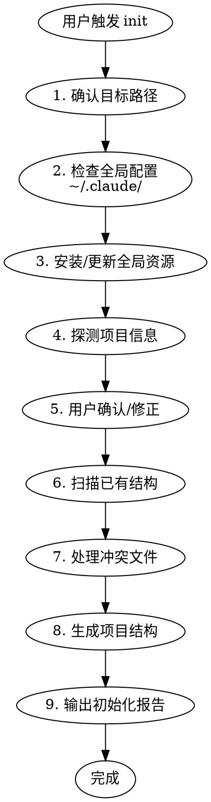

# ideal-init（项目初始化）

## Overview

CC-Workflow 项目初始化 Skill，实现分级配置架构：
- **全局配置**：agents 和 skills 安装到 `~/.claude/`
- **项目配置**：只保留 `project-config.md` 和文档结构

**不在 16 阶段中** - 在开始任何需求之前独立调用。

## HARD GATE

```
╔══════════════════════════════════════════════════════════════════╗
║  ALWAYS CHECK GLOBAL CONFIG BEFORE CREATING PROJECT STRUCTURE    ║
╚══════════════════════════════════════════════════════════════════╝
```

**全局 agents/skills 必须存在且是最新版本，才能继续项目初始化。**

## When to Use

- 新项目需要接入 CC-Workflow
- 老项目迁移到工作流体系
- 用户说 "初始化项目"、"把这个项目接入工作流"
- 用户触发 `/ideal-init`

## Workflow



---

## Step 1: 确认目标路径

**默认**：当前目录

**询问**：
```
初始化目标路径：{current_dir}
是否正确？如需指定其他路径，请提供。
```

---

## Step 2: 检查全局配置

**检查 `~/.claude/` 目录**：

```
□ ~/.claude/config.yaml 是否存在
□ ~/.claude/agents/ 是否包含 cc-workflow agents
□ ~/.claude/skills/ 是否包含 cc-workflow skills
```

**预期全局结构**：

```
~/.claude/
├── config.yaml           # 全局配置
├── agents/               # 全局 agents
│   ├── analyst.md
│   ├── pm.md
│   ├── architect.md
│   ├── dev.md
│   ├── qa.md
│   └── tech-writer.md
└── skills/               # 全局 skills
    ├── ideal-requirement/
    ├── ideal-dev-solution/
    └── ...（其他 skills）
```

---

## Step 3: 安装/更新全局资源

### 3.1 如果全局配置不存在

**创建 `~/.claude/config.yaml`**：

```yaml
registry:
  agents_repo: "https://gitea.example.com/cc-workflow/agents.git"
  skills_repo: "https://gitea.example.com/cc-workflow/skills.git"

installed:
  agents: {}
  skills: {}
```

**询问用户仓库地址**：
```
请提供 CC-Workflow 仓库地址：
- agents 仓库 URL（默认：从当前 cc-workflow 复制）
- skills 仓库 URL（默认：从当前 cc-workflow 复制）
```

### 3.2 安装/更新逻辑

```
如果 agents/skills 不存在：
  → 从远程仓库克隆到 ~/.claude/

如果已存在：
  → 检查版本（读取 config.yaml 中的 installed 记录）
  → 如果远程有更新，询问用户是否升级
```

### 3.3 更新 config.yaml

安装/更新完成后，记录版本信息：

```yaml
installed:
  agents:
    analyst: "1.0.0"
    pm: "1.0.0"
    # ...
  skills:
    ideal-requirement: "1.0.0"
    # ...
```

---

## Step 4: 探测项目信息

**阅读 `references/detection-rules.md` 了解探测规则。**

### 探测内容

| 探测项 | 检测方式 | 用途 |
|--------|----------|------|
| 项目名称 | 目录名或 Git 仓库名 | 填充 project-config.md |
| 语言类型 | 检测特征文件 | 选择命令模板 |
| 框架 | 解析依赖文件 | 填充技术栈 |
| Git 状态 | 检测 .git 目录 | 填充 Git 配置 |
| 测试命令 | 推断或读取配置 | 填充执行配置 |
| 构建命令 | 推断或读取配置 | 填充执行配置 |

### 特征文件映射

| 特征文件 | 语言 | 测试命令 | 构建命令 |
|----------|------|----------|----------|
| `package.json` | Node.js | `npm test` | `npm run build` |
| `requirements.txt` / `pyproject.toml` | Python | `pytest` | `python setup.py build` |
| `go.mod` | Go | `go test ./...` | `go build` |
| `pom.xml` / `build.gradle` | Java | `mvn test` | `mvn package` |

---

## Step 5: 用户确认/修正

**展示探测结果**：

```
📊 项目探测结果：

| 项目 | 探测值 |
|------|--------|
| 项目名称 | {name} |
| 语言 | {language} |
| 框架 | {framework} |
| 测试命令 | {test_cmd} |
| 构建命令 | {build_cmd} |
| Git 仓库 | {git_repo} |
| 主分支 | {main_branch} |

以上信息是否正确？如需修改请告知。
```

---

## Step 6: 扫描已有结构

**检查目标路径中已存在的文件**：

```
□ CLAUDE.md
□ .claude/project-config.md
□ docs/Wiki/
□ docs/迭代/
□ docs/项目状态.md
```

---

## Step 7: 处理冲突文件

**对于每个已存在的文件，使用 AskUserQuestion 询问**：

| 选项 | 说明 |
|------|------|
| 跳过 | 保留现有文件，不进行任何修改 |
| 覆盖 | 用新模板替换现有文件 |
| 合并 | 尝试合并内容（仅适用于 project-config.md） |
| 查看差异 | 显示现有文件与新模板的差异后再决定 |

**默认行为**：如果用户没有明确选择，默认**跳过**已存在的文件。

---

## Step 8: 生成项目结构

### 8.1 创建目录结构

```
{target-project}/
├── .claude/
│   └── project-config.md
├── docs/
│   ├── Wiki/
│   │   ├── 用户文档/
│   │   ├── 开发文档/
│   │   └── 接口文档/
│   ├── 迭代/
│   └── 项目状态.md
└── CLAUDE.md
```

### 8.2 生成文件

| 文件 | 模板 | 数据来源 |
|------|------|----------|
| `.claude/project-config.md` | `project-config.md.tmpl` | 探测结果 |
| `CLAUDE.md` | `CLAUDE.md.tmpl` | 探测结果 |
| `docs/项目状态.md` | `flow-status.md.tmpl` | 探测结果 |

**模板路径**：`references/templates/`

---

## Step 9: 输出初始化报告

```
✓ CC-Workflow 初始化完成

全局配置：
  ✓ agents: {status} ({version})
  ✓ skills: {status} ({version})

项目结构：
  ✓ 创建 .claude/project-config.md
  ✓ 创建 docs/Wiki/
  ✓ 创建 docs/迭代/
  ✓ 创建 docs/项目状态.md
  {skip_symbol} CLAUDE.md: {skip_reason}

探测结果：
  项目名称: {name}
  语言: {language}
  框架: {framework}
  测试命令: {test_cmd}
  构建命令: {build_cmd}

后续步骤：
  1. 检查 .claude/project-config.md 确认配置正确
  2. 运行 /ideal-requirement 开始第一个需求
```

---

## Quality Checklist

**Step 2-3 完成检查**：
- [ ] 检查了 ~/.claude/config.yaml
- [ ] 确认全局 agents/skills 存在
- [ ] 全局资源是最新版本

**Step 4-5 完成检查**：
- [ ] 探测了项目名称
- [ ] 探测了语言和框架
- [ ] 探测了 Git 状态
- [ ] 用户确认或修正了探测结果

**Step 6-8 完成检查**：
- [ ] 扫描了已有文件
- [ ] 对冲突文件询问了用户
- [ ] 创建了所有必需目录
- [ ] 生成了所有必需文件

**Step 9 完成检查**：
- [ ] 输出了完整初始化报告
- [ ] 报告包含后续步骤指引

---

## Common Mistakes

| 错误 | 正确做法 | HARD GATE |
|------|----------|-----------|
| 跳过全局配置检查 | 必须先检查 ~/.claude/ | ⚠️ 分级架构基础 |
| 直接覆盖已存在文件 | 必须询问用户 | - |
| 使用硬编码探测规则 | 阅读 detection-rules.md | - |
| 忘记输出报告 | 必须输出完整报告 | - |
| 在项目中复制 agents/skills | 只保留 project-config.md | ⚠️ 分级架构原则 |

---

## References

| 文件 | 用途 |
|------|------|
| `references/templates/CLAUDE.md.tmpl` | 项目指令模板 |
| `references/templates/project-config.md.tmpl` | 项目配置模板 |
| `references/templates/flow-status.md.tmpl` | 流程状态模板 |
| `references/detection-rules.md` | 项目类型探测规则 |

---

## Related Skills

| Skill | 关系 |
|-------|------|
| ideal-requirement | init 完成后，用户通常从此开始第一个需求 |
| ideal-flow-control | init 创建的 `docs/项目状态.md` 是 flow-control 的管理对象 |
| ideal-dev-solution | init 生成的 `project-config.md` 会被 dev-solution 读取 |
