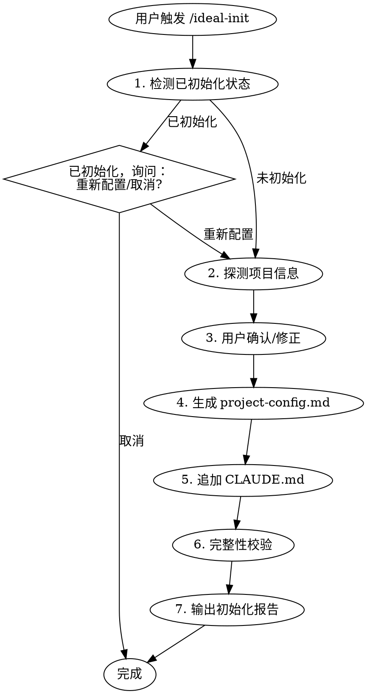

# ideal-init（项目初始化）

## Overview

CC-Workflow 项目初始化 Skill，负责需要 AI 的智能操作。

**不在 15 阶段中** - 在开始任何需求之前独立调用。

## 职责边界

| 功能 | 负责方 | 说明 |
|------|--------|------|
| 全局资源下载 | CLI | 下载 agents/skills 到 `~/.claude/` |
| 目录结构创建 | CLI | 创建 `docs/迭代/`、`docs/Wiki/` 等 |
| **已初始化检测** | **Skill** | 检查项目是否已接入工作流 |
| **项目探测** | **Skill** | 探测语言、框架、Git 等信息 |
| **配置生成** | **Skill** | 生成/优化 `project-config.md` |
| **CLAUDE.md 追加** | **Skill** | 在现有文件末尾追加工作流说明 |
| **完整性校验** | **Skill** | 检查依赖、配置是否完整 |

## When to Use

- 新项目需要接入 CC-Workflow
- 老项目迁移到工作流体系
- 用户说 "初始化项目"、"把这个项目接入工作流"
- 用户触发 `/ideal-init`

---

## 工作类型探测

> 探测结果存储到 `project-config.md` 的 `work_type` 字段，供其他 Skill 读取

### 预设工作类型

| 工作类型 | 标识符 | 典型特征 |
|----------|--------|----------|
| 软件开发 | `software-dev` | src/, package.json, go.mod |
| 文档撰写 | `doc-writing` | docs/, *.md（无代码） |
| 汇报材料 | `presentation` | slides/, *.pptx |
| 论文撰写 | `paper-writing` | *.tex, bib/ |
| 专利申请 | `patent-filing` | 专利模板 |
| 调研报告 | `research-report` | 调研目录 |
| 项目申请书 | `project-proposal` | NSFC模板 |
| 投标文件 | `bid-document` | 投标目录 |
| 标书解析 | `bid-analysis` | 招标文件待分析 |

详细探测规则见 `references/detection-rules.md`

### 探测优先级

1. **用户明确指定**：使用用户指定的工作类型
2. **目录结构分析**：根据项目特征自动判断
3. **询问用户**：展示选项让用户选择
4. **兜底方案**：询问用户描述，生成合适的工作类型标识符

### 未知工作类型处理

当预设类型都不匹配时：
1. 询问用户描述工作类型（是什么类型的工作、主要产出、验证方式）
2. 基于用户描述生成合适的标识符（如 `video-production`、`data-analysis`）
3. 直接将标识符写入 `project-config.md` 的 `work_type` 字段
4. **不使用 `custom` 作为标识符** - 是什么工作类型就用什么标识符

---

## 通用初始化流程

### Step 1: 已初始化检测

检查 `.claude/project-config.md` 是否存在：
- 不存在 → 进入 Step 2
- 存在 → 询问用户（重新配置/取消）

### Step 2: 项目探测

阅读 `references/detection-rules.md` 探测：
- 项目名称
- 工作类型（work_type）
- 技术栈（仅 software-dev）
- Git 状态

### Step 3: 用户确认

展示探测结果，用户可修正。

### Step 4-5: 生成配置

- 读取 `references/templates/project-config.md.tmpl`
- 读取 `references/templates/CLAUDE.md.appendix.md`
- 生成/更新文件

### Step 6-7: 校验和报告

- 完整性校验
- 输出初始化报告

---

## References

| 文件 | 用途 |
|------|------|
| `references/detection-rules.md` | 项目类型探测规则 |
| `references/templates/project-config.md.tmpl` | 项目配置模板 |
| `references/templates/CLAUDE.md.appendix.md` | CLAUDE.md 追加内容模板 |

---

## Related Skills

| Skill | 关系 |
|-------|------|
| ideal-requirement | init 完成后，用户通常从此开始第一个需求 |
| ideal-flow-control | init 创建的配置是 flow-control 的管理对象 |
