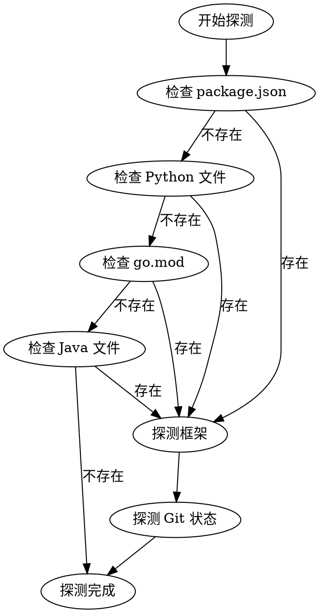

# 项目类型探测规则

本文档定义如何自动探测项目类型、语言、框架等信息。

## 探测流程



## 语言探测

### Node.js / TypeScript

**特征文件**：
- `package.json`

**探测步骤**：
1. 读取 `package.json`
2. 检查 `engines.node` 获取 Node.js 版本
3. 检查依赖列表判断框架：
   - `react` → React
   - `vue` → Vue
   - `next` → Next.js
   - `express` → Express
   - `nestjs` → NestJS
   - `typescript` 在 devDependencies → TypeScript

**默认命令**：
| 命令类型 | 命令 |
|----------|------|
| 安装依赖 | `npm install` |
| 构建 | `npm run build` |
| 测试 | `npm test` |
| Lint | `npm run lint` |

### Python

**特征文件**：
- `requirements.txt`
- `pyproject.toml`
- `setup.py`
- `Pipfile`

**探测步骤**：
1. 检查特征文件存在性
2. 读取 `pyproject.toml` 或 `requirements.txt`
3. 检查依赖判断框架：
   - `django` → Django
   - `flask` → Flask
   - `fastapi` → FastAPI
   - `torch` / `tensorflow` → ML/AI

**默认命令**：
| 命令类型 | 命令 |
|----------|------|
| 安装依赖 | `pip install -r requirements.txt` |
| 构建 | `python setup.py build` |
| 测试 | `pytest` |
| Lint | `flake8` / `ruff check` |

### Go

**特征文件**：
- `go.mod`

**探测步骤**：
1. 读取 `go.mod` 获取模块名和 Go 版本
2. 检查依赖判断框架：
   - `gin` → Gin
   - `echo` → Echo
   - `fiber` → Fiber

**默认命令**：
| 命令类型 | 命令 |
|----------|------|
| 安装依赖 | `go mod download` |
| 构建 | `go build` |
| 测试 | `go test ./...` |
| Lint | `golangci-lint run` |

### Java / Kotlin

**特征文件**：
- `pom.xml` (Maven)
- `build.gradle` / `build.gradle.kts` (Gradle)

**探测步骤**：
1. 检查构建文件类型
2. 读取依赖判断框架：
   - `spring-boot` → Spring Boot
   - `quarkus` → Quarkus
   - `micronaut` → Micronaut

**Maven 默认命令**：
| 命令类型 | 命令 |
|----------|------|
| 安装依赖 | `mvn dependency:resolve` |
| 构建 | `mvn package` |
| 测试 | `mvn test` |
| Lint | `mvn checkstyle:check` |

**Gradle 默认命令**：
| 命令类型 | 命令 |
|----------|------|
| 安装依赖 | `gradle dependencies` |
| 构建 | `gradle build` |
| 测试 | `gradle test` |
| Lint | `gradle check` |

### Rust

**特征文件**：
- `Cargo.toml`

**探测步骤**：
1. 读取 `Cargo.toml` 获取项目名和依赖
2. 检查依赖判断框架：
   - `actix-web` → Actix Web
   - `rocket` → Rocket
   - `axum` → Axum

**默认命令**：
| 命令类型 | 命令 |
|----------|------|
| 安装依赖 | `cargo fetch` |
| 构建 | `cargo build` |
| 测试 | `cargo test` |
| Lint | `cargo clippy` |

### 其他 / 通用

**当无法识别项目类型时**：
- 语言：Unknown
- 框架：Unknown
- 命令：留空，让用户手动填写

---

## 框架探测详情

### 前端框架

| 框架 | 依赖关键词 | 用途 |
|------|-----------|------|
| React | `react`, `react-dom` | UI 组件库 |
| Vue | `vue` | 渐进式框架 |
| Angular | `@angular/core` | 企业级框架 |
| Next.js | `next` | React 全栈框架 |
| Nuxt | `nuxt` | Vue 全栈框架 |
| Svelte | `svelte` | 编译型框架 |
| Solid | `solid-js` | 响应式框架 |

### 后端框架

| 框架 | 语言 | 依赖关键词 |
|------|------|-----------|
| Express | Node.js | `express` |
| NestJS | Node.js | `@nestjs/core` |
| Fastify | Node.js | `fastify` |
| Django | Python | `django` |
| Flask | Python | `flask` |
| FastAPI | Python | `fastapi` |
| Spring Boot | Java | `spring-boot` |
| Gin | Go | `github.com/gin-gonic/gin` |
| Actix | Rust | `actix-web` |

---

## Git 状态探测

### 探测内容

```bash
# 检查是否是 Git 仓库
git rev-parse --is-inside-work-tree

# 获取远程仓库 URL
git remote get-url origin

# 获取当前分支
git branch --show-current

# 获取默认分支
git remote show origin | grep "HEAD branch"
```

### 填充配置

| 探测项 | Git 命令 | 配置字段 |
|--------|----------|----------|
| Git 仓库 | `git rev-parse --is-inside-work-tree` | 是否 Git 项目 |
| 远程 URL | `git remote get-url origin` | 仓库地址 |
| 当前分支 | `git branch --show-current` | - |
| 默认分支 | `git remote show origin` | main_branch |

---

## 项目名称探测

**优先级**：
1. `pyproject.toml` 中的 `project.name`
2. `package.json` 中的 `name`
3. `Cargo.toml` 中的 `package.name`
4. Git 仓库名（从 remote URL 解析）
5. 目录名

---

## 探测结果示例

### Node.js + React 项目

```yaml
project_name: my-react-app
project_type: frontend
language: TypeScript
language_version: "5.0"
framework: React
framework_version: "18.2"
test_framework: Jest
install_cmd: npm install
build_cmd: npm run build
test_cmd: npm test
lint_cmd: npm run lint
format_cmd: npm run format
main_branch: main
git_repo: https://github.com/user/my-react-app.git
```

### Python + FastAPI 项目

```yaml
project_name: my-fastapi-app
project_type: backend
language: Python
language_version: "3.11"
framework: FastAPI
framework_version: "0.100"
test_framework: pytest
install_cmd: pip install -r requirements.txt
build_cmd: ""
test_cmd: pytest
lint_cmd: ruff check
format_cmd: black .
main_branch: main
git_repo: https://github.com/user/my-fastapi-app.git
```
