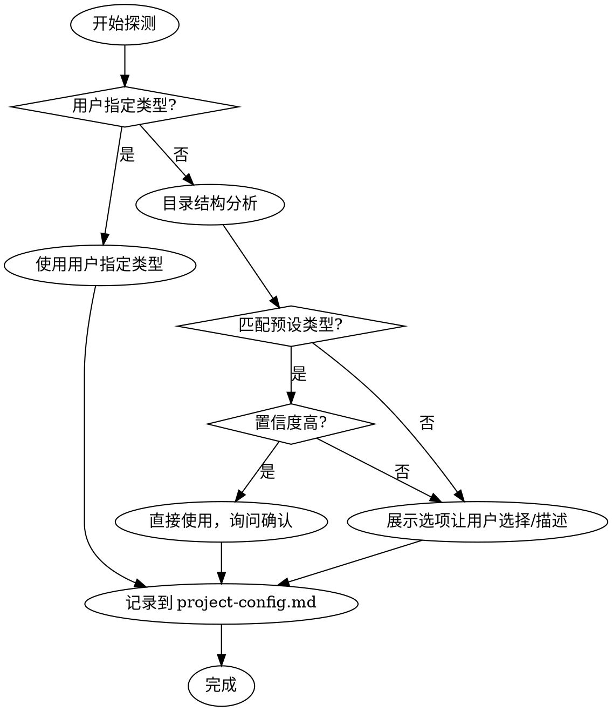
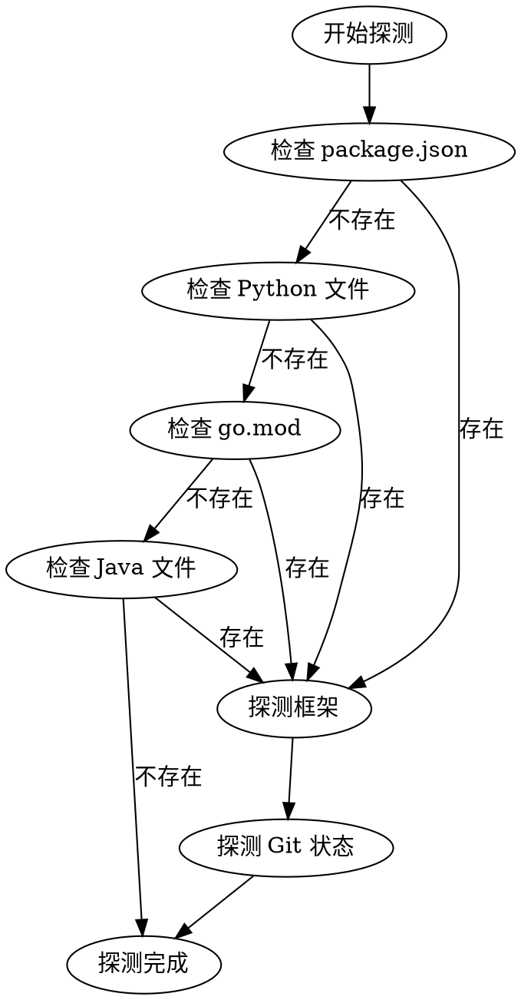

# 项目类型探测规则

本文档定义如何自动探测项目类型、语言、框架等信息。

> 工作类型定义见 `work-types.md`

---

## 工作类型探测

### 探测优先级

| 优先级 | 探测方式 | 说明 |
|--------|----------|------|
| 1 | 用户明确指定 | 用户在初始化时指定工作类型 |
| 2 | 目录结构分析 | 根据项目特征自动判断 |
| 3 | 询问用户 | 展示选项让用户选择或描述 |
| 4 | 兜底方案 | 询问用户描述，生成合适的类型标识符 |

### 探测流程



### 特征检测规则

| 检测项 | 规则 | 工作类型 |
|--------|------|----------|
| 代码文件 | 存在 src/, lib/, app/ 等代码目录 | software-dev |
| 包管理 | 存在 package.json, go.mod, requirements.txt | software-dev |
| 文档目录 | 存在 docs/ 且无代码特征 | doc-writing |
| 幻灯片 | 存在 slides/, *.pptx, *.key | presentation |
| LaTeX | 存在 *.tex, bib/ | paper-writing |
| 专利模板 | 存在 权利要求书, 说明书 模板 | patent-filing |
| 调研目录 | 存在 调研/, 问卷/, 分析报告 | research-report |
| 申请书 | 存在 NSFC模板, 可行性报告 | project-proposal |
| 投标目录 | 存在 投标/, 招标文件 | bid-document |
| 招标文件 | 存在待分析的招标文件 | bid-analysis |

### 置信度评估

| 情况 | 置信度 | 处理方式 |
|------|--------|----------|
| 匹配单一类型且特征明显 | 高 | 直接使用，询问确认 |
| 匹配多个类型 | 中 | 展示选项让用户选择 |
| 无匹配 | 低 | 询问用户描述，生成类型标识符 |

---

## 技术栈探测流程

> 仅 `software-dev` 工作类型需要探测技术栈



---

## 语言探测

### Node.js / TypeScript

**特征文件**：`package.json`

**探测步骤**：
1. 读取 `package.json`
2. 检查 `name` 字段获取项目名称
3. 检查 `engines.node` 获取 Node.js 版本
4. 检查依赖列表判断框架：
   - `react` → React
   - `vue` → Vue
   - `next` → Next.js
   - `express` → Express
   - `nestjs` / `@nestjs/core` → NestJS
   - `typescript` 在 devDependencies → TypeScript

**默认命令**：

| 命令类型 | 命令 | 说明 |
|----------|------|------|
| 安装依赖 | `npm install` | 或 `yarn` / `pnpm install` |
| 构建 | `npm run build` | 检查 scripts.build |
| 测试 | `npm test` | 检查 scripts.test |
| Lint | `npm run lint` | 检查 scripts.lint |
| 格式化 | `npm run format` | 检查 scripts.format |

**包管理器检测**：
- `pnpm-lock.yaml` → pnpm
- `yarn.lock` → yarn
- `package-lock.json` → npm

---

### Python

**特征文件**：
- `pyproject.toml`（优先）
- `requirements.txt`
- `setup.py`
- `Pipfile`

**探测步骤**：
1. 检查特征文件存在性
2. 读取 `pyproject.toml` 或 `requirements.txt`
3. 检查依赖判断框架：
   - `django` → Django
   - `flask` → Flask
   - `fastapi` → FastAPI
   - `torch` / `tensorflow` → ML/AI
   - `pytest` → 测试框架

**默认命令**：

| 命令类型 | 命令 | 说明 |
|----------|------|------|
| 安装依赖 | `pip install -r requirements.txt` | 或 `poetry install` |
| 构建 | `python setup.py build` | 或 `poetry build` |
| 测试 | `pytest` | 检查 pytest 配置 |
| Lint | `ruff check` | 或 `flake8` |
| 格式化 | `black .` | 或 `ruff format` |

**包管理器检测**：
- `poetry.lock` → poetry
- `Pipfile.lock` → pipenv
- `uv.lock` → uv
- 其他 → pip

---

### Go

**特征文件**：`go.mod`

**探测步骤**：
1. 读取 `go.mod`
2. 提取模块名称
3. 检查 Go 版本
4. 检查依赖判断框架：
   - `gin-gonic/gin` → Gin
   - `echo` → Echo
   - `fiber` → Fiber

**默认命令**：

| 命令类型 | 命令 | 说明 |
|----------|------|------|
| 安装依赖 | `go mod download` | 自动处理 |
| 构建 | `go build` | 或 `go build ./...` |
| 测试 | `go test ./...` | 运行所有测试 |
| Lint | `golangci-lint run` | 需要安装 |
| 格式化 | `go fmt ./...` | 内置 |

---

### Java

**特征文件**：
- `pom.xml`（Maven）
- `build.gradle` / `build.gradle.kts`（Gradle）

**探测步骤**：
1. 检查构建文件类型
2. 读取项目配置
3. 检查依赖判断框架：
   - `spring-boot` → Spring Boot
   - `quarkus` → Quarkus
   - `micronaut` → Micronaut

**默认命令**：

| 构建工具 | 安装依赖 | 构建 | 测试 |
|----------|----------|------|------|
| Maven | `mvn dependency:resolve` | `mvn package` | `mvn test` |
| Gradle | `gradle dependencies` | `gradle build` | `gradle test` |

---

## 探测项详情

### 项目名称

| 优先级 | 来源 | 示例 |
|--------|------|------|
| 1 | package.json.name | `my-project` |
| 2 | pyproject.toml.project.name | `my-project` |
| 3 | Git 远程仓库名称 | `owner/repo-name` |
| 4 | 目录名称 | `my-project` |

### 主分支

| 检测方式 | 命令 |
|----------|------|
| Git 命令 | `git rev-parse --abbrev-ref HEAD` |
| 常见分支名检查 | main, master, develop |

### Git 状态

| 探测项 | 检测方式 |
|--------|----------|
| 是否 Git 仓库 | 检查 `.git` 目录 |
| 当前分支 | `git branch --show-current` |
| 远程 URL | `git remote get-url origin` |

---

## 探测失败处理

| 场景 | 处理方式 | 默认值 |
|------|----------|--------|
| 无法识别项目类型 | 语言设为 `Other` | `Other` |
| 特征文件缺失 | 使用默认值 | - |
| Git 未初始化 | `isGitRepo: false` | `false` |
| 无法获取项目名称 | 使用目录名 | 目录名 |
| 无法推断测试命令 | 设为空 | - |
| 无法推断构建命令 | 设为空 | - |

**重要**：所有探测失败情况都应在用户确认步骤时允许修正。

---

## 探测结果格式

```typescript
interface DetectionResult {
  // 基本信息
  projectName: string;
  projectRoot: string;

  // 工作类型（预设类型或用户定义的类型标识符）
  workType: string; // 如 'software-dev', 'doc-writing', 'video-production' 等

  // 技术栈（仅 software-dev）
  language?: 'Node.js' | 'Python' | 'Go' | 'Java' | 'Other';
  framework?: string;
  packageManager?: string;

  // Git 信息
  isGitRepo: boolean;
  gitBranch?: string;
  gitRemoteUrl?: string;

  // 执行命令（仅 software-dev）
  testCommand?: string;
  buildCommand?: string;
  installCommand?: string;
  lintCommand?: string;
  formatCommand?: string;

  // 元信息
  detectedAt: string;
}
```

---

## 使用说明

1. **按顺序检测**：从 Node.js → Python → Go → Java → Other
2. **首次匹配即返回**：找到特征文件后立即识别语言类型
3. **依赖分析**：读取依赖文件判断具体框架
4. **提供默认值**：无法推断时使用合理的默认值
5. **用户修正**：所有探测结果都应展示给用户确认
