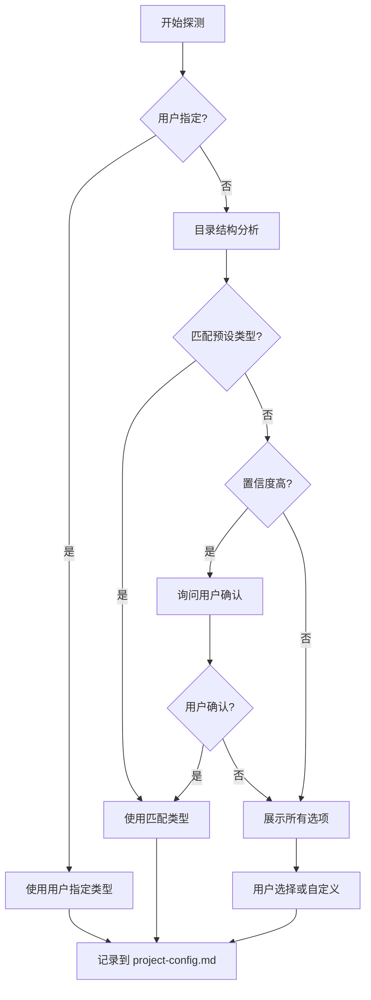

# 工作类型定义

本文档定义所有预设的工作类型及其探测规则。

## 预设工作类型

| 工作类型 | 标识符 | 典型特征 | instruction 文件 |
|----------|--------|----------|------------------|
| 软件开发 | `software-dev` | src/, package.json, go.mod, pom.xml | instructions/software-dev.md |
| 文档撰写 | `doc-writing` | docs/, *.md（无代码特征） | instructions/doc-writing.md |
| 汇报材料 | `presentation` | slides/, *.pptx, 汇报关键词 | instructions/presentation.md |
| 论文撰写 | `paper-writing` | *.tex, 论文模板, 参考文献 | instructions/paper-writing.md |
| 专利申请 | `patent-filing` | 专利模板, 权利要求书 | instructions/patent-filing.md |
| 调研报告 | `research-report` | 调研目录, 问卷, 分析报告 | instructions/research-report.md |
| 项目申请书 | `project-proposal` | NSFC模板, 可行性报告 | instructions/project-proposal.md |
| 投标文件 | `bid-document` | 招标文件, 投标书模板 | instructions/bid-document.md |
| 标书解析 | `bid-analysis` | 招标文件待分析 | instructions/bid-analysis.md |

## 探测规则

### 优先级

1. **用户明确指定**：用户说"这是一个XX类型的项目"
2. **目录结构分析**：根据特征文件自动判断
3. **询问用户**：展示选项让用户选择
4. **兜底方案**：使用 `custom` 类型

### 探测逻辑



### 特征检测规则

| 检测项 | 规则 | 工作类型 |
|--------|------|----------|
| 代码文件 | 存在 src/, lib/, app/ 等代码目录 | software-dev |
| 包管理 | 存在 package.json, go.mod, requirements.txt | software-dev |
| 文档目录 | 存在 docs/ 且无代码特征 | doc-writing |
| 幻灯片 | 存在 slides/, *.pptx, *.key | presentation |
| LaTeX | 存在 *.tex, bib/ | paper-writing |
| 专利模板 | 存在 权利要求书, 说明书 模板 | patent-filing |
| 调研目录 | 存在 调研/, 问卷/, 分析报告 | research-report |
| 申请书 | 存在 NSFC模板, 可行性报告 | project-proposal |
| 投标目录 | 存在 投标/, 招标文件 | bid-document |

### 置信度评估

| 情况 | 置信度 | 处理方式 |
|------|--------|----------|
| 匹配单一类型且特征明显 | 高 | 直接使用，询问确认 |
| 匹配多个类型 | 中 | 展示选项让用户选择 |
| 无匹配 | 低 | 展示所有选项 + custom |

## 未知工作类型处理

当预设类型都不匹配时：

1. **询问用户描述**：
   ```
   未识别到预设的工作类型。请描述您的工作类型：
   - 这是什么类型的工作？
   - 主要产出是什么？
   - 需要什么样的验证方式？
   ```

2. **生成工作类型标识符**：
   - 基于用户描述生成合适的标识符（如 `video-production`、`data-analysis` 等）
   - **不使用 `custom` 作为标识符** - 是什么工作类型就用什么标识符

3. **直接记录到配置**：
   ```yaml
   work_type: video-production  # 直接使用实际的工作类型标识符
   ```

## 各 Skill 如何使用 work_type

```
各 Skill 读取 project-config.md 获取 work_type

if work_type 是预设类型:
    读取 instructions/{work_type}.md
else:
    Skill 根据 work_type 名称自行处理（可能需要 LLM 生成指导）
```

---

## 扩展指南

### 新增预设工作类型

1. 在本文件"预设工作类型"表格中添加新行
2. 创建 `instructions/{type-id}.md` 指导文件
3. 在探测规则中添加特征检测
4. 更新 CLAUDE.md 或相关文档
