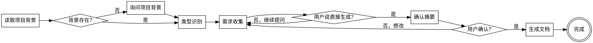

# Ideal Requirement

通过交互式对话引导用户完善需求，生成符合正式学术风格的标准化需求文档。

## Agents

本 Skill 调用以下角色能力：

| Agent | 角色 | 用途 |
|-------|------|------|
| pm | 产品经理 | 需求梳理、苏格拉底式对话、文档编写 |
| analyst | 业务分析师 | 竞品分析、市场调研（可选） |

请先阅读：
- `.claude/agents/pm.md`
- `.claude/agents/analyst.md`

## Workflow

Requirement Collection Progress:
- [ ] Step 0: Project Context ⚠️ REQUIRED
  - [ ] 0.1 Read CLAUDE.md or README.md
  - [ ] 0.2 Extract key information
  - [ ] 0.3 Display context summary
- [ ] Step 1: Type Detection
- [ ] Step 2: Template Processing
- [ ] Step 3: Requirement Gathering
  - [ ] 3.1 Collect core fields
  - [ ] 3.2 Collect main fields
  - [ ] 3.3 Collect detail fields
- [ ] Step 4: Confirmation ⚠️ REQUIRED
- [ ] Step 5: Generation
- [ ] Step 6: Completion



## 0. Project Context

**在提问之前，必须先了解项目背景**，使需求收集更加智能化和上下文相关。

### 0.1 读取顺序

按以下优先级读取项目文件（任一存在即可）：

1. **CLAUDE.md** - Claude Code 项目指令文件（优先）
2. **README.md** - 项目说明文件
3. **docs/项目状态.md** - 项目状态看板（如存在）

### 0.2 背景信息提取

从上述文件中提取关键信息：

| 信息类型 | 用途 |
|----------|------|
| 项目目标 | 理解需求与项目整体目标的关系 |
| 系统架构 | 判断需求涉及的技术范围 |
| 当前阶段 | 了解项目进展，定位需求优先级 |
| 已有模块 | 避免重复，识别依赖关系 |
| 技术栈 | 确保需求符合技术约束 |
| 团队规模 | 调整问题深度和复杂度 |

### 0.3 背景应用

在开始需求收集时，简要说明已了解的项目背景：

```
📚 项目背景已加载：
- 项目：{项目名称}
- 目标：{项目目标概述}
- 当前阶段：{当前阶段}
- 相关模块：{涉及的模块}

基于以上背景，开始收集需求...
```

### 0.4 无项目背景时的处理

若项目根目录不存在上述文件：
1. 直接进入类型识别阶段
2. 在第一个问题中询问："请简要描述项目背景"

## The Iron Law

```
NO REQUIREMENT QUESTIONS WITHOUT READING PROJECT CONTEXT FIRST
```

**No exceptions:**
- Don't rely on conversation memory
- Don't assume project context from previous mentions
- Don't skip even for "simple" requirements
- Don't guess - read files first

### 0.5 Red Flags - STOP

You are ABOUT TO violate this rule if:
- About to ask the first question without reading CLAUDE.md or README.md
- Don't know the project name, goal, or current phase
- User says "in this project..." but you have no project context loaded
- Thinking "I'll gather requirements and infer context later"
- Feeling "this is simple enough to skip the setup"
- **ANY indication you're starting questions without project context**

**If ANY red flag applies: Stop. Read project files first.**

## 1. Type Detection

启动时确定需求类型：

**若用户已指定类型**：直接使用指定模板。

**若未指定**：通过简短对话识别：
- "这是新功能开发、Bug修复、还是重构优化？"
- 或根据用户描述的关键词自动判断

| 类型 | 触发关键词 | 模板 |
|------|-----------|------|
| 软件功能 | 新功能、新增、开发、实现 | `software-feature.md` |
| Bug修复 | Bug、缺陷、错误、修复、问题 | `bug-fix.md` |
| 重构优化 | 重构、优化、改进、调整 | `refactoring.md` |

确认类型后，加载对应的模板文件。

## 2. Template Processing

### 2.1 Auto-Extract Placeholders

1. 读取 `references/templates/{type}.md` 模板文件
2. 扫描所有 `{placeholder}` 格式的占位符
3. 按"核心→细节"智能排序提问：
   - **第一优先级**：title、problem_statement、bug_title、goal、goals（核心）
   - **第二优先级**：features、user_roles、acceptance、preconditions、复现步骤（主体）
   - **第三优先级**：constraints、risks、references、performance（细节）

### 2.2 Required vs Optional Fields

**必填字段**（收集时强制确认）：

| 模板 | 必填字段 |
|------|----------|
| software-feature | title, problem_statement, goal, features, acceptance_functional |
| bug-fix | title, bug_title, preconditions, step_1, expected_behavior, actual_behavior |
| refactoring | title, current_state, problems, goals, solution_overview |

**可选字段**：其他占位符，用户可跳过

## 3. Requirement Gathering (Socratic Dialogue)

<!-- AGENT: pm -->
你现在扮演产品经理角色。请阅读 `.claude/agents/pm.md` 了解：
- 角色定义：以用户价值为导向
- 思维方式：苏格拉底式提问、MVP 思维
- 输出规范：用户故事格式、需求文档结构

然后执行需求收集任务。
<!-- END AGENT -->

### 3.0 User Commands (Anytime)

用户可在对话过程中随时使用以下命令：

| 命令 | 作用 |
|------|------|
| **跳过** | 跳过当前问题（可选字段） |
| **直接生成** | 跳过剩余问题，进入确认阶段 |
| **回到 XX** | 修改之前某个字段的回答 |
| **取消** | 结束流程（可选保存草稿） |

### 3.1 Question Strategy

<!-- AGENT: pm -->
以产品经理的视角，采用苏格拉底式提问策略：

1. **一次只问一个问题** - 不堆砌多个问题
2. **提供选项辅助** - 复杂问题给出 2-4 个选项
3. **追问细节** - 根据回答深入挖掘（参考 pm.md 中的"苏格拉底式问题清单"）
4. **记录答案** - 实时记录用户回答
5. **聚焦用户价值** - 每个功能都要回答"为谁解决什么问题"
<!-- END AGENT -->

### 3.2 Progress Indicator

每完成一个主要章节，告知用户进度：

```
📋 需求收集进度：
✅ 需求背景
🔄 功能需求（进行中）
⏳ 非功能需求
⏳ 验收标准
```

### 3.3 Optional: Competitor Analysis

<!-- AGENT: analyst -->
如果用户需要竞品分析，你现在扮演业务分析师角色。

请阅读 `.claude/agents/analyst.md` 了解：
- 角色定义：证据优先、结构化思维
- 输出规范：竞品分析报告结构

执行竞品分析时：
1. 识别主要竞品
2. 对比功能差异
3. 分析优劣势
4. 提出差异化建议
<!-- END AGENT -->

## 4. Error Handling

### 4.1 Directory Conflict

**检查:** 若 `docs/迭代/{需求名称}/` 已存在，使用 AskUserQuestion 提供选项：
- **覆盖**: 备份旧文件后重新生成
- **修改**: 读取现有文档，基于当前内容进行修改
- **新名称**: 提供新的需求名称

**执行:** 根据用户选择执行相应操作。

### 4.2 User Cancellation

**触发:** 用户说"取消"或"不需要了"

**流程:**
1. 询问："是否保存已收集的信息为草稿？"
2. 选择"是": 保存到 `docs/迭代/.drafts/{timestamp}.md`
3. 选择"否": 直接结束，不生成任何文件

### 4.3 Missing Required Fields

**处理:**
1. 提示："该字段为必填项，建议提供基本信息"
2. 用户坚持跳过: 用 `[待补充]` 占位，继续生成

## 5. Confirmation

**时机:** 收集完成后

**内容:** 展示摘要（类型、标题、背景摘要、核心功能、验收标准）

**用户响应:**
- **"是"/"确认"** → 进入生成阶段
- **"修改 XX"** → 返回收集阶段修改指定字段
- **"继续"** → 补充更多信息

## 6. Generation

<!-- AGENT: pm -->
你现在扮演产品经理角色。请阅读 `.claude/agents/pm.md` 了解输出规范。

根据收集的信息，生成符合正式学术风格的需求文档：
1. 应用需求文档结构（见 pm.md 输出规范）
2. 确保验收标准清晰、可测试
3. 使用正式学术风格（见 `references/writing-style.md`）
<!-- END AGENT -->

### 6.1 Determine Requirement Name

与用户确认需求名称，建议基于 title 自动生成目录名。

### 6.2 Create Files

**输出路径**：`docs/迭代/{需求名称}/`

| 文件 | 说明 |
|------|------|
| `P1-需求文档.md` | 需求文档本体（填充模板 + 学术风格） |
| `流程状态.md` | 流程控制文件（current_phase: P1, status: completed） |

### 6.3 Generation Process

1. 读取 `references/templates/{type}.md`
2. 填充占位符，计算风险等级
3. 应用正式学术风格（见 `references/writing-style.md`）
4. 写入文件

## 7. Completion

生成后输出文件位置和下一步提示（进入 P2 需求评审）。

## 8. Examples

### Example 1: Problem Statement

<Good>
**问题陈述:**
"当前用户登录模块存在以下问题：
1. 登录响应时间过长，平均耗时 3.5 秒，超出系统设计目标（1 秒）
2. 高并发场景下错误率上升至 5%，主要表现为连接超时
3. 用户反馈统计显示，登录相关问题占总投诉量的 23%"

**特点:** 具体数据、明确对比、量化影响
```

<Bad>
**问题陈述:**
"现在用户登录很慢，经常报错，用户体验不好，需要优化一下。"

**问题:** 缺乏数据、主观评价、无量化指标
```

### Example 2: Features Description

<Good>
| 功能编号 | 功能名称 | 功能描述 | 优先级 |
|----------|----------|----------|--------|
| F001 | 用户登录 | 支持邮箱/手机号登录，包含验证码验证 | P0 |
| F002 | 密码找回 | 通过邮箱找回密码，发送重置链接 | P1 |
| F003 | 第三方登录 | 支持微信、GitHub OAuth 登录 | P2 |

**特点:** 结构化、可追踪、优先级明确
```

<Bad>
**功能清单:**
- 登录功能
- 找回密码
- 第三方登录
- 还有其他一些功能...

**问题:** 无编号、无优先级、无描述
```

### Example 3: Acceptance Criteria

<Good>
**功能验收:**
- [ ] 用户可使用邮箱和手机号登录
- [ ] 验证码 60 秒内发送成功
- [ ] 登录响应时间 < 1 秒（P95）
- [ ] 并发 100 用户时错误率 < 0.1%

**特点:** 可测试、可量化、覆盖边界
```

<Bad>
**验收标准:**
- 功能正常
- 性能良好
- 无 Bug

**问题:** 无法验证、无具体指标
```

## Script Directory

**Agent Execution Instructions:**
1. Determine this SKILL.md file's directory path as `SKILL_DIR`
2. Script path = `${SKILL_DIR}/scripts/<script-name>.py`

| Script | Purpose | Usage |
|--------|---------|-------|
| `validate-requirements.py` | 验证需求文档完整性 | `python scripts/validate-requirements.py <file.md>` |
| `calculate-risk.py` | 计算风险等级 | `python scripts/calculate-risk.py <file.md>` |
| `generate-flow-status.py` | 生成流程状态文件 | `python scripts/generate-flow-status.py <output_dir> <requirement_name> [phase]` |

**Scripts location:** `scripts/` directory within this skill

## References

| 文件 | 用途 |
|------|------|
| `references/templates/software-feature.md` | 软件功能需求模板 |
| `references/templates/bug-fix.md` | Bug 修复需求模板 |
| `references/templates/refactoring.md` | 重构优化需求模板 |
| `references/writing-style.md` | 正式学术风格指南 |
