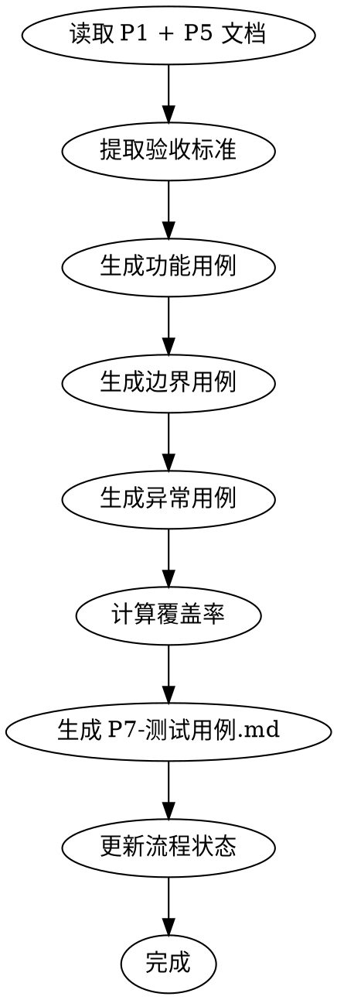

# ideal-test-case（P7 测试用例生成）

## Overview

基于需求文档和编码计划生成测试用例，覆盖功能、边界和异常场景。

## Agents

本 Skill 通过 Task 工具调用以下子代理：

| Agent | 角色 | 用途 |
|-------|------|------|
| qa | 测试工程师 | 测试设计、用例编写 |

**调用方式**：通过 Task 工具调用，Hook 自动注入 jsonl 配置的上下文。

```markdown
Task(
    subagent_type: "qa",
    prompt: "基于需求文档和编码计划生成测试用例，覆盖功能、边界、异常场景",
    model: "opus"
)
```

## When to Use

- P6 计划评审已通过
- 需要生成 P7-测试用例.md
- 需要为测试执行准备用例

## Prerequisites

- `docs/迭代/{需求名称}/P1-需求文档.md` 存在
- `docs/迭代/{需求名称}/P5-编码计划.md` 存在
- `docs/迭代/{需求名称}/流程状态.md` 中 P6 状态为 completed

## Input

| 输入 | 路径 | 说明 |
|------|------|------|
| 需求文档 | `docs/迭代/{需求名称}/P1-需求文档.md` | 包含验收标准 |
| 编码计划 | `docs/迭代/{需求名称}/P5-编码计划.md` | 包含任务和功能点 |

## Output

| 输出 | 路径 | 说明 |
|------|------|------|
| 测试用例 | `docs/迭代/{需求名称}/P7-测试用例.md` | 功能/边界/异常用例 |
| 流程状态更新 | `docs/迭代/{需求名称}/流程状态.md` | current_phase 更新为 P7 |

## Test Case Types

| 类型 | 说明 | 占比 |
|------|------|------|
| 功能测试 | 验证正常功能流程 | 50-60% |
| 边界测试 | 验证输入/状态边界 | 20-30% |
| 异常测试 | 验证错误处理 | 15-20% |

## Test Case Format

```markdown
## TC-{type}-{id}: {用例名称}

| 项目 | 内容 |
|------|------|
| **用例编号** | TC-{type}-{id} |
| **用例名称** | {名称} |
| **优先级** | P0/P1/P2 |
| **前置条件** | {测试前需满足的条件} |

**测试步骤**:
1. {步骤1}
2. {步骤2}
...

**预期结果**:
{期望的输出或状态}
```

## Priority Definition

| 优先级 | 说明 |
|--------|------|
| P0 | 核心功能，必须通过 |
| P1 | 重要功能，应该通过 |
| P2 | 次要功能，可延后 |

## Workflow



## Step-by-Step Process

### Step 1: 读取输入

1. 读取 `P1-需求文档.md`，提取：
   - 功能需求清单
   - 验收标准
   - 非功能需求

2. 读取 `P5-编码计划.md`，提取：
   - 模块和任务
   - 功能点映射

### Step 2: 提取验收标准

从需求文档中提取所有验收标准，作为测试用例的基础。

### Step 3: 生成功能测试用例

**调用 qa 子代理**：

```
Task(
    subagent_type: "qa",
    prompt: "生成功能测试用例，覆盖主流程和分支流程",
    model: "opus"
)
```

1. 每个功能点至少一个正向用例
2. 覆盖主流程和分支流程
3. 确保可验证

### Step 4: 生成边界测试用例

**调用 qa 子代理**：

```
Task(
    subagent_type: "qa",
    prompt: "生成边界测试用例，覆盖输入边界、状态边界、流程边界",
    model: "opus"
)
```

1. 输入边界（空值、最大值、最小值）
2. 状态边界（初始、中间、结束）
3. 流程边界（开始、进行中、完成）

### Step 5: 生成异常测试用例

**调用 qa 子代理**：

```
Task(
    subagent_type: "qa",
    prompt: "生成异常测试用例，覆盖错误输入、异常状态、外部错误",
    model: "opus"
)
```

1. 错误输入（无效数据、格式错误）
2. 异常状态（权限不足、资源不存在）
3. 外部错误（网络超时、服务不可用）

### Step 6: 计算覆盖率

1. 统计用例覆盖的功能点
2. 计算覆盖率百分比
3. 生成覆盖率报告

### Step 7: 生成文档

1. 组织用例清单
2. 添加覆盖率统计
3. 写入 `P7-测试用例.md`

### Step 8: 更新状态

更新 `流程状态.md`：
- current_phase: P7
- status: completed

## Quality Checklist

- [ ] 所有功能点有对应用例
- [ ] 包含功能、边界、异常三类用例
- [ ] 用例可独立执行
- [ ] 预期结果明确
- [ ] 包含覆盖率统计

## Common Mistakes

| 错误 | 正确做法 |
|------|----------|
| 只写正向用例 | 覆盖边界和异常 |
| 预期结果模糊 | 明确描述预期状态 |
| 步骤不可执行 | 确保步骤具体可操作 |
| 忽略前置条件 | 明确测试前需满足的条件 |

## References

- `references/templates/test-case-template.md` - 用例模板
- `references/examples/example-test-case.md` - 完整示例
