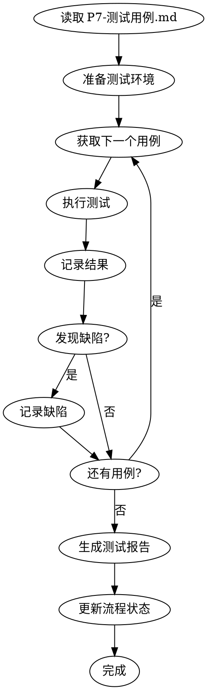

# ideal-test-exec（P11 测试执行）

## Overview

执行测试用例，收集测试结果，生成测试报告。

## Agents

本 Skill 调用以下角色能力：

| Agent | 角色 | 用途 |
|-------|------|------|
| qa | 测试工程师 | 测试执行、缺陷记录 |
| dev | 开发工程师 | 缺陷修复 |

请先阅读：
- `.claude/agents/qa.md`
- `.claude/agents/dev.md`

## When to Use

- P10 代码评审已通过
- 需要执行 P7-测试用例.md 中的用例
- 需要生成测试报告

## Prerequisites

- `docs/迭代/{需求名称}/P7-测试用例.md` 存在
- `docs/迭代/{需求名称}/流程状态.md` 中 P10 状态为 completed
- 代码已合并到测试分支

## Input

| 输入 | 路径 | 说明 |
|------|------|------|
| 测试用例 | `docs/迭代/{需求名称}/P7-测试用例.md` | 包含功能/边界/异常用例 |
| 代码 | 项目代码库 | 待测试的代码 |

## Output

| 输出 | 路径 | 说明 |
|------|------|------|
| 测试报告 | `docs/迭代/{需求名称}/P11-测试报告.md` | 测试结果和缺陷记录 |
| 流程状态更新 | `docs/迭代/{需求名称}/流程状态.md` | current_phase 更新为 P11 |

## Test Result Status

| 状态 | 说明 |
|------|------|
| ✅ PASS | 测试通过 |
| ❌ FAIL | 测试失败 |
| ⏭️ SKIP | 跳过测试 |
| 🚫 BLOCK | 被阻塞无法执行 |

## Workflow



## Test Report Structure

```markdown
# P11-测试报告

## 测试概况

| 项目 | 数量 |
|------|------|
| 总用例数 | {total} |
| 通过数 | {pass} |
| 失败数 | {fail} |
| 跳过数 | {skip} |
| 通过率 | {rate}% |

## 测试结果详情

| 用例编号 | 用例名称 | 状态 | 备注 |
|----------|----------|------|------|
| TC-F-001 | xxx | ✅ PASS | |
| TC-F-002 | xxx | ❌ FAIL | xxx |

## 缺陷记录

| 缺陷编号 | 严重程度 | 描述 | 状态 |
|----------|----------|------|------|
| DEF-001 | 高 | xxx | 待修复 |

## 测试结论

{结论和建议}
```

## Defect Severity

| 级别 | 说明 |
|------|------|
| 致命 | 系统崩溃、数据丢失 |
| 严重 | 核心功能不可用 |
| 一般 | 功能受限、体验问题 |
| 轻微 | 界面问题、文字错误 |

## Step-by-Step Process

### Step 1: 读取测试用例

1. 读取 `P7-测试用例.md`
2. 解析用例列表
3. 按优先级排序

### Step 2: 准备测试环境

1. 确认代码版本
2. 准备测试数据
3. 检查环境配置

### Step 3: 执行测试

1. 按优先级执行用例
2. 记录执行结果
3. 截图/日志留存

### Step 4: 记录缺陷

1. 发现缺陷时记录详细信息
2. 分类缺陷严重程度
3. 关联相关用例

### Step 5: 生成报告

1. 统计测试结果
2. 汇总缺陷信息
3. 给出测试结论

### Step 6: 更新状态

更新 `流程状态.md`：
- current_phase: P11
- status: completed

## Quality Checklist

- [ ] 所有用例已执行
- [ ] 结果记录准确
- [ ] 缺陷已记录
- [ ] 报告格式规范

## Common Mistakes

| 错误 | 正确做法 |
|------|----------|
| 跳过失败用例 | 记录失败原因 |
| 缺陷描述不清 | 包含复现步骤 |
| 忽略环境信息 | 记录测试环境 |

## References

- `references/templates/test-report-template.md` - 报告模板
- `scripts/test-runner.sh` - 测试执行脚本
