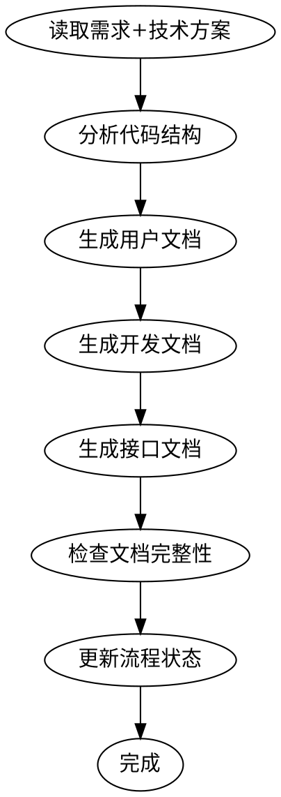

# ideal-wiki（P15 维基更新）

## Overview

基于代码和需求文档生成三种维基文档：用户文档、开发文档、接口文档。

## Agents

本 Skill 调用以下角色能力：

| Agent | 角色 | 用途 |
|-------|------|------|
| tech-writer | 技术文档撰写 | 文档编写、知识整理 |

请先阅读：`.claude/agents/tech-writer.md`

## When to Use

- P14 部署上线已完成
- 需要生成 `docs/Wiki/` 目录下的文档
- 需要更新项目维基

## Prerequisites

- `docs/迭代/{需求名称}/P1-需求文档.md` 存在
- `docs/迭代/{需求名称}/P3-技术方案.md` 存在
- 代码已上线
- `docs/迭代/{需求名称}/流程状态.md` 中 P14 状态为 completed

## Input

| 输入 | 路径 | 说明 |
|------|------|------|
| 需求文档 | `docs/迭代/{需求名称}/P1-需求文档.md` | 功能描述 |
| 技术方案 | `docs/迭代/{需求名称}/P3-技术方案.md` | 架构设计 |
| 代码 | 项目代码库 | 实现代码 |

## Output

| 输出 | 路径 | 说明 |
|------|------|------|
| 用户文档 | `docs/Wiki/用户文档/{功能名称}.md` | 面向最终用户 |
| 开发文档 | `docs/Wiki/开发文档/{功能名称}.md` | 面向开发人员 |
| 接口文档 | `docs/Wiki/接口文档/{功能名称}.md` | API 文档 |
| 流程状态更新 | `docs/迭代/{需求名称}/流程状态.md` | current_phase 更新为 P15 |

## Document Types

### 用户文档

**目标读者**: 最终用户、产品经理

**内容结构**:
```markdown
# {功能名称} - 用户指南

## 功能简介
{功能概述}

## 使用指南
### 快速开始
{快速上手步骤}

### 详细操作
{详细操作说明}

## 常见问题
{FAQ}

## 更新日志
{版本更新记录}
```

### 开发文档

**目标读者**: 开发人员、维护人员

**内容结构**:
```markdown
# {功能名称} - 开发文档

## 架构说明
{系统架构}

## 环境配置
### 开发环境
{开发环境配置}

### 依赖说明
{依赖项}

## 代码结构
{代码目录说明}

## 部署指南
{部署步骤}

## 维护说明
{维护注意事项}
```

### 接口文档

**目标读者**: 前端开发、第三方集成

**内容结构**:
```markdown
# {功能名称} - 接口文档

## 接口概览
{接口列表}

## 接口详情
### {接口名称}
- **路径**: `{method} {path}`
- **描述**: {描述}
- **请求参数**: {参数表}
- **响应格式**: {响应示例}
- **错误码**: {错误码表}
```

## Workflow



## Step-by-Step Process

### Step 1: 收集信息

1. 读取 `P1-需求文档.md`
2. 读取 `P3-技术方案.md`
3. 分析代码结构

### Step 2: 分析代码

1. 提取接口信息（API 端点、参数、响应）
2. 识别核心模块和组件
3. 分析配置和部署信息

### Step 3: 生成用户文档

1. 提取功能描述
2. 编写使用指南
3. 整理常见问题

### Step 4: 生成开发文档

1. 描述系统架构
2. 说明环境配置
3. 解释代码结构

### Step 5: 生成接口文档

1. 提取 API 列表
2. 描述请求/响应格式
3. 列出错误码

### Step 6: 检查完整性

1. 确保三类文档都已生成
2. 检查内容完整性
3. 验证格式正确

### Step 7: 更新状态

更新 `流程状态.md`：
- current_phase: P15
- status: completed

## Quality Checklist

- [ ] 用户文档完整
- [ ] 开发文档完整
- [ ] 接口文档完整
- [ ] 文档路径正确

## Common Mistakes

| 错误 | 正确做法 |
|------|----------|
| 缺少某类文档 | 确保三类文档都生成 |
| 接口描述不完整 | 包含完整的请求/响应示例 |
| 忽略版本信息 | 记录版本和更新日期 |

## References

- `references/templates/user-doc-template.md` - 用户文档模板
- `references/templates/dev-doc-template.md` - 开发文档模板
- `references/templates/api-doc-template.md` - 接口文档模板
- `references/examples/` - 示例文档
