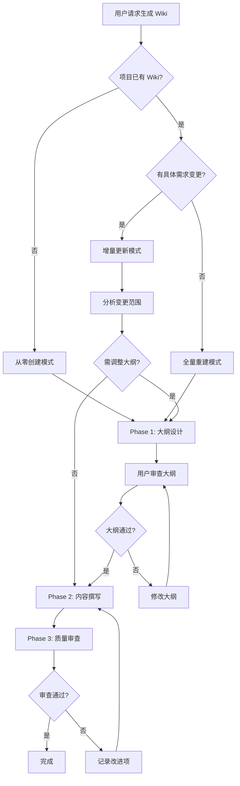
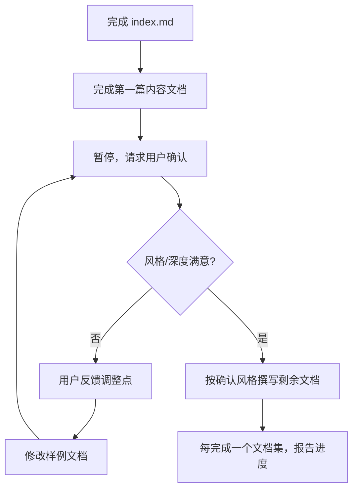

# ideal-wiki（P15 维基更新）

## Overview

基于项目上下文生成高质量维基文档集。

**核心原则**：大纲先行、用户确认、持续迭代。

**违反以下任何规则 = 违反 skill 精神**：
- 跳过大纲确认
- 内容简略模糊
- 输出单文件
- 使用 ASCII 图

---

## When to Use



### 触发条件

| 模式 | 触发条件 | 说明 |
|------|----------|------|
| 从零创建 | 项目无 Wiki | 完整的文档集规划 |
| 增量更新 | P14 完成 + 需求变更 | 更新受影响的文档 |
| 全量重建 | 用户明确要求 | 重新规划全部文档 |

### 不适用场景

- 私有/内部项目不需要公开文档 → 询问用户确认
- 纯数据/配置项目无业务逻辑 → 只生成最小文档

---

## Agents

| Agent | 角色 | 使用阶段 |
|-------|------|----------|
| tech-writer | 技术文档撰写 | Phase 1 大纲设计、Phase 2 内容撰写 |
| dev | 开发工程师 | Phase 3 内容验证（一致性检查） |
| qa | 测试工程师 | Phase 3 角色模拟审查 |

执行各阶段前请阅读对应 Agent 文件：`.claude/agents/{agent}.md`

---

## Phase 1: 大纲设计

**目标**：根据项目实际情况规划合理的文档结构，获得用户确认。

### 1.1 分析项目需求

**思考以下问题**：

1. **目标读者是谁？**
   - 终端用户？开发者？运维人员？
   - 他们的技术水平如何？

2. **项目有哪些主要功能/模块？**
   - 核心功能是什么？
   - 有哪些独立模块？

3. **读者需要什么类型的文档？**
   - 入门教程（Tutorial）
   - 操作指南（How-to）
   - 概念解析（Explanation）
   - 参考文档（Reference）

### 1.2 规划文档结构

**原则**：根据实际需求决定，不硬编码文档数量。

**思考过程**：

1. 每类读者需要哪些文档？
2. 每个功能模块需要独立文档吗？
3. 哪些内容适合放在一起？
4. 文档之间如何关联？

**目录结构**（按读者群体划分）：

```
docs/Wiki/
├── wiki-outline.md
├── wiki-improvements.md
│
├── 用户指南/           # 面向终端用户
│   └── *.md
│
└── 开发指南/           # 面向开发者
    └── *.md
```

### 1.3 生成大纲文件

**输出路径**：`docs/Wiki/wiki-outline.md`

**大纲必须包含**：
1. 项目概述（复杂度评估、目标读者）
2. 文档集列表（文件名、标题、主题范围、**章节结构**、预估篇幅）
3. 设计说明（拆分依据、覆盖范围）

**大纲格式**：

```markdown
# Wiki 文档大纲

## 项目概述
- 项目名称：{name}
- 目标读者：{reader types}
- 文档目标：{想让读者达成什么}

## 文档结构

### 用户指南/

#### 1. index.md - 首页
- 目标读者：{读者类型}
- 主题范围：{简要说明}
- 章节结构：
  - {章节 1}
  - {章节 2}
  - ...

#### 2. {filename}.md - {标题}
- 目标读者：{读者类型}
- 主题范围：{简要说明}
- 章节结构：
  - {章节 1}
  - {章节 2}
  - ...

### 开发指南/

...（同上格式）

## 设计说明

### 文档规划依据
- {说明为什么这样规划}

### 覆盖范围
- {说明覆盖的功能/场景}
```

### 1.4 用户审查确认

**IRON LAW: 必须等待用户明确确认后才能进入 Phase 2**

**无例外**：
- 不能假设"大纲看起来合理"就继续
- 不能因为"用户之前说要生成 Wiki"就跳过确认
- 不能因为"项目简单"就简化流程
- 确认意味着用户说了"确定"、"可以"、"没问题"等明确同意的话

**暂停并输出**：
```
大纲已生成到 docs/Wiki/wiki-outline.md

请审查大纲：
- 文档数量和拆分是否合理？
- 章节结构是否覆盖需要的内容？
- 是否需要调整某些文档的范围？

确认后我将开始撰写内容。
```

**用户可**：
- 确认大纲结构
- 要求调整文档数量
- 要求调整主题范围
- 要求合并或拆分文档
- 要求补充章节内容

---

## Phase 2: 内容撰写

**目标**：基于确认的大纲，撰写详细、准确、技术化的文档内容。

### 2.1 写作原则

#### 正式技术风格

- 使用行业通用术语，避免口语化
- **必须提供具体数据**，禁止模糊描述
- 使用主动语态描述系统行为

**具体数据 vs 模糊描述**：

| ❌ 模糊（禁止） | ✅ 具体（必须） |
|----------------|----------------|
| 响应很快 | 响应时间 < 100ms |
| 确保配置正确 | 设置 API_KEY 环境变量 |
| 需要一些时间 | 通常需要 5-10 分钟 |
| 支持多种格式 | 支持 JSON、YAML、XML |
| 经常使用 | 90% 的场景使用 |
| 非常重要 | 缺少此项会导致启动失败 |

#### Diataxis 写作指导

根据文档目的选择写作方式：

| 文档类型 | 写作重点 | 注意事项 |
|----------|----------|----------|
| **教程** | 让读者动手，尽早见效 | 关注"做什么"而非"解释什么" |
| **操作指南** | 面向结果，解决具体问题 | 不深入解释原理 |
| **概念解析** | 解释"为什么"，建立理解 | **以段落为主**，列表为辅 |
| **参考文档** | 结构化信息，便于查阅 | 简洁、聚焦事实 |

#### 段落写作规范

**核心原则**：
- 概念解析类文档**以段落为主**，列表为辅
- 每段一个观点，主题句在段首（开门见山）
- 使用过渡词建立连贯性：因此、然而、此外、例如
- ❌ 避免"列表堆砌"：不要用列表替代解释

**段落 vs 列表选择**：

| 情况 | 使用 |
|------|------|
| 需要解释"为什么" | 段落 |
| 需要建立逻辑链条 | 段落 |
| 快速查阅信息 | 列表 |
| 步骤序列 | 有序列表 |

**内容深度要求**：
- 流程说明必须完整：前置条件 → 步骤 → 预期结果 → 异常处理
- **禁止简化流程**：每个阶段都要说明输入、输出、关键活动
- 代码示例必须可执行
- 配置说明必须包含默认值和可选值

**结构化组织**：
- 每篇文档有明确的单一主题
- 章节层次不超过 4 级
- 交叉引用使用相对路径

### 2.2 输出格式要求

**IRON LAW: 必须输出文档集，禁止单文件**

```
✅ 正确：docs/Wiki/用户指南/
  ├── index.md
  ├── 快速开始.md
  ├── 流程概述.md
  └── ...

❌ 错误：docs/Wiki/用户指南.md（单文件）
```

**无例外**：
- 即使项目简单，也要拆分为文档集
- 最少 2 个文档：index.md + 至少一篇内容文档
- 文档集按读者类型或主题拆分

### 2.3 在线文档兼容

所有文档需符合以下技术标准，以支持 Docusaurus/ReadTheDocs 生成：

**图表要求**：
- **必须使用 Mermaid**，禁止 ASCII 图
- 流程图使用 `flowchart TD/LR`
- 时序图使用 `sequenceDiagram`

**Frontmatter 标准**：

```yaml
---
title: 文档标题
description: 文档描述（用于 SEO，150 字符内）
sidebar_position: 1
tags: [tag1, tag2]
---
```

**目录结构标准**：

```
docs/Wiki/
├── wiki-outline.md           # 大纲文件
├── wiki-improvements.md      # 改进项追踪
│
├── 用户指南/                 # 中文目录名
│   ├── _category_.json
│   ├── index.md
│   └── *.md
│
└── 开发指南/                 # 中文目录名
    ├── _category_.json
    ├── index.md
    └── *.md
```

**_category_.json 格式**：

```json
{
  "label": "用户指南",
  "position": 1,
  "link": {
    "type": "generated-index",
    "description": "CC-Workflow 用户文档"
  }
}
```

### 2.4 执行步骤

1. 读取用户确认的 `wiki-outline.md`
2. 创建目录结构（文档集，非单文件）
3. 按大纲顺序逐篇撰写
4. 每篇完成后检查：
   - Frontmatter 完整
   - Mermaid 图表语法正确（无 ASCII 图）
   - 内容使用具体数据（无模糊描述）
   - 流程说明完整（无遗漏步骤）
   - 代码块指定语言
   - 交叉链接有效
5. 生成 `_category_.json` 配置文件

### 2.5 渐进式撰写（样例确认）

**IRON LAW: 第一篇内容文档完成后必须暂停，等待用户确认风格**



**无例外**：
- 不能"为了效率"跳过样例确认
- 不能假设"大纲确认了就不用再确认"
- 第一篇内容文档通常是 `quick-start.md` 或大纲中排序靠前的文档

**暂停并输出**：
```
已完成样例文档：{文件路径}

请确认写作风格：
- 内容深度是否合适？（太简略/太详细/刚好）
- 技术风格是否正确？（太口语/太生硬/刚好）
- 流程说明是否清晰？（有遗漏/有歧义/清晰）

确认后我将继续撰写剩余文档，或根据反馈调整写作方式。
```

**用户反馈处理**：

| 反馈类型 | 处理方式 |
|----------|----------|
| 太简略 | 增加细节、补充步骤、添加具体数据 |
| 太详细 | 精简内容、提取为子页面 |
| 太口语 | 使用正式术语、减少"确保/非常重要"等词 |
| 太生硬 | 增加过渡句、添加示例 |
| 有遗漏 | 补充缺失步骤或前置条件 |
| 有歧义 | 明确表述、添加说明 |

**批量撰写阶段**：

样例确认后，按文档集分批撰写：
1. 完成一个文档集（如 用户指南/）
2. 报告进度："已完成用户指南（3/6 篇）"
3. 继续下一个文档集

---

## Phase 3: 质量审查

**目标**：验证文档质量，发现不足并记录改进项。

### 3.1 内容一致性审查

<!-- AGENT: dev -->
你现在扮演开发工程师角色。请执行内容一致性审查：

1. 读取项目核心代码和配置文件
2. 逐一检查 Wiki 文档中的描述：
   - 代码示例是否与实际代码一致
   - 配置参数是否与实际配置一致
   - 流程描述是否与实际逻辑一致
   - 版本号、依赖是否正确
3. 标记所有不一致之处（幻觉、过时、冲突）

输出格式：
```markdown
# 一致性检查报告

## 检查范围
- 检查文件：{list}
- 对比源：{code files}

## 发现的问题

| 优先级 | 文档 | 问题描述 | 实际情况 | 建议修复 |
|--------|------|----------|----------|----------|
| P0 | xxx.md | 描述 API 路径为 /v1/user | 实际为 /v2/user | 更新路径 |
```
<!-- END AGENT -->

### 3.2 角色模拟审查

<!-- AGENT: qa -->
你现在扮演测试工程师角色。请执行角色模拟审查：

**模拟新用户视角**：
1. 能否仅凭文档完成快速开始？
2. 是否有无法理解的概念或术语？
3. 是否缺少关键前置条件说明？
4. 步骤是否有歧义或遗漏？

**模拟开发者视角**：
1. 能否按文档搭建完整的开发环境？
2. 架构说明是否足够支持理解系统？
3. 贡献流程是否清晰可执行？
4. 是否缺少必要的代码示例？

输出格式：
```markdown
# 角色模拟审查报告

## 新用户模拟

### 可完成项
- {可以完成的任务}

### 遇到的困难
- {具体的困难和卡点}

### 缺失信息
- {文档应该包含但缺失的内容}

## 开发者模拟

### 可完成项
- {可以完成的任务}

### 遇到的困难
- {具体的困难和卡点}

### 缺失信息
- {文档应该包含但缺失的内容}
```
<!-- END AGENT -->

### 3.3 改进项追踪

审查发现的问题记录到 `docs/Wiki/wiki-improvements.md`：

```markdown
# Wiki 改进项追踪

## 改进项列表

| ID | 优先级 | 类型 | 问题描述 | 影响文档 | 状态 | 备注 |
|----|--------|------|----------|----------|------|------|
| IMP-001 | P0 | 一致性 | API 路径与代码不符 | api.md | 待修复 | Phase 3 发现 |
| IMP-002 | P1 | 完整性 | 缺少环境变量说明 | dev-env.md | 待补充 | 用户反馈 |
| IMP-003 | P2 | 可读性 | 架构图不够清晰 | arch.md | 待优化 | 开发者反馈 |

## 优先级说明
- P0：严重问题，必须立即修复（内容错误、与实际不符）
- P1：重要问题，应尽快处理（信息缺失、流程断裂）
- P2：一般问题，可排期处理（可读性、格式优化）
```

### 3.4 审查结果处理

| 情况 | 处理方式 |
|------|----------|
| 存在 P0 问题 | 立即修复后重新审查 |
| 仅存在 P1 问题 | 记录改进项，询问用户是否立即修复 |
| 仅存在 P2 问题 | 记录改进项，流程继续 |

---

## Step-by-Step Process

### Step 1: 识别模式

1. 检查 `docs/Wiki/` 目录状态
2. 询问用户确认模式（创建/更新/重建）

### Step 2: Phase 1 - 大纲设计

1. 分析项目代码、配置、现有文档
2. 评估项目复杂度
3. 动态设计文档集结构
4. 生成 `wiki-outline.md`
5. **暂停，等待用户审查确认**

### Step 3: Phase 2 - 内容撰写

1. 读取用户确认的大纲
2. 创建目录结构和 `_category_.json`
3. 按大纲逐篇撰写内容
4. 自检每篇文档质量

### Step 4: Phase 3 - 质量审查

1. 执行内容一致性审查（dev 角色）
2. 执行角色模拟审查（qa 角色）
3. 生成 `wiki-improvements.md`
4. 根据审查结果处理问题

### Step 5: 更新流程状态

更新 `docs/迭代/{需求名称}/流程状态.md`（如适用）：
- current_phase: P15
- wiki_status: completed
- wiki_review: pending

---

## Quality Checklist

### Phase 1: 大纲设计

- [ ] 项目复杂度分析完成
- [ ] 文档数量根据复杂度动态确定
- [ ] 大纲文件已生成
- [ ] **用户已确认大纲**

### Phase 2: 内容撰写

- [ ] 目录结构符合在线文档标准
- [ ] 所有文档有正确的 Frontmatter
- [ ] 内容使用正式技术风格
- [ ] 流程说明完整（无遗漏步骤）
- [ ] Mermaid 图表语法正确
- [ ] 代码块指定语言
- [ ] 交叉链接有效

### Phase 3: 质量审查

- [ ] 一致性检查完成
- [ ] 角色模拟审查完成
- [ ] 改进项已记录
- [ ] P0 问题已修复

---

## Common Mistakes

| 错误 | 正确做法 |
|------|----------|
| 跳过大纲直接撰写 | Phase 1 大纲必须经用户确认 |
| 假设大纲"看起来合理"就继续 | 必须等待用户明确说"确定" |
| 文档数量硬编码 | 根据项目实际需求动态决定 |
| 输出单文件 | 必须输出文档集（目录结构） |
| 跳过样例确认 | 第一篇内容文档后必须暂停确认风格 |
| 样例确认后不调整 | 根据用户反馈修改写作标准 |
| 内容过于简略 | 确保流程完整、步骤详细 |
| 使用模糊描述 | 提供具体数据（时间、数量、名称） |
| 简化流程说明 | 每个阶段说明输入、输出、关键活动 |
| 使用 ASCII 图 | 使用 Mermaid 图表 |
| 使用口语化表达 | 使用正式技术风格 |
| 忽略在线文档需求 | 符合 Frontmatter 和目录结构标准 |
| 生成后不审查 | 必须执行 Phase 3 质量审查 |
| 发现问题不记录 | 所有改进项必须记录到 wiki-improvements.md |
| 概念解析文档全用列表 | Explanation 类应以段落为主 |
| 列表堆砌替代解释 | 需要解释"为什么"时使用段落 |

## Red Flags - 立即停止

如果发现自己正在做以下事情，立即停止：

- "大纲看起来合理，继续撰写"
- "样例文档已完成，继续写剩下的"（未等待用户确认）
- "项目简单，一个文件就够了"
- "这是个概述，不需要太详细"
- "用 ASCII 图更直观"
- "用户之前确认要生成 Wiki，不用再问"
- "为了效率跳过样例确认"
- "概念用列表更清晰"（Explanation 类应使用段落）

**所有这些都意味着：停止，返回遵循规则。**

---

## References

| 文件 | 用途 |
|------|------|
| `references/guides/outline-design-guide.md` | 大纲设计详细指南 |
| `references/guides/technical-writing-guide.md` | 技术写作规范 |
| `references/guides/wiki-review-guide.md` | Wiki 审查详细指南 |
| `references/standards/online-wiki-standard.md` | 在线 Wiki 技术标准 |
| `references/guides/user-doc-guide.md` | 用户文档写作参考 |
| `references/guides/dev-doc-guide.md` | 开发文档写作参考 |
