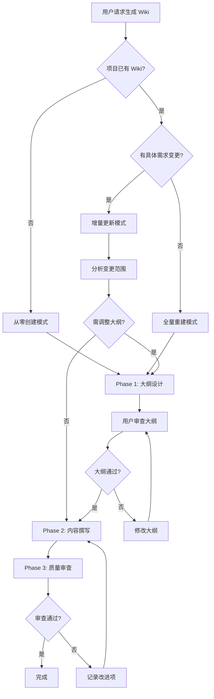

# ideal-wiki（P15 维基更新）

## Overview

基于项目上下文生成高质量维基文档集。采用**三阶段流程**确保文档质量：

1. **Phase 1 - 大纲设计**：根据项目复杂度动态规划文档结构，用户审查确认
2. **Phase 2 - 内容撰写**：基于大纲撰写详细、准确、技术化的文档内容
3. **Phase 3 - 质量审查**：验证内容一致性，模拟用户/开发者视角发现不足

核心原则：**文档是活的资产——大纲先行、用户确认、持续迭代**。

---

## When to Use



### 触发条件

| 模式 | 触发条件 | 说明 |
|------|----------|------|
| 从零创建 | 项目无 Wiki | 完整的文档集规划 |
| 增量更新 | P14 完成 + 需求变更 | 更新受影响的文档 |
| 全量重建 | 用户明确要求 | 重新规划全部文档 |

### 不适用场景

- 私有/内部项目不需要公开文档 → 询问用户确认
- 纯数据/配置项目无业务逻辑 → 只生成最小文档

---

## Agents

| Agent | 角色 | 使用阶段 |
|-------|------|----------|
| tech-writer | 技术文档撰写 | Phase 1 大纲设计、Phase 2 内容撰写 |
| dev | 开发工程师 | Phase 3 内容验证（一致性检查） |
| qa | 测试工程师 | Phase 3 角色模拟审查 |

执行各阶段前请阅读对应 Agent 文件：`.claude/agents/{agent}.md`

---

## Phase 1: 大纲设计

**目标**：根据项目复杂度规划合理的文档结构，获得用户确认。

### 1.1 分析项目复杂度

| 维度 | 简单 | 中等 | 复杂 |
|------|------|------|------|
| 功能模块 | 1-3 个 | 4-10 个 | 10+ 个 |
| 技术栈 | 单一技术 | 2-3 种技术 | 多系统/微服务 |
| 用户群体 | 单一角色 | 2-3 种角色 | 多种角色 |
| API 接口 | 无 | REST API | REST + GraphQL + SDK |

### 1.2 动态确定文档结构

**原则**：文档数量和拆分方式根据复杂度动态决定，不硬编码。

**复杂度 → 文档数量映射**：

| 项目复杂度 | 用户文档 | 开发文档 | 说明 |
|------------|----------|----------|------|
| 简单 | 2-3 篇 | 2-3 篇 | 快速开始 + 使用指南 + FAQ |
| 中等 | 4-6 篇 | 4-6 篇 | 按功能模块拆分使用指南 |
| 复杂 | 6-10 篇 | 6-10 篇 | 多层级文档结构 |

### 1.3 生成大纲文件

**输出路径**：`docs/Wiki/wiki-outline.md`

**大纲格式**：

```markdown
# Wiki 文档大纲

## 项目概述
- 项目名称：{name}
- 复杂度评估：{simple/medium/complex}
- 目标读者：{reader types}

## 文档结构

### 用户文档集

| 序号 | 文件名 | 标题 | 主题范围 | 预估篇幅 |
|------|--------|------|----------|----------|
| 1 | index.md | 用户指南首页 | 文档导航和概述 | 200-300 字 |
| 2 | quick-start.md | 快速开始 | 核心流程 5 步内完成 | 500-800 字 |
| ... | ... | ... | ... | ... |

### 开发文档集

| 序号 | 文件名 | 标题 | 主题范围 | 预估篇幅 |
|------|--------|------|----------|----------|
| 1 | index.md | 开发文档首页 | 文档导航和概述 | 200-300 字 |
| ... | ... | ... | ... | ... |

## 设计说明

### 文档拆分依据
- {说明为什么这样拆分}

### 预期覆盖范围
- {说明文档覆盖的功能范围}
```

### 1.4 用户审查确认

**必须等待用户确认后才能进入 Phase 2**。

用户可：
- 确认大纲结构
- 要求调整文档数量
- 要求调整主题范围
- 要求合并或拆分文档

---

## Phase 2: 内容撰写

**目标**：基于确认的大纲，撰写详细、准确、技术化的文档内容。

### 2.1 写作原则

**正式技术风格**：
- 使用行业通用术语，避免口语化
- 提供具体数据，避免模糊描述（"响应时间 < 100ms" 而非 "响应很快"）
- 使用被动语态描述系统行为（"系统创建文件" 而非 "文件将被创建"）

**内容深度要求**：
- 流程说明必须完整：前置条件 → 步骤 → 预期结果 → 异常处理
- 代码示例必须可执行
- 配置说明必须包含默认值和可选值

**结构化组织**：
- 每篇文档有明确的单一主题
- 章节层次不超过 4 级
- 交叉引用使用相对路径

### 2.2 在线文档兼容

所有文档需符合以下技术标准，以支持 Docusaurus/ReadTheDocs 生成：

**Frontmatter 标准**：

```yaml
---
title: 文档标题
description: 文档描述（用于 SEO，150 字符内）
sidebar_position: 1
tags: [tag1, tag2]
---
```

**目录结构标准**：

```
docs/Wiki/
├── wiki-outline.md           # 大纲文件
├── wiki-improvements.md      # 改进项追踪
│
├── user-guide/
│   ├── _category_.json
│   ├── index.md
│   └── *.md
│
└── dev-guide/
    ├── _category_.json
    ├── index.md
    └── *.md
```

**_category_.json 格式**：

```json
{
  "label": "用户指南",
  "position": 1,
  "link": {
    "type": "generated-index",
    "description": "CC-Workflow 用户文档"
  }
}
```

### 2.3 执行步骤

1. 读取用户确认的 `wiki-outline.md`
2. 按大纲顺序逐篇撰写
3. 每篇完成后检查：
   - Frontmatter 完整
   - Mermaid 图表语法正确
   - 代码块指定语言
   - 交叉链接有效
4. 生成 `_category_.json` 配置文件

---

## Phase 3: 质量审查

**目标**：验证文档质量，发现不足并记录改进项。

### 3.1 内容一致性审查

<!-- AGENT: dev -->
你现在扮演开发工程师角色。请执行内容一致性审查：

1. 读取项目核心代码和配置文件
2. 逐一检查 Wiki 文档中的描述：
   - 代码示例是否与实际代码一致
   - 配置参数是否与实际配置一致
   - 流程描述是否与实际逻辑一致
   - 版本号、依赖是否正确
3. 标记所有不一致之处（幻觉、过时、冲突）

输出格式：
```markdown
# 一致性检查报告

## 检查范围
- 检查文件：{list}
- 对比源：{code files}

## 发现的问题

| 优先级 | 文档 | 问题描述 | 实际情况 | 建议修复 |
|--------|------|----------|----------|----------|
| P0 | xxx.md | 描述 API 路径为 /v1/user | 实际为 /v2/user | 更新路径 |
```
<!-- END AGENT -->

### 3.2 角色模拟审查

<!-- AGENT: qa -->
你现在扮演测试工程师角色。请执行角色模拟审查：

**模拟新用户视角**：
1. 能否仅凭文档完成快速开始？
2. 是否有无法理解的概念或术语？
3. 是否缺少关键前置条件说明？
4. 步骤是否有歧义或遗漏？

**模拟开发者视角**：
1. 能否按文档搭建完整的开发环境？
2. 架构说明是否足够支持理解系统？
3. 贡献流程是否清晰可执行？
4. 是否缺少必要的代码示例？

输出格式：
```markdown
# 角色模拟审查报告

## 新用户模拟

### 可完成项
- {可以完成的任务}

### 遇到的困难
- {具体的困难和卡点}

### 缺失信息
- {文档应该包含但缺失的内容}

## 开发者模拟

### 可完成项
- {可以完成的任务}

### 遇到的困难
- {具体的困难和卡点}

### 缺失信息
- {文档应该包含但缺失的内容}
```
<!-- END AGENT -->

### 3.3 改进项追踪

审查发现的问题记录到 `docs/Wiki/wiki-improvements.md`：

```markdown
# Wiki 改进项追踪

## 改进项列表

| ID | 优先级 | 类型 | 问题描述 | 影响文档 | 状态 | 备注 |
|----|--------|------|----------|----------|------|------|
| IMP-001 | P0 | 一致性 | API 路径与代码不符 | api.md | 待修复 | Phase 3 发现 |
| IMP-002 | P1 | 完整性 | 缺少环境变量说明 | dev-env.md | 待补充 | 用户反馈 |
| IMP-003 | P2 | 可读性 | 架构图不够清晰 | arch.md | 待优化 | 开发者反馈 |

## 优先级说明
- P0：严重问题，必须立即修复（内容错误、与实际不符）
- P1：重要问题，应尽快处理（信息缺失、流程断裂）
- P2：一般问题，可排期处理（可读性、格式优化）
```

### 3.4 审查结果处理

| 情况 | 处理方式 |
|------|----------|
| 存在 P0 问题 | 立即修复后重新审查 |
| 仅存在 P1 问题 | 记录改进项，询问用户是否立即修复 |
| 仅存在 P2 问题 | 记录改进项，流程继续 |

---

## Step-by-Step Process

### Step 1: 识别模式

1. 检查 `docs/Wiki/` 目录状态
2. 询问用户确认模式（创建/更新/重建）

### Step 2: Phase 1 - 大纲设计

1. 分析项目代码、配置、现有文档
2. 评估项目复杂度
3. 动态设计文档集结构
4. 生成 `wiki-outline.md`
5. **暂停，等待用户审查确认**

### Step 3: Phase 2 - 内容撰写

1. 读取用户确认的大纲
2. 创建目录结构和 `_category_.json`
3. 按大纲逐篇撰写内容
4. 自检每篇文档质量

### Step 4: Phase 3 - 质量审查

1. 执行内容一致性审查（dev 角色）
2. 执行角色模拟审查（qa 角色）
3. 生成 `wiki-improvements.md`
4. 根据审查结果处理问题

### Step 5: 更新流程状态

更新 `docs/迭代/{需求名称}/流程状态.md`（如适用）：
- current_phase: P15
- wiki_status: completed
- wiki_review: pending

---

## Quality Checklist

### Phase 1: 大纲设计

- [ ] 项目复杂度分析完成
- [ ] 文档数量根据复杂度动态确定
- [ ] 大纲文件已生成
- [ ] **用户已确认大纲**

### Phase 2: 内容撰写

- [ ] 目录结构符合在线文档标准
- [ ] 所有文档有正确的 Frontmatter
- [ ] 内容使用正式技术风格
- [ ] 流程说明完整（无遗漏步骤）
- [ ] Mermaid 图表语法正确
- [ ] 代码块指定语言
- [ ] 交叉链接有效

### Phase 3: 质量审查

- [ ] 一致性检查完成
- [ ] 角色模拟审查完成
- [ ] 改进项已记录
- [ ] P0 问题已修复

---

## Common Mistakes

| 错误 | 正确做法 |
|------|----------|
| 跳过大纲直接撰写 | Phase 1 大纲必须经用户确认 |
| 文档数量硬编码 | 根据项目复杂度动态决定 |
| 内容过于简略 | 确保流程完整、步骤详细 |
| 使用口语化表达 | 使用正式技术风格 |
| 忽略在线文档需求 | 符合 Frontmatter 和目录结构标准 |
| 生成后不审查 | 必须执行 Phase 3 质量审查 |
| 发现问题不记录 | 所有改进项必须记录到 wiki-improvements.md |

---

## References

| 文件 | 用途 |
|------|------|
| `references/guides/outline-design-guide.md` | 大纲设计详细指南 |
| `references/guides/technical-writing-guide.md` | 技术写作规范 |
| `references/guides/wiki-review-guide.md` | Wiki 审查详细指南 |
| `references/standards/online-wiki-standard.md` | 在线 Wiki 技术标准 |
| `references/guides/user-doc-guide.md` | 用户文档写作参考 |
| `references/guides/dev-doc-guide.md` | 开发文档写作参考 |
