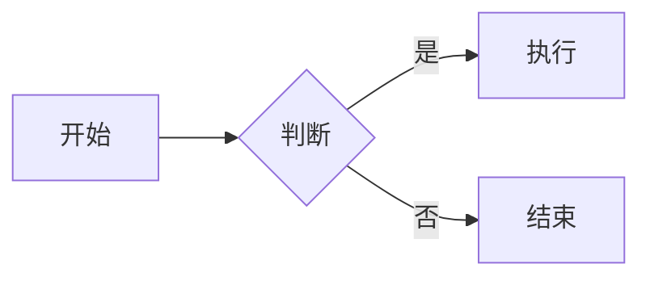

# 技术写作规范

## 概述

本规范定义了 CC-Workflow Wiki 文档的写作标准，确保文档内容正式、准确、技术化。

**核心目标**：
- 消除「AI 味」，使用正式技术风格
- 确保内容深度，避免过于简略
- 保证流程完整，无遗漏步骤

---

## 语言风格

### 正式技术风格

**使用行业通用术语**：

| 避免 | 推荐 |
|------|------|
| 这个东西 | 该组件 / 该模块 |
| 它可以 | 支持以下功能 |
| 挺简单的 | 步骤如下 |
| 你需要 | 用户需要 / 执行以下操作 |
| 我们建议 | 建议 / 推荐配置 |

**避免口语化**：

| 口语化 | 技术化 |
|--------|--------|
| 这个功能主要是用来... | 该功能用于... |
| 然后你要做的是... | 后续步骤包括... |
| 差不多就是这样 | 配置完成后，系统将... |
| 如果出了问题 | 异常处理方式如下 |

### 数据与精确性

**提供具体数值**：

| 模糊描述 | 精确描述 |
|----------|----------|
| 响应很快 | 响应时间 < 100ms（P95） |
| 支持大量并发 | 支持 1000 QPS |
| 定期执行 | 每 5 分钟执行一次 |
| 较大文件 | 文件大小 > 100MB |

**使用量化指标**：

| 模糊描述 | 量化描述 |
|----------|----------|
| 提高效率 | 减少人工操作 70% |
| 优化性能 | 请求延迟降低 50% |
| 增强稳定性 | 可用性提升至 99.9% |

### 主动语态优先

| 被动语态 | 主动语态 |
|----------|----------|
| 文件将被创建 | 系统创建文件 |
| 配置需要被修改 | 用户修改配置 |
| 请求将被处理 | 服务端处理请求 |

---

## 内容深度要求

### 流程说明完整性

每个流程/操作必须包含：

1. **前置条件**
   - 必需的环境/工具
   - 必需的权限/配置
   - 依赖的其他步骤

2. **操作步骤**
   - 每步一个清晰的动作
   - 具体的命令或操作
   - 参数说明（如有）

3. **预期结果**
   - 成功时的输出/状态
   - 如何验证成功

4. **异常处理**
   - 常见错误及解决方式
   - 回滚方案（如适用）

**示例**：

```markdown
### 创建新用户

**前置条件**：
- 已安装 CLI 工具 v1.0+
- 具有管理员权限

**步骤**：

1. 执行创建命令
   ```bash
   user-cli create --name "张三" --email "zhangsan@example.com"
   ```

2. 确认用户信息
   ```bash
   user-cli get --email "zhangsan@example.com"
   ```

**预期结果**：
- 终端输出：`User created successfully. ID: usr_12345`
- 用户状态为 `active`

**常见问题**：

| 错误信息 | 原因 | 解决方案 |
|----------|------|----------|
| `Email already exists` | 邮箱已被注册 | 使用其他邮箱 |
| `Permission denied` | 无管理员权限 | 联系管理员授权 |
```

### 代码示例要求

**必须可执行**：
- 完整的命令，非片段
- 包含必要的参数
- 指定版本要求（如有）

**示例**：

```markdown
# 推荐：完整可执行
```bash
# 安装依赖（需要 Node.js 18+）
npm install cc-workflow@1.0.0

# 初始化项目
npx cc-workflow init --template typescript
```

# 避免：不完整片段
```bash
npm install ...
init ...
```
```

### 配置说明要求

**必须包含**：
- 配置项名称
- 类型
- 默认值
- 可选值范围
- 说明

**示例**：

```markdown
### 数据库配置

| 配置项 | 类型 | 默认值 | 说明 |
|-------|------|--------|------|
| DB_HOST | string | localhost | 数据库主机地址 |
| DB_PORT | number | 5432 | 数据库端口，范围：1-65535 |
| DB_POOL_SIZE | number | 10 | 连接池大小，建议：CPU 核心数 * 2 |
```

---

## 结构化组织

### 章节层次

- **最多 4 级**：H1 > H2 > H3 > H4
- **每级有明确主题**：不跑题
- **同级结构一致**：风格统一

### 交叉引用

**使用相对路径**：

```markdown
# 同目录
参见 [配置说明](./configuration.md)

# 上级目录
参见 [架构设计](../architecture.md)

# 子目录
参见 [API 概览](./api/overview.md)
```

### 信息组织

**使用表格组织结构化信息**：

```markdown
| 命令 | 用途 | 示例 |
|------|------|------|
| ls | 列出文件 | ls -la |
```

**使用列表组织步骤或要点**：

```markdown
1. 第一步
2. 第二步
   - 子步骤 a
   - 子步骤 b
3. 第三步
```

---

## 在线文档兼容

### Frontmatter 标准

每篇文档必须包含：

```yaml
---
title: 文档标题
description: 简短描述（150 字符内，用于 SEO）
sidebar_position: 1
tags: [tag1, tag2]
---
```

### Mermaid 图表

**使用标准语法**：



**支持的图表类型**：
- flowchart：流程图
- sequenceDiagram：时序图
- stateDiagram：状态图
- classDiagram：类图

### 代码块

**必须指定语言**：

````markdown
```bash
npm install
```

```typescript
const config: Config = {
  host: 'localhost'
};
```

```json
{
  "name": "cc-workflow"
}
```
````

---

## 写作检查清单

### 语言风格

- [ ] 无口语化表达
- [ ] 使用行业通用术语
- [ ] 提供具体数值（非模糊描述）
- [ ] 主动语态优先

### 内容深度

- [ ] 流程包含前置条件
- [ ] 流程包含预期结果
- [ ] 流程包含异常处理
- [ ] 代码示例可执行
- [ ] 配置说明包含默认值

### 结构化

- [ ] 章节层次不超过 4 级
- [ ] 交叉引用使用相对路径
- [ ] 结构化信息使用表格
- [ ] 步骤使用有序列表

### 格式规范

- [ ] Frontmatter 完整
- [ ] 代码块指定语言
- [ ] Mermaid 图表语法正确
