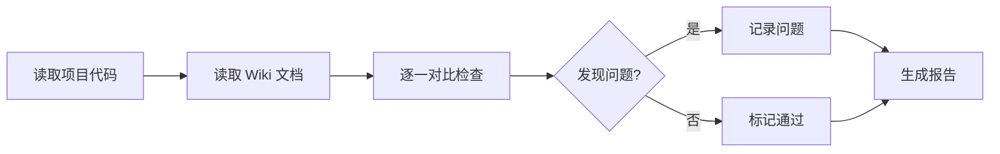
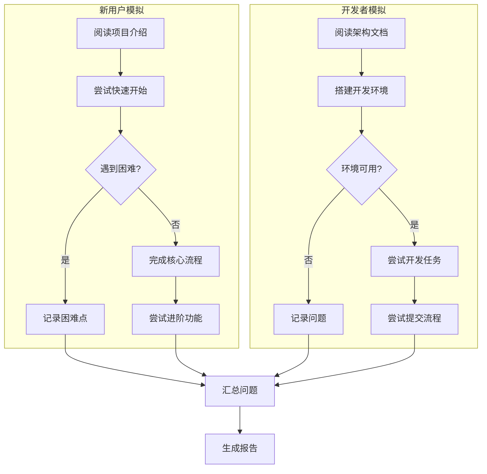
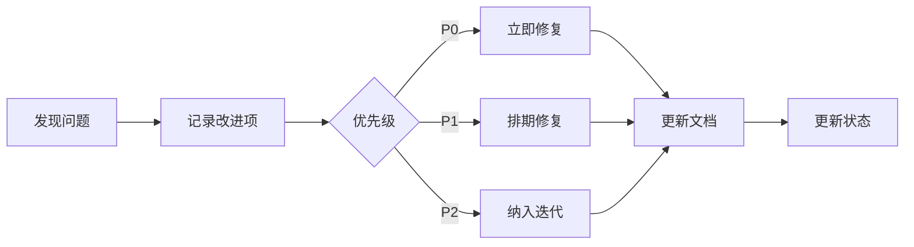

# Wiki 审查指南

## 概述

Wiki 审查是确保文档质量的关键环节，包含两个维度：
1. **内容一致性审查**：验证文档内容与项目实际是否一致
2. **角色模拟审查**：模拟用户/开发者视角发现文档不足

---

## 内容一致性审查

### 审查目标

确保 Wiki 文档内容与项目代码、配置、实际行为一致，不存在：
- **幻觉内容**：文档描述的功能/特性不存在
- **过时信息**：文档描述与当前版本不符
- **冲突描述**：不同文档间描述矛盾

### 审查范围

| 检查项 | 检查内容 | 优先级 |
|--------|----------|--------|
| 代码示例 | 命令、API、配置是否与代码一致 | P0 |
| 版本信息 | 版本号、依赖版本是否正确 | P0 |
| 流程描述 | 步骤是否与实际逻辑一致 | P0 |
| 配置参数 | 参数名、默认值是否正确 | P1 |
| 文件路径 | 引用的文件路径是否存在 | P1 |
| 链接地址 | 外部链接是否有效 | P2 |

### 审查流程



### 审查方法

#### 1. 代码示例验证

**检查步骤**：
1. 提取文档中的代码块
2. 对比实际代码/配置
3. 验证命令是否可执行

**常见问题**：

| 问题类型 | 示例 | 检测方法 |
|----------|------|----------|
| API 路径错误 | 文档写 `/v1/user`，实际 `/v2/user` | 对比路由定义 |
| 参数名错误 | 文档写 `user_name`，实际 `username` | 对比接口定义 |
| 命令不存在 | 文档写 `cli run`，实际 `cli start` | 检查 CLI 帮助 |

#### 2. 流程逻辑验证

**检查步骤**：
1. 梳理文档描述的流程
2. 对比实际代码逻辑
3. 检查步骤是否有遗漏/多余

**常见问题**：

| 问题类型 | 示例 |
|----------|------|
| 遗漏步骤 | 文档缺少必要的配置步骤 |
| 顺序错误 | 文档步骤顺序与依赖关系不符 |
| 条件缺失 | 文档未说明特定条件下的处理 |

#### 3. 配置参数验证

**检查步骤**：
1. 提取文档中的配置说明
2. 对比配置文件/代码中的定义
3. 验证默认值和可选值

**常见问题**：

| 问题类型 | 示例 |
|----------|------|
| 默认值错误 | 文档写默认 8080，实际 3000 |
| 可选值遗漏 | 文档未列出所有可选值 |
| 类型错误 | 文档写 string，实际 number |

### 报告格式

```markdown
# 一致性检查报告

## 概述
- 检查时间：{datetime}
- 检查范围：{file list}
- 对比源：{code files}

## 检查结果

### 严重问题（P0）

| 文档 | 位置 | 问题描述 | 实际情况 | 建议修复 |
|------|------|----------|----------|----------|
| api.md | 第 45 行 | API 路径 /v1/user | 实际为 /v2/user | 更新路径 |

### 一般问题（P1）

| 文档 | 位置 | 问题描述 | 实际情况 | 建议修复 |
|------|------|----------|----------|----------|
| config.md | 第 20 行 | 默认端口 8080 | 实际为 3000 | 更新默认值 |

### 轻微问题（P2）

| 文档 | 位置 | 问题描述 | 建议修复 |
|------|------|----------|----------|
| guide.md | 第 100 行 | 外部链接失效 | 更新或移除链接 |

## 统计
- P0 问题：{count} 项
- P1 问题：{count} 项
- P2 问题：{count} 项
```

---

## 角色模拟审查

### 审查目标

模拟真实用户/开发者使用文档，发现：
- **理解困难**：概念解释不清、术语未定义
- **操作卡点**：步骤不清晰、缺少前置条件
- **信息缺失**：缺少必要的说明、示例

### 模拟角色

#### 新用户模拟

**角色设定**：
- 第一次接触项目
- 了解相关领域基础知识
- 不了解项目特定概念

**检查清单**：

| 检查项 | 问题 |
|--------|------|
| 项目介绍 | 是否清楚项目是什么、解决什么问题？ |
| 快速开始 | 能否独立完成？需要多长时间？ |
| 概念理解 | 核心概念是否有解释？ |
| 前置条件 | 是否说明了必要的环境/工具？ |
| 验证方式 | 如何确认操作成功？ |

**典型问题**：

| 问题类型 | 示例 |
|----------|------|
| 缺少背景 | 直接开始讲功能，不知项目用途 |
| 术语未解释 | 直接使用项目特定术语 |
| 步骤跳跃 | 省略了「显而易见」的步骤 |
| 验证缺失 | 没说成功后是什么样 |

#### 开发者模拟

**角色设定**：
- 准备参与项目开发
- 了解相关技术栈
- 需要搭建开发环境

**检查清单**：

| 检查项 | 问题 |
|--------|------|
| 环境搭建 | 能否按文档搭建完整环境？ |
| 架构理解 | 是否足够理解系统结构？ |
| 代码导航 | 能否快速找到相关代码？ |
| 开发流程 | 如何开始开发、测试、提交？ |
| 调试方法 | 如何调试、查看日志？ |

**典型问题**：

| 问题类型 | 示例 |
|----------|------|
| 环境遗漏 | 缺少必要的依赖说明 |
| 架构不清 | 架构图过于简单或缺失 |
| 流程断裂 | 开发-测试-提交流程不完整 |
| 缺少示例 | 关键操作缺少代码示例 |

### 审查流程



### 报告格式

```markdown
# 角色模拟审查报告

## 新用户模拟

### 模拟场景
- 角色：首次使用的开发者
- 目标：完成核心功能试用
- 耗时预估：{time}

### 可完成项
- ✅ 阅读项目介绍
- ✅ 安装 CLI 工具
- ✅ 执行初始化命令

### 遇到的困难
| 步骤 | 困难描述 | 影响 |
|------|----------|------|
| 配置环境变量 | 文档未说明必需变量 | 无法继续 |

### 缺失信息
- {应该有但没有的内容}

## 开发者模拟

### 模拟场景
- 角色：准备参与开发的贡献者
- 目标：完成首次代码提交
- 耗时预估：{time}

### 可完成项
- ✅ {完成的项目}

### 遇到的困难
| 步骤 | 困难描述 | 影响 |
|------|----------|------|
| {步骤} | {困难} | {影响} |

### 缺失信息
- {应该有但没有的内容}

## 综合评估

| 维度 | 评分（1-5） | 说明 |
|------|-------------|------|
| 新用户友好度 | {score} | {说明} |
| 开发者友好度 | {score} | {说明} |
| 内容完整性 | {score} | {说明} |
| 结构清晰度 | {score} | {说明} |
```

---

## 改进项追踪

### 改进项文件格式

```markdown
# Wiki 改进项追踪

## 统计
- 待处理：{count} 项
- 处理中：{count} 项
- 已完成：{count} 项

## 改进项列表

| ID | 优先级 | 类型 | 问题描述 | 影响文档 | 状态 | 来源 | 备注 |
|----|--------|------|----------|----------|------|------|------|
| IMP-001 | P0 | 一致性 | API 路径与代码不符 | api.md | 待修复 | 一致性检查 | |
| IMP-002 | P1 | 完整性 | 缺少环境变量说明 | dev-env.md | 待补充 | 用户模拟 | |
| IMP-003 | P2 | 可读性 | 架构图不够清晰 | arch.md | 待优化 | 开发者模拟 | |

## 优先级说明
- P0：严重问题，必须立即修复（内容错误、与实际不符）
- P1：重要问题，应尽快处理（信息缺失、流程断裂）
- P2：一般问题，可排期处理（可读性、格式优化）

## 类型说明
- 一致性：文档与实际不符
- 完整性：缺少必要信息
- 可读性：表述不清或难以理解
- 格式：格式或规范问题
```

### 处理流程


