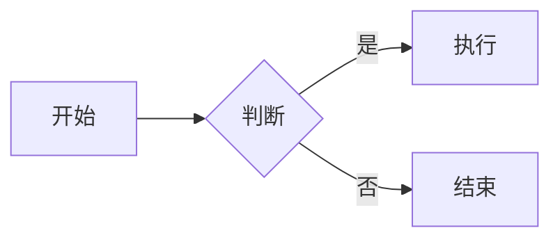

# 技术写作通用原则

## 核心理念

**让复杂的技术内容变得易于理解。**

文档是活的资产：结构化思维 + 持续迭代 = 可复制的团队生产力。

---

## 写作原则

### 1. 用户中心

始终考虑：
- **读者是谁？** 新用户 / 实践者 / 专家
- **他们需要什么？** 快速上手 / 详细指南 / 参考查询
- **他们能理解什么？** 技术深度要匹配目标读者

```
❌ 假设读者背景：使用标准 OAuth 2.0 流程
✅ 解释术语：使用 OAuth 2.0 授权流程（让用户在第三方平台登录）
```

### 2. 结构优先

- 先规划文档结构，再填充内容
- 使用清晰的层次和导航
- 让信息易于查找

**层级原则**：不超过 4 级深度

### 3. 准确性

- 文档内容必须与实际一致
- 示例代码必须可运行
- 版本信息必须准确

### 4. 简洁明了

- 一句话能说清楚的不用两句
- 使用列表和表格组织信息
- 避免冗余和重复

---

## 语言风格

### 使用主动语态

```
❌ 被动：文件将被系统创建
✅ 主动：系统创建文件
```

### 使用简单句

```
❌ 复杂：当用户点击提交按钮后，如果所有验证都通过，系统将会处理数据并返回结果
✅ 简单：点击提交后，系统验证并保存数据
```

### 使用列表组织

```
❌ 段落：首先你需要安装 Node.js，然后克隆项目，接着安装依赖，最后启动服务
✅ 列表：
   1. 安装 Node.js
   2. 克隆项目
   3. 安装依赖
   4. 启动服务
```

### 提供具体数值

```
❌ 模糊：响应时间很快
✅ 具体：响应时间 < 100ms（P95）
```

---

## 格式规范

### 代码块

必须指定语言类型：

````
❌ ```
   npm install
   ```

✅ ```bash
   npm install
   ```
````

### 图表

使用 Mermaid，不使用 ASCII：

````markdown

````

### 链接

- 使用相对路径引用项目内文档
- 使用 `[描述](链接)` 格式
- 确保链接有效

### 层级结构

```
docs/Wiki/
├── 用户文档/
│   ├── README.md          # 一级：文档集索引
│   ├── 快速开始.md        # 一级：单篇文档
│   └── advanced/          # 二级：子目录
│       └── config.md      # 二级：进阶文档
```

---

## 文档类型对比

| 类型 | 目的 | 读者 | 特点 |
|------|------|------|------|
| 快速开始 | 5分钟上手 | 新用户 | 最小步骤，立即见效 |
| 使用指南 | 详细功能说明 | 普通用户 | 步骤完整，覆盖全部功能 |
| FAQ | 常见问题解答 | 遇到问题的用户 | Q&A 格式，问题导向 |
| API 文档 | 接口说明 | 开发者 | 参数表、响应示例、错误码 |
| 开发指南 | 本地开发设置 | 新开发者 | 环境、依赖、构建、测试 |
| 架构文档 | 系统设计说明 | 架构师/维护者 | 组件图、数据流、决策记录 |

---

## 质量检查清单

### 写作时检查

- [ ] 目标读者是否明确？
- [ ] 技术深度是否匹配？
- [ ] 代码示例是否可运行？
- [ ] 术语是否需要解释？

### 格式检查

- [ ] 代码块是否指定语言？
- [ ] 图表是否使用 Mermaid？
- [ ] 链接是否有效？
- [ ] 层级是否过深？

### 完整性检查

- [ ] 是否有前置条件说明？
- [ ] 是否有预期结果说明？
- [ ] 是否有常见问题/错误处理？
- [ ] 是否有版本/更新信息？

---

## 常见陷阱

| 陷阱 | 表现 | 解决方案 |
|------|------|----------|
| 假设背景 | 读者不理解术语 | 解释专业术语，提供入门链接 |
| 信息过载 | 一个文档包含所有 | 按主题拆分，建立导航 |
| 缺乏示例 | 只有文字说明 | 提供可运行的代码示例 |
| 文档过时 | 内容与代码不一致 | 将文档更新纳入开发流程 |
| 过于正式 | 官僚化语言 | 使用简洁、直接的表达 |

---

## 参考资料

- [GitHub Docs 贡献指南](https://github.com/github/docs)
- [Write the Docs 社区](https://www.writethedocs.org/)
- [Google 技术写作指南](https://developers.google.com/tech-writing)
