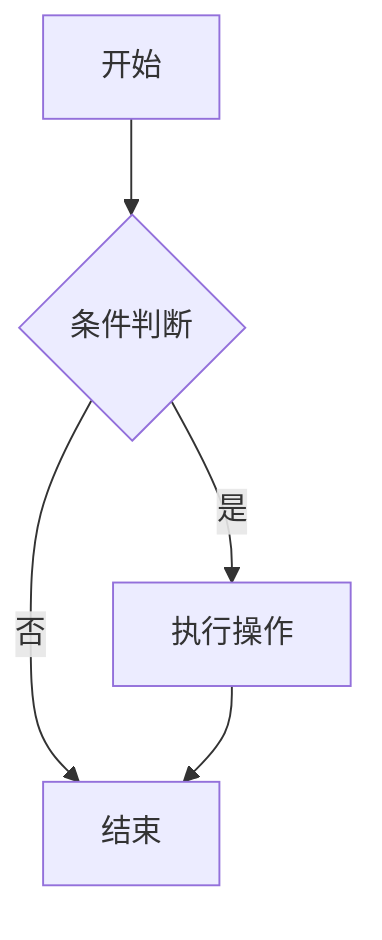
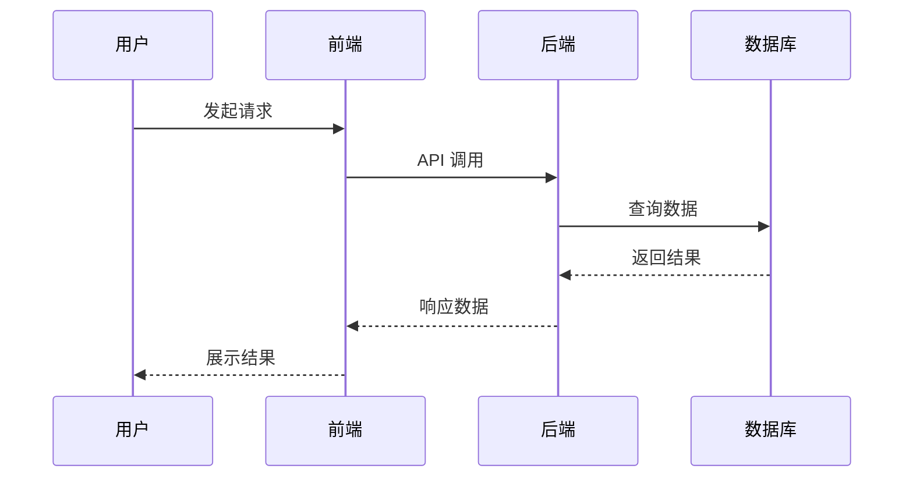

# 在线 Wiki 技术标准

## 概述

本标准定义了 CC-Workflow Wiki 文档的技术规范，确保文档可被主流文档平台（Docusaurus、ReadTheDocs、GitBook 等）正确解析和渲染。

---

## 目录结构标准

### 基础结构

```
docs/
├── wiki-outline.md           # 大纲文件
├── wiki-improvements.md      # 改进项追踪
│
├── user-guide/               # 用户文档集
│   ├── _category_.json       # Docusaurus 分类配置
│   ├── index.md              # 文档集首页（必需）
│   └── *.md                  # 其他文档
│
├── dev-guide/                # 开发文档集
│   ├── _category_.json
│   ├── index.md
│   └── *.md
│
└── api-guide/                # API 文档集（如有）
    ├── _category_.json
    ├── index.md
    └── *.md
```

### 多层级结构（复杂项目）

```
docs/
└── user-guide/
    ├── _category_.json
    ├── index.md
    ├── getting-started/
    │   ├── _category_.json
    │   ├── index.md
    │   ├── installation.md
    │   └── quick-start.md
    ├── tutorials/
    │   ├── _category_.json
    │   └── ...
    └── reference/
        └── ...
```

---

## 文件命名规范

### 命名规则

| 规则 | 示例 | 说明 |
|------|------|------|
| 使用小写字母 | `quick-start.md` | 避免大小写问题 |
| 使用连字符分隔 | `api-reference.md` | 不用空格或下划线 |
| 避免特殊字符 | `user-guide.md` | 不用中文、符号 |
| 语义化命名 | `deployment-guide.md` | 名称反映内容 |

### 文件名映射

| 中文名 | 英文文件名 |
|--------|------------|
| 首页 | `index.md` |
| 快速开始 | `quick-start.md` |
| 使用指南 | `user-guide.md` 或按模块拆分 |
| 常见问题 | `faq.md` |
| 更新日志 | `changelog.md` |
| 架构设计 | `architecture.md` |
| 开发环境 | `development-environment.md` |
| 代码结构 | `code-structure.md` |
| 部署指南 | `deployment-guide.md` |
| 贡献指南 | `contributing.md` |
| API 概览 | `api-overview.md` |

---

## Markdown 规范

### Frontmatter 标准

每篇文档必须包含 frontmatter：

```yaml
---
title: 文档标题
description: 文档描述，用于 SEO，控制在 150 字符内
sidebar_position: 1
tags: [tag1, tag2, tag3]
---
```

**字段说明**：

| 字段 | 必需 | 类型 | 说明 |
|------|------|------|------|
| title | 是 | string | 文档标题，显示在页面和导航 |
| description | 是 | string | 文档描述，用于 SEO |
| sidebar_position | 否 | number | 侧边栏排序位置 |
| tags | 否 | string[] | 文档标签 |

### 标题层级

- **H1 (`#`)**：文档标题，与 frontmatter title 一致，每篇仅一个
- **H2 (`##`)**：主要章节
- **H3 (`###`)**：子章节
- **H4 (`####`)**：细分子章节，不建议更深

**示例**：

```markdown
---
title: 快速开始
description: 5 分钟快速上手 CC-Workflow
---

# 快速开始

## 前置条件

### 系统要求

#### macOS

#### Linux

## 安装步骤

### 下载安装

### 配置环境
```

### 段落与空行

- 段落间使用**空行**分隔
- 列表项之间不留空行（同组）
- 不同组列表间使用空行

```markdown
这是第一段。

这是第二段。

- 项目 1
- 项目 2

- 另一组项目 1
- 另一组项目 2
```

---

## 代码块规范

### 语言标识

必须指定语言标识符：

````markdown
```bash
npm install
```

```typescript
interface Config {
  host: string;
  port: number;
}
```

```json
{
  "name": "cc-workflow"
}
```

```yaml
version: "1.0"
services:
  app:
    image: node:18
```

```python
def main():
    print("Hello")
```
````

### 常用语言标识符

| 语言 | 标识符 |
|------|--------|
| Shell/Bash | `bash`, `shell`, `sh` |
| JavaScript | `javascript`, `js` |
| TypeScript | `typescript`, `ts` |
| Python | `python`, `py` |
| JSON | `json` |
| YAML | `yaml`, `yml` |
| Markdown | `markdown`, `md` |
| SQL | `sql` |
| HTTP | `http` |

### 代码块标题

支持代码块标题（Docusaurus）：

````markdown
```bash title="安装依赖"
npm install cc-workflow
```
````

---

## 图表规范

### Mermaid 语法

**支持的图表类型**：

| 类型 | 用途 | 关键字 |
|------|------|--------|
| 流程图 | 流程、决策 | `flowchart`, `graph` |
| 时序图 | 交互、通信 | `sequenceDiagram` |
| 状态图 | 状态转换 | `stateDiagram-v2` |
| 类图 | 类结构 | `classDiagram` |
| ER 图 | 数据模型 | `erDiagram` |

**流程图示例**：



**时序图示例**：



### 图表最佳实践

- 图表应包含**简短说明**
- 节点标签**简洁明了**
- 保持图表**可读性**（不过于复杂）

---

## 链接规范

### 内部链接

使用**相对路径**：

```markdown
# 同目录
参见 [配置说明](./configuration.md)

# 上级目录
参见 [架构设计](../architecture.md)

# 子目录
参见 [API 概览](./api/overview.md)

# 跳转锚点
参见 [环境配置](./installation.md#环境配置)
```

### 外部链接

使用完整 URL：

```markdown
参见 [React 官方文档](https://react.dev/)
```

### 图片链接

使用相对路径，存放在同目录或 `images/` 子目录：

```markdown

```

---

## _category_.json 标准

### 基础格式

```json
{
  "label": "用户指南",
  "position": 1,
  "link": {
    "type": "generated-index",
    "description": "CC-Workflow 用户文档"
  }
}
```

### 字段说明

| 字段 | 类型 | 说明 |
|------|------|------|
| label | string | 分类显示名称 |
| position | number | 分类在侧边栏的位置 |
| link.type | string | 链接类型：`generated-index` 或 `doc` |
| link.description | string | 生成的索引页描述 |
| link.id | string | 当 type 为 `doc` 时，指定文档 ID |

### 多层级配置

```json
{
  "label": "教程",
  "position": 2,
  "link": {
    "type": "generated-index",
    "description": "循序渐进的学习教程",
    "slug": "/user-guide/tutorials"
  },
  "customProps": {
    "icon": "TutorialIcon"
  }
}
```

---

## 检查清单

### 文件结构

- [ ] 每个文档集有 `_category_.json`
- [ ] 每个文档集有 `index.md` 首页
- [ ] 文件名符合命名规范

### Markdown 格式

- [ ] 每篇文档有正确的 frontmatter
- [ ] 标题层级不超过 4 级
- [ ] 代码块指定语言标识符

### 图表与链接

- [ ] Mermaid 图表语法正确
- [ ] 内部链接使用相对路径
- [ ] 图片路径正确

### 兼容性

- [ ] 可被 Docusaurus 正确解析
- [ ] 可被 ReadTheDocs 正确解析
- [ ] 无平台特定语法
