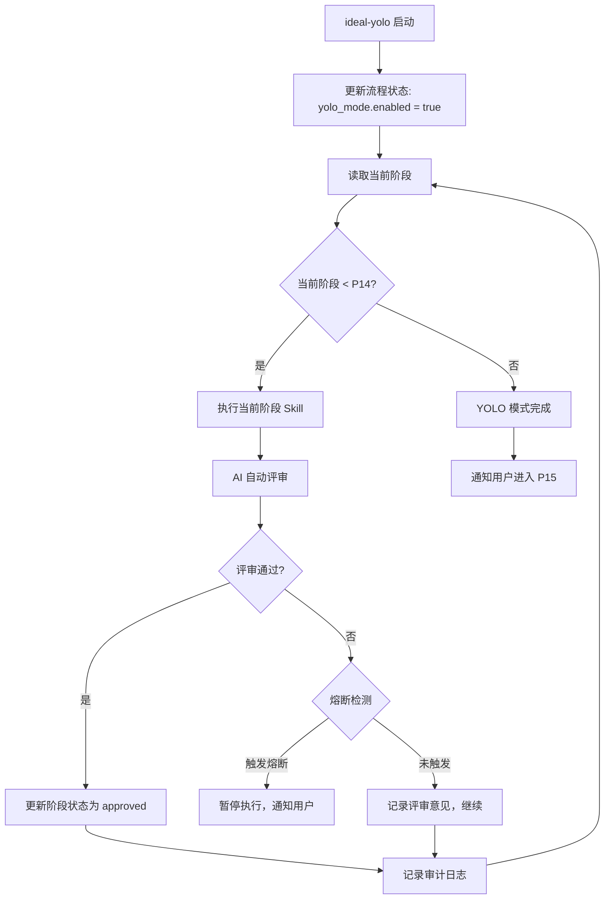

# ideal-yolo Skill

## 概述

YOLO 模式自动化执行引擎，支持从 P3 到 P14 阶段的全自动执行。

## 触发条件

- **由 ideal-flow-control 调用**：P2 评审通过后，用户选择启用 YOLO 模式
- **用户手动调用**：`/ideal-yolo` 或说"启用 YOLO 模式"

## 调用方式

### 由 ideal-flow-control 调用

```markdown
当用户在 P2 评审通过后选择"启用 YOLO 模式"时：

Skill(
    skill: "ideal-yolo"
)
```

### 用户手动调用

```bash
/ideal-yolo
```

或说：
- "启用 YOLO 模式"
- "开始自动执行"

## 功能

- **自动执行**：P2 评审通过后，自动执行 P3-P14 阶段
- **自动评审**：AI 自动进行阶段评审并记录结果
- **熔断机制**：异常检测（连续失败、测试失败、重复错误）自动暂停
- **中断恢复**：支持断点续传，从中断点继续执行
- **审计日志**：完整记录执行过程和评审结果

## 使用方式

### 启用 YOLO 模式

在 P2 评审通过后，ideal-flow-control 会询问是否启用 YOLO 模式：

```
📋 P2 需求评审已通过！

是否启用 YOLO 模式自动执行后续阶段？

1. 启用 YOLO 模式
2. 继续传统人工评审流程
```

```
用户选择 "1" → 调用 ideal-yolo skill
用户选择 "2" → 继续传统人工评审流程
```

### 执行流程



### 命令行工具

```bash
# 启用 YOLO 模式
python3 .claude/skills/ideal-yolo/scripts/yolo_control.py --action enable --state-file <path>

# 检查状态
python3 .claude/skills/ideal-yolo/scripts/yolo_control.py --action status --state-file <path>

# 恢复执行（中断后）
python3 .claude/skills/ideal-yolo/scripts/yolo_resume.py --action resume --state-file <path>
```

## 模块结构

```
.claude/skills/ideal-yolo/
├── SKILL.md                    # Skill 定义（本文件）
├── scripts/
│   ├── yolo_state.py          # M1 状态管理
│   ├── yolo_logger.py         # M2 审计日志
│   ├── yolo_control.py        # M3 模式控制
│   ├── yolo_review.py         # M4 自动评审
│   ├── yolo_orchestrator.py   # M5 阶段编排
│   ├── yolo_ralph.py          # M6 Ralph Loop 集成
│   ├── yolo_circuit.py        # M7 熔断机制
│   └── yolo_resume.py         # M8 中断恢复
├── references/
│   ├── review-standards.md    # 评审标准
│   └── recovery-protocol.md   # 恢复协议
└── templates/
    └── audit-log.md           # 审计日志模板

.claude/ralph/
├── ralph-loop.sh              # 主循环脚本
├── PROMPT.md                  # 执行提示（动态生成）
└── hooks/
    ├── pre-phase.sh           # 前置钩子
    ├── post-phase.sh          # 后置钩子
    ├── on-error.sh            # 错误钩子
    └── on-complete.sh         # 完成钩子
```

## 阶段编排

| 当前阶段 | 执行 Skill | 评审阶段 | 评审方式 |
|----------|-----------|----------|----------|
| P3 | ideal-dev-solution | P4 | 自动评审 |
| P5 | ideal-dev-plan | P6 | 自动评审 |
| P7 | ideal-test-case | P8 | 自动评审 |
| P9 | ideal-dev-exec | P10 | 自动评审 |
| P11 | ideal-test-exec | P12 | 自动评审 |
| P13 | ideal-wiki | P14 | 自动评审 |

## 熔断条件

| 异常类型 | 阈值 | 处理方式 |
|----------|------|----------|
| 评审失败 | 连续 3 次不通过 | 暂停执行，等待用户介入 |
| 测试失败 | 通过率 < 80% | 暂停执行，等待用户介入 |
| 重复错误 | 同一错误重复 5 次 | 暂停执行，等待用户介入 |

## 审计日志

日志存储位置：`docs/迭代/{需求名}/yolo-logs/`

日志内容：
- 执行时间戳
- 阶段名称和编号
- 评审意见（包含通过/不通过判定）
- 修改建议（如有）
- 执行结果
- Token 消耗统计

## 恢复机制

1. 检测到中断后，记录当前状态到流程状态文件
2. 等待恢复条件满足
3. 自动重新启动 Ralph Loop，从上次中断点继续执行
4. 重置熔断计数器

## Ralph Loop 集成

YOLO 模式通过 Ralph Loop 实现持续执行：

```bash
# Ralph Loop 位置
.claude/ralph/ralph-loop.sh

# 执行方式
./.claude/ralph/ralph-loop.sh --state-file docs/迭代/{需求名}/流程状态.md
```

**Ralph Loop 职责**：
- 持续调用 Claude Code 直到任务完成
- 每次调用时传递当前阶段上下文
- 处理中断和恢复

## 依赖

- Python 3.8+
- PyYAML
- pytest（测试）

## 与其他 Skill 的关系

| Skill | 关系 |
|-------|------|
| ideal-flow-control | P2 通过后调用 ideal-yolo |
| ideal-dev-solution | YOLO 模式下自动调用 (P3) |
| ideal-dev-plan | YOLO 模式下自动调用 (P5) |
| ideal-test-case | YOLO 模式下自动调用 (P7) |
| ideal-dev-exec | YOLO 模式下自动调用 (P9) |
| ideal-test-exec | YOLO 模式下自动调用 (P11) |
| ideal-wiki | YOLO 模式下自动调用 (P13) |
| ideal-delivery | YOLO 完成后等待用户确认 (P15) |
