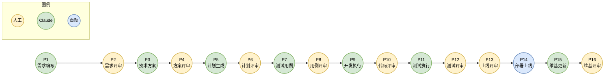

# Claude Code 中心化团队工作流设计方案

## 一、项目背景

以 Claude Code 为中心重构团队工作流，实现从产品设计、前端设计到开发、测试、上线的全流程自动化。核心目标是让团队成员只需：**提需求、做评审、反馈意见**，其他工作由 Claude Code 自动完成。

---

## 二、核心架构

### 2.1 统一存储结构

采用 **Git 仓库 + Obsidian vault 统一存储** 方案，`docs/` 目录即为 Obsidian vault，文档与代码在同一仓库中版本同步。

```
{项目名称}/                       # Git 仓库根目录
│
├── .claude/                       # Claude Code 相关
│   ├── skills/                    # 定制化 skills（项目级）
│   │   ├── ideal-brainstorm/      # 头脑风暴（通用）
│   │   ├── ideal-requirement/     # 需求编写（通用）
│   │   ├── ideal-dev-solution/    # 技术方案（开发领域）
│   │   ├── ideal-dev-plan/        # 计划生成（开发领域）
│   │   ├── ideal-test-case/       # 测试用例（测试领域）
│   │   ├── ideal-dev-review/      # 代码审查（开发领域）
│   │   ├── ideal-wiki/            # 维基生成（通用）
│   │   └── ...
│   └── plans/                     # 编码计划（临时文件）
│
├── src/                           # 源代码
│   └── orchestrator/              # 流程编排器
│
├── tests/                         # 测试代码
│
├── templates/                     # 所有模板
│   └── docs/                      # 文档模板
│       ├── 需求文档.md
│       ├── 技术方案.md
│       ├── 编码计划.md
│       ├── 测试用例.md
│       └── 测试报告.md
│
├── docs/                          # Obsidian vault（文档中心）
│   ├── .obsidian/                 # Obsidian 配置
│   ├── .automation/               # 自动化配置
│   │   └── config.yaml
│   │
│   ├── 项目状态.md                 # 项目状态看板
│   ├── 产品愿景.md
│   ├── 产品路线图.md
│   │
│   ├── 迭代/                      # 按需求命名
│   │   └── {需求名称}/
│   │       ├── P1-需求文档.md
│   │       ├── P3-技术方案.md
│   │       ├── P5-编码计划.md
│   │       ├── P7-测试用例.md
│   │       ├── P11-测试报告.md
│   │       ├── 流程状态.md         # 状态控制文件
│   │       └── stories/           # 故事文件（P5 生成）
│   │           ├── index.md       # 故事索引
│   │           └── 0XX-*.md       # 原子化故事
│   │
│   └── Wiki/                      # 维基文档
│       ├── 用户文档/
│       ├── 开发文档/
│       └── 接口文档/
│
├── .gitignore
├── .gitlab-ci.yml
└── README.md                      # 仓库说明
```

### 2.2 职责划分

| 维度 | docs/ (Obsidian vault) | src/ + 根目录 |
|------|------------------------|---------------|
| **定位** | 文档中心、流程控制、决策记录 | 代码执行层 |
| **人类交互** | 产品/设计/管理者（Obsidian 界面） | 开发者评审代码 |
| **Claude 交互** | 读写文档、生成方案 | 读写代码、执行计划 |
| **版本控制** | Git（通过 Obsidian Git 插件） | Git |

### 2.3 Obsidian Git 插件配置

团队使用 Obsidian Git 插件实现文档的自动同步：
- 自动备份间隔：每 5 分钟
- 自动拉取间隔：每 5 分钟
- 冲突处理：先 pull 再 push

---

## 三、阶段流程定义（P1-P16）

### 3.1 阶段总览



### 3.2 阶段详情

| 阶段 | 名称 | 执行者 | 输入 | 输出 | 审核人 |
|------|------|--------|------|------|--------|
| P1 | 需求编写 | 产品/设计 | 需求想法 | 需求文档.md + 原型代码 | - |
| P2 | 需求评审 | 人工 | 需求文档.md | 评审意见/通过 | 产品+技术负责人 |
| P3 | 技术方案 | Claude | 需求文档.md | 技术方案.md | - |
| P4 | 方案评审 | 人工 | 技术方案.md | 评审意见/通过 | 技术负责人+架构师 |
| P5 | 计划生成 | Claude | 技术方案.md | 编码计划.md（原子任务） | - |
| P6 | 计划评审 | 人工 | 编码计划.md | 评审意见/通过 | 开发负责人 |
| P7 | 测试用例 | Claude | 需求文档.md + 编码计划.md | 测试用例.md | - |
| P8 | 用例评审 | 人工 | 测试用例.md | 评审意见/通过 | 测试负责人 |
| P9 | 开发执行 | Claude | 编码计划.md | 代码 + MR | - |
| P10 | 代码评审 | 人工 | MR | Approve/修改意见 | 开发团队 |
| P11 | 测试执行 | Claude | 测试用例.md | 测试报告.md | - |
| P12 | 测试评审 | 人工 | 测试报告.md | 通过/修复 | 测试负责人 |
| P13 | 上线评审 | 人工 | 全部文档 | 上线许可 | 产品+技术+运维 |
| P14 | 部署上线 | 自动 | 代码 | 生产环境 | - |
| P15 | 维基更新 | Claude | 代码 + 需求文档.md | 维基文档 | - |
| P16 | 维基评审 | 人工 | 维基文档 | 发布许可 | 产品+技术 |

---

## 四、触发机制

### 4.1 自动触发
- 文件变化监听（fswatch/chokidar）
- 流程状态.md 中的状态字段变更
- GitLab Webhook（MR 状态变化）

### 4.2 手动触发
- 修改 流程状态.md 中的审核状态字段
- 命令行：`automation trigger --project 项目名 --phase P7`
- Obsidian 内按钮（Templater 插件）

### 4.3 状态控制示例

```markdown
# 流程状态.md
---
current_phase: P6
plan_review: pending    # 改为 approved 触发 P7
---
```

---

## 五、通知服务

- **邮件**：关键节点通知
- **即时通讯**：钉钉/企业微信机器人
- **Obsidian 内**：README.md 状态看板自动更新

---

## 六、维基管理

### 6.1 文档分类

| 类型 | 内容 | 生成时机 |
|------|------|----------|
| 用户文档 | 使用指南、常见问题、更新日志 | 上线后 P15 |
| 开发文档 | 架构说明、部署文档 | 方案确认后 + 上线后 |
| 接口文档 | REST/GraphQL 文档 | 代码合并后自动提取 |

### 6.2 发布方式
- GitLab Wiki（自动同步）
- 静态站点（VitePress/Docusaurus，可选）

---

## 七、技术组件

### 7.1 流程调度器
- 文件监听器（watcher）
- 状态机（state machine）
- 任务队列（task queue）
- 通知服务（notify）

### 7.2 执行器
- Claude Code 命令行调用
- GitLab 接口集成
- 持续集成流水线触发

---

## 八、后续实施任务

| 优先级 | 任务 | 说明 |
|--------|------|------|
| 高 | 定义需求文档模板和编写指南 | 产品文档规范 |
| 高 | 定义技术方案模板 | 基于 Superpowers |
| 高 | 定义编码计划模板 | 参考 Superpowers writing-plans |
| 高 | 实现文件监听器 | chokidar/fswatch |
| 高 | 实现状态机 | 阶段流转控制 |
| 高 | GitLab 接口集成 | Issue/MR 管理 |
| 中 | 定义测试用例模板 | 测试规范 |
| 中 | 实现通知服务 | 邮件 + 即时通讯 |
| 中 | 定义产品级文档模板 | 愿景/路线图 |
| 低 | 维基静态站点构建 | VitePress 集成 |

---

## 九、关键决策记录

1. **存储架构**：Git 仓库与 Obsidian vault 统一存储，`docs/` 目录即为 vault
2. **文档格式**：全量 Markdown
3. **Claude 调用方式**：Claude Code 命令行
4. **人工干预**：关键决策点 + 每阶段审核
5. **Bug 管理**：直接在 GitLab Issue，不存 Obsidian
6. **需求与 Issue**：一对一对应
7. **编码计划位置**：仓库根目录 `.claude/plans/`，临时文件
8. **Skills 位置**：`.claude/skills/`，Claude Code 标准位置
9. **Skills 命名规范**：`ideal-{领域?}-{功能}`，如 `ideal-brainstorm`、`ideal-dev-plan`
10. **模板位置**：`templates/docs/`，按类型统一管理
11. **迭代命名**：按需求名称命名，如 `迭代/用户登录/`

---

## 十、验证方式

1. 选择一个简单功能（如用户登录）
2. 按照流程从 P1 到 P16 走一遍
3. 验证各阶段文档生成质量
4. 验证触发机制是否正常
5. 验证通知是否到位

---

## 参考资源

- [Superpowers GitHub](https://github.com/obra/Superpowers)
- [Superpowers writing-plans skill](https://github.com/obra/Superpowers/blob/master/skills/writing-plans/SKILL.md)
- [Jesse Vincent's Blog - How I'm using coding agents](https://blog.fsck.com/2025/10/09/superpowers/)
