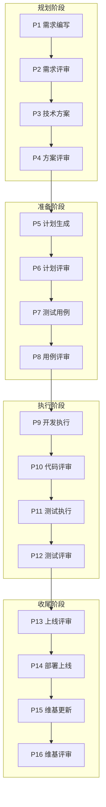
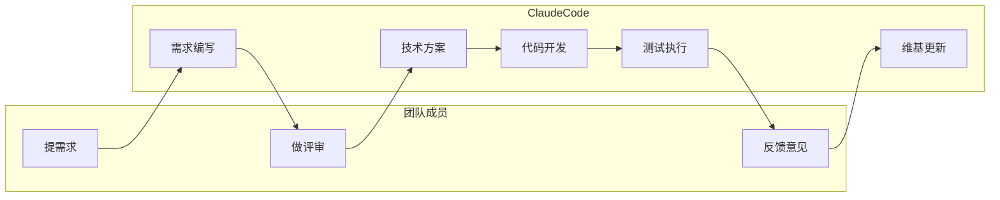
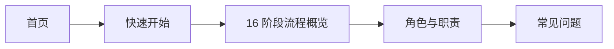

# CC-Workflow 用户指南

## 简介

CC-Workflow 是一个以 Claude Code 为中心的团队工作流自动化系统。系统将软件开发的 16 个阶段划分为人工决策点和 Claude 自动执行两部分，实现人机协作的高效开发模式。

**核心价值**：团队成员只需负责**提需求、做评审、反馈意见**三项工作，其余环节由 Claude Code 自动完成。

**适用场景**：
- 软件研发团队的日常迭代
- 产品功能的快速开发
- 技术债务的规范化处理

---

## 核心概念

### 16 阶段流程

CC-Workflow 将软件开发流程划分为 16 个阶段（P1-P16），分为四组：

详见 [16 阶段流程概览](./workflow-overview.md)。

### Skill + Agent 架构

系统采用 Skill + Agent 混合架构：

- **Skill（规范层）**：定义每个阶段的流程规范、输入输出、质量标准
- **Agent（能力层）**：定义角色身份、思维方式、决策框架

详见 [架构设计](../dev-guide/architecture.md)。

### 人机协作模式

---

## 文档导航

| 文档 | 说明 | 读者 |
|------|------|------|
| [快速开始](./quick-start.md) | 5 分钟完成从需求到上线的完整流程 | 新用户 |
| [16 阶段流程概览](./workflow-overview.md) | P1-P16 详细说明 | 所有用户 |
| [角色与职责](./user-roles.md) | 团队成员与 Claude 的职责划分 | 团队管理者 |
| [常见问题](./faq.md) | 按场景分类的 FAQ | 遇到问题的用户 |
| [术语表](./glossary.md) | 核心术语定义 | 需要概念澄清的用户 |

### 推荐阅读路径

---

## 快速链接

- 🚀 [开始第一个需求](./quick-start.md)
- 📋 [了解 16 阶段流程](./workflow-overview.md)
- ❓ [常见问题](./faq.md)
- 🔧 [开发文档](../dev-guide/index.md)
