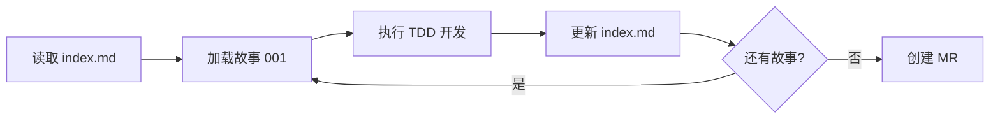

# 快速开始

本文档演示 CC-Workflow 的完整工作流程，帮助你快速上手从需求到上线的 16 个阶段。

## 前置条件

### 环境要求

| 项目 | 要求 |
|------|------|
| Claude Code | 已安装并配置 |
| Git | 已配置用户信息 |
| Obsidian | （可选）用于查看和编辑文档 |

### 项目初始化

如果项目尚未初始化，使用以下命令：

```bash
# 方式一：克隆已有项目
git clone <repo_url>
cd <project_name>

# 方式二：使用 ideal-init 初始化新项目
/ideal-init
```

验证项目结构：

```bash
ls -la .claude/
# 预期输出：agents/  skills/  project-config.md
```

---

## 完整流程演示

CC-Workflow 将软件开发流程划分为 16 个阶段（P1-P16），分为四个阶段组：

```mermaid
flowchart LR
    subgraph 规划
        P1[P1 需求编写]
        P2[P2 需求评审]
        P3[P3 技术方案]
        P4[P4 方案评审]
    end

    subgraph 准备
        P5[P5 计划生成]
        P6[P6 计划评审]
        P7[P7 测试用例]
        P8[P8 用例评审]
    end

    subgraph 执行
        P9[P9 开发执行]
        P10[P10 代码评审]
        P11[P11 测试执行]
        P12[P12 测试评审]
    end

    subgraph 收尾
        P13[P13 上线评审]
        P14[P14 部署上线]
        P15[P15 维基更新]
        P16[P16 维基评审]
    end

    P1 --> P2 --> P3 --> P4
    P4 --> P5 --> P6 --> P7 --> P8
    P8 --> P9 --> P10 --> P11 --> P12
    P12 --> P13 --> P14 --> P15 --> P16
```



以下以「添加用户登录功能」为例，演示完整流程。

---

### 阶段一：规划（P1-P4）

#### P1 - 需求编写

**执行者**：Claude（PM 角色）

**触发方式**：

```
/ideal-requirement 我需要添加用户登录功能
```

**流程说明**：

Claude 会以产品经理角色，通过苏格拉底式对话收集需求信息：

| 问题类型 | 示例问题 |
|----------|----------|
| 问题背景 | "当前用户登录存在什么问题？" |
| 目标用户 | "这个功能主要服务哪类用户？" |
| 功能细节 | "登录失败时如何处理？" |
| 验收标准 | "如何验证这个功能已正确实现？" |

**输出**：

- `docs/迭代/用户登录/P1-需求文档.md`
- `docs/迭代/用户登录/流程状态.md`

**示例对话**：

```
用户：/ideal-requirement 我需要添加用户登录功能

Claude：我来帮你收集需求信息。

1. 请描述当前用户登录存在什么问题？
用户：目前没有登录功能，用户无法识别身份

2. 目标用户是谁？
用户：主要是内部员工，使用企业邮箱

3. 登录方式有哪些？
用户：支持邮箱密码登录，后期可能需要 SSO

...
```

---

#### P2 - 需求评审（人工）

**执行者**：人工（产品 + 技术负责人）

**输入**：`P1-需求文档.md`

**评审要点**：

| 检查项 | 说明 |
|--------|------|
| 功能完整性 | 是否覆盖所有业务场景 |
| 验收标准 | 是否清晰、可测试 |
| 边界情况 | 是否考虑异常场景 |
| 优先级 | 功能优先级是否合理 |

**操作方式**：

1. 打开 `docs/迭代/用户登录/P1-需求文档.md`
2. 逐项检查上述要点
3. 如有问题，直接在文档中标注或在对话中反馈
4. 确认通过后，修改流程状态文件

**触发下一阶段**：

编辑 `docs/迭代/用户登录/流程状态.md`：

```yaml
---
current_phase: P3
requirement_review: approved
---
```

---

#### P3 - 技术方案（Claude 自动）

**执行者**：Claude（架构师角色）

**输入**：`P1-需求文档.md`

**自动执行内容**：

- 分析需求，设计系统架构
- 进行技术选型
- 评估技术风险
- 制定实现策略

**输出**：

- `P3-技术方案.md`（架构设计、技术选型、风险评估、实现策略）

**用户无需操作**，Claude 自动完成。

---

#### P4 - 方案评审（人工）

**执行者**：人工（技术负责人 + 架构师）

**输入**：`P3-技术方案.md`

**评审要点**：

| 检查项 | 说明 |
|--------|------|
| 技术选型 | 是否合理、团队是否熟悉 |
| 架构设计 | 是否满足需求、可扩展性 |
| 风险评估 | 是否识别主要风险 |
| 实现策略 | 是否可行 |

**触发下一阶段**：

```yaml
current_phase: P5
solution_review: approved
```

---

### 阶段二：准备（P5-P8）

#### P5 - 计划生成（Claude 自动）

**执行者**：Claude（架构师 + PM 角色）

**输入**：`P3-技术方案.md`

**自动执行内容**：

- 将技术方案拆分为原子化任务
- 生成故事文件（Story Files）
- 建立任务依赖关系

**输出**：

- `P5-编码计划.md`
- `stories/` 目录：
  ```
  stories/
  ├── index.md           # 故事索引
  ├── 001-用户认证.md     # 故事 1
  ├── 002-密码加密.md     # 故事 2
  └── 003-会话管理.md     # 故事 3
  ```

**故事文件说明**：故事文件实现上下文隔离，P9 开发时只加载当前故事，可降低 Token 消耗 70-90%。

---

#### P6 - 计划评审（人工）

**执行者**：人工（开发负责人）

**输入**：`P5-编码计划.md`、`stories/index.md`

**评审要点**：

| 检查项 | 说明 |
|--------|------|
| 任务拆分 | 粒度是否合适（每个故事 < 1 天） |
| 依赖关系 | 是否正确、是否有循环依赖 |
| 完整性 | 是否覆盖所有需求 |

**触发下一阶段**：

```yaml
current_phase: P7
plan_review: approved
```

---

#### P7 - 测试用例（Claude 自动）

**执行者**：Claude（QA 角色）

**输入**：`P1-需求文档.md`、`P5-编码计划.md`

**自动执行内容**：

- 生成功能测试用例
- 生成边界测试用例
- 生成异常测试用例

**输出**：

- `P7-测试用例.md`

---

#### P8 - 用例评审（人工）

**执行者**：人工（测试负责人）

**输入**：`P7-测试用例.md`

**评审要点**：

| 检查项 | 说明 |
|--------|------|
| 覆盖完整性 | 是否覆盖所有功能点 |
| 边界情况 | 是否考虑边界值 |
| 异常场景 | 是否覆盖异常流程 |

**触发下一阶段**：

```yaml
current_phase: P9
test_case_review: approved
```

---

### 阶段三：执行（P9-P12）

#### P9 - 开发执行（Claude 自动）

**执行者**：Claude（Dev 角色）

**输入**：`stories/*.md`

**执行方式**：

1. 读取 `stories/index.md` 确认当前故事
2. 只加载当前故事文件（上下文隔离）
3. 以 TDD 方式开发：先写测试，再写实现
4. 完成后更新 `stories/index.md` 状态
5. 继续下一个故事

**输出**：

- 代码实现
- GitLab Merge Request

**故事执行示例**：



---

#### P10 - 代码评审（人工）

**执行者**：人工（开发团队）

**输入**：GitLab Merge Request

**评审要点**：

| 检查项 | 说明 |
|--------|------|
| 代码质量 | 可读性、可维护性 |
| 安全性 | 是否存在安全漏洞 |
| 测试覆盖 | 单元测试是否充分 |
| 规范性 | 是否符合代码规范 |

**操作方式**：

1. 在 GitLab 查看 MR
2. 逐文件 Review 代码
3. 提出修改意见或 Approve

**触发下一阶段**：

MR 合并后自动进入 P11。

---

#### P11 - 测试执行（Claude 自动）

**执行者**：Claude（QA + Dev 角色）

**输入**：`P7-测试用例.md`

**自动执行内容**：

- 执行所有测试用例
- 记录测试结果
- 标记通过/失败的用例

**输出**：

- `P11-测试报告.md`

**异常处理**：

如有缺陷，记录到报告并可能返回 P9 进行修复。

---

#### P12 - 测试评审（人工）

**执行者**：人工（测试负责人）

**输入**：`P11-测试报告.md`

**评审要点**：

| 检查项 | 说明 |
|--------|------|
| 测试通过率 | 是否满足发布标准（通常 > 95%） |
| 遗留缺陷 | 是否有阻塞发布的缺陷 |
| 风险评估 | 已知风险是否可接受 |

**触发下一阶段**：

```yaml
current_phase: P13
test_exec_review: approved
```

---

### 阶段四：收尾（P13-P16）

#### P13 - 上线评审（人工）

**执行者**：人工（产品 + 技术 + 运维）

**输入**：全部文档 + 测试结果 + 代码状态

**评审要点**：

| 检查项 | 说明 |
|--------|------|
| 功能完整性 | 所有需求是否已实现 |
| 文档完整性 | 所有文档是否已更新 |
| 风险预案 | 是否有回滚方案 |
| 运维准备 | 监控、告警是否就绪 |

**触发下一阶段**：

```yaml
current_phase: P14
release_review: approved
```

---

#### P14 - 部署上线（自动）

**执行者**：CI/CD 自动执行

**用户无需操作**，CI/CD 流水线自动完成部署。

---

#### P15 - 维基更新（Claude 自动）

**执行者**：Claude（技术文档角色）

**输入**：代码 + 需求文档 + 技术方案

**自动执行内容**：

- 分析代码变更
- 更新相关 Wiki 文档
- 生成用户文档和开发文档

**输出**：

- `docs/Wiki/` 下的文档集

---

#### P16 - 维基评审（人工）

**执行者**：人工（产品 + 技术）

**输入**：更新的 Wiki 文档

**评审要点**：

| 检查项 | 说明 |
|--------|------|
| 内容准确性 | 是否与实际功能一致 |
| 完整性 | 是否覆盖所有变更 |
| 可读性 | 用户是否能理解 |

**完成流程**：

```yaml
current_phase: P16
wiki_review: approved
```

---

## 流程状态控制

### 流程状态文件

位置：`docs/迭代/{需求名称}/流程状态.md`

### 状态字段

| 字段 | 值 | 说明 |
|------|-----|------|
| `current_phase` | P1-P16 | 当前阶段 |
| `requirement_review` | pending/approved/rejected | P2 评审状态 |
| `solution_review` | pending/approved/rejected | P4 评审状态 |
| `plan_review` | pending/approved/rejected | P6 评审状态 |
| `test_case_review` | pending/approved/rejected | P8 评审状态 |
| `code_review` | pending/approved/rejected | P10 评审状态 |
| `test_exec_review` | pending/approved/rejected | P12 评审状态 |
| `release_review` | pending/approved/rejected | P13 评审状态 |
| `wiki_review` | pending/approved/rejected | P16 评审状态 |

### 手动触发下一阶段

将对应的 `xxx_review` 字段从 `pending` 改为 `approved`。

---

## 验证结果

流程完成后，检查以下内容：

| 检查项 | 位置 |
|--------|------|
| 需求文档 | `docs/迭代/{需求}/P1-需求文档.md` |
| 技术方案 | `docs/迭代/{需求}/P3-技术方案.md` |
| 编码计划 | `docs/迭代/{需求}/P5-编码计划.md` |
| 测试用例 | `docs/迭代/{需求}/P7-测试用例.md` |
| 测试报告 | `docs/迭代/{需求}/P11-测试报告.md` |
| 代码 | GitLab 仓库（已合并到主分支） |
| Wiki | `docs/Wiki/` |

---

## 下一步

- 深入了解各阶段细节：[16 阶段流程概览](./workflow-overview.md)
- 遇到问题：[常见问题](./faq.md)
- 理解系统设计：[架构设计](../dev-guide/architecture.md)
