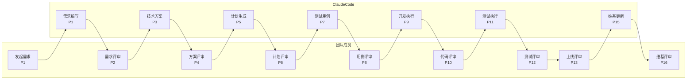

# 角色与职责

CC-Workflow 的核心设计原则是明确划分「团队成员」与「Claude Code」的职责边界，实现人机协作的高效开发模式。

## 核心原则

| 角色 | 职责 |
|------|------|
| **团队成员** | 提需求、做评审、反馈意见 |
| **Claude Code** | 需求编写、技术方案、计划生成、开发执行、测试用例、维基更新 |

---

## 协作流程

---

## 团队成员职责

### 产品经理 / 设计师

| 活动 | 阶段 | 职责 |
|------|------|------|
| 发起新需求 | P1 | 描述需求背景和业务目标 |
| 需求评审 | P2 | 确认需求文档的完整性和准确性 |
| 上线评审 | P13 | 确认功能符合业务预期 |
| 维基评审 | P16 | 确认用户文档准确 |

**关注点**：业务价值、用户体验、功能完整性

### 开发负责人

| 活动 | 阶段 | 职责 |
|------|------|------|
| 方案评审 | P4 | 评估技术方案的可行性 |
| 计划评审 | P6 | 确认任务拆分和排期 |
| 代码评审 | P10 | 审查代码质量和架构设计 |

**关注点**：技术可行性、代码质量、开发效率

### 测试负责人

| 活动 | 阶段 | 职责 |
|------|------|------|
| 用例评审 | P8 | 确认测试覆盖的完整性 |
| 测试评审 | P12 | 评估测试结果和遗留问题 |

**关注点**：测试覆盖率、缺陷数量、质量风险

### 架构师

| 活动 | 阶段 | 职责 |
|------|------|------|
| 方案评审 | P4 | 评估架构设计和技术选型 |
| 代码评审 | P10 | 审查系统架构和技术债务 |

**关注点**：系统架构、技术选型、扩展性、安全性

---

## Claude Code 职责

### 需求阶段

| 阶段 | 活动 |
|------|------|
| P1 | 以 PM 角色进行苏格拉底式对话，收集需求信息，生成结构化需求文档 |

### 设计阶段

| 阶段 | 活动 |
|------|------|
| P3 | 以架构师角色分析需求，设计系统架构，进行技术选型和风险评估 |
| P5 | 以架构师 + PM 角色拆分任务，生成编码计划和故事文件 |

### 测试阶段

| 阶段 | 活动 |
|------|------|
| P7 | 以 QA 角色生成功能、边界、异常测试用例 |
| P11 | 以 QA + Dev 角色执行测试，记录结果，生成测试报告 |

### 开发阶段

| 阶段 | 活动 |
|------|------|
| P9 | 以 Dev 角色执行 TDD 开发，逐个故事实现，创建 Merge Request |

### 文档阶段

| 阶段 | 活动 |
|------|------|
| P15 | 以技术文档角色分析代码变更，生成/更新 Wiki 文档 |

---

## 评审决策权

| 评审点 | 阶段 | 决策者 | 通过标准 |
|--------|------|--------|----------|
| 需求评审 | P2 | 产品 + 技术负责人 | 功能完整、验收标准清晰 |
| 方案评审 | P4 | 技术负责人 + 架构师 | 技术选型合理、风险可控 |
| 计划评审 | P6 | 开发负责人 | 任务拆分合理、依赖正确 |
| 用例评审 | P8 | 测试负责人 | 覆盖完整、边界充分 |
| 代码评审 | P10 | 开发团队 | 代码质量达标、安全合规 |
| 测试评审 | P12 | 测试负责人 | 通过率 > 95%、无阻塞缺陷 |
| 上线评审 | P13 | 产品 + 技术 + 运维 | 功能完整、有回滚方案 |
| 维基评审 | P16 | 产品 + 技术 | 内容准确、用户可读 |

---

## 典型工作日

### 产品经理的一天

1. **上午**：发起一个新需求（P1），参与需求对话
2. **下午**：评审上一个需求的需求文档（P2），确认通过

### 开发负责人的一天

1. **上午**：评审技术方案（P4）、评审编码计划（P6）
2. **下午**：代码评审（P10），Approve 或提出修改意见

### 测试负责人的一天

1. **上午**：评审测试用例（P8），补充边界场景
2. **下午**：评审测试报告（P12），确认上线质量

---

## 协作最佳实践

### 评审效率

- 评审前先阅读文档，准备问题
- 评审时聚焦关键问题，避免细节纠结
- 评审后及时更新状态，触发下一阶段

### 沟通规范

- 修改意见具体明确，避免模糊表述
- 确认通过后及时更新 `流程状态.md`
- 有疑问时在对应文档中标注评论

### 质量把控

- 不跳过评审环节
- 不在未通过时强制推进
- 记录所有决策和变更原因
