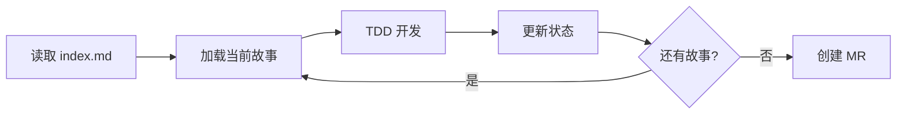

# 16 阶段流程概览

本文档详细介绍 CC-Workflow 的 16 个阶段（P1-P16），包括各阶段的目标、执行者、输入输出和关键活动。

## 流程总览

```mermaid
flowchart TB
    subgraph 规划["规划阶段（P1-P4）"]
        direction TB
        P1((P1<br/>需求编写)):::claude
        P2((P2<br/>需求评审)):::human
        P3((P3<br/>技术方案)):::claude
        P4((P4<br/>方案评审)):::human
    end

    subgraph 准备["准备阶段（P5-P8）"]
        direction TB
        P5((P5<br/>计划生成)):::claude
        P6((P6<br/>计划评审)):::human
        P7((P7<br/>测试用例)):::claude
        P8((P8<br/>用例评审)):::human
    end

    subgraph 执行["执行阶段（P9-P12）"]
        direction TB
        P9((P9<br/>开发执行)):::claude
        P10((P10<br/>代码评审)):::human
        P11((P11<br/>测试执行)):::claude
        P12((P12<br/>测试评审)):::human
    end

    subgraph 收尾["收尾阶段（P13-P16）"]
        direction TB
        P13((P13<br/>上线评审)):::human
        P14((P14<br/>部署上线)):::auto
        P15((P15<br/>维基更新)):::claude
        P16((P16<br/>维基评审)):::human
    end

    P1 --> P2 --> P3 --> P4
    P4 --> P5 --> P6 --> P7 --> P8
    P8 --> P9 --> P10 --> P11 --> P12
    P12 --> P13 --> P14 --> P15 --> P16

    classDef claude fill:#d5e8d4,stroke:#82b366
    classDef human fill:#fff2cc,stroke:#d6b656
    classDef auto fill:#dae8fc,stroke:#6c8ebf
```

**图例说明**：
- 🟢 绿色：Claude 自动执行
- 🟡 黄色：人工评审决策
- 🔵 蓝色：自动化流程

---

## 规划阶段（P1-P4）

规划阶段完成需求收集和技术方案设计，是整个流程的基础。

### P1 - 需求编写

| 属性 | 说明 |
|------|------|
| **执行者** | Claude（PM 角色） |
| **输入** | 用户需求描述 |
| **输出** | `P1-需求文档.md`、`流程状态.md` |
| **触发方式** | `/ideal-requirement {需求描述}` |

**关键活动**：
- 通过苏格拉底式对话收集需求信息
- 梳理问题背景、目标用户、功能细节
- 定义清晰的验收标准
- 生成结构化需求文档

### P2 - 需求评审

| 属性 | 说明 |
|------|------|
| **执行者** | 人工（产品 + 技术负责人） |
| **输入** | `P1-需求文档.md` |
| **输出** | 评审意见 / 通过 |

**评审要点**：
- 功能是否完整覆盖业务场景
- 验收标准是否清晰可测试
- 是否考虑边界和异常情况
- 功能优先级是否合理

**触发下一阶段**：修改 `流程状态.md` 中 `requirement_review: approved`

### P3 - 技术方案

| 属性 | 说明 |
|------|------|
| **执行者** | Claude（架构师角色） |
| **输入** | `P1-需求文档.md` |
| **输出** | `P3-技术方案.md` |

**关键活动**：
- 分析需求，设计系统架构
- 进行技术选型，评估方案优劣
- 识别技术风险，制定应对策略
- 制定实现策略和开发计划

### P4 - 方案评审

| 属性 | 说明 |
|------|------|
| **执行者** | 人工（技术负责人 + 架构师） |
| **输入** | `P3-技术方案.md` |
| **输出** | 评审意见 / 通过 |

**评审要点**：
- 技术选型是否合理
- 架构设计是否满足需求
- 风险评估是否充分
- 实现策略是否可行

**触发下一阶段**：修改 `solution_review: approved`

---

## 准备阶段（P5-P8）

准备阶段生成开发计划和测试用例，为执行阶段做准备。

### P5 - 计划生成

| 属性 | 说明 |
|------|------|
| **执行者** | Claude（架构师 + PM 角色） |
| **输入** | `P3-技术方案.md` |
| **输出** | `P5-编码计划.md`、`stories/*.md` |

**关键活动**：
- 将技术方案拆分为原子化任务
- 生成故事文件（Story Files）
- 建立任务依赖关系
- 估算工作量

**故事文件说明**：
- 位置：`docs/迭代/{需求名}/stories/`
- 作用：P9 开发时只加载当前故事，实现上下文隔离
- 效果：Token 消耗降低 70-90%

### P6 - 计划评审

| 属性 | 说明 |
|------|------|
| **执行者** | 人工（开发负责人） |
| **输入** | `P5-编码计划.md`、`stories/index.md` |
| **输出** | 评审意见 / 通过 |

**评审要点**：
- 任务拆分粒度是否合适
- 依赖关系是否正确
- 是否覆盖所有需求

**触发下一阶段**：修改 `plan_review: approved`

### P7 - 测试用例

| 属性 | 说明 |
|------|------|
| **执行者** | Claude（QA 角色） |
| **输入** | `P1-需求文档.md`、`P5-编码计划.md` |
| **输出** | `P7-测试用例.md` |

**关键活动**：
- 生成功能测试用例
- 生成边界测试用例
- 生成异常测试用例
- 定义测试数据和预期结果

### P8 - 用例评审

| 属性 | 说明 |
|------|------|
| **执行者** | 人工（测试负责人） |
| **输入** | `P7-测试用例.md` |
| **输出** | 评审意见 / 通过 |

**评审要点**：
- 是否覆盖所有功能点
- 边界值是否考虑充分
- 异常场景是否完整

**触发下一阶段**：修改 `test_case_review: approved`

---

## 执行阶段（P9-P12）

执行阶段完成代码开发和测试验证。

### P9 - 开发执行

| 属性 | 说明 |
|------|------|
| **执行者** | Claude（Dev 角色） |
| **输入** | `stories/*.md` |
| **输出** | 代码实现、GitLab MR |

**关键活动**：
- 读取 `stories/index.md` 确认当前故事
- 只加载当前故事文件（上下文隔离）
- 以 TDD 方式开发：先写测试，再写实现
- 完成后更新故事状态
- 逐个故事执行直至完成

**执行流程**：

### P10 - 代码评审

| 属性 | 说明 |
|------|------|
| **执行者** | 人工（开发团队） |
| **输入** | GitLab Merge Request |
| **输出** | Approve / 修改意见 |

**评审要点**：
- 代码质量和可读性
- 安全性检查
- 测试覆盖率
- 代码规范

**触发下一阶段**：MR 合并后自动进入 P11

### P11 - 测试执行

| 属性 | 说明 |
|------|------|
| **执行者** | Claude（QA + Dev 角色） |
| **输入** | `P7-测试用例.md` |
| **输出** | `P11-测试报告.md` |

**关键活动**：
- 执行所有测试用例
- 记录测试结果
- 标记通过/失败状态
- 如有缺陷，记录并可能返回 P9 修复

### P12 - 测试评审

| 属性 | 说明 |
|------|------|
| **执行者** | 人工（测试负责人） |
| **输入** | `P11-测试报告.md` |
| **输出** | 通过 / 修复 |

**评审要点**：
- 测试通过率（通常 > 95%）
- 遗留缺陷是否阻塞发布
- 已知风险是否可接受

**触发下一阶段**：修改 `test_exec_review: approved`

---

## 收尾阶段（P13-P16）

收尾阶段完成上线决策和文档更新。

### P13 - 上线评审

| 属性 | 说明 |
|------|------|
| **执行者** | 人工（产品 + 技术 + 运维） |
| **输入** | 全部文档 + 测试结果 + 代码状态 |
| **输出** | 上线许可 |

**评审要点**：
- 所有需求是否已实现
- 所有文档是否已更新
- 是否有回滚方案
- 监控和告警是否就绪

**触发下一阶段**：修改 `release_review: approved`

### P14 - 部署上线

| 属性 | 说明 |
|------|------|
| **执行者** | CI/CD 自动执行 |
| **输入** | 代码（已合并到主分支） |
| **输出** | 生产环境 |

**执行内容**：
- 自动化构建
- 自动化部署
- 健康检查

### P15 - 维基更新

| 属性 | 说明 |
|------|------|
| **执行者** | Claude（技术文档角色） |
| **输入** | 代码 + 需求文档 + 技术方案 |
| **输出** | Wiki 文档集 |

**关键活动**：
- 分析代码变更范围
- 更新相关 Wiki 文档
- 生成用户文档和开发文档
- 更新 API 文档（如有）

### P16 - 维基评审

| 属性 | 说明 |
|------|------|
| **执行者** | 人工（产品 + 技术） |
| **输入** | Wiki 文档 |
| **输出** | 发布许可 |

**评审要点**：
- 内容准确性
- 文档完整性
- 用户可读性

**完成流程**：修改 `wiki_review: approved`

---

## 阶段速查表

| 阶段 | 名称 | 执行者 | 输入 | 输出 | 评审人 |
|------|------|--------|------|------|--------|
| P1 | 需求编写 | Claude | 需求描述 | 需求文档 | - |
| P2 | 需求评审 | 人工 | 需求文档 | 评审意见 | 产品+技术 |
| P3 | 技术方案 | Claude | 需求文档 | 技术方案 | - |
| P4 | 方案评审 | 人工 | 技术方案 | 评审意见 | 技术+架构 |
| P5 | 计划生成 | Claude | 技术方案 | 编码计划+故事 | - |
| P6 | 计划评审 | 人工 | 编码计划 | 评审意见 | 开发负责人 |
| P7 | 测试用例 | Claude | 需求+计划 | 测试用例 | - |
| P8 | 用例评审 | 人工 | 测试用例 | 评审意见 | 测试负责人 |
| P9 | 开发执行 | Claude | 故事文件 | 代码+MR | - |
| P10 | 代码评审 | 人工 | MR | Approve/修改 | 开发团队 |
| P11 | 测试执行 | Claude | 测试用例 | 测试报告 | - |
| P12 | 测试评审 | 人工 | 测试报告 | 通过/修复 | 测试负责人 |
| P13 | 上线评审 | 人工 | 全部文档 | 上线许可 | 产品+技术+运维 |
| P14 | 部署上线 | 自动 | 代码 | 生产环境 | - |
| P15 | 维基更新 | Claude | 代码+文档 | Wiki | - |
| P16 | 维基评审 | 人工 | Wiki | 发布许可 | 产品+技术 |
