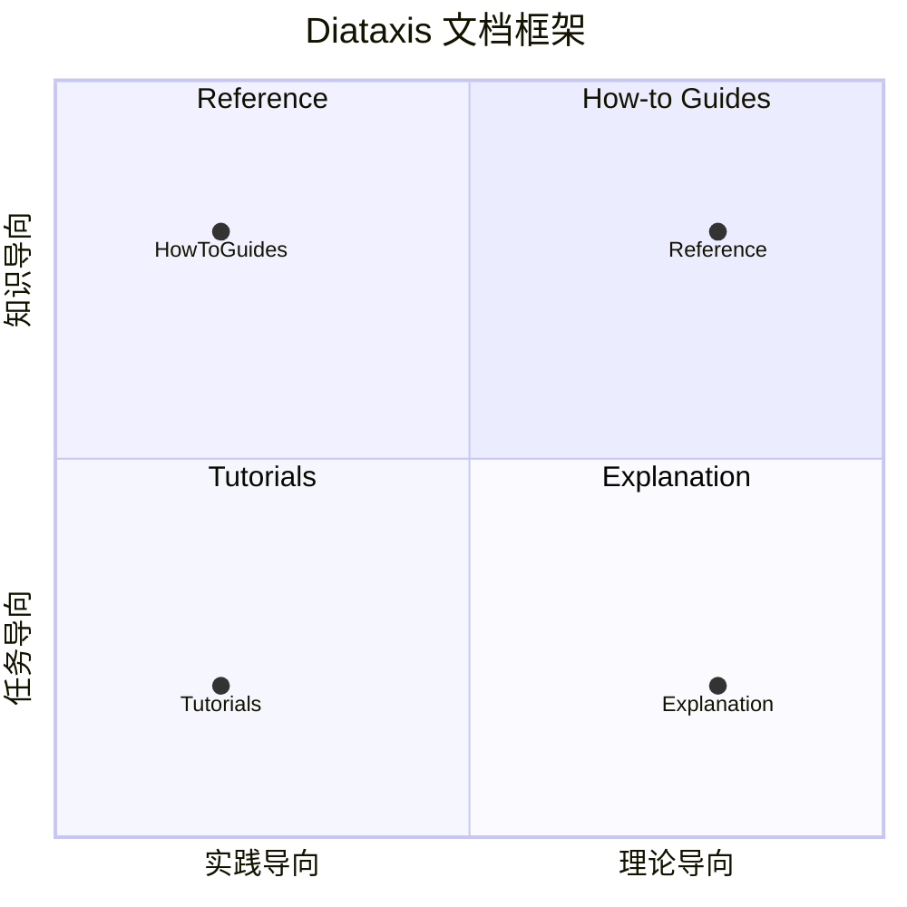

# 技术文档写作风格调研报告

本文档调研了主流技术产品的文档写作风格，为 CC-Workflow Wiki 写作提供参考。

---

## 调研对象

| 厂商 | 文档类型 | 风格特点 |
|------|----------|----------|
| Google | Developer Documentation Style Guide | 对话式、友好、清晰 |
| Anthropic | Claude API Documentation | 直接、实用、结构化 |
| OpenAI | API Documentation | 简洁、示例丰富、教程导向 |
| Microsoft | Writing Style Guide | 温暖、专业、一致 |

---

## 一、语态与语气

### 1.1 主动语态（Active Voice）

**Google 风格指南核心原则**：

> Use active voice: make clear who's performing the action.

| ❌ 被动语态（避免） | ✅ 主动语态（推荐） |
|-------------------|-------------------|
| The service is queried, and an acknowledgment is sent. | Send a query to the service. The server sends an acknowledgment. |
| The file is saved. | The system saves the file. |
| An error was encountered. | The system encountered an error. |

**例外情况**：
- 强调对象而非动作时："The file is saved."
- 弱化责任方时："Over 50 conflicts were found in the file."

### 1.2 第二人称（Second Person）

**核心原则**：使用 "you" 而非 "we"

| ❌ 避免 | ✅ 推荐 |
|--------|--------|
| Let's click Submit. | Click Submit. |
| We recommend... | We recommend...（保留，这是表达观点） |
| To do this, we need to... | To do this, you need to... |

### 1.3 对话式语气

**Google 定义**：

> Aim for a voice and tone that's conversational, friendly, and respectful without using slang or being overly colloquial or frivolous; a voice that's casual and natural and approachable, not pedantic or pushy. Try to sound like a knowledgeable friend who understands what the developer wants to do.

**语气对比示例**：

| 太随意 | 恰好 | 太正式 |
|--------|------|--------|
| Dude! This API is totally awesome! | This API lets you collect data about what your users like. | The API documented by this page may enable the acquisition of information pertaining to user preferences. |
| Just like a certain pop star, this call gets your telephone number. The easy way to ask for someone's digits! | To get the user's phone number, call `user.phoneNumber.get`. | The telephone number can be retrieved by the developer via the simple expedient of using the `get` method. |
| Then—BOOM—just garbage-collect, and you're golden. | To clean up, call the `collectGarbage` method. | Please note that completion of the task requires the following prerequisite: executing an automated memory management function. |

---

## 二、避免的表达方式

### 2.1 Google 风格指南明确禁止

| 类型 | 示例 | 替代方案 |
|------|------|----------|
| **流行语/行话** | "leverage", "synergy" | 使用具体词汇 |
| **过度可爱** | "Dude!", "BOOM!" | 保持专业友好 |
| **占位符短语** | "please note", "at this time" | 直接说明 |
| **重复句式** | 所有句子以 "You can..." 开头 | 变换句式 |
| **感叹号** | "This is amazing!" | 仅在极少数激动时刻使用 |
| **网络俚语** | "tl;dr", "ymmv" | 使用完整表达 |
| **简化宣称** | "simply", "It's easy", "quickly" | 不评判难度 |
| **文化特定引用** | 流行文化梗 | 使用通用表达 |
| **过度礼貌** | "please click..." | 直接 "Click..." |

### 2.2 避免模糊描述

| ❌ 模糊 | ✅ 具体 |
|---------|--------|
| 响应很快 | 响应时间 < 100ms |
| 需要一些时间 | 通常需要 5-10 分钟 |
| 支持多种格式 | 支持 JSON、YAML、XML |
| 经常使用 | 90% 的场景使用 |
| 非常重要 | 缺少此项会导致启动失败 |
| 确保配置正确 | 设置 API_KEY 环境变量 |

---

## 三、Diataxis 框架详解

### 3.1 框架概述

Diataxis 是一个系统化的技术文档方法论，已被 Django、Gatsby、Cloudflare、LangChain 等主流项目采用。

> Diátaxis identifies four distinct needs, and four corresponding forms of documentation - tutorials, how-to guides, technical reference and explanation.

**核心思想**：文档应该围绕用户需求的结构来组织，而不是随意堆砌。

### 3.2 四种文档类型



| 类型 | 用户需求 | 写作目标 | 特点 |
|------|----------|----------|------|
| **Tutorials（教程）** | 学习基础知识 | 帮助读者**获得信心** | "带着读者的手走" |
| **How-to Guides（操作指南）** | 完成特定任务 | 解决**实际问题** | 面向结果，不解释原理 |
| **Reference（参考文档）** | 查阅 API/配置 | **结构化信息** | 假设读者已了解背景 |
| **Explanation（概念解析）** | 理解设计决策 | **阐明原因** | 讨论"为什么" |

### 3.3 每种类型的写作规范

#### Tutorials（教程）

**目的**：帮助新手通过实践学习，尽早获得成就感。

**写作要点**：
- 从读者能**立即看到效果**的事情开始
- 关注"读者**做什么**"，而非"你解释什么"
- 让读者**动手**，而不是**阅读**
- 提供**完整可运行**的示例

**Django 的建议**：
> The important thing in a tutorial is to help the reader achieve something useful, preferably as early as possible, in order to give them confidence. Don't feel that you need to begin with explanations of how things work - what matters is what the reader does.

#### How-to Guides（操作指南）

**目的**：解决特定问题，面向结果。

**写作要点**：
- 假设读者已有基础知识
- 聚焦于"如何达到目标"
- 不深入解释原理（链接到 Explanation）
- 提供多种解决方案（如有）

**Django 的建议**：
> What matters most in a how-to guide is what a user wants to achieve. A how-to should always be result-oriented rather than focused on internal details.

#### Reference（参考文档）

**目的**：提供准确、完整的技术信息。

**写作要点**：
- 结构化、可检索
- 保持简洁，聚焦于事实
- 假设读者了解背景
- 与概念解释分离

**Django 的建议**：
> Keep reference material tightly focused on the subject. Reference guides aren't the place for general explanation.

#### Explanation（概念解析）

**目的**：解释"为什么"，阐明设计决策。

**写作要点**：
- 讨论设计理念和权衡
- 提供背景知识
- 连接相关概念
- 帮助读者建立心智模型

### 3.4 Wiki 文档的 Diataxis 应用

CC-Workflow Wiki 应按 Diataxis 框架组织：

| 文档 | 类型 | 说明 |
|------|------|------|
| `quick-start.md` | Tutorial | 从零开始的完整流程 |
| `workflow-overview.md` | Explanation | 理解 15 阶段流程 |
| `user-roles.md` | Explanation | 理解角色分工 |
| `glossary.md` | Reference | 术语查询 |
| `faq.md` | How-to | 解决常见问题 |
| `architecture.md` | Explanation | 理解系统架构 |
| `skill-development.md` | How-to + Tutorial | 开发自定义 Skill |
| `agents-index.md` | Reference | Agent API 参考 |

---

## 四、段落写作规范

### 4.1 段落的核心原则

**普渡大学写作指南**：

> A paragraph is a collection of related sentences dealing with a single topic.
> The basic rule of thumb with paragraphing is to keep one idea to one paragraph.

**段落四要素**：
1. **Unity（统一性）**：整段围绕一个焦点
2. **Coherence（连贯性）**：句子之间逻辑流畅
3. **Topic Sentence（主题句）**：明确段落主旨
4. **Adequate Development（充分展开）**：提供足够支撑

### 4.2 段落连贯性技巧

**Logical Bridges（逻辑桥梁）**：
- 同一主题从句子延续到句子
- 使用平行句式

**Verbal Bridges（语言桥梁）**：
- 关键词在多句中重复
- 使用同义词
- 使用代词指代前文名词
- 使用过渡词连接

**常用过渡词**：

| 功能 | 过渡词 |
|------|--------|
| 顺承 | 因此、于是、那么 |
| 转折 | 然而、但是、不过 |
| 递进 | 此外、而且、更重要的是 |
| 因果 | 因此、所以、导致 |
| 举例 | 例如、比如、具体来说 |
| 总结 | 总之、综上所述 |

### 4.3 段落 vs 列表：何时用什么

**问题**：你提到"不要列表堆砌"。什么时候用段落，什么时候用列表？

**原则**：

| 情况 | 推荐格式 |
|------|----------|
| 需要解释"为什么" | **段落** |
| 需要建立逻辑链条 | **段落** |
| 多个概念相互关联 | **段落** |
| 快速查阅信息 | **列表** |
| 步骤序列 | **有序列表** |
| 并列选项 | **无序列表** |
| 对比信息 | **表格** |

**Google Technical Writing 建议**：
> People reading technical documentation are trying to quickly find information. If they can find what they need in 10 seconds and stop reading, that's a win. Bullet points tend to be information-dense and easy to scan, making them the perfect tool.

**但要注意**：
- 列表适合**快速传递信息**
- 段落适合**构建理解和论证**
- 概念解析类文档**应该以段落为主**
- 参考文档**可以用列表为主**

### 4.4 学术/专业写作风格

**斯坦福大学《Writing in the Sciences》课程要点**：

**段落结构**：
- 1 段 = 1 个观点
- 主题句尽早出现（开门见山）
- 读者记住的是**第一句和最后一句**

**句子长度**：
- 技术写作：每句 20-30 词
- 避免超过 40 词的长句

**动词使用**：
- 使用**主动语态**
- 使用**强动词**（show、demonstrate）而非弱动词（is、are）
- 不要把动词变成名词（"make an analysis" → "analyze"）

**避免冗余**：
- 去掉 "dead-weight phrases"
- 去掉重复词语
- 去掉模棱两可的词
- 去掉不必要的否定

### 4.5 示例对比

**列表堆砌风格（❌ 避免）**：

```markdown
## 技能系统

- 技能是一个流程规范层
- 定义"做什么"和"输出什么"
- 位于 `.claude/skills/`
- 不定义角色身份

## Agent 系统

- Agent 是角色能力层
- 定义"如何思考"
- 位于 `.claude/agents/`
- 不定义输出模板
```

**连贯段落风格（✅ 推荐）**：

```markdown
## 技能系统与 Agent 系统

CC-Workflow 采用 Skill + Agent 混合架构，将"做什么"与"如何思考"分离。

**Skill（流程规范层）**定义阶段目标、输入输出规范和检查清单，但不定义角色身份。
这种设计使得同一个 Skill 可以被不同的 Agent 以不同方式执行。例如，"编写需求文档"
这个 Skill 可以由 PM Agent 以产品视角完成，也可以由 Analyst Agent 以分析视角完成。

**Agent（角色能力层）**定义角色身份、专业视角和思维方式，但不定义输出模板。
这种设计使得同一个 Agent 可以执行多个 Skill。例如，PM Agent 既可以执行需求编写
Skill，也可以执行需求评审 Skill。

两者通过 `.claude/` 目录下的独立文件组织：Skill 位于 `skills/`，Agent 位于
`agents/`。Skill 调用 Agent，实现流程与能力的解耦。
```

---

## 五、格式规范

### 5.1 标题格式

**使用句子格式（Sentence Case）**：

| ❌ 避免 | ✅ 推荐 |
|--------|--------|
| Getting Started With Our API | Getting started with our API |
| How To Configure Settings | How to configure settings |
| The Quick-Start Guide | The quick-start guide |

### 5.2 列表类型

| 类型 | 用途 | 示例 |
|------|------|------|
| **有序列表** | 序列步骤 | 1. First step 2. Second step |
| **无序列表** | 非序列项目 | - Feature A - Feature B |
| **描述列表** | 术语-定义对 | Term: Definition |

### 5.3 代码格式

| 元素 | 格式 |
|------|------|
| 代码片段 | 使用等宽字体 `code` |
| UI 元素 | 使用粗体 **Button** |
| 文件名 | 使用等宽字体 `filename.py` |
| 占位符 | 使用斜体或尖括号 `<filename>` |

### 5.4 链接文本

**使用描述性链接文本**：

| ❌ 避免 | ✅ 推荐 |
|--------|--------|
| Click here for more info | For more info, see [API documentation](link) |
| Read this document | See [Configure authentication](link) |
| https://long-url.com | [Authentication guide](https://long-url.com) |

---

## 六、中文技术文档规范

### 6.1 阮一峰《中文技术文档写作规范》要点

| 规范 | 说明 |
|------|------|
| 标题 | 层次不超过四级，使用数字编号 |
| 段落 | 一个段落只表达一个意思 |
| 数值 | 使用半角数字，千分位使用逗号 |
| 标点 | 遵循 GB/T 15834-2001《标点符号用法》 |

### 6.2 中文排版规范

| 规范 | 示例 |
|------|------|
| 中英文之间加空格 | 使用 Claude API 进行开发 |
| 中文与数字之间加空格 | 版本 2.0 发布 |
| 专有名词使用正确大小写 | GitHub、iOS、macOS |

---

## 七、CC-Wiki 写作风格指南（完整版）

基于以上调研，CC-Workflow Wiki 应遵循以下风格：

### 7.1 Diataxis 框架应用

**按文档类型组织**：

| 文档类型 | CC-Wiki 对应文档 | 写作重点 |
|----------|------------------|----------|
| Tutorial | `quick-start.md` | 完整流程、尽早见效 |
| How-to | `faq.md`、`skill-development.md` | 解决问题、面向结果 |
| Explanation | `workflow-overview.md`、`architecture.md` | 解释原因、建立理解 |
| Reference | `glossary.md`、`agents-index.md` | 准确完整、结构化 |

### 7.2 段落写作规范

**核心原则**：
- ✅ 概念解析类文档**以段落为主**，列表为辅
- ✅ 每段一个观点，使用主题句开头
- ✅ 使用过渡词建立连贯性
- ❌ 避免"列表堆砌"：不要用列表替代解释

**段落 vs 列表选择**：
- 需要解释"为什么" → **段落**
- 需要建立逻辑链条 → **段落**
- 快速查阅信息 → **列表**
- 步骤序列 → **有序列表**

### 7.3 语态语气

- ✅ 使用**主动语态**："系统创建文件" 而非 "文件被创建"
- ✅ 使用**第二人称**："点击提交" 而非 "让我们点击提交"
- ✅ **对话式但专业**：像知识丰富的朋友，不要太随意

### 7.4 具体性

- ✅ 提供具体数据：`< 100ms` 而非 "很快"
- ✅ 使用具体名称：`API_KEY` 而非 "密钥"
- ❌ 禁止 "确保"、"非常重要"、"简单地"

### 7.5 结构

- ✅ 使用句子格式标题
- ✅ 流程说明：前置条件 → 步骤 → 预期结果 → 异常处理
- ✅ 代码示例必须可执行
- ✅ 使用 Mermaid 图表

### 7.6 格式

- ✅ 代码使用等宽字体：`code`
- ✅ UI 元素使用粗体：**Button**
- ✅ 链接使用描述性文本

---

## 八、文档自检清单

### 结构检查

- [ ] 文档按 Diataxis 框架分类
- [ ] 概念解析类以段落为主
- [ ] 每段一个观点
- [ ] 主题句在段落开头

### 内容检查

- [ ] 是否使用主动语态？
- [ ] 是否使用第二人称？
- [ ] 是否有具体数据替代模糊描述？
- [ ] 是否避免了"please"、"simply"、"easy"等词？
- [ ] 流程说明是否完整（前置条件→步骤→预期结果）？
- [ ] 代码示例是否可执行？

### 格式检查

- [ ] 标题是否使用句子格式？
- [ ] 链接文本是否描述性强？
- [ ] Mermaid 图表是否正确？
- [ ] 中文排版是否规范（空格、大小写）？

---

## 参考资源

- [Diataxis Framework](https://diataxis.fr/) - 文档框架方法论
- [Google Developer Documentation Style Guide](https://developers.google.com/style) - 风格指南
- [Google Technical Writing Courses](https://developers.google.com/tech-writing) - 写作课程
- [Django Documentation Guidelines](https://docs.djangoproject.com/en/dev/internals/contributing/writing-documentation/) - Django 文档规范
- [Stanford Writing in the Sciences](https://www.coursera.org/learn/writing-in-the-sciences) - 学术写作
- [普渡大学段落写作指南](https://owl.purdue.edu/) - 段落结构
- [阮一峰：中文技术文档写作规范](https://www.ruanyifeng.com/blog/2016/10/document_style_guide.html)
- [Microsoft Writing Style Guide](https://docs.microsoft.com/en-us/style-guide/)
