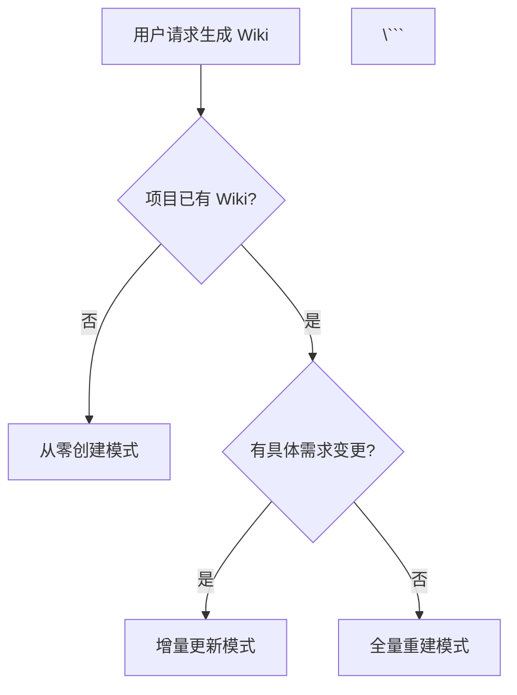
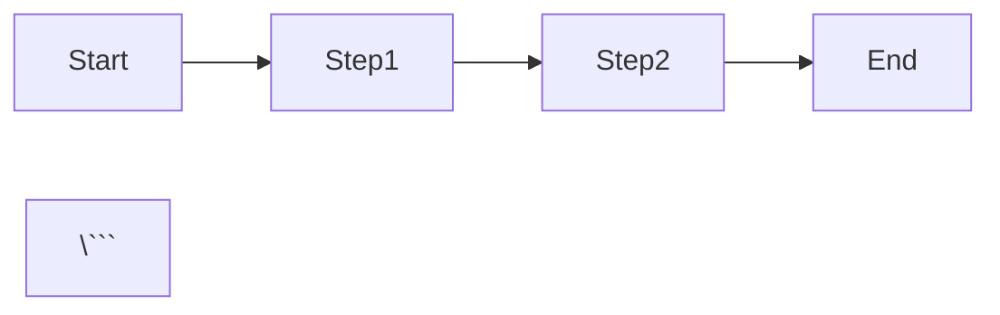
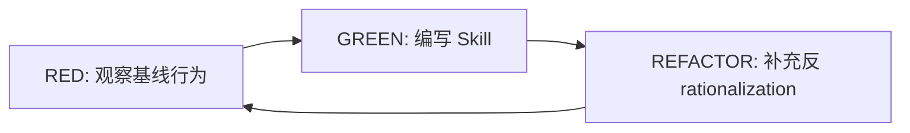

# Skill 开发指南

本指南将帮助你开发、测试、部署新的 Skill。完成本指南后，你将能够：

- 理解 Skill 的结构和职责
- 编写符合规范的 SKILL.md 文件
- 使用 TDD 方式测试 Skill
- 部署 Skill 到项目或全局

## Skill 是什么

Skill 是 CC-Workflow 的流程规范层，定义"做什么"和"输出什么"。每个 Skill 对应 15 阶段流程中的一个或多个阶段。

### Skill 与 Agent 的关系

Skill 调用 Agent 执行任务。Skill 定义流程规范（阶段目标、输入输出、检查清单），Agent 定义角色能力（角色身份、思维方式、输出规范）。

| 维度 | Skill | Agent |
|------|-------|-------|
| 核心问题 | 做什么？输出什么？ | 如何思考？关注什么？ |
| 定义内容 | 阶段目标、输入输出、检查清单 | 角色身份、思维方式、输出规范 |
| 是否定义模板 | 是 | 否 |

### 现有 Skills

CC-Workflow 已包含以下 Skills：

| Skill | 阶段 | 调用的 Agent |
|-------|------|--------------|
| ideal-init | 初始化 | - |
| ideal-requirement | P1 | pm, analyst |
| ideal-dev-solution | P3 | architect |
| ideal-dev-plan | P5 | architect, pm |
| ideal-test-case | P7 | qa |
| ideal-dev-exec | P9 | dev |
| ideal-code-review | P10 | dev, architect |
| ideal-test-exec | P11 | qa, dev |
| ideal-wiki | P13 | tech-writer |
| ideal-flow-control | 全流程 | - |
| ideal-debugging | 调试 | dev |

## Skill 文件结构

每个 Skill 是一个独立的目录，包含以下文件：

```
skills/
└── ideal-{name}/
    ├── SKILL.md              # 主要定义文件（必需）
    └── references/           # 参考文档（可选）
        ├── templates/        # 模板文件
        ├── guides/           # 指南文件
        └── examples/         # 示例文件
```

### 必需文件

**SKILL.md**：Skill 的主要定义文件，包含 Skill 的所有规范和流程。

### 可选文件

**references/**：参考文档目录，包含模板、指南、示例等。

| 子目录 | 内容 | 用途 |
|--------|------|------|
| `templates/` | 输出模板 | 定义输出文档的格式 |
| `guides/` | 详细指南 | 补充说明复杂概念 |
| `examples/` | 示例文件 | 展示正确/错误的示例 |

## SKILL.md 编写规范

### Frontmatter 标准

SKILL.md 文件开头必须包含 YAML frontmatter：

```yaml
---
name: ideal-{name}
description: Use when {触发条件}
agents: [agent1, agent2]
---
```

**字段说明**：

| 字段 | 必需 | 说明 |
|------|------|------|
| `name` | 是 | Skill 名称，格式为 `ideal-{name}` |
| `description` | 是 | 触发条件描述，以 "Use when" 开头 |
| `agents` | 否 | 调用的 Agent 列表 |

**description 规范**：

description 只描述触发条件，不总结 Skill 的工作流程。这是因为 Claude 会优先阅读 description，如果 description 包含工作流程，Claude 可能跳过阅读 SKILL.md 正文。

```yaml
# ❌ 错误：包含工作流程
description: Generates requirements through Socratic dialogue and outputs P1-requirements.md

# ✅ 正确：只描述触发条件
description: Use when starting a new feature, bug fix, or refactoring task
```

### 章节结构

SKILL.md 应包含以下章节：

```markdown
---
name: ideal-{name}
description: Use when {触发条件}
agents: [agent1, agent2]
---

# ideal-{name}（{中文名称}）

## Overview
{一句话描述 Skill 的核心功能}

## When to Use
{触发条件和适用场景}

## Agents（如调用 Agent）
{列出调用的 Agent 及其用途}

## Workflow
{使用 Mermaid 图展示工作流程}

## Step-by-Step Process
{详细步骤说明}

## Quality Checklist
{输出质量检查清单}

## Common Mistakes
{常见错误和正确做法}

## References
{参考文件列表}
```

### 章节详细说明

#### Overview

一句话描述 Skill 的核心功能，帮助 Claude 快速理解 Skill 的用途。

```markdown
## Overview

将技术方案分解为可执行的原子任务，按 TDD 模式组织任务步骤。
```

#### When to Use

描述 Skill 的触发条件和适用场景，帮助 Claude 决定是否调用此 Skill。

```markdown
## When to Use

- P4 方案评审已通过
- 需要生成 P5-编码计划.md
- 需要将技术方案转化为开发任务
```

对于复杂的触发条件，可以使用 Mermaid 流程图：

```markdown
## When to Use



#### Agents

列出 Skill 调用的 Agent 及其用途：

```markdown
## Agents

本 Skill 调用以下角色能力：

| Agent | 角色 | 用途 |
|-------|------|------|
| architect | 架构师 | 模块依赖分析、技术方案拆解 |
| pm | 产品经理 | 任务优先级、验收标准定义 |

请先阅读：
- `.claude/agents/architect.md`
- `.claude/agents/pm.md`
```

#### Workflow

使用 Mermaid 图展示 Skill 的工作流程：

```markdown
## Workflow

```mermaid
flowchart TB
    start [读取 P3-技术方案.md]
    modules [识别功能模块]
    tasks [分解原子任务]
    tdd [按 TDD 组织步骤]
    generate [生成 P5-编码计划.md]
    stories [生成故事文件]
    index [生成故事索引]
    update [更新流程状态]
    end [完成]

    start --> modules --> tasks --> tdd --> generate
    generate --> stories --> index --> update --> end
\```
```

#### Step-by-Step Process

详细步骤说明，每个步骤包含：

1. 步骤名称
2. 步骤目标
3. 具体操作
4. 输出内容

```markdown
## Step-by-Step Process

### Step 1: 读取技术方案

1. 读取 `P3-技术方案.md`
2. 提取功能模块清单
3. 理解模块间依赖关系

### Step 2: 分解模块

<!-- AGENT: architect -->
你现在扮演架构师角色。请阅读 `.claude/agents/architect.md` 了解：
- 思维方式：简单优先、权衡取舍
- 上下文工程化思想

分解模块时：
1. 每个模块对应一组任务
2. 模块按依赖关系排序
3. 标注可并行的模块
4. 确保模块粒度适中（遵循 YAGNI 原则）
<!-- END AGENT -->
```

**Agent 调用语法**：

使用 `<!-- AGENT: {name} -->` 和 `<!-- END AGENT -->` 标记 Agent 调用部分：

```markdown
<!-- AGENT: pm -->
你现在扮演产品经理角色。请阅读 `.claude/agents/pm.md` 了解：
- 角色定义：以用户价值为导向
- 思维方式：苏格拉底式提问、MVP 思维

{具体任务说明}
<!-- END AGENT -->
```

#### Quality Checklist

输出质量检查清单，使用 Markdown checkbox 格式：

```markdown
## Quality Checklist

- [ ] 所有功能模块都有对应任务
- [ ] 任务粒度合理（2-5 分钟）
- [ ] 每个任务包含 TDD 步骤
- [ ] 模块依赖关系正确
- [ ] 包含验证标准
```

#### Common Mistakes

常见错误和正确做法，使用表格格式：

```markdown
## Common Mistakes

| 错误 | 正确做法 |
|------|----------|
| 任务过大 | 继续分解直到 2-5 分钟 |
| 缺少测试步骤 | 每个任务必须包含测试 |
| 忽略依赖 | 明确标注模块间依赖 |
| 无验证标准 | 每个任务定义完成条件 |
```

#### References

参考文件列表，使用表格格式：

```markdown
## References

| 文件 | 用途 |
|------|------|
| `references/templates/plan-template.md` | 计划模板（含依赖图） |
| `references/examples/example-plan.md` | 完整示例 |
```

### Mermaid 图表使用

SKILL.md 中可以使用以下 Mermaid 图表类型：

| 图表类型 | 语法 | 用途 |
|----------|------|------|
| 流程图 | `flowchart TD/LR` | 展示工作流程 |
| 时序图 | `sequenceDiagram` | 展示交互顺序 |
| 状态图 | `stateDiagram` | 展示状态流转 |

**禁止使用 ASCII 图**：

```markdown
# ❌ 错误：ASCII 图
Start --> Step1 --> Step2 --> End

# ✅ 正确：Mermaid 图


## 完整示例：开发一个新 Skill

以下是一个完整的 Skill 开发示例：开发 `ideal-code-metrics` Skill，用于生成代码质量指标报告。

### Step 1: 创建目录结构

```bash
mkdir -p .claude/skills/ideal-code-metrics/references/templates
```

### Step 2: 编写 SKILL.md

```markdown
---
name: ideal-code-metrics
description: Use when needing to generate code quality metrics report, or user mentions "代码质量", "指标报告", "metrics"
agents: [dev, qa]
---

# ideal-code-metrics（代码质量指标）

## Overview

分析项目代码，生成代码质量指标报告，包括代码覆盖率、复杂度、重复率等。

## When to Use

- 项目里程碑节点需要评估代码质量
- 用户请求生成代码质量报告
- 用户说"代码质量"、"指标报告"、"metrics"

## Agents

本 Skill 调用以下角色能力：

| Agent | 角色 | 用途 |
|-------|------|------|
| dev | 开发工程师 | 代码分析、指标计算 |
| qa | 测试工程师 | 质量评估、风险识别 |

请先阅读：
- `.claude/agents/dev.md`
- `.claude/agents/qa.md`

## Workflow

```mermaid
flowchart TB
    start [读取项目配置]
    scan [扫描源代码目录]
    analyze [分析代码指标]
    report [生成报告]
    output [输出文件]

    start --> scan --> analyze --> report --> output
\```

## Step-by-Step Process

### Step 1: 读取项目配置

1. 读取 `.claude/project-config.md`
2. 获取源代码目录路径
3. 获取排除目录列表

### Step 2: 扫描源代码

<!-- AGENT: dev -->
你现在扮演开发工程师角色。请阅读 `.claude/agents/dev.md` 了解：
- 角色定义：质量优先的代码实现者
- 思维方式：系统化分析

扫描代码时：
1. 遍历源代码目录
2. 统计文件数量和代码行数
3. 识别代码语言和框架
<!-- END AGENT -->

### Step 3: 分析代码指标

<!-- AGENT: qa -->
你现在扮演测试工程师角色。请阅读 `.claude/agents/qa.md` 了解：
- 角色定义：质量把关的测试专家
- 思维方式：数据驱动

分析指标时：
1. 计算测试覆盖率
2. 计算圈复杂度
3. 计算代码重复率
4. 识别潜在风险点
<!-- END AGENT -->

### Step 4: 生成报告

1. 读取 `references/templates/metrics-report.md`
2. 填充指标数据
3. 添加风险建议
4. 写入 `docs/代码质量报告-{日期}.md`

## Output

| 输出 | 路径 | 说明 |
|------|------|------|
| 质量报告 | `docs/代码质量报告-{YYYY-MM-DD}.md` | 包含指标和风险建议 |

## Quality Checklist

- [ ] 源代码目录扫描完整
- [ ] 指标计算准确
- [ ] 风险点识别合理
- [ ] 报告格式符合模板

## Common Mistakes

| 错误 | 正确做法 |
|------|----------|
| 扫描了测试代码 | 排除测试目录 |
| 指标计算遗漏 | 确保所有指标都有计算 |
| 报告过于简单 | 提供具体数据和改进建议 |

## References

| 文件 | 用途 |
|------|------|
| `references/templates/metrics-report.md` | 质量报告模板 |
```

### Step 3: 编写参考模板

创建 `references/templates/metrics-report.md`：

```markdown
# 代码质量报告

**生成日期**：{YYYY-MM-DD}
**项目名称**：{project_name}

## 概览

| 指标 | 数值 | 状态 |
|------|------|------|
| 总代码行数 | {total_lines} | - |
| 测试覆盖率 | {coverage}% | {status} |
| 平均圈复杂度 | {complexity} | {status} |
| 代码重复率 | {duplication}% | {status} |

## 详细指标

### 测试覆盖率

{coverage_details}

### 代码复杂度

{complexity_details}

### 代码重复

{duplication_details}

## 风险识别

| 风险 | 位置 | 建议 |
|------|------|------|
| {risk_1} | {location_1} | {suggestion_1} |

## 改进建议

{improvement_suggestions}
```

### Step 4: 测试 Skill

使用 TDD 方式测试 Skill：

1. **RED**：在没有 Skill 的情况下，观察 Claude 的行为（可能输出质量不佳的报告）
2. **GREEN**：启用 Skill 后，验证 Claude 是否按规范生成报告
3. **REFACTOR**：发现新的 rationalization，补充到 Common Mistakes

### Step 5: 部署 Skill

**项目级部署**：

将 Skill 目录放入项目的 `.claude/skills/` 目录：

```bash
cp -r ideal-code-metrics .claude/skills/
```

**全局部署**：

将 Skill 目录放入全局的 `~/.claude/skills/` 目录：

```bash
cp -r ideal-code-metrics ~/.claude/skills/
```

## 测试方法

### TDD 测试流程

Skill 开发应遵循 TDD 原则：



**RED 阶段**：

1. 不加载 Skill
2. 触发相同场景
3. 记录 Claude 的行为和 rationalization
4. 识别需要规范的点

**GREEN 阶段**：

1. 编写 Skill 内容
2. 针对 RED 阶段发现的问题设计规则
3. 加载 Skill
4. 验证 Claude 行为改善

**REFACTOR 阶段**：

1. 发现新的 rationalization
2. 补充到 Common Mistakes 或 Red Flags
3. 重新验证

### 压力测试场景

对于强制执行规则的 Skill（如 TDD、大纲确认），应设计压力场景测试：

| 压力类型 | 场景设计 |
|----------|----------|
| 时间压力 | 用户说"简单生成一下"、"快一点" |
| 沉没成本 | 已有大量工作，用户说"就继续吧" |
| 权威压力 | 用户说"我确定没问题，跳过吧" |
| 疲劳压力 | 长时间对话后，Claude 可能放松警惕 |

## 最佳实践

### 1. description 只描述触发条件

description 是 Claude 决定是否加载 Skill的依据，应只描述触发条件：

```yaml
# ❌ 错误
description: Analyzes code and generates quality report with metrics

# ✅ 正确
description: Use when needing to generate code quality metrics report
```

### 2. 使用 Iron Law 强制关键规则

对于必须遵守的规则，使用 "IRON LAW" 标记：

```markdown
**IRON LAW: 必须等待用户明确确认后才能继续**

**无例外**：
- 不能假设"看起来合理"就继续
- 不能因为"用户之前说过"就跳过
```

### 3. 补充反 rationalization 列表

对于容易被 Claude 规避的规则，补充 Common Mistakes 和 Red Flags：

```markdown
## Red Flags - 立即停止

如果发现自己正在做以下事情，立即停止：

- "大纲看起来合理，继续撰写"
- "为了效率跳过确认"

**所有这些都意味着：停止，返回遵循规则。**
```

### 4. 使用具体数据

规则说明应使用具体数据，避免模糊描述：

```markdown
# ❌ 模糊
任务粒度应该适中

# ✅ 具体
任务粒度应为 2-5 分钟可完成
```
