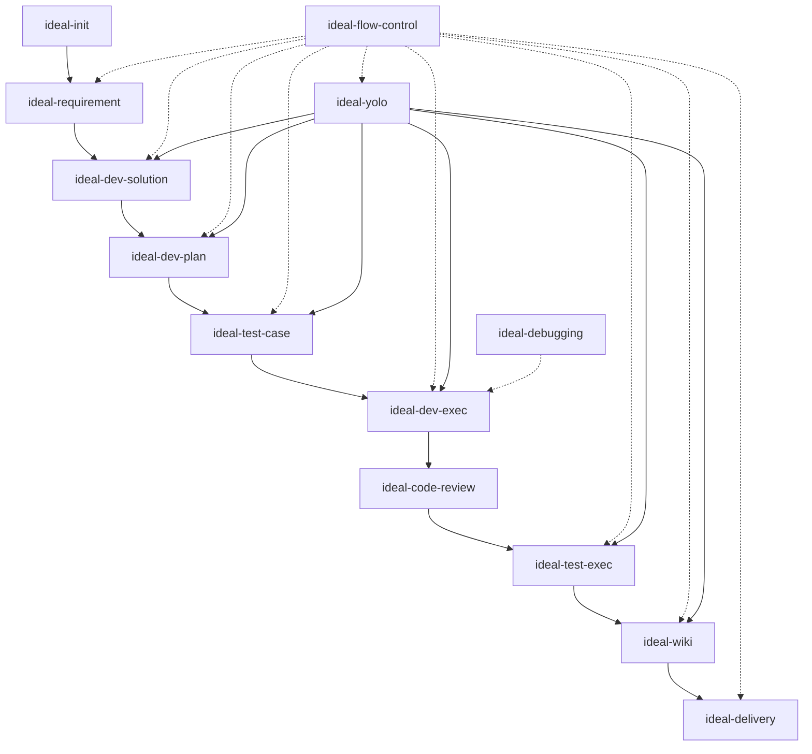

# Skills 索引

本文档提供 CC-Workflow 所有 Skills 的快速参考，包括触发条件、调用的 Agent 和核心功能。

## Skills 总览

| Skill | 阶段 | Agents | 核心功能 |
|-------|------|--------|----------|
| [ideal-init](#ideal-init) | 初始化 | - | 项目初始化配置 |
| [ideal-requirement](#ideal-requirement) | P1 | pm, analyst | 需求编写 |
| [ideal-dev-solution](#ideal-dev-solution) | P3 | architect | 技术方案 |
| [ideal-dev-plan](#ideal-dev-plan) | P5 | architect, pm | 计划生成 |
| [ideal-test-case](#ideal-test-case) | P7 | qa | 测试用例 |
| [ideal-dev-exec](#ideal-dev-exec) | P9 | dev | 开发执行 |
| [ideal-code-review](#ideal-code-review) | P10 | dev, architect | 代码评审 |
| [ideal-test-exec](#ideal-test-exec) | P11 | qa, dev | 测试执行 |
| [ideal-wiki](#ideal-wiki) | P13 | tech-writer | 维基更新 |
| [ideal-delivery](#ideal-delivery) | P15 | - | 成果提交 |
| [ideal-flow-control](#ideal-flow-control) | 全流程 | - | 流程状态管理、评审通过检测 |
| [ideal-yolo](#ideal-yolo) | P3-P14 | - | YOLO 模式自动执行 |
| [ideal-debugging](#ideal-debugging) | 调试 | dev | 系统化调试 |

## Skill 触发条件速查

| 触发场景 | 触发命令 |
|----------|----------|
| 初始化新项目 | `/ideal-init` |
| 开始新需求 | `/ideal-requirement` |
| 生成技术方案 | `/ideal-dev-solution` |
| 生成编码计划 | `/ideal-dev-plan` |
| 生成测试用例 | `/ideal-test-case` |
| 执行开发任务 | `/ideal-dev-exec` |
| 执行代码评审 | `/ideal-code-review` |
| 执行测试 | `/ideal-test-exec` |
| 更新维基 | `/ideal-wiki` |
| 提交成果 | `/ideal-delivery` |
| 管理流程状态 | `/ideal-flow-control` |
| 启用 YOLO 模式 | `/ideal-yolo` |
| 调试问题 | `/ideal-debugging` |

## Skill 依赖关系

---

## ideal-init

**阶段**：初始化（不在 15 阶段中）

**触发条件**：
- 新项目需要接入 CC-Workflow
- 老项目迁移到工作流体系
- 用户说 "初始化项目"、"把这个项目接入工作流"

**调用的 Agent**：无

**核心功能**：
1. 检查全局配置（`~/.claude/`）
2. 安装/更新全局 agents 和 skills
3. 探测项目信息（语言、框架、Git 配置）
4. 生成项目结构（`.claude/project-config.md`、`docs/` 目录）

**输入**：项目目录路径

**输出**：
- `.claude/project-config.md`
- `docs/Wiki/`
- `docs/迭代/`
- `docs/项目状态.md`
- `CLAUDE.md`（如不存在）

---

## ideal-requirement

**阶段**：P1（需求编写）

**触发条件**：
- 开始新功能、Bug 修复或重构任务
- 用户说 "需求"、"需求文档"、"PRD"

**调用的 Agent**：pm, analyst（可选）

**核心功能**：
1. 读取项目背景（CLAUDE.md 或 README.md）
2. 通过苏格拉底式对话收集需求
3. 识别需求类型（软件功能/Bug 修复/重构优化）
4. 生成符合正式学术风格的需求文档

**输入**：用户的口头或书面需求描述

**输出**：
- `docs/迭代/{YYYY-MM-DD}-{需求名称}/P1-需求文档.md`
- `docs/迭代/{YYYY-MM-DD}-{需求名称}/流程状态.md`

**关键特性**：
- 苏格拉底式提问：一次只问一个问题
- 类型自动识别：根据关键词选择模板
- 必填字段验证：确保需求完整

---

## ideal-dev-solution

**阶段**：P3（技术方案）

**触发条件**：
- P2 需求评审已通过
- 需要生成技术方案

**调用的 Agent**：architect

**核心功能**：
1. 读取需求文档，提取技术要点
2. 设计系统架构和数据模型
3. 划分功能模块，定义模块接口
4. 评估技术风险和依赖
5. 生成技术方案文档

**输入**：`docs/迭代/{需求名称}/P1-需求文档.md`

**输出**：`docs/迭代/{需求名称}/P3-技术方案.md`

**关键特性**：
- 架构设计：系统架构图、数据模型
- 模块划分：功能模块清单、依赖关系
- 风险评估：技术风险、应对措施

---

## ideal-dev-plan

**阶段**：P5（计划生成）

**触发条件**：
- P4 方案评审已通过
- 需要生成编码计划

**调用的 Agent**：architect, pm

**核心功能**：
1. 读取技术方案，提取功能模块
2. 分析模块依赖关系，确定执行顺序
3. 将每个模块分解为 3-7 个原子任务
4. 为每个任务定义 TDD 步骤（RED-GREEN-REFACTOR）
5. 生成故事文件（上下文隔离）

**输入**：`docs/迭代/{需求名称}/P3-技术方案.md`

**输出**：
- `docs/迭代/{需求名称}/P5-编码计划.md`
- `docs/迭代/{需求名称}/stories/index.md`
- `docs/迭代/{需求名称}/stories/0XX-*.md`

**关键特性**：
- 任务粒度：每个任务 2-5 分钟可完成
- TDD 组织：每个任务包含测试步骤
- 故事文件：实现上下文隔离，降低 Token 消耗 70-90%

---

## ideal-test-case

**阶段**：P7（测试用例）

**触发条件**：
- P6 计划评审已通过
- 需要生成测试用例

**调用的 Agent**：qa

**核心功能**：
1. 读取需求文档，提取验收标准
2. 读取编码计划，了解功能模块
3. 为每个功能设计测试用例
4. 包含正向、边界、异常三类测试
5. 生成测试用例文档

**输入**：
- `docs/迭代/{需求名称}/P1-需求文档.md`
- `docs/迭代/{需求名称}/P5-编码计划.md`

**输出**：`docs/迭代/{需求名称}/P7-测试用例.md`

**关键特性**：
- 三类测试：正向、边界、异常
- 验收标准映射：每个用例对应验收标准
- 测试数据准备：明确测试数据需求

---

## ideal-dev-exec

**阶段**：P9（开发执行）

**触发条件**：
- P8 用例评审已通过
- 需要执行开发任务

**调用的 Agent**：dev

**核心功能**：
1. 读取 `stories/index.md` 确认当前故事
2. 只加载当前故事文件（上下文隔离）
3. 按 TDD 模式执行任务：编写测试 → 运行确认失败 → 编写最小代码 → 运行确认通过
4. 提交代码到功能分支 `feature/{需求名称}`
5. 创建 Merge Request

**输入**：
- `docs/迭代/{需求名称}/P5-编码计划.md`
- `docs/迭代/{需求名称}/stories/*.md`

**输出**：
- 代码（提交到功能分支）
- Merge Request

**关键特性**：
- TDD 铁律：NO CODE WITHOUT FAILING TEST FIRST
- 上下文隔离：只加载当前故事文件
- 自动提交：完成任务后自动提交代码

---

## ideal-code-review

**阶段**：P10（代码评审）

**触发条件**：
- P9 开发执行已完成
- 需要执行代码评审

**调用的 Agent**：dev, architect

**核心功能**：
1. 读取 Merge Request 代码变更
2. 执行两阶段评审：
   - 规范合规性审查
   - 代码质量审查
3. 输出评审报告
4. 标记 Approve 或 Request Changes

**输入**：Merge Request

**输出**：评审报告（Approve/Request Changes）

**关键特性**：
- 两阶段评审：先规范后质量
- 自动检查：测试覆盖率、Lint 警告
- 建设性反馈：提供具体修改建议

---

## ideal-test-exec

**阶段**：P11（测试执行）

**触发条件**：
- P10 代码评审已通过
- 需要执行测试

**调用的 Agent**：qa, dev

**核心功能**：
1. 读取测试用例文档
2. 部署测试环境
3. 执行所有测试用例
4. 记录测试结果
5. 统计通过率
6. 生成测试报告

**输入**：
- `docs/迭代/{需求名称}/P7-测试用例.md`
- 代码

**输出**：`docs/迭代/{需求名称}/P11-测试报告.md`

**关键特性**：
- 自动化执行：自动运行测试用例
- 结果记录：详细记录每个用例的结果
- 通过率统计：自动计算通过率

---

## ideal-wiki

**阶段**：P13（维基更新）

**触发条件**：
- P12 测试评审已通过
- 需要更新维基文档
- 用户明确要求生成维基

**调用的 Agent**：tech-writer

**核心功能**：
1. 读取项目代码和配置
2. 分析本次变更的影响范围
3. 更新受影响的维基文档
4. 生成新的文档（如有新功能）
5. 更新文档索引

**输入**：代码 + 需求文档

**输出**：维基文档

**关键特性**：
- 三阶段流程：大纲设计 → 内容撰写 → 质量审查
- Diataxis 框架：按文档类型选择写作方式
- 渐进式撰写：样例确认后再批量撰写

---

## ideal-flow-control

**阶段**：全流程

**触发条件**：
- 需要读取当前流程状态
- 需要更新阶段状态
- 需要验证阶段前置条件
- 需要触发下一阶段

**调用的 Agent**：无

**核心功能**：
1. 读取 `docs/迭代/{需求名称}/流程状态.md`
2. 解析 YAML front matter
3. 获取 current_phase 和各阶段状态
4. 验证前置条件
5. 触发对应 Skill

**输入**：`docs/迭代/{需求名称}/流程状态.md`

**输出**：更新后的流程状态文件

**关键特性**：
- 前置条件验证：确保流程按顺序执行
- 状态管理：统一管理各阶段状态
- Skill 触发：自动触发下一阶段的 Skill

---

## ideal-delivery

**阶段**：P15（成果提交）

**触发条件**：
- P14 维基评审已通过
- 所有开发和测试工作已完成
- 用户请求 "标记完成"、"提交成果"、"归档"

**调用的 Agent**：无

**核心功能**：
1. 读取项目配置（主分支名、功能分支前缀）
2. 确定目标迭代（如有多个进行中迭代）
3. 提交所有代码变更
4. 创建 Pull Request
5. 等待 PR 合并
6. 删除 feature 分支和 worktree
7. 更新流程状态文件
8. 重命名迭代目录（`[进行中]` → `[已完成]`）
9. 提交状态更新
10. 输出成果摘要

**输入**：
- 代码（已提交到功能分支）
- `docs/迭代/{需求名称}/流程状态.md`

**输出**：
- Pull Request（已合并）
- 更新后的流程状态文件
- 成果摘要

**关键特性**：
- **IRON LAW**：禁止直接合并到主分支，必须通过 PR
- 完整清理：删除 feature 分支、worktree
- 状态归档：重命名迭代目录为 `[已完成]`

**常见错误**：
- 直接合并到主分支（必须创建 PR）
- 忘记删除 feature 分支或 worktree
- 跳过流程状态更新
- 忘记重命名迭代目录

---

## ideal-yolo

**阶段**：P3-P14（YOLO 模式自动执行）

**触发条件**：
- P2 需求评审通过后，用户选择启用 YOLO 模式
- ideal-flow-control 调用
- 用户说"启用 YOLO 模式"

**调用的 Agent**：无（编排其他 Skills）

**核心功能**：
1. 自动执行 P3-P14 阶段（无需人工评审）
2. AI 自动进行阶段评审
3. 记录审计日志
4. 熔断机制：异常检测自动暂停
5. 中断恢复：支持断点续传

**输入**：
- `docs/迭代/{需求名称}/流程状态.md`（P2 已通过）
- 需求文档

**输出**：
- P3-P14 所有阶段产物
- 审计日志（`docs/迭代/{需求名}/yolo-logs/`）
- 更新后的流程状态文件

**关键特性**：
- **自动执行**：依次调用 ideal-dev-solution → ideal-dev-plan → ideal-test-case → ideal-dev-exec → ideal-test-exec → ideal-wiki
- **自动评审**：AI 自动评审 P4, P6, P8, P10, P12, P14
- **熔断机制**：连续失败 3 次、测试通过率 < 80%、同一错误重复 5 次时暂停

**熔断条件**：

| 异常类型 | 阈值 | 处理方式 |
|----------|------|----------|
| 评审失败 | 连续 3 次不通过 | 暂停执行，等待用户介入 |
| 测试失败 | 通过率 < 80% | 暂停执行，等待用户介入 |
| 重复错误 | 同一错误重复 5 次 | 暂停执行，等待用户介入 |

---

## ideal-debugging

**阶段**：调试（不在 15 阶段中）

**触发条件**：
- 遇到 Bug、测试失败或意外行为
- 需要进行系统化调试

**调用的 Agent**：dev

**核心功能**：
1. 收集错误信息和上下文
2. 复现问题
3. 分析根本原因
4. 验证假设
5. 实施修复

**输入**：错误描述或现象

**输出**：Bug 分析报告、修复代码

**关键特性**：
- 系统化流程：收集 → 复现 → 分析 → 验证 → 修复
- 根因分析：找到问题根源而非表面症状
- 假设验证：通过实验验证分析结论
