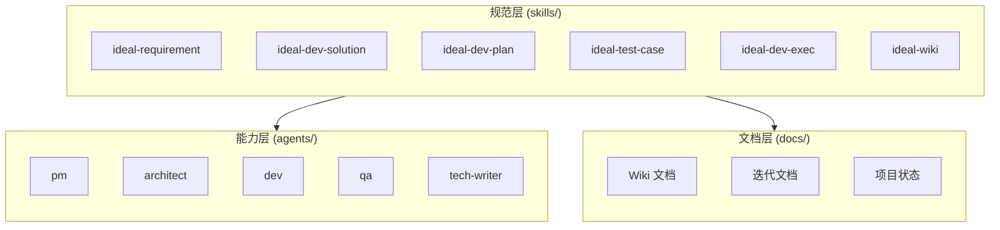
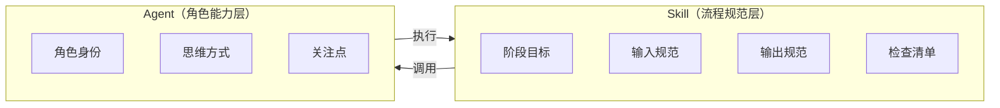
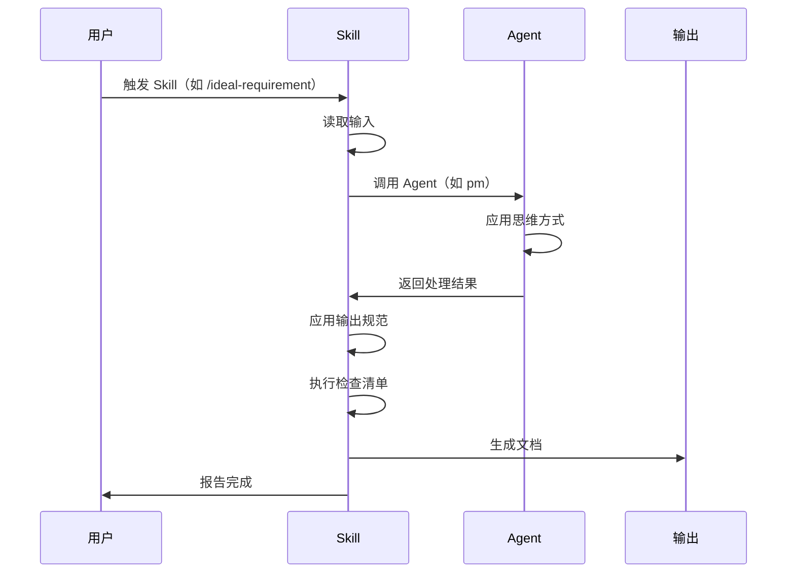
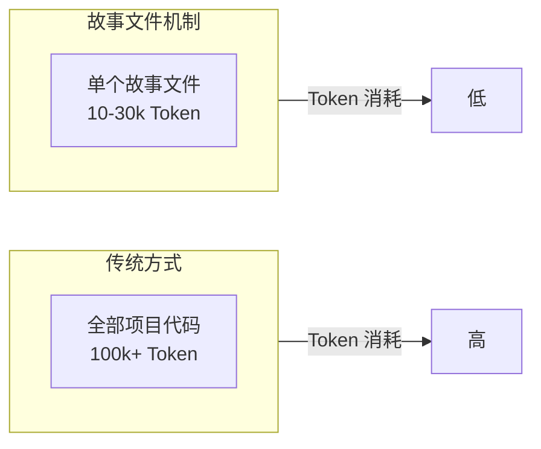
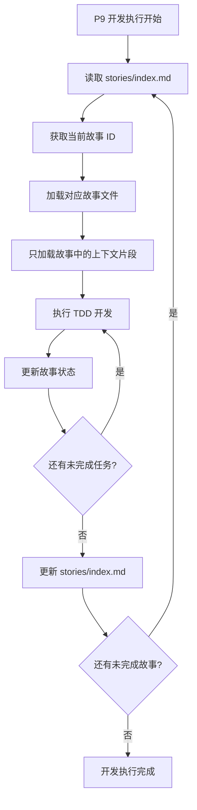

# 架构设计

本文档将帮助你理解 CC-Workflow 的技术架构、设计理念和核心机制。通过理解这些内容，你可以更好地使用 CC-Workflow，并为其开发扩展。

## 整体架构

CC-Workflow 采用三层架构设计，将角色能力、流程规范和文档中心分离。



### 三层结构

| 层级 | 目录 | 职责 | 说明 |
|------|------|------|------|
| **能力层** | `.claude/agents/` | 定义角色能力 | Agent 定义"如何思考" |
| **规范层** | `.claude/skills/` | 定义流程规范 | Skill 定义"做什么"和"输出什么" |
| **文档层** | `docs/` | 存储文档和状态 | Obsidian vault，文档与代码版本同步 |

### 架构原则

CC-Workflow 的架构设计遵循以下原则：

**1. 职责分离**：Agent 定义角色能力，Skill 定义流程规范，两者通过调用关系协作。这种分离使得同一个 Agent 可以被多个 Skill 调用，同一个 Skill 可以调用多个 Agent。

**2. 配置驱动**：项目配置、流程状态、故事文件都使用 Markdown + YAML frontmatter 格式，便于人类阅读和 Claude 解析。

**3. 上下文隔离**：通过故事文件机制，每个开发任务只加载必要的上下文，降低 Token 消耗 70-90%。

**4. 质量保障**：15 阶段流程中嵌入 8 个人工评审点，确保每个阶段的输出质量。

## Skill + Agent 混合架构

Skill + Agent 混合架构是 CC-Workflow 的核心设计，它将"做什么"与"如何思考"分离。

### 设计理念

传统的工作流系统往往将流程和角色耦合在一起，导致以下问题：

1. **复用困难**：同一个流程不能被不同角色以不同方式执行
2. **扩展困难**：新增角色需要重写整个流程
3. **维护困难**：流程变更影响多个角色，修改成本高

CC-Workflow 采用 Skill + Agent 混合架构，通过职责边界解决上述问题。

### 职责边界



| 维度 | Skill | Agent |
|------|-------|-------|
| **定义内容** | 阶段目标、输入输出、检查清单 | 角色身份、思维方式、输出规范 |
| **核心问题** | 做什么？输出什么？ | 如何思考？关注什么？ |
| **文件位置** | `.claude/skills/` | `.claude/agents/` |
| **可复用性** | 被多个项目复用 | 被多个 Skill 调用 |
| **是否定义模板** | 是（定义输出模板） | 否（使用 Skill 的模板） |

### Skill 的职责

Skill 定义流程规范，包括以下内容：

**阶段目标**：当前阶段要达成什么目标。例如 P1（需求编写）的目标是"通过交互式对话收集需求信息，生成标准化需求文档"。

**输入规范**：当前阶段需要什么输入。例如 P3（技术方案）的输入是 P1-需求文档.md。

**输出规范**：当前阶段产出什么输出。例如 P5（计划生成）的输出是 P5-编码计划.md + 故事文件。

**检查清单**：如何验证输出质量。例如 P1 的检查清单包括"需求背景清晰"、"功能清单完整"、"验收标准可测试"。

### Agent 的职责

Agent 定义角色能力，包括以下内容：

**角色身份**：我是谁？例如 pm（产品经理）的角色身份是"以用户价值为导向的产品决策者"。

**思维方式**：我如何思考？例如 architect（架构师）的思维方式包括"简单优先"、"权衡取舍"。

**输出规范**：我输出的内容应该符合什么格式？例如 pm 输出的需求文档应该包含问题陈述、目标、功能清单、验收标准。

### 协作机制

Skill 调用 Agent 执行任务，协作流程如下：



**示例：P1 需求编写**

1. 用户输入 `/ideal-requirement`
2. `ideal-requirement` Skill 读取项目背景（CLAUDE.md）
3. Skill 调用 `pm` Agent 进行需求对话
4. `pm` Agent 使用苏格拉底式提问收集信息
5. `pm` Agent 按输出规范返回需求内容
6. Skill 按模板格式生成 P1-需求文档.md
7. Skill 执行检查清单验证文档质量
8. 报告用户文档已生成

### 职责边界示例

以"编写需求文档"为例，说明 Skill 和 Agent 的职责边界：

**Skill（ideal-requirement）负责**：
- 定义需求文档的模板结构（问题陈述、目标、功能清单、验收标准）
- 定义苏格拉底式提问的流程（一次只问一个问题、提供选项辅助）
- 定义文档生成的路径（`docs/迭代/{需求名称}/P1-需求文档.md`）
- 定义检查清单（需求背景清晰、功能清单完整、验收标准可测试）

**Agent（pm）负责**：
- 定义产品经理的角色身份（以用户价值为导向）
- 定义苏格拉底式提问的技巧（如何追问、如何引导）
- 定义 MVP 思维（如何识别核心价值、如何避免过度设计）
- 定义需求文档的语言风格（正式学术风格）

## 存储架构

CC-Workflow 采用 **Git 仓库 + Obsidian vault 统一存储** 方案，`docs/` 目录即为 Obsidian vault，文档与代码在同一仓库中版本同步。

### 存储结构

```
{项目名称}/                       # Git 仓库根目录
│
├── .claude/                       # Claude Code 相关
│   ├── agents/                    # Agent 定义
│   ├── skills/                    # Skill 定义
│   └── project-config.md          # 项目配置
│
├── src/                           # 源代码
├── tests/                         # 测试代码
│
├── docs/                          # Obsidian vault
│   ├── .obsidian/                 # Obsidian 配置
│   ├── 迭代/                      # 迭代文档
│   │   └── {YYYY-MM-DD}-{需求名称}/
│   │       ├── P1-需求文档.md
│   │       ├── P3-技术方案.md
│   │       ├── P5-编码计划.md
│   │       ├── P7-测试用例.md
│   │       ├── P11-测试报告.md
│   │       ├── 流程状态.md
│   │       └── stories/
│   │           ├── index.md
│   │           └── 0XX-*.md
│   │
│   └── Wiki/                      # 维基文档
│       ├── 用户指南/
│       └── 开发指南/
│
├── CLAUDE.md                      # 项目指令
└── README.md
```

### 职责划分

| 维度 | docs/ (Obsidian vault) | src/ + 根目录 |
|------|------------------------|---------------|
| **定位** | 文档中心、流程控制、决策记录 | 代码执行层 |
| **人类交互** | 产品/设计/管理者（Obsidian 界面） | 开发者评审代码 |
| **Claude 交互** | 读写文档、生成方案 | 读写代码、执行计划 |
| **版本控制** | Git（通过 Obsidian Git 插件） | Git |

### Obsidian Git 插件配置

团队使用 Obsidian Git 插件实现文档的自动同步：

- 自动备份间隔：每 5 分钟
- 自动拉取间隔：每 5 分钟
- 冲突处理：先 pull 再 push

## 故事文件机制

故事文件机制是 CC-Workflow 的核心优化，通过上下文隔离降低 Token 消耗 70-90%。

### 问题背景

在 P9（开发执行）阶段，Claude Code 需要编写代码。传统方式会加载整个项目代码作为上下文，导致：

1. **Token 消耗高**：大型项目可能超过 100k Token
2. **成本增加**：Token 消耗直接影响 API 调用成本
3. **响应变慢**：上下文越长，响应时间越长

### 解决方案

P5（计划生成）阶段会生成故事文件，每个故事文件包含独立开发和测试所需的全部上下文：



### 故事文件结构

每个故事文件包含以下内容：

```markdown
---
story_id: 001
title: 用户登录表单验证
status: pending
depends_on: []
---

# Story 001: 用户登录表单验证

## 上下文

### 需求来源
> 来源：P1-需求文档.md#功能需求

用户需要通过邮箱或手机号登录系统，登录时需要进行表单验证。

### 技术方案
> 来源：P3-技术方案.md#登录模块

采用前端即时验证 + 后端二次验证的方式。前端使用 React Hook Form，
后端 API 路径为 POST /api/auth/login。

### 相关代码

已完成的依赖模块：
- `src/components/Form/Input.tsx` - 通用输入组件（Story 000）
- `src/utils/validation.ts` - 验证工具函数（Story 000）

## 任务清单

- [ ] 编写登录表单组件测试
- [ ] 实现邮箱格式验证
- [ ] 实现手机号格式验证
- [ ] 实现密码强度验证
- [ ] 集成后端 API 调用

## 验收标准

### 功能验收
- [ ] 邮箱格式验证正确
- [ ] 手机号格式验证正确
- [ ] 密码强度验证正确
- [ ] 登录成功后跳转首页

### 代码质量
- [ ] 测试覆盖率 > 80%
- [ ] 无 Lint 警告

## 实现笔记

<!-- 由 Claude 在执行过程中填写 -->
```

### 上下文片段原则

故事文件中的上下文是**片段**，而非完整文档。这是降低 Token 消耗的关键：

| 内容 | 传统方式 | 故事文件方式 |
|------|----------|--------------|
| 需求文档 | 加载整个 P1（可能 5k+ Token） | 只加载相关片段（可能 500 Token） |
| 技术方案 | 加载整个 P3（可能 10k+ Token） | 只加载相关片段（可能 1k Token） |
| 项目代码 | 加载全部代码（可能 100k+ Token） | 只加载相关代码片段（可能 5k Token） |

### 执行流程



### 故事粒度原则

故事文件的粒度需要适中，遵循以下原则：

| 原则 | 说明 |
|------|------|
| **独立性** | 每个故事可独立开发和测试 |
| **完整性** | 故事包含完成任务所需的全部上下文 |
| **时间限制** | 每个故事 1-4 小时可完成 |
| **依赖明确** | 故事之间的依赖关系在 frontmatter 中声明 |

## 设计决策记录

CC-Workflow 的重要设计决策记录如下：

### ADR-001：采用 15 阶段流程

**背景**：传统软件开发流程粒度过粗，难以准确评估进度和质量。

**决策**：将软件开发流程划分为 15 个阶段，分为规划、准备、执行、收尾四个阶段组。

**原因**：
- 更细粒度的阶段划分使职责更清晰
- 8 个人工评审点确保质量可控
- 流程状态文件实时记录各阶段状态

**影响**：
- 流程更复杂，但质量更有保障
- 团队成员需要理解更多阶段概念

### ADR-002：Skill + Agent 分离

**背景**：传统工作流系统将流程和角色耦合，导致复用和扩展困难。

**决策**：采用 Skill + Agent 混合架构，将"做什么"与"如何思考"分离。

**原因**：
- 同一个 Skill 可以被不同的 Agent 以不同方式执行
- 同一个 Agent 可以执行多个 Skill
- 流程变更不影响角色定义，角色变更不影响流程规范

**影响**：
- 架构更复杂，但灵活性更高
- 开发者需要理解 Skill 和 Agent 的职责边界

### ADR-003：故事文件机制

**背景**：P9 开发执行阶段加载整个项目代码导致 Token 消耗过高。

**决策**：P5 阶段生成故事文件，每个故事文件包含独立开发和测试所需的全部上下文。

**原因**：
- 降低 Token 消耗 70-90%
- 降低 API 调用成本
- 提高响应速度

**影响**：
- P5 阶段需要额外工作生成故事文件
- 故事文件的粒度需要仔细设计

### ADR-004：Git 仓库 + Obsidian vault 统一存储

**背景**：文档和代码分散存储导致版本不同步，协作困难。

**决策**：采用 Git 仓库 + Obsidian vault 统一存储方案，`docs/` 目录即为 Obsidian vault。

**原因**：
- 文档与代码在同一仓库中版本同步
- 团队成员可以通过 Obsidian 界面操作文档
- Claude Code 可以直接读写文档

**影响**：
- 仓库体积可能增大（如果包含大量图片）
- 团队成员需要安装 Obsidian Git 插件
