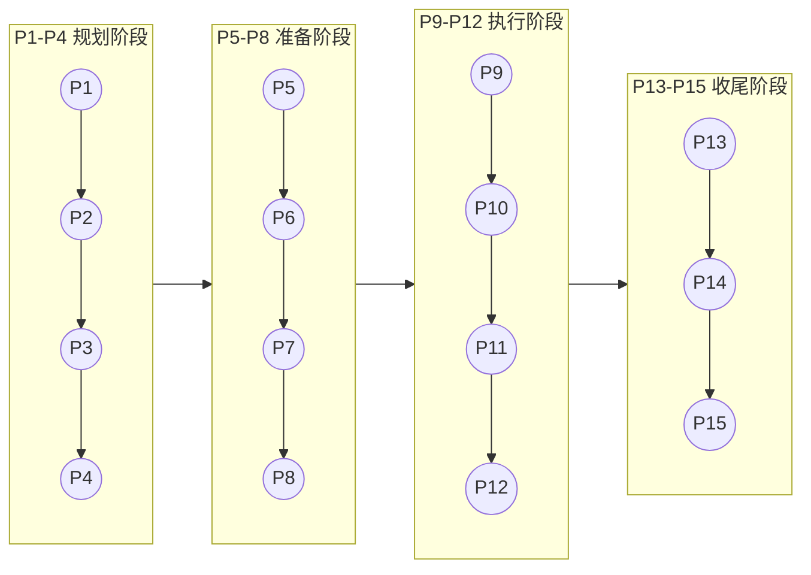

# 用户指南

欢迎使用 CC-Workflow 用户指南。本指南面向使用 CC-Workflow 的团队成员，帮助你快速上手并理解整个工作流程。

## 文档导航

### 入门

| 文档 | 说明 | 适合人群 |
|------|------|----------|
| [快速开始](./快速开始.md) | 5 分钟上手教程，完成从需求到上线的完整流程 | 新用户、初次使用者 |

### 理解流程

| 文档 | 说明 | 适合人群 |
|------|------|----------|
| [流程概述](./流程概述.md) | 15 阶段开发流程的完整说明 | 所有用户、管理者 |
| [角色分工](./角色分工.md) | 团队成员和 Claude Code 的职责划分 | 团队成员、管理者 |

### 解决问题

| 文档 | 说明 | 适合人群 |
|------|------|----------|
| [常见问题](./常见问题.md) | 常见问题和解决方案 | 遇到问题的用户 |

## 按场景查找

### 我是新用户，想快速上手

1. 阅读 [快速开始](./快速开始.md) 完成第一次完整流程
2. 阅读 [流程概述](./流程概述.md) 理解整体流程设计
3. 遇到问题时查阅 [常见问题](./常见问题.md)

### 我是团队成员，需要了解自己的职责

1. 阅读 [角色分工](./角色分工.md) 了解职责划分
2. 参考 [流程概述](./流程概述.md) 中的阶段详情，确认各阶段的参与要求

### 我是管理者，需要了解流程设计

1. 阅读 [流程概述](./流程概述.md) 中的"流程设计理念"章节
2. 阅读 [角色分工](./角色分工.md) 了解资源配置

## 核心概念

### CC-Workflow 是什么？

CC-Workflow 是一个以 Claude Code 为核心的团队协作工作流系统。它实现了从需求到上线的全流程自动化，让团队成员只需专注于三件事：**提需求、做评审、反馈意见**。

### 核心原则

| 角色 | 职责 |
|------|------|
| **团队成员** | 提需求、做评审、反馈意见 |
| **Claude Code** | 需求编写、技术方案、计划生成、开发执行、测试用例、维基更新 |

### 15 阶段流程

CC-Workflow 将软件开发分为 15 个阶段（P1-P15），分为四个阶段组：

详细的阶段说明请参阅 [流程概述](./流程概述.md)。
