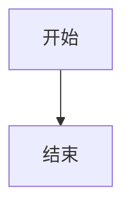

# 常见问题

本文档整理了使用 CC-Workflow 过程中的常见问题和解决方案。如果你遇到的问题不在列表中，请通过 Issue 反馈。

## 安装配置问题

### 问题：初始化时提示"全局配置不存在"

**现象**：运行 `/ideal-init` 时，Claude Code 提示"全局配置不存在，请先安装全局 agents 和 skills"。

**原因**：`~/.claude/` 目录中没有 CC-Workflow 的全局 agents 和 skills 文件。

**解决方案**：

1. 确认可以访问 CC-Workflow 仓库（GitLab/GitHub）
2. 运行 `/ideal-init`，Claude Code 会引导你完成全局资源安装
3. 如果自动安装失败，手动克隆仓库：

```bash
# 克隆 agents
git clone {agents-repo-url} ~/.claude/agents

# 克隆 skills
git clone {skills-repo-url} ~/.claude/skills
```

4. 重新运行 `/ideal-init`

### 问题：项目目录已存在 CLAUDE.md

**现象**：运行 `/ideal-init` 时，提示"CLAUDE.md 已存在"。

**原因**：项目根目录已存在 CLAUDE.md 文件，可能是之前初始化过或其他工具创建的。

**解决方案**：

Claude Code 会提供以下选项：

| 选项 | 说明 |
|------|------|
| 跳过 | 保留现有 CLAUDE.md，不进行任何修改 |
| 覆盖 | 用新模板替换现有 CLAUDE.md |
| 查看差异 | 显示现有文件与新模板的差异后再决定 |

建议选择"查看差异"，确认是否需要更新。

### 问题：全局 agents/skills 版本过旧

**现象**：Claude Code 提示"全局 agents/skills 版本过旧，建议更新"。

**原因**：`~/.claude/` 目录中的 agents 或 skills 版本低于项目要求的版本。

**解决方案**：

```bash
# 更新 agents
cd ~/.claude/agents && git pull

# 更新 skills
cd ~/.claude/skills && git pull
```

或者重新运行 `/ideal-init`，选择"更新全局资源"选项。

## 流程执行问题

### 问题：需求文档生成失败

**现象**：运行 `/ideal-requirement` 后，提示"需求文档生成失败"。

**可能原因及解决方案**：

| 原因 | 检查方式 | 解决方案 |
|------|----------|----------|
| 目录权限问题 | 检查 `docs/迭代/` 目录权限 | `chmod 755 docs/迭代/` |
| 模板文件缺失 | 检查 `~/.claude/skills/ideal-requirement/references/templates/` | 重新安装 skills |
| 需求名称包含特殊字符 | 检查输入的需求名称 | 使用中文、英文、数字和连字符 |

### 问题：流程状态更新后没有触发下一阶段

**现象**：将 `流程状态.md` 中某阶段状态更新为 `approved`，但 Claude Code 没有自动触发下一阶段。

**原因**：Claude Code 没有检测到文件变化，或前置条件不满足。

**解决方案**：

1. **手动触发下一阶段**：

```
/ideal-dev-solution  # 触发 P3
/ideal-dev-plan      # 触发 P5
/ideal-test-case     # 触发 P7
/ideal-dev-exec      # 触发 P9
/ideal-test-exec     # 触发 P11
/ideal-wiki          # 触发 P15
```

2. **检查前置条件**：

确认 `流程状态.md` 中前置阶段的状态是否为 `completed` 或 `approved`：

| 阶段 | 前置条件 |
|------|----------|
| P3 | P2 = approved |
| P5 | P4 = approved |
| P7 | P6 = approved |
| P9 | P8 = approved |
| P11 | P10 = approved |
| P15 | P14 = completed |

### 问题：故事文件加载错误

**现象**：运行 `/ideal-dev-exec` 时，提示"故事文件加载失败"或"故事索引格式错误"。

**原因**：故事索引文件 `stories/index.md` 格式不正确，或故事文件路径与索引不匹配。

**解决方案**：

1. 检查 `stories/index.md` 格式：

```yaml
---
requirement: {需求名称}
total_stories: N
completed: 0
current: 001
---

# 故事索引

## 概览

| 故事 | 标题 | 状态 | 依赖 |
|------|------|------|------|
| [001](001-xxx.md) | xxx | ⏳ 待开始 | - |
```

2. 确认故事文件存在：

```bash
ls docs/迭代/{需求名称}/stories/
```

3. 如果索引损坏，重新生成：

```
/ideal-dev-plan
```

### 问题：开发执行中途卡住

**现象**：`/ideal-dev-exec` 执行过程中，Claude Code 停止响应或报告错误。

**原因**：可能是上下文过长、测试失败、或代码冲突。

**解决方案**：

1. **检查故事状态**：

打开 `stories/index.md`，查看当前故事状态。

2. **手动跳过当前任务**：

如果某个任务无法完成，可以标记为跳过，继续下一个任务：

```markdown
- [x] 任务 1（已跳过，原因：外部依赖不可用）
```

3. **重新开始当前故事**：

删除当前故事的实现笔记，重新执行：

```bash
# 清除实现笔记
sed -i '' '/## 实现笔记/,$d' docs/迭代/{需求名称}/stories/001-xxx.md
```

然后重新运行 `/ideal-dev-exec`。

## 文档生成问题

### 问题：需求文档内容不完整

**现象**：生成的需求文档缺少某些字段或内容简略。

**原因**：需求收集阶段跳过了某些问题，或回答不够详细。

**解决方案**：

1. 在需求对话过程中，尽量详细回答问题
2. 如果文档已生成，可以要求补充：

```
请补充 P1-需求文档.md 中的非功能需求部分
```

3. 如果是必填字段缺失（如验收标准），Claude Code 会提示，按提示补充即可

### 问题：技术方案过于复杂

**现象**：生成的技术方案引入了过多技术组件，与项目实际需求不匹配。

**原因**：Claude Code 倾向于提供"完整"的方案，可能过度设计。

**解决方案**：

1. 在需求文档中明确约束：

```markdown
## 约束条件

- 用户量级：< 1000 日活
- 不引入新的中间件
- 优先复用现有组件
```

2. 在 P4 评审时反馈：

```
这个方案太复杂了，能否简化？不需要消息队列，直接同步调用即可。
```

3. Claude Code 会根据反馈调整方案

### 问题：Wiki 文档格式不正确

**现象**：生成的 Wiki 文档无法在 Docusaurus 中正确渲染。

**原因**：文档格式不符合 Docusaurus 要求，如缺少 frontmatter、Mermaid 语法错误等。

**解决方案**：

1. 检查 frontmatter 格式：

```yaml
---
title: 文档标题
description: 文档描述（150 字符内）
sidebar_position: 1
tags: [tag1, tag2]
---
```

2. 检查 Mermaid 语法：



3. 运行 `/ideal-wiki` 时，Claude Code 会自动检查格式

## Git 操作问题

### 问题：Merge Request 创建失败

**现象**：P9 开发执行完成后，提示"Merge Request 创建失败"。

**原因**：Git 配置问题、权限问题、或分支已存在。

**解决方案**：

1. **检查 Git 配置**：

```bash
git config --list | grep remote
```

确认 `remote.origin.url` 指向正确的仓库。

2. **检查权限**：

```bash
git push origin feature/{需求名称}
```

如果提示权限错误，确认有仓库写入权限。

3. **检查分支是否存在**：

```bash
git branch -a | grep feature/{需求名称}
```

如果分支已存在，可能需要删除后重新创建。

### 问题：代码冲突无法合并

**现象**：P10 代码评审通过后，合并 MR 时出现冲突。

**原因**：功能分支与主分支之间存在冲突。

**解决方案**：

1. **手动解决冲突**：

```bash
git checkout main
git pull
git checkout feature/{需求名称}
git merge main
# 解决冲突
git add .
git commit -m "resolve conflicts"
git push
```

2. **请求 Claude Code 协助**：

```
请帮我解决 feature/user-auth 分支与 main 分支的冲突
```

### 问题：提交信息格式不规范

**现象**：Git 提交信息不符合项目规范，导致 CI 检查失败。

**原因**：CC-Workflow 的提交信息格式与项目规范不一致。

**解决方案**：

CC-Workflow 默认使用 Conventional Commits 格式：

```
type(scope): subject

body

footer
```

如果项目有不同规范，可以在 `project-config.md` 中配置：

```yaml
git:
  commit_template: |
    [{需求名称}] {type}: {subject}
```

## 故障排查指南

### 通用排查步骤

遇到问题时，按以下步骤排查：

1. **检查日志**：查看 Claude Code 的输出日志，定位错误信息
2. **检查文件**：确认相关文件存在且格式正确
3. **检查状态**：查看 `流程状态.md`，确认各阶段状态
4. **检查配置**：查看 `project-config.md`，确认配置正确
5. **搜索文档**：在 Wiki 中搜索相关关键词

### 重置流程状态

如果流程状态混乱，可以手动重置：

1. 打开 `docs/迭代/{需求名称}/流程状态.md`
2. 将 `current_phase` 设置为当前应执行的阶段
3. 将对应阶段的状态设置为 `pending`
4. 保存文件

### 清理工作目录

如果工作目录混乱，可以清理：

```bash
# 删除未跟踪的文件
git clean -fd

# 撤销未提交的修改
git checkout .

# 删除功能分支（如果不需要）
git branch -D feature/{需求名称}
```

### 重新开始需求

如果需求执行出现问题，可以重新开始：

```bash
# 备份现有文档
mv docs/迭代/{需求名称} docs/迭代/.backup-{需求名称}

# 重新运行需求收集
/ideal-requirement
```

### 获取帮助

如果以上方法都无法解决问题：

1. 查看 [CC-Workflow 仓库](https://gitlab.com/your-org/cc-workflow) 的 Issues
2. 提交新 Issue，包含：
   - 问题描述
   - 复现步骤
   - 错误日志
   - 环境信息（操作系统、Claude Code 版本）
