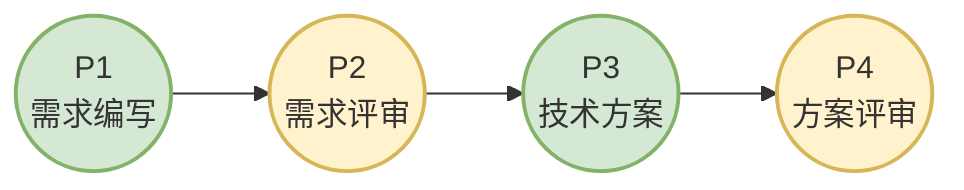

# 快速开始

本教程将引导你使用 CC-Workflow 完成一个完整的需求开发流程。完成本教程后，你将能够：

- 初始化项目接入 CC-Workflow
- 使用 `/ideal-requirement` 提交第一个需求
- 理解 15 阶段流程如何自动推进
- 完成一次从需求到上线的完整迭代

**预计完成时间**：20-30 分钟

## 前置条件

在开始之前，请确认以下条件已满足：

| 条件 | 要求 | 检查方式 |
|------|------|----------|
| Claude Code | 版本 ≥ 0.5.0 | 运行 `claude --version` |
| Git | 版本 ≥ 2.20 | 运行 `git --version` |
| 项目仓库 | 已初始化 Git | 检查项目根目录存在 `.git/` |
| Git 配置 | 已配置 user.name 和 user.email | 运行 `git config --list` |

如果 Claude Code 尚未安装，请访问 [Claude Code 官方文档](https://docs.anthropic.com/claude-code) 完成安装。

## 步骤 1：初始化项目

CC-Workflow 需要先初始化项目配置，才能使用完整的 15 阶段流程。

### 1.1 进入项目目录

```bash
cd /path/to/your-project
```

### 1.2 运行初始化命令

在 Claude Code 中输入：

```
/ideal-init
```

Claude Code 将执行以下操作：

1. **检测全局配置**：检查 `~/.claude/` 目录是否存在 agents 和 skills
2. **探测项目信息**：识别项目名称、语言类型、框架、Git 配置
3. **生成项目结构**：创建 `.claude/project-config.md` 和 `docs/` 目录结构

### 1.3 确认探测结果

Claude Code 会展示探测到的项目信息，例如：

```
📊 项目探测结果：

| 项目 | 探测值 |
|------|--------|
| 项目名称 | my-web-app |
| 语言 | Node.js |
| 框架 | React 18.2.0 |
| 测试命令 | npm test |
| 构建命令 | npm run build |
| Git 仓库 | git@gitlab.com:team/my-web-app.git |
| 主分支 | main |
```

确认信息正确后，输入"确认"或"是"继续。如果需要修改，直接告知正确的值。

### 1.4 验证初始化结果

初始化完成后，项目结构应包含以下新增内容：

```
your-project/
├── .claude/
│   └── project-config.md    # 项目配置文件
├── docs/
│   ├── Wiki/                # 维基文档目录
│   ├── 迭代/                # 迭代文档目录
│   └── 项目状态.md          # 项目状态看板
└── CLAUDE.md                # Claude 指令文件（如已存在则跳过）
```

**预期结果**：`docs/` 目录和 `.claude/project-config.md` 已创建。

**异常处理**：
- 若提示"全局配置不存在"：Claude Code 会引导你从远程仓库安装全局 agents 和 skills
- 若提示"文件已存在"：选择"跳过"保留现有文件，或"覆盖"使用新模板

## 步骤 2：提交第一个需求

项目初始化完成后，可以开始第一个需求。

### 2.1 启动需求收集

在 Claude Code 中输入：

```
/ideal-requirement
```

Claude Code 将以产品经理角色，通过苏格拉底式对话收集需求信息。

### 2.2 回答需求问题

Claude Code 会依次询问以下核心问题（每个问题只问一个）：

**问题 1：需求标题**
```
这个需求的标题是什么？（例如：用户登录功能）
```

**问题 2：问题陈述**
```
这个需求要解决什么问题？请描述当前的痛点。
```
示例回答：
> 当前用户需要联系客服才能重置密码，平均处理时间 2 小时，
> 占客服工单量的 15%。用户满意度调查显示，密码相关问题
> 满意度仅 3.2 分（满分 5 分）。

**问题 3：目标**
```
这个需求的目标是什么？
```
示例回答：
> 实现用户自助重置密码功能，将密码重置时间从 2 小时缩短至 5 分钟，
> 减少客服相关工单量 80% 以上。

**问题 4：功能清单**
```
需要实现哪些具体功能？
```
示例回答：
> 1. 邮箱验证码发送
> 2. 新密码设置（含强度校验）
> 3. 重置成功通知

### 2.3 确认需求摘要

收集完成后，Claude Code 会展示需求摘要：

```
📋 需求摘要：

类型：软件功能
标题：用户密码自助重置
目标：实现用户自助重置密码功能
核心功能：
  - 邮箱验证码发送
  - 新密码设置
  - 重置成功通知
验收标准：
  - 用户可通过邮箱完成密码重置
  - 重置流程完成时间 < 5 分钟
  - 验证码有效期 10 分钟

确认生成需求文档？
```

输入"确认"生成文档。

### 2.4 验证文档生成

需求文档生成后，检查以下文件：

```
docs/迭代/用户密码自助重置/
├── P1-需求文档.md    # 需求文档本体
└── 流程状态.md       # 流程控制文件
```

打开 `P1-需求文档.md` 确认内容符合预期。

**预期结果**：`docs/迭代/{需求名称}/` 目录已创建，包含需求文档和流程状态文件。

## 步骤 3：完成评审流程

CC-Workflow 的 15 阶段流程包含 7 个人工评审点。P1（需求编写）完成后，进入 P2（需求评审）。

### 3.1 理解评审流程



**人工评审阶段（P2/P4/P6/P8/P10/P12/P14）**：需要团队成员审查文档或代码，做出通过/修改决定。

**Claude 执行阶段（P1/P3/P5/P7/P9/P11/P13/P15）**：由 Claude Code 自动完成文档生成、代码开发、测试执行等工作。

### 3.2 执行需求评审（P2）

打开 `docs/迭代/{需求名称}/流程状态.md`，将 `P2 需求评审` 的状态从 `pending` 改为 `approved`：

```yaml
### 规划阶段
| 阶段 | 状态 | 更新时间 |
|------|------|----------|
| P1 需求编写 | ✅ completed | 2026-02-22 10:00 |
| P2 需求评审 | ✅ approved | 2026-02-22 10:30 |  # 修改此处
```

保存文件后，Claude Code 会检测到状态变更，自动触发 P3（技术方案）。

### 3.3 触发技术方案（P3）

状态更新后，在 Claude Code 中输入：

```
继续下一个阶段
```

或直接输入：

```
/ideal-dev-solution
```

Claude Code 将读取需求文档，生成技术方案文档 `P3-技术方案.md`。

## 步骤 4：执行开发任务

完成 P4（方案评审）和 P5（计划生成）、P6（计划评审）、P7（测试用例）、P8（用例评审）后，进入 P9（开发执行）。

### 4.1 理解故事文件机制

P5 阶段会生成故事文件，实现上下文隔离：

```
docs/迭代/{需求名称}/stories/
├── index.md           # 故事索引
├── 001-xxx.md         # 故事 1
├── 002-xxx.md         # 故事 2
└── ...
```

每个故事文件包含：
- 上下文片段（相关需求、技术方案、已完成代码）
- 任务清单
- 验收标准

### 4.2 开始开发执行（P9）

在 Claude Code 中输入：

```
/ideal-dev-exec
```

Claude Code 将：
1. 读取 `stories/index.md` 确认当前故事
2. 只加载当前故事文件（上下文隔离）
3. 以 TDD 方式执行开发任务
4. 创建 Git 分支和 Merge Request

### 4.3 验证开发结果

开发完成后，检查以下内容：

| 检查项 | 位置 |
|--------|------|
| 代码变更 | Git 分支 `feature/{需求名称}` |
| Merge Request | GitLab/GitHub MR 列表 |
| 测试结果 | `docs/迭代/{需求名称}/P11-测试报告.md` |

## 步骤 5：完成收尾工作

完成 P10（代码评审）、P11（测试执行）、P12（测试评审）后，进入收尾阶段。

### 5.1 维基更新（P13）

P12 测试评审通过后，在 Claude Code 中输入：

```
/ideal-wiki
```

Claude Code 将：
1. 分析本次变更的影响范围
2. 更新受影响的维基文档
3. 生成新的文档（如有新功能）

### 5.2 维基评审（P14）

由产品和技术人员审查维基文档，确认准确完整后，将 `流程状态.md` 中 P14 状态更新为 `approved`。

### 5.3 成果提交（P15）

P14 通过后，Claude Code 自动执行：

1. 合并代码到主分支
2. 删除开发用的 worktree
3. 提交 Pull Request

### 5.4 自动部署

P15 完成后，CI/CD 流水线自动检测主分支更新，执行：

1. 构建生产包
2. 运行生产环境测试
3. 部署到生产服务器
4. 执行健康检查

### 5.5 验证部署结果

部署完成后，确认：

- [ ] 生产环境可访问
- [ ] 新功能正常工作
- [ ] 无错误日志

## 常见问题排查

### 问题：初始化时提示"全局配置不存在"

**原因**：`~/.claude/` 目录中没有 CC-Workflow 的全局 agents 和 skills。

**解决方案**：
1. 确认可以访问 CC-Workflow 仓库
2. 运行 `/ideal-init`，Claude Code 会引导你完成全局资源安装

### 问题：需求文档生成失败

**原因**：可能是目录权限问题或模板文件缺失。

**解决方案**：
1. 检查 `docs/迭代/` 目录是否有写入权限
2. 确认 `~/.claude/skills/ideal-requirement/references/templates/` 目录存在

### 问题：流程状态更新后没有触发下一阶段

**原因**：Claude Code 没有检测到文件变化，或前置条件不满足。

**解决方案**：
1. 手动触发下一阶段的 Skill（如 `/ideal-dev-solution`）
2. 检查 `流程状态.md` 中前置阶段的状态是否为 `completed` 或 `approved`

### 问题：故事文件加载错误

**原因**：故事索引文件损坏或路径不正确。

**解决方案**：
1. 检查 `docs/迭代/{需求名称}/stories/index.md` 格式是否正确
2. 确认故事文件路径与索引中的路径一致

## 下一步

完成本教程后，建议继续阅读：

- [流程概述](./流程概述.md) - 深入理解 15 阶段流程的设计理念
- [角色分工](./角色分工.md) - 了解团队成员和 Claude Code 的职责划分
- [常见问题](./常见问题.md) - 查看更多问题解决方案
