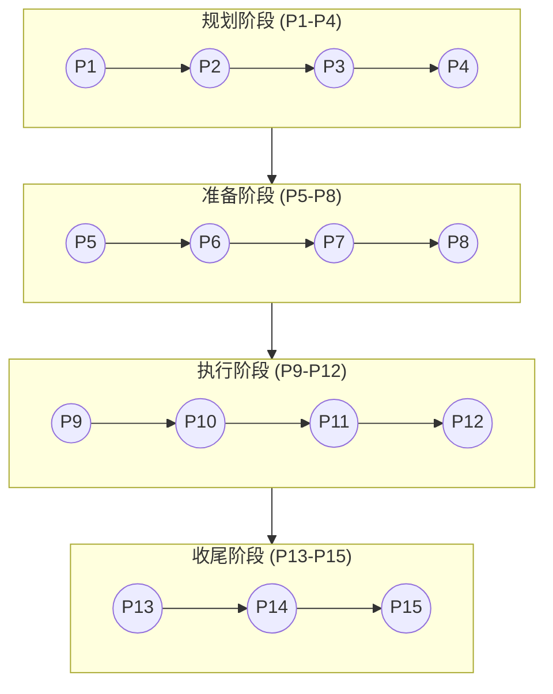
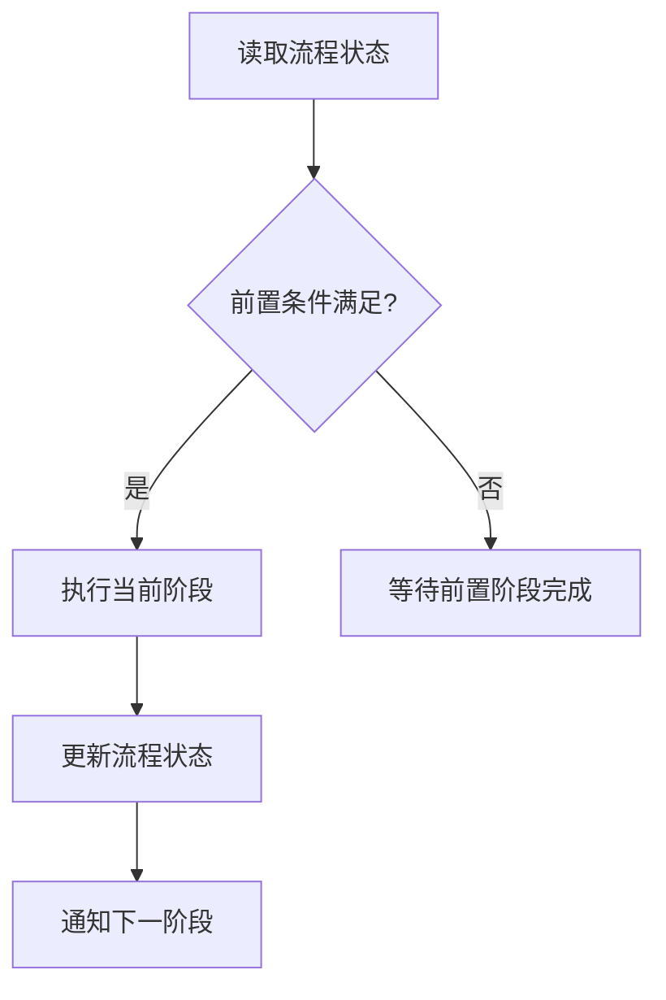

# 流程概述

CC-Workflow 将软件开发流程划分为 15 个阶段（P1-P15），每个阶段都有明确的目标、输入、输出和执行者。本文档将帮助你理解这套流程的设计理念、阶段详情和状态流转机制。

## 流程设计理念

### 为什么是 15 阶段？

传统的软件开发流程往往模糊地分为"需求-开发-测试-上线"几个大阶段，这种粗粒度划分存在以下问题：

1. **职责不清**：开发和测试的边界在哪里？测试什么时候开始？
2. **质量失控**：问题往往在后期才发现，修复成本高
3. **进度不透明**：难以准确评估当前进度和剩余工作量

CC-Workflow 采用 15 阶段设计，通过更细粒度的阶段划分，解决上述问题：

| 设计目标 | 实现方式 |
|----------|----------|
| 职责清晰 | 每个阶段有明确的输入、输出和执行者 |
| 质量保障 | 7 个人工评审点（P2/P4/P6/P8/P10/P12/P14）确保质量 |
| 进度透明 | 流程状态文件实时记录各阶段状态 |
| 自动化优先 | 8 个 Claude 执行阶段减少人工工作量 |

### 阶段分组逻辑

15 个阶段按时间顺序分为四个阶段组，每个阶段组有明确的目标：

**规划阶段（P1-P4）**的目标是将模糊的需求想法转化为可执行的技术方案。这个阶段产出的文档是后续所有工作的基础，因此需要严格评审（P2 和 P4）。

**准备阶段（P5-P8）**的目标是将技术方案转化为具体的开发任务和测试用例。这个阶段产出的编码计划和测试用例是开发执行的直接依据。

**执行阶段（P9-P12）**的目标是完成代码开发和测试验证。这个阶段是工作量最大的阶段，通过故事文件机制实现上下文隔离，降低 Token 消耗。

**收尾阶段（P13-P15）**的目标是完成维基文档更新和成果提交。这个阶段确保维基文档与代码保持同步，并完成代码合并、PR 提交等收尾工作。

## 阶段总览

| 阶段 | 名称 | 执行者 | 触发条件 | 核心输出 |
|------|------|--------|----------|----------|
| P1 | 需求编写 | Claude | 用户触发 `/ideal-requirement` | P1-需求文档.md |
| P2 | 需求评审 | 人工 | P1 完成 | 评审意见/通过 |
| P3 | 技术方案 | Claude | P2 通过 | P3-技术方案.md |
| P4 | 方案评审 | 人工 | P3 完成 | 评审意见/通过 |
| P5 | 计划生成 | Claude | P4 通过 | P5-编码计划.md + 故事文件 |
| P6 | 计划评审 | 人工 | P5 完成 | 评审意见/通过 |
| P7 | 测试用例 | Claude | P6 通过 | P7-测试用例.md |
| P8 | 用例评审 | 人工 | P7 完成 | 评审意见/通过 |
| P9 | 开发执行 | Claude | P8 通过 | 代码 + MR |
| P10 | 代码评审 | 人工 | P9 完成 | Approve/修改意见 |
| P11 | 测试执行 | Claude | P10 通过 | P11-测试报告.md |
| P12 | 测试评审 | 人工 | P11 完成 | 通过/修复 |
| P13 | 维基更新 | Claude | P12 通过 | 维基文档 |
| P14 | 维基评审 | 人工 | P13 完成 | 发布许可 |
| P15 | 成果提交 | Claude | P14 通过 | 合并代码、删除 worktree、提交 PR |

> **注意**：上线部署由 CI/CD 自动化完成，P15 成果提交后自动触发 CI/CD 流水线。

## 阶段详情

### 规划阶段（P1-P4）

规划阶段将需求想法转化为技术方案，是整个流程的基础。

#### P1：需求编写

**目标**：通过交互式对话收集需求信息，生成标准化的需求文档。

**输入**：用户的口头或书面需求描述

**输出**：
- `docs/迭代/{YYYY-MM-DD}-{需求名称}/P1-需求文档.md`：需求文档本体
- `docs/迭代/{YYYY-MM-DD}-{需求名称}/流程状态.md`：流程控制文件

**执行者**：Claude Code（调用 `ideal-requirement` skill，扮演 PM 角色）

**关键活动**：
1. 读取项目背景（CLAUDE.md 或 README.md）
2. 通过苏格拉底式对话收集需求信息
3. 识别需求类型（软件功能/Bug 修复/重构优化）
4. 生成符合正式学术风格的需求文档
5. 更新流程状态文件

**触发方式**：用户输入 `/ideal-requirement`

#### P2：需求评审

**目标**：由团队成员审查需求文档，确认需求清晰、完整、可实现。

**输入**：P1-需求文档.md

**输出**：评审意见（通过/需修改）

**执行者**：产品负责人 + 技术负责人

**关键活动**：
1. 审查需求背景和目标是否清晰
2. 确认功能清单是否完整
3. 验证验收标准是否可测试
4. 评估技术可行性

**通过标准**：
- 需求背景清晰，有明确的问题陈述
- 功能清单覆盖所有必要功能
- 验收标准可量化、可测试
- 技术方案可行

**状态更新**：将 `流程状态.md` 中 P2 状态更新为 `approved`

#### P3：技术方案

**目标**：基于需求文档，设计技术架构、模块划分、接口规范。

**输入**：P1-需求文档.md

**输出**：`docs/迭代/{YYYY-MM-DD}-{需求名称}/P3-技术方案.md`

**执行者**：Claude Code（调用 `ideal-dev-solution` skill，扮演 Architect 角色）

**关键活动**：
1. 分析需求文档，提取技术要点
2. 设计系统架构和数据模型
3. 划分功能模块，定义模块接口
4. 评估技术风险和依赖
5. 生成技术方案文档

**触发方式**：P2 状态更新为 `approved` 后，用户输入 `/ideal-dev-solution`

#### P4：方案评审

**目标**：由技术负责人和架构师审查技术方案，确认设计合理。

**输入**：P3-技术方案.md

**输出**：评审意见（通过/需修改）

**执行者**：技术负责人 + 架构师

**关键活动**：
1. 审查架构设计是否符合项目规范
2. 验证模块划分是否合理
3. 评估技术风险应对措施
4. 确认接口设计是否完整

**通过标准**：
- 架构设计符合项目现有架构
- 模块划分粒度适中，依赖关系清晰
- 技术风险有明确的应对方案
- 接口定义完整，包含请求/响应格式

**状态更新**：将 `流程状态.md` 中 P4 状态更新为 `approved`

### 准备阶段（P5-P8）

准备阶段将技术方案转化为可执行的开发任务和测试用例。

#### P5：计划生成

**目标**：将技术方案分解为原子任务，按 TDD 模式组织任务步骤。

**输入**：P3-技术方案.md

**输出**：
- `docs/迭代/{YYYY-MM-DD}-{需求名称}/P5-编码计划.md`：编码计划
- `docs/迭代/{YYYY-MM-DD}-{需求名称}/stories/index.md`：故事索引
- `docs/迭代/{YYYY-MM-DD}-{需求名称}/stories/0XX-*.md`：故事文件

**执行者**：Claude Code（调用 `ideal-dev-plan` skill，扮演 Architect + PM 角色）

**关键活动**：
1. 读取技术方案，提取功能模块
2. 分析模块依赖关系，确定执行顺序
3. 将每个模块分解为 3-7 个原子任务
4. 为每个任务定义 TDD 步骤（RED-GREEN-REFACTOR）
5. 生成故事文件（上下文隔离）
6. 生成故事索引文件

**故事文件机制**：每个故事文件包含独立开发和测试所需的全部上下文，避免加载整个项目代码，降低 Token 消耗 70-90%。

**触发方式**：P4 状态更新为 `approved` 后，用户输入 `/ideal-dev-plan`

#### P6：计划评审

**目标**：由开发负责人审查编码计划，确认任务划分合理。

**输入**：P5-编码计划.md + 故事文件

**输出**：评审意见（通过/需修改）

**执行者**：开发负责人

**关键活动**：
1. 审查任务粒度是否适中（每个任务 2-5 分钟可完成）
2. 验证任务依赖关系是否正确
3. 确认 TDD 步骤是否完整
4. 评估整体工作量

**通过标准**：
- 任务粒度适中，无过大或过小的任务
- 依赖关系正确，可并行任务已标注
- 每个任务包含完整的 TDD 步骤
- 工作量评估合理

**状态更新**：将 `流程状态.md` 中 P6 状态更新为 `approved`

#### P7：测试用例

**目标**：基于需求文档和编码计划，生成测试用例。

**输入**：P1-需求文档.md + P5-编码计划.md

**输出**：`docs/迭代/{YYYY-MM-DD}-{需求名称}/P7-测试用例.md`

**执行者**：Claude Code（调用 `ideal-test-case` skill，扮演 QA 角色）

**关键活动**：
1. 读取需求文档，提取验收标准
2. 读取编码计划，了解功能模块
3. 为每个功能设计测试用例
4. 包含正向、边界、异常三类测试
5. 生成测试用例文档

**触发方式**：P6 状态更新为 `approved` 后，用户输入 `/ideal-test-case`

#### P8：用例评审

**目标**：由测试负责人审查测试用例，确认覆盖完整。

**输入**：P7-测试用例.md

**输出**：评审意见（通过/需修改）

**执行者**：测试负责人

**关键活动**：
1. 审查测试用例是否覆盖所有功能
2. 验证边界条件和异常场景
3. 确认测试步骤可执行
4. 评估测试数据准备需求

**通过标准**：
- 功能覆盖率 100%
- 边界条件有对应测试用例
- 异常场景有对应测试用例
- 测试步骤清晰可执行

**状态更新**：将 `流程状态.md` 中 P8 状态更新为 `approved`

### 执行阶段（P9-P12）

执行阶段完成代码开发和测试验证，是工作量最大的阶段。

#### P9：开发执行

**目标**：按编码计划执行开发任务，产出代码和 Merge Request。

**输入**：P5-编码计划.md + 故事文件

**输出**：
- 代码（提交到功能分支）
- Merge Request（提交到 GitLab/GitHub）

**执行者**：Claude Code（调用 `ideal-dev-exec` skill，扮演 Dev 角色）

**关键活动**：
1. 读取 `stories/index.md` 确认当前故事
2. 只加载当前故事文件（上下文隔离）
3. 按 TDD 模式执行任务：编写测试 → 运行确认失败 → 编写最小代码 → 运行确认通过
4. 提交代码到功能分支 `feature/{需求名称}`
5. 创建 Merge Request
6. 更新故事状态

**TDD 铁律**：
- NO PRODUCTION CODE WITHOUT A FAILING TEST FIRST
- NO COMPLETION CLAIMS WITHOUT FRESH VERIFICATION EVIDENCE

**触发方式**：P8 状态更新为 `approved` 后，用户输入 `/ideal-dev-exec`

#### P10：代码评审

**目标**：由开发团队审查代码，确认质量达标。

**输入**：Merge Request

**输出**：Approve/修改意见

**执行者**：开发团队

**关键活动**：
1. 审查代码风格是否符合规范
2. 验证测试覆盖率是否达标（> 80%）
3. 检查是否有明显的性能或安全问题
4. 确认代码逻辑正确

**通过标准**：
- 代码风格符合项目规范
- 测试覆盖率 > 80%
- 无明显的性能或安全问题
- 代码逻辑正确，可读性好

**状态更新**：将 `流程状态.md` 中 P10 状态更新为 `approved`，MR 状态设为 Approved

#### P11：测试执行

**目标**：按测试用例执行测试，产出测试报告。

**输入**：P7-测试用例.md + 代码

**输出**：`docs/迭代/{YYYY-MM-DD}-{需求名称}/P11-测试报告.md`

**执行者**：Claude Code（调用 `ideal-test-exec` skill，扮演 QA + Dev 角色）

**关键活动**：
1. 读取测试用例文档
2. 部署测试环境
3. 执行所有测试用例
4. 记录测试结果
5. 统计通过率
6. 生成测试报告

**触发方式**：P10 状态更新为 `approved` 且 MR 合并后，用户输入 `/ideal-test-exec`

#### P12：测试评审

**目标**：由测试负责人审查测试报告，确认质量达标。

**输入**：P11-测试报告.md

**输出**：通过/需修复

**执行者**：测试负责人

**关键活动**：
1. 审查测试通过率是否达标（> 95%）
2. 分析失败用例的原因
3. 确认是否需要修复
4. 决定是否可以上线

**通过标准**：
- 测试通过率 > 95%
- 失败用例已分析原因
- 无阻塞级缺陷

**状态更新**：将 `流程状态.md` 中 P12 状态更新为 `approved`

### 收尾阶段（P13-P15）

收尾阶段完成维基文档更新和成果提交。

#### P13：维基更新

**目标**：更新维基文档，确保与代码保持同步。

**输入**：代码 + 需求文档

**输出**：维基文档

**执行者**：Claude Code（调用 `ideal-wiki` skill，扮演 Tech-writer 角色）

**关键活动**：
1. 读取项目代码和配置
2. 分析本次变更的影响范围
3. 更新受影响的维基文档
4. 生成新的文档（如有新功能）
5. 更新文档索引

**触发方式**：P12 状态更新为 `approved` 后，用户输入 `/ideal-wiki`

#### P14：维基评审

**目标**：由产品和技术人员审查维基文档，确认准确完整。

**输入**：维基文档

**输出**：发布许可

**执行者**：产品负责人 + 技术负责人

**关键活动**：
1. 审查文档是否准确反映当前功能
2. 验证示例代码是否可运行
3. 确认文档结构清晰
4. 检查是否有遗漏的内容

**通过标准**：
- 文档与代码一致
- 示例代码可运行
- 文档结构清晰易读
- 无遗漏的重要内容

**状态更新**：将 `流程状态.md` 中 P14 状态更新为 `approved`

#### P15：成果提交

**目标**：完成代码合并、清理工作环境、提交 PR，为 CI/CD 部署做准备。

**输入**：已评审通过的代码和维基文档

**输出**：合并的代码、清理的 worktree、提交的 PR

**执行者**：Claude Code（自动执行）

**关键活动**：
1. 合并代码到主分支
2. 删除开发用的 worktree
3. 提交 Pull Request
4. 触发 CI/CD 流水线

**自动化程度**：完全由 Claude 自动执行，无需人工干预

**触发方式**：P14 状态更新为 `approved` 后自动执行

> **注意**：P15 完成后，CI/CD 流水线自动检测主分支更新，执行构建和部署。上线部署由 CI/CD 自动化完成。

## 阶段触发机制

### 触发方式

CC-Workflow 支持三种触发方式：

| 触发方式 | 说明 | 适用阶段 |
|----------|------|----------|
| 手动命令 | 用户输入 Skill 命令 | P1, P3, P5, P7, P9, P11, P13, P15 |
| 状态变更 | 修改流程状态文件 | P2, P4, P6, P8, P10, P12, P14 |
| 自动触发 | CI/CD 流水线检测 | 自动部署（P15 成果提交后） |

### 状态值定义

流程状态文件中的状态值含义：

| 状态 | 说明 |
|------|------|
| `pending` | 待执行 |
| `in_progress` | 进行中 |
| `completed` | 已完成（Claude 执行阶段） |
| `approved` | 已通过（人工评审阶段） |
| `blocked` | 已阻塞 |
| `revision` | 需要修改 |

### 前置条件验证

每个 Claude 执行阶段都有前置条件验证：

| 阶段 | 前置条件 |
|------|----------|
| P3 | P2 = approved |
| P5 | P4 = approved |
| P7 | P6 = approved |
| P9 | P8 = approved |
| P11 | P10 = approved |
| P13 | P12 = approved |
| P15 | P14 = approved |

## 人工干预点说明

15 个阶段中有 7 个人工评审阶段，这些阶段需要团队成员做出决策：

### 评审阶段职责矩阵

| 评审阶段 | 主要评审人 | 关注重点 |
|----------|------------|----------|
| P2 需求评审 | 产品 + 技术负责人 | 需求清晰度、技术可行性 |
| P4 方案评审 | 技术负责人 + 架构师 | 架构设计、风险评估 |
| P6 计划评审 | 开发负责人 | 任务粒度、工作量评估 |
| P8 用例评审 | 测试负责人 | 测试覆盖、测试数据 |
| P10 代码评审 | 开发团队 | 代码质量、测试覆盖 |
| P12 测试评审 | 测试负责人 | 通过率、缺陷分析 |
| P14 维基评审 | 产品 + 技术 | 文档准确性、完整性 |

### 评审决策

每个评审阶段有三个可能的决策：

1. **通过（approved）**：进入下一阶段
2. **需修改（revision）**：返回上一阶段修改后重新评审
3. **阻塞（blocked）**：暂停流程，等待外部条件

### 评审时间建议

| 评审阶段 | 建议评审时间 | 说明 |
|----------|--------------|------|
| P2 需求评审 | 1-2 小时 | 确保需求清晰，避免后期返工 |
| P4 方案评审 | 2-4 小时 | 架构决策影响深远，需仔细评审 |
| P6 计划评审 | 1 小时 | 任务粒度适中即可 |
| P8 用例评审 | 1-2 小时 | 确保测试覆盖关键路径 |
| P10 代码评审 | 2-4 小时 | 代码质量直接影响系统稳定性 |
| P12 测试评审 | 1 小时 | 关注失败用例和缺陷 |
| P14 维基评审 | 30 分钟 | 确认文档准确即可 |
