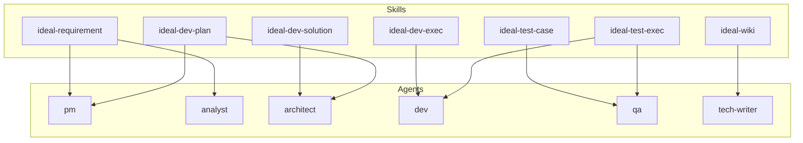

# 角色分工

CC-Workflow 的核心设计理念是让团队成员只需专注于三件事：**提需求、做评审、反馈意见**，其他工作由 Claude Code 自动完成。本文档将帮助你理解 CC-Workflow 中的角色体系和职责划分。

## 角色体系概述

CC-Workflow 包含两类角色：人类角色和 Agent 角色。人类角色由团队成员担任，负责决策和创意工作；Agent 角色由 Claude Code 扮演，负责执行和技术工作。

### 角色分工原则

CC-Workflow 的角色分工遵循以下原则：

**人类负责决策**：需求是否合理、方案是否可行、代码是否合格——这些需要人类判断和决策的工作由团队成员负责。

**Agent 负责执行**：编写文档、生成代码、执行测试、更新维基——这些可以标准化的执行工作由 Claude Code 的 Agent 角色负责。

**评审点嵌入流程**：在关键决策点（P2/P4/P6/P8/P10/P12/P14），流程会暂停等待人类评审，确保质量可控。

### 角色对应关系

| 人类角色 | 对应 Agent | 职责范围 |
|----------|------------|----------|
| 产品经理 / 产品负责人 | pm | 需求梳理、验收标准定义 |
| 业务分析师 | analyst | 市场调研、竞品分析 |
| 架构师 | architect | 技术方案、模块设计 |
| 开发工程师 | dev | 代码开发、Bug 修复 |
| 测试工程师 | qa | 测试用例、测试执行 |
| 技术文档撰写 | tech-writer | 维基文档更新 |

## 人类角色详解

### 团队成员（所有参与者）

CC-Workflow 对团队成员的核心要求是三件事：

**1. 提需求**

用自然语言描述你想做什么，不需要写成正式文档。Claude Code 会通过对话引导你完善需求。

示例输入：
> 我想做一个用户自助重置密码的功能，现在用户都要找客服，太麻烦了。

**2. 做评审**

在流程的 7 个评审点，审查相关文档或代码，做出通过/修改的决定。

评审关注点：
- 需求是否清晰完整？
- 方案是否合理可行？
- 代码质量是否达标？
- 测试是否覆盖充分？

**3. 反馈意见**

如果对 Claude Code 产出的文档或代码不满意，直接反馈修改意见。

示例反馈：
> 这个技术方案太复杂了，能不能简化一下？用户量不大，不需要引入消息队列。

### 产品经理 / 产品负责人

**主要职责**：

1. **P2 需求评审**：审查需求文档，确认需求清晰、完整、可实现
2. **P14 维基评审**：确认用户文档准确反映产品功能

**关注重点**：

- 需求是否解决了实际问题？
- 验收标准是否可量化、可测试？
- 功能是否完整覆盖用户场景？
- 用户文档是否易于理解？

**参与阶段**：P2, P14

### 技术负责人

**主要职责**：

1. **P2 需求评审**：评估需求的技术可行性
2. **P4 方案评审**：审查技术方案，确认架构设计合理
3. **P10 代码评审**：审查代码质量，确保符合规范
4. **P14 维基评审**：确认技术文档准确

**关注重点**：

- 技术方案是否符合项目架构？
- 是否存在技术风险？
- 代码质量是否达标？
- 性能和安全性是否满足要求？

**参与阶段**：P2, P4, P10, P14

### 架构师

**主要职责**：

1. **P4 方案评审**：审查架构设计，评估技术选型

**关注重点**：

- 架构设计是否符合系统整体架构？
- 模块划分是否合理？
- 技术选型是否恰当？
- 是否存在架构层面的风险？

**参与阶段**：P4

### 开发负责人

**主要职责**：

1. **P6 计划评审**：审查编码计划，确认任务划分合理
2. **P10 代码评审**：参与代码评审

**关注重点**：

- 任务粒度是否适中？
- 任务依赖关系是否正确？
- 工作量评估是否合理？
- 代码风格是否符合规范？

**参与阶段**：P6, P10

### 测试负责人

**主要职责**：

1. **P8 用例评审**：审查测试用例，确认覆盖完整
2. **P12 测试评审**：审查测试报告，做出通过/修复决策

**关注重点**：

- 测试用例是否覆盖所有功能？
- 边界条件和异常场景是否有对应测试？
- 测试通过率是否达标？
- 失败用例原因是否分析清楚？

**参与阶段**：P8, P12

## Agent 角色详解

Agent 是 Claude Code 扮演的角色，每个 Agent 有明确的角色身份、思维方式和输出规范。Agent 由 Skill 调用，不独立存在。

### pm（产品经理）

**角色定位**：以用户价值为导向的产品决策者

**核心能力**：
- 苏格拉底式提问：通过问题引导用户完善需求
- MVP 思维：识别核心价值，避免过度设计
- 用户故事格式：将需求转化为可执行的用户故事

**被调用阶段**：P1（需求编写）

**输出规范**：需求文档（包含问题陈述、目标、功能清单、验收标准）

### analyst（业务分析师）

**角色定位**：证据优先的业务分析专家

**核心能力**：
- 结构化思维：将复杂信息组织成清晰的结构
- 数据驱动：用数据支撑分析结论
- 竞品分析：对比竞品功能，提出差异化建议

**被调用阶段**：P1（可选，竞品分析时调用）

**输出规范**：竞品分析报告

### architect（架构师）

**角色定位**：权衡取舍的技术决策者

**核心能力**：
- 简单优先：优先选择最简单的解决方案
- 权衡取舍：在多个方案中选择最合适的
- 上下文工程化：设计故事文件机制，实现上下文隔离

**被调用阶段**：P3（技术方案）、P5（计划生成）

**输出规范**：技术方案文档、编码计划、故事文件

### dev（开发工程师）

**角色定位**：质量优先的代码实现者

**核心能力**：
- TDD 开发：测试驱动开发，先写测试再写代码
- 系统化调试：遇到问题先分析根因，再修复
- 代码质量：遵循代码规范，编写可维护的代码

**被调用阶段**：P9（开发执行）、P11（测试执行辅助）

**输出规范**：代码、Merge Request

### qa（测试工程师）

**角色定位**：质量把关的测试专家

**核心能力**：
- 测试设计：设计覆盖功能、边界、异常的测试用例
- 缺陷分析：分析缺陷原因，提出修复建议
- 质量评估：评估产品质量，给出测试结论

**被调用阶段**：P7（测试用例）、P11（测试执行）

**输出规范**：测试用例文档、测试报告

### tech-writer（技术文档撰写）

**角色定位**：用户体验导向的文档撰写者

**核心能力**：
- 用户视角：从读者角度思考文档内容和形式
- 结构优先：先规划文档结构，再填充内容
- 准确性：文档内容必须与实际一致

**被调用阶段**：P13（维基更新）

**输出规范**：维基文档

## 各阶段角色参与表

下表展示了每个阶段参与的角色：

```mermaid
flowchart LR
    subgraph P1-P4
        P1((P1<br/>需求编写)):::claude
        P2((P2<br/>需求评审)):::human
        P3((P3<br/>技术方案)):::claude
        P4((P4<br/>方案评审)):::human
    end

    subgraph P5-P8
        P5((P5<br/>计划生成)):::claude
        P6((P6<br/>计划评审)):::human
        P7((P7<br/>测试用例)):::claude
        P8((P8<br/>用例评审)):::human
    end

    subgraph P9-P12
        P9((P9<br/>开发执行)):::claude
        P10((P10<br/>代码评审)):::human
        P11((P11<br/>测试执行)):::claude
        P12((P12<br/>测试评审)):::human
    end

    subgraph P13-P15
        P13((P13<br/>维基更新)):::claude
        P14((P14<br/>维基评审)):::human
        P15((P15<br/>成果提交)):::claude
    end

    P1 --> P2 --> P3 --> P4
    P4 --> P5 --> P6 --> P7 --> P8
    P8 --> P9 --> P10 --> P11 --> P12
    P12 --> P13 --> P14 --> P15

    classDef human fill:#fff2cc,stroke:#d6b656,stroke-width:2px
    classDef claude fill:#d5e8d4,stroke:#82b366,stroke-width:2px
```



### 详细参与表

| 阶段 | 执行者 | 人类参与角色 | 调用的 Agent |
|------|--------|--------------|--------------|
| P1 需求编写 | Claude | 团队成员（提供需求） | pm, analyst（可选） |
| P2 需求评审 | 人工 | 产品负责人, 技术负责人 | - |
| P3 技术方案 | Claude | - | architect |
| P4 方案评审 | 人工 | 技术负责人, 架构师 | - |
| P5 计划生成 | Claude | - | architect, pm |
| P6 计划评审 | 人工 | 开发负责人 | - |
| P7 测试用例 | Claude | - | qa |
| P8 用例评审 | 人工 | 测试负责人 | - |
| P9 开发执行 | Claude | - | dev |
| P10 代码评审 | 人工 | 开发团队 | - |
| P11 测试执行 | Claude | - | qa, dev |
| P12 测试评审 | 人工 | 测试负责人 | - |
| P13 维基更新 | Claude | - | tech-writer |
| P14 维基评审 | 人工 | 产品负责人, 技术负责人 | - |
| P15 成果提交 | Claude | - | - |

> **注意**：上线部署由 CI/CD 自动化完成，P15 成果提交后自动触发 CI/CD 流水线。

## Agent 与 Skill 的关系

Agent 定义"如何思考"，Skill 定义"做什么"。Agent 由 Skill 调用，实现流程与能力的解耦。

### 调用关系



### 职责边界

| 维度 | Agent | Skill |
|------|--------|-------|
| 定义内容 | 角色身份、思维方式、输出规范 | 阶段目标、输入输出、检查清单 |
| 文件位置 | `.claude/agents/` | `.claude/skills/` |
| 独立性 | 可被多个 Skill 调用 | 调用 Agent 执行任务 |
| 可复用性 | 高（同一角色可用于多个场景） | 中（同一流程可用于多个项目） |

### 示例：P1 需求编写

**Skill（ideal-requirement）定义**：
- 阶段目标：通过交互式对话收集需求信息，生成标准化需求文档
- 输入：用户的口头或书面需求描述
- 输出：P1-需求文档.md
- 检查清单：需求背景清晰、功能清单完整、验收标准可测试

**Agent（pm）定义**：
- 角色身份：以用户价值为导向的产品经理
- 思维方式：苏格拉底式提问、MVP 思维
- 输出规范：用户故事格式、需求文档结构

**执行过程**：
1. Skill 读取项目背景（CLAUDE.md）
2. Skill 调用 pm Agent 进行需求对话
3. pm Agent 使用苏格拉底式提问收集信息
4. pm Agent 按输出规范生成需求文档
5. Skill 验证检查清单，确认文档质量

## 角色配置

### 查看可用 Agent

```bash
ls .claude/agents/
```

输出：
```
analyst.md
architect.md
dev.md
pm.md
qa.md
README.md
tech-writer.md
```

### 查看 Agent 定义

```bash
cat .claude/agents/pm.md
```

### 查看可用 Skill

```bash
ls .claude/skills/
```

### 查看 Skill 调用的 Agent

每个 Skill 的 `SKILL.md` 文件开头会标注调用的 Agent：

```yaml
---
name: ideal-requirement
agents: [pm, analyst]
---
```
