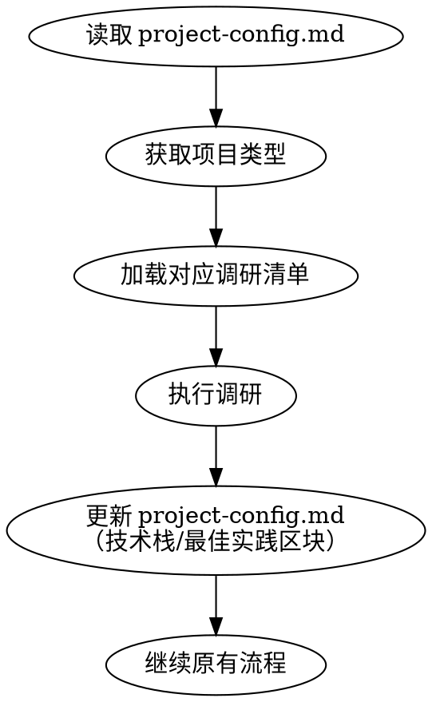
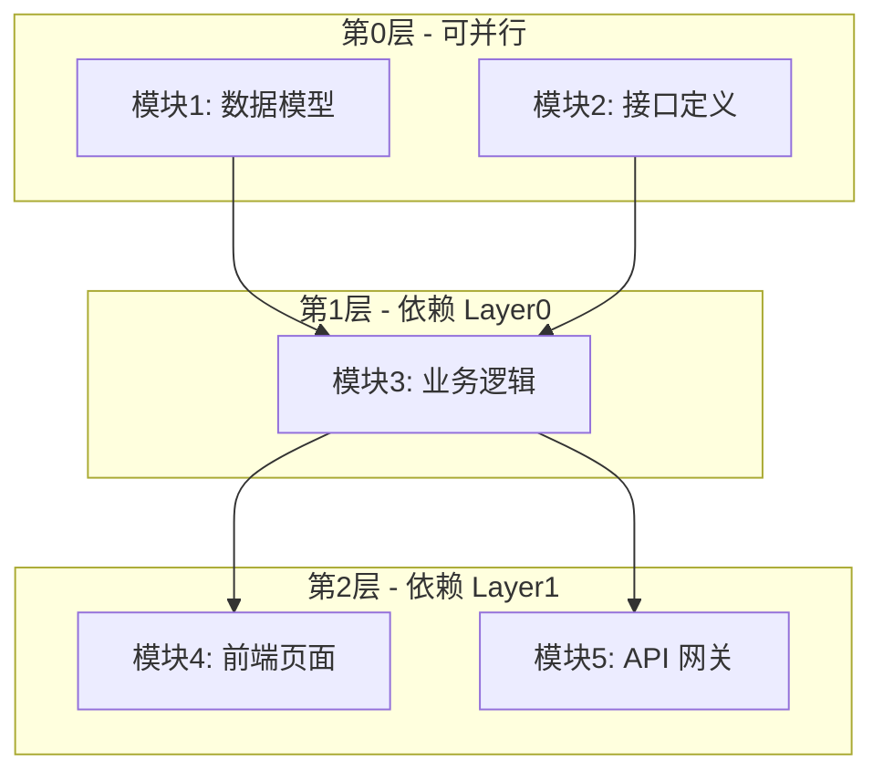
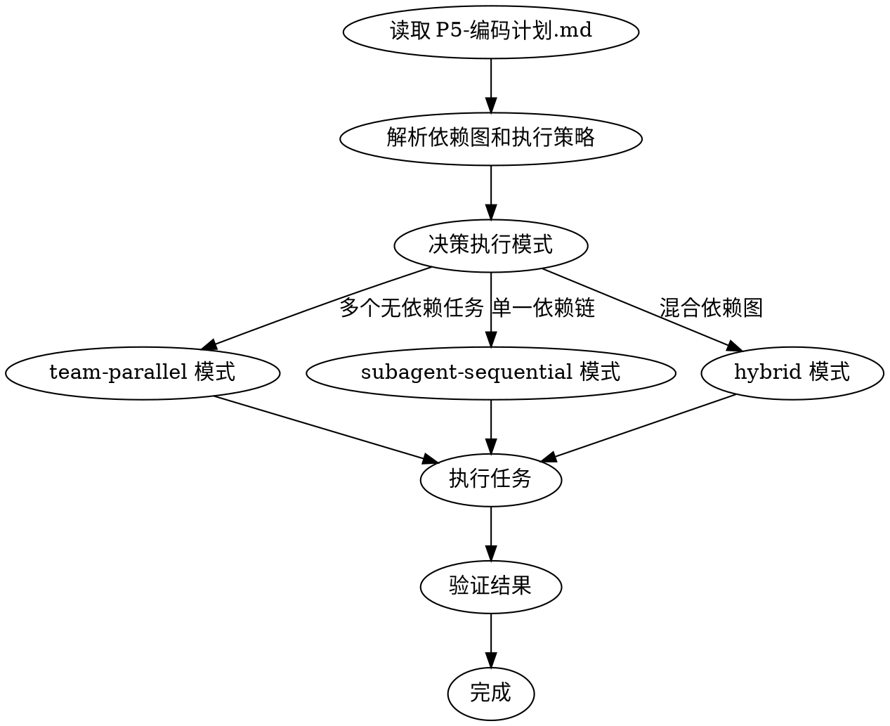

# Skills 增强设计方案

> **设计日期**: 2026-02-19
> **设计目标**: 增强 ideal-dev-exec、ideal-dev-solution、ideal-dev-plan skills，补充缺失模板

---

## 一、背景与问题

### 1.1 当前问题

| 问题 | 影响范围 | 严重程度 |
|------|----------|----------|
| ideal-dev-exec 缺少并行执行能力 | 开发效率低，无依赖任务无法并行 | 高 |
| Git 分支策略硬编码为 main | 不适配不同分支规范的项目 | 中 |
| ideal-dev-solution 缺少调研前置 | 技术方案可能与现有技术栈冲突 | 中 |
| 多个 skill 缺少模板文件 | 新用户难以快速上手 | 低 |

### 1.2 设计目标

1. **执行效率** - 支持任务并行执行，缩短开发周期
2. **项目适配** - 通过配置文件支持不同项目类型和规范
3. **方案质量** - 技术方案与现有技术栈保持一致
4. **模板完善** - 所有 skill 都有配套模板和示例

---

## 二、整体架构

### 2.1 改动范围

```
.claude/
├── project-config.md          # [新增] 项目配置文件
└── skills/
    ├── ideal-dev-solution/    # [修改] 增加调研前置步骤
    │   └── references/
    │       └── research-checklists/  # [新增] 按项目类型的调研清单
    ├── ideal-dev-plan/        # [修改] 增加任务依赖图
    │   └── references/
    │       └── templates/
    │           └── plan-template.md  # [新增]
    ├── ideal-dev-exec/        # [修改] 增加执行策略决策
    │   └── references/
    │       └── execution-strategy.md  # [修改]
    ├── ideal-test-case/       # [修改] 补充模板
    │   └── references/
    │       └── templates/
    │           └── test-case-template.md  # [新增]
    ├── ideal-test-exec/       # [修改] 补充模板
    │   └── references/
    │       └── templates/
    │           └── test-report-template.md  # [新增]
    └── ideal-wiki/            # [修改] 补充模板
        └── references/
            └── templates/
                ├── user-doc-template.md   # [新增]
                ├── dev-doc-template.md    # [新增]
                └── api-doc-template.md    # [新增]
```

### 2.2 数据流

```
┌─────────────────────────────────────────────────────────────────────────────┐
│                              项目配置层                                       │
│  ┌─────────────────────────┐                                                │
│  │  project-config.md      │                                                │
│  │  - 项目类型              │                                                │
│  │  - Git 配置              │                                                │
│  │  - 执行命令              │                                                │
│  │  - 技术栈（自动填充）     │                                                │
│  └─────────────────────────┘                                                │
└─────────────────────────────────────────────────────────────────────────────┘
                                    │
                                    ▼
┌─────────────────────────────────────────────────────────────────────────────┐
│                              P3 技术方案层                                    │
│  ┌─────────────────────────┐                                                │
│  │  ideal-dev-solution     │                                                │
│  │  Step 0: 读取项目配置    │                                                │
│  │  Step 1: 按类型调研      │                                                │
│  │  Step 2-N: 生成方案      │                                                │
│  │  Output: P3-技术方案.md  │                                                │
│  └─────────────────────────┘                                                │
└─────────────────────────────────────────────────────────────────────────────┘
                                    │
                                    ▼
┌─────────────────────────────────────────────────────────────────────────────┐
│                              P5 编码计划层                                    │
│  ┌─────────────────────────┐                                                │
│  │  ideal-dev-plan         │                                                │
│  │  Input: P3-技术方案.md   │                                                │
│  │  Process: 分解任务       │                                                │
│  │  Output:                │                                                │
│  │  - 任务列表              │                                                │
│  │  - 依赖图 (Mermaid)      │                                                │
│  │  - 执行策略标注          │                                                │
│  └─────────────────────────┘                                                │
└─────────────────────────────────────────────────────────────────────────────┘
                                    │
                                    ▼
┌─────────────────────────────────────────────────────────────────────────────┐
│                              P9 开发执行层                                    │
│  ┌─────────────────────────┐                                                │
│  │  ideal-dev-exec         │                                                │
│  │  Input: P5-编码计划.md   │                                                │
│  │  Process:               │                                                │
│  │  1. 解析依赖图           │                                                │
│  │  2. 决策执行策略         │                                                │
│  │  3. 按策略执行任务       │                                                │
│  │  Output: 代码 + MR       │                                                │
│  └─────────────────────────┘                                                │
└─────────────────────────────────────────────────────────────────────────────┘
```

---

## 三、项目配置文件设计

### 3.1 文件位置

```
.claude/project-config.md
```

### 3.2 文件结构

```markdown
# 项目配置

## 项目元信息

| 配置项 | 值 |
|--------|-----|
| 项目名称 | {name} |
| 项目类型 | development / documentation / specification / research |
| 创建日期 | {date} |
| 最后更新 | {date} |

---

## Git 配置

### 分支策略

| 配置项 | 值 |
|--------|-----|
| 默认分支 | main / master / develop / ... |
| 功能分支前缀 | feature/ |
| 修复分支前缀 | fix/ |
| 重构分支前缀 | refactor/ |

### 提交规范

| 配置项 | 值 |
|--------|-----|
| 提交消息格式 | conventional / custom |
| 需要 GPG 签名 | true / false |

---

## 执行配置

### 命令映射

| 命令类型 | 命令 |
|----------|------|
| 安装依赖 | {install_command} |
| 构建 | {build_command} |
| 测试 | {test_command} |
| Lint | {lint_command} |
| 格式化 | {format_command} |

### 测试配置

| 配置项 | 值 |
|--------|-----|
| 测试框架 | {framework} |
| 覆盖率要求 | {percentage}% |
| 测试目录 | {test_dir} |

---

## 技术栈

> ⚠️ 以下内容由 ideal-dev-solution 自动检测填充

### 语言与运行时

| 技术 | 版本 | 用途 |
|------|------|------|
| {tech} | {version} | {purpose} |

### 框架与库

| 技术 | 版本 | 用途 |
|------|------|------|
| {tech} | {version} | {purpose} |

### 开发工具

| 工具 | 版本 | 用途 |
|------|------|------|
| {tool} | {version} | {purpose} |

---

## 最佳实践

> ⚠️ 以下内容由 ideal-dev-solution 自动检测填充

### 代码规范

- **风格指南**: {style_guide}
- **Linter 配置**: {lint_config}
- **格式化配置**: {format_config}

### 架构模式

- **分层结构**: {layer_pattern}
- **模块划分**: {module_structure}
- **设计模式**: {design_patterns}

### 测试实践

- **测试策略**: {test_strategy}
- **Mock 方式**: {mock_approach}
- **测试数据**: {test_data}

---

## 部署配置

### 环境

| 环境名称 | 分支 | 描述 |
|----------|------|------|
| development | develop | 开发环境 |
| staging | staging | 预发布环境 |
| production | main | 生产环境 |

### CI/CD

| 配置项 | 值 |
|--------|-----|
| 平台 | {platform} |
| 配置文件 | {config_file} |
```

### 3.3 项目类型定义

| 类型 | 标识符 | 描述 | 典型场景 |
|------|--------|------|----------|
| 开发项目 | `development` | 包含可执行代码、测试、部署 | Web 应用、API 服务、CLI 工具 |
| 文档项目 | `documentation` | 以文档内容为核心产出 | 技术文档站、知识库、Obsidian vault |
| 规范项目 | `specification` | 编制标准、规范、最佳实践 | 编码规范、流程规范、模板库 |
| 研究项目 | `research` | 调研、分析、报告类产出 | 竞品分析、技术选型、可行性研究 |

---

## 四、ideal-dev-solution 改进设计

### 4.1 新增 Step 0: 项目调研

**位置**: 在现有 Step 1 之前插入

**流程**:



### 4.2 调研清单设计

**目录结构**:
```
.claude/skills/ideal-dev-solution/references/research-checklists/
├── development.md
├── documentation.md
├── specification.md
└── research.md
```

**development.md 示例**:

```markdown
# 开发项目调研清单

## 1. 技术栈识别

### 1.1 语言与运行时
- [ ] 识别主要编程语言
- [ ] 确认语言版本要求
- [ ] 识别运行时环境

### 1.2 框架与库
- [ ] 识别核心框架
- [ ] 列出主要依赖库
- [ ] 确认依赖版本约束

## 2. 代码规范

### 2.1 风格指南
- [ ] 检查 .editorconfig
- [ ] 检查 .prettierrc
- [ ] 检查 .eslintrc / .pylintrc 等

### 2.2 静态分析
- [ ] 识别 Linter 配置
- [ ] 识别类型检查配置
- [ ] 识别代码复杂度工具

## 3. 架构模式

### 3.1 项目结构
- [ ] 分析目录结构
- [ ] 识别分层模式
- [ ] 识别模块边界

### 3.2 设计模式
- [ ] 识别常用设计模式
- [ ] 识别依赖注入方式
- [ ] 识别状态管理模式

## 4. 测试实践

### 4.1 测试框架
- [ ] 识别测试框架
- [ ] 确认测试目录结构
- [ ] 识别测试命名约定

### 4.2 测试配置
- [ ] 检查覆盖率要求
- [ ] 检查 Mock 策略
- [ ] 检查测试数据管理

## 5. 部署配置

### 5.1 CI/CD
- [ ] 检查 CI/CD 配置
- [ ] 识别部署流程
- [ ] 识别环境变量管理

### 5.2 容器化
- [ ] 检查 Dockerfile
- [ ] 检查 docker-compose
- [ ] 检查 Kubernetes 配置（如有）
```

**documentation.md 示例**:

```markdown
# 文档项目调研清单

## 1. 文档结构

### 1.1 目录组织
- [ ] 识别文档根目录
- [ ] 分析目录层次结构
- [ ] 识别索引文件命名

### 1.2 文件格式
- [ ] 确认文档格式（Markdown/AsciiDoc 等）
- [ ] 识别文件命名约定
- [ ] 检查资源文件组织

## 2. 写作规范

### 2.1 风格指南
- [ ] 检查写作风格文档
- [ ] 识别术语表
- [ ] 确认语言风格（正式/非正式）

### 2.2 格式规范
- [ ] 检查标题层级规范
- [ ] 检查代码块格式
- [ ] 检查链接格式

## 3. 工具链

### 3.1 构建工具
- [ ] 识别文档构建工具
- [ ] 检查构建配置
- [ ] 确认输出格式

### 3.2 发布流程
- [ ] 识别发布平台
- [ ] 检查发布配置
- [ ] 确认版本管理方式

## 4. 质量保证

### 4.1 校验工具
- [ ] 检查拼写检查配置
- [ ] 检查链接检查工具
- [ ] 检查格式校验工具

### 4.2 评审流程
- [ ] 识别文档评审流程
- [ ] 检查评审标准
- [ ] 确认评审工具
```

### 4.3 SKILL.md 修改

在 `ideal-dev-solution/SKILL.md` 中新增：

```markdown
## Step 0: 项目调研（新增）

### 0.1 读取项目配置

1. 读取 `.claude/project-config.md`
2. 获取项目类型（type 字段）
3. 如文件不存在，提示用户创建

### 0.2 加载调研清单

根据项目类型加载对应清单：
- development → `references/research-checklists/development.md`
- documentation → `references/research-checklists/documentation.md`
- specification → `references/research-checklists/specification.md`
- research → `references/research-checklists/research.md`

### 0.3 执行调研

1. 按清单逐项检查项目
2. 收集技术栈信息
3. 收集最佳实践信息

### 0.4 更新配置

将调研结果写入 `project-config.md` 的技术栈和最佳实践区块。
```

---

## 五、ideal-dev-plan 改进设计

### 5.1 新增任务依赖图

**在 P5-编码计划.md 中新增章节**:

````markdown
## 任务依赖图



## 执行策略

| 模块 | 依赖 | 执行策略 | 预估时间 |
|------|------|----------|----------|
| M1: 数据模型 | 无 | parallel | 30min |
| M2: 接口定义 | 无 | parallel | 20min |
| M3: 业务逻辑 | M1, M2 | sequential | 45min |
| M4: 前端页面 | M3 | parallel | 40min |
| M5: API 网关 | M3 | parallel | 35min |

**总预估时间**: 串行 170min → 并行优化后 95min

## 并行执行计划

| 批次 | 模块 | 说明 |
|------|------|------|
| Batch 1 | M1, M2 | 同时启动，无依赖 |
| Batch 2 | M3 | 等待 Batch 1 完成 |
| Batch 3 | M4, M5 | 同时启动，都只依赖 M3 |
````

### 5.2 SKILL.md 修改

在 `ideal-dev-plan/SKILL.md` 中新增：

```markdown
## Dependency Analysis（新增章节）

### 依赖识别

1. 分析模块间调用关系
2. 识别共享资源（数据库、API、配置）
3. 确定执行顺序约束

### 依赖图生成

使用 Mermaid flowchart 格式生成依赖图：
- 每个模块为节点
- 箭头表示依赖方向（A --> B 表示 B 依赖 A）
- 使用 subgraph 分组可并行模块

### 执行策略标注

| 策略 | 条件 | 说明 |
|------|------|------|
| parallel | 无依赖 | 可与其他 parallel 任务同时执行 |
| sequential | 有依赖 | 必须等待依赖完成后执行 |

### 时间优化

计算：
1. 串行总时间 = 所有模块时间之和
2. 并行优化时间 = 按拓扑层级累加最大时间
3. 节省时间 = 串行时间 - 并行时间
```

### 5.3 模板设计

**references/templates/plan-template.md**:

````markdown
# P5-编码计划

## 概述

| 项目 | 内容 |
|------|------|
| 需求名称 | {requirement_name} |
| 技术方案 | P3-技术方案.md |
| 生成日期 | {date} |

---

## 模块总览

| 模块编号 | 模块名称 | 任务数 | 依赖 | 预估时间 |
|----------|----------|--------|------|----------|
| M1 | {name} | {count} | {deps} | {time} |
| M2 | {name} | {count} | {deps} | {time} |

**总计**: {total_tasks} 个任务，预估 {total_time}

---

## 任务依赖图

```mermaid
flowchart TB
    {mermaid_content}
```

---

## 执行策略

| 模块 | 依赖 | 执行策略 | 预估时间 |
|------|------|----------|----------|
| {module_table} |

**总预估时间**: 串行 {serial_time} → 并行优化后 {parallel_time}

---

## 并行执行计划

| 批次 | 模块 | 说明 |
|------|------|------|
| {batch_table} |

---

## 模块详情

### M1: {模块名称}

**目标**: {一句话描述}

**依赖**: {无 / M{x}, M{y}}

**任务列表**:

#### 任务 M1-T1: {任务名称}

**目标**: {一句话描述}

**步骤**:
1. [ ] 编写失败测试
2. [ ] 运行确认失败
3. [ ] 实现最小代码
4. [ ] 运行确认通过
5. [ ] 提交代码

**验证标准**: {如何验证完成}

**文件范围**:
- 新增: {file_list}
- 修改: {file_list}

---

#### 任务 M1-T2: {任务名称}

...

---

### M2: {模块名称}

...

---

## 验证计划

### 完整流程验证

1. [ ] 运行所有单元测试
2. [ ] 运行集成测试
3. [ ] 执行手动验收测试
4. [ ] 检查代码覆盖率

### 验收标准

| 编号 | 标准 | 验证方式 |
|------|------|----------|
| AC-1 | {standard} | {method} |

---

## 风险与应对

| 风险 | 影响 | 应对措施 |
|------|------|----------|
| {risk} | {impact} | {mitigation} |
````

---

## 六、ideal-dev-exec 改进设计

### 6.1 执行策略决策

**决策流程**:



### 6.2 执行模式定义

| 模式 | 触发条件 | 执行方式 | 工具 |
|------|----------|----------|------|
| team-parallel | Batch 中有 2+ 个 parallel 任务 | 多个 Task agent 并行 | `Task` tool (多调用) |
| subagent-sequential | 只有 sequential 任务 | 单个 Task agent 顺序执行 | `Task` tool (单调用链) |
| hybrid | 混合依赖图 | 按拓扑层级，每层并行，层间串行 | 组合使用 |

### 6.3 并行执行实现

**team-parallel 模式**:

在单个响应中发起多个 Task tool 调用：

```
并行启动 M1 和 M2 的实现...
[Task tool call for M1]
[Task tool call for M2]
```

**hybrid 模式**:

```
Batch 1: 并行执行 M1, M2...
[Task tool call for M1]
[Task tool call for M2]

等待 Batch 1 完成...

Batch 2: 执行 M3（依赖 M1, M2）...
[Task tool call for M3]

等待 Batch 2 完成...

Batch 3: 并行执行 M4, M5...
[Task tool call for M4]
[Task tool call for M5]
```

### 6.4 读取项目配置

**新增 Step**:

```markdown
### Step 0: 读取项目配置（新增）

1. 读取 `.claude/project-config.md`
2. 获取 Git 配置：
   - default_branch
   - branch_prefix
3. 获取执行配置：
   - test_command
   - build_command
4. 如配置项缺失，使用默认值

**默认值**:
- default_branch: main
- branch_prefix.feature: feature/
- test_command: npm test
- build_command: npm run build
```

### 6.5 SKILL.md 修改

**修改 Git Branch Strategy 章节**:

```markdown
## Git Branch Strategy

从 `project-config.md` 读取分支配置：

```
{default_branch}
  └── {branch_prefix.feature}{需求名称}
        └── [开发提交]
```

**分支命名（可配置）**:
- 功能开发：`{branch_prefix.feature}{需求名称}`
- Bug 修复：`{branch_prefix.fix}{需求名称}`
- 重构：`{branch_prefix.refactor}{需求名称}`

**默认值**:
- branch_prefix.feature: feature/
- branch_prefix.fix: fix/
- branch_prefix.refactor: refactor/
```

**新增 Execution Strategy 章节**:

```markdown
## Execution Strategy

### 策略决策

从 P5-编码计划.md 读取执行策略：

1. 解析任务依赖图
2. 识别并行/串行标注
3. 生成执行计划

### 执行模式

| 模式 | 触发条件 | 实现 |
|------|----------|------|
| team-parallel | Batch 内多个 parallel 任务 | 多 Task 并行调用 |
| subagent-sequential | 单一 sequential 链 | 单 Task 顺序调用 |
| hybrid | 混合依赖 | 按拓扑层级分批执行 |

### 并行执行规则

1. 同一层级的 parallel 任务可同时启动
2. 等待所有同层任务完成后再启动下一层
3. 每个任务完成后验证测试通过
4. 任务失败时暂停，等待人工介入

### 进度跟踪

使用 TodoWrite 跟踪：
- 每个 Batch 作为一个阶段
- 每个任务作为一个 todo item
- 完成时立即标记
```

### 6.6 更新 references/execution-strategy.md

```markdown
# 执行策略详情

## 1. 配置读取

### 1.1 项目配置

启动时读取 `.claude/project-config.md`：

```yaml
# 示例配置
git:
  default_branch: develop
  branch_prefix:
    feature: feat/
    fix: bugfix/

execution:
  build_command: pnpm build
  test_command: pnpm test
```

### 1.2 默认值

| 配置项 | 默认值 |
|--------|--------|
| default_branch | main |
| branch_prefix.feature | feature/ |
| branch_prefix.fix | fix/ |
| branch_prefix.refactor | refactor/ |
| build_command | npm run build |
| test_command | npm test |

## 2. 依赖图解析

### 2.1 Mermaid 解析

从 P5 的 Mermaid flowchart 中提取：

1. 节点列表（模块）
2. 边列表（依赖关系）
3. subgraph 分组（并行组）

### 2.2 拓扑排序

使用 Kahn 算法进行拓扑排序：

1. 计算每个节点的入度
2. 入度为 0 的节点加入当前层
3. 移除当前层节点的出边
4. 重复直到所有节点处理完毕

### 2.3 批次生成

```python
# 伪代码
def generate_batches(nodes, edges):
    batches = []
    remaining = set(nodes)
    completed = set()

    while remaining:
        # 找到所有依赖已满足的节点
        ready = [n for n in remaining
                 if all(dep in completed for dep in n.dependencies)]

        if not ready:
            raise CycleDetectedError()

        batches.append(ready)
        completed.update(ready)
        remaining -= ready

    return batches
```

## 3. 并行执行

### 3.1 Task Tool 调用

**单批次多任务**:

```
我将并行执行以下任务：
- M1: 数据模型
- M2: 接口定义

[Task tool for M1]
[Task tool for M2]
```

### 3.2 结果收集

每个 Task 完成后：
1. 检查返回结果
2. 验证测试通过
3. 更新 TodoWrite
4. 如有失败，暂停并报告

### 3.3 错误处理

| 错误类型 | 处理方式 |
|----------|----------|
| 单任务失败 | 暂停批次，报告错误，等待介入 |
| 依赖失败 | 跳过依赖此任务的所有后续任务 |
| 超时 | 标记超时，报告进度，等待介入 |

## 4. 进度报告

### 4.1 批次报告

每个批次完成后输出：

```markdown
## Batch {n} 完成

| 任务 | 状态 | 耗时 | 备注 |
|------|------|------|------|
| M1 | ✅ 完成 | 28min | - |
| M2 | ✅ 完成 | 22min | - |

**批次耗时**: 28min（并行执行）
**累计进度**: 2/5 模块完成
```

### 4.2 最终报告

```markdown
## 执行完成

**总模块数**: 5
**总任务数**: 18
**总耗时**: 95min
**预估耗时**: 95min
**效率**: 100%

**分支**: feat/user-auth
**MR 链接**: {mr_url}
```
```

---

## 七、模板补充设计

### 7.1 ideal-test-case 模板

**references/templates/test-case-template.md**:

```markdown
# P7-测试用例

## 概述

| 项目 | 内容 |
|------|------|
| 需求名称 | {requirement_name} |
| 编码计划 | P5-编码计划.md |
| 生成日期 | {date} |

---

## 用例统计

| 类型 | 数量 | 占比 |
|------|------|------|
| 功能测试 | {func_count} | {func_pct}% |
| 边界测试 | {boundary_count} | {boundary_pct}% |
| 异常测试 | {exception_count} | {exception_pct}% |
| **总计** | {total} | 100% |

---

## 功能测试用例

### TC-F-001: {用例名称}

| 项目 | 内容 |
|------|------|
| **用例编号** | TC-F-001 |
| **用例名称** | {name} |
| **优先级** | P0 / P1 / P2 |
| **关联模块** | M{x} |
| **前置条件** | {preconditions} |

**测试步骤**:
1. {step_1}
2. {step_2}
3. {step_3}

**预期结果**:
- {expected_1}
- {expected_2}

**测试数据**:
```
{test_data}
```

---

### TC-F-002: {用例名称}

...

---

## 边界测试用例

### TC-B-001: {用例名称}

| 项目 | 内容 |
|------|------|
| **用例编号** | TC-B-001 |
| **用例名称** | {name} |
| **优先级** | P0 / P1 / P2 |
| **边界类型** | 输入边界 / 状态边界 / 流程边界 |
| **关联模块** | M{x} |
| **前置条件** | {preconditions} |

**测试步骤**:
1. {step_1}
2. {step_2}

**预期结果**:
- {expected_1}

**边界值**:
| 参数 | 最小值 | 最大值 | 测试值 |
|------|--------|--------|--------|
| {param} | {min} | {max} | {test} |

---

## 异常测试用例

### TC-E-001: {用例名称}

| 项目 | 内容 |
|------|------|
| **用例编号** | TC-E-001 |
| **用例名称** | {name} |
| **优先级** | P0 / P1 / P2 |
| **异常类型** | 输入错误 / 状态错误 / 外部错误 |
| **关联模块** | M{x} |
| **前置条件** | {preconditions} |

**测试步骤**:
1. {step_1}
2. {step_2}

**预期结果**:
- 系统返回错误码: {error_code}
- 错误消息: {error_message}
- 系统状态: {expected_state}

---

## 覆盖率报告

### 功能覆盖

| 模块 | 功能点 | 用例数 | 覆盖率 |
|------|--------|--------|--------|
| M1 | {features} | {count} | {rate}% |

### 优先级分布

| 优先级 | 数量 | 说明 |
|--------|------|------|
| P0 | {count} | 核心功能，必须通过 |
| P1 | {count} | 重要功能，应该通过 |
| P2 | {count} | 次要功能，可延后 |
```

### 7.2 ideal-test-exec 模板

**references/templates/test-report-template.md**:

```markdown
# P11-测试报告

## 概述

| 项目 | 内容 |
|------|------|
| 需求名称 | {requirement_name} |
| 测试用例 | P7-测试用例.md |
| 测试日期 | {date} |
| 测试人员 | Claude Code |
| 测试环境 | {environment} |

---

## 测试概况

| 项目 | 数量 |
|------|------|
| 总用例数 | {total} |
| 通过数 | {pass} |
| 失败数 | {fail} |
| 跳过数 | {skip} |
| 阻塞数 | {block} |
| **通过率** | **{rate}%** |

### 结果分布

```
通过: ████████████████████ {pass}
失败: ██ {fail}
跳过: █ {skip}
阻塞: ░ {block}
```

---

## 测试结果详情

### 功能测试

| 用例编号 | 用例名称 | 状态 | 耗时 | 备注 |
|----------|----------|------|------|------|
| TC-F-001 | {name} | ✅ PASS | {time}s | - |
| TC-F-002 | {name} | ❌ FAIL | {time}s | {note} |
| TC-F-003 | {name} | ⏭️ SKIP | - | {reason} |
| TC-F-004 | {name} | 🚫 BLOCK | - | {blocker} |

### 边界测试

| 用例编号 | 用例名称 | 状态 | 耗时 | 备注 |
|----------|----------|------|------|------|
| ... | ... | ... | ... | ... |

### 异常测试

| 用例编号 | 用例名称 | 状态 | 耗时 | 备注 |
|----------|----------|------|------|------|
| ... | ... | ... | ... | ... |

---

## 缺陷记录

### 缺陷列表

| 缺陷编号 | 用例编号 | 严重程度 | 描述 | 状态 | 负责人 |
|----------|----------|----------|------|------|--------|
| DEF-001 | TC-F-002 | 严重 | {description} | 待修复 | - |
| DEF-002 | TC-B-001 | 一般 | {description} | 待修复 | - |

### 缺陷详情

#### DEF-001: {缺陷标题}

| 项目 | 内容 |
|------|------|
| **严重程度** | 致命 / 严重 / 一般 / 轻微 |
| **发现用例** | TC-F-002 |
| **发现时间** | {datetime} |
| **当前状态** | 待修复 / 修复中 / 已修复 / 验证通过 |

**复现步骤**:
1. {step_1}
2. {step_2}
3. {step_3}

**预期结果**:
{expected}

**实际结果**:
{actual}

**错误日志**:
```
{error_log}
```

**截图/录屏**: {attachment}

---

## 测试结论

### 总体评价

| 维度 | 评价 | 说明 |
|------|------|------|
| 功能完整性 | ✅ / ⚠️ / ❌ | {comment} |
| 质量水平 | ✅ / ⚠️ / ❌ | {comment} |
| 上线建议 | ✅ 可上线 / ⚠️ 有条件上线 / ❌ 不可上线 | {comment} |

### 上线条件

**必须满足**:
- [ ] 所有 P0 用例通过
- [ ] 无致命/严重级别缺陷

**建议满足**:
- [ ] 通过率 ≥ 90%
- [ ] 所有 P1 用例通过
- [ ] 一般级别缺陷有应对方案

### 后续行动

| 行动项 | 负责人 | 截止日期 | 状态 |
|--------|--------|----------|------|
| {action} | {owner} | {date} | {status} |

---

## 附件

- 完整测试日志: {log_file}
- 测试数据: {data_file}
- 截图目录: {screenshot_dir}
```

### 7.3 ideal-wiki 模板

**references/templates/user-doc-template.md**:

```markdown
# {功能名称} - 用户指南

## 功能简介

{功能概述，2-3 句话描述功能是什么，解决什么问题}

### 适用场景

- 场景 1: {description}
- 场景 2: {description}

### 功能亮点

- ✨ {highlight_1}
- ✨ {highlight_2}
- ✨ {highlight_3}

---

## 使用指南

### 快速开始

**前置条件**:
- {prerequisite_1}
- {prerequisite_2}

**步骤**:

1. **{step_1_title}**
   ```
   {step_1_content}
   ```

2. **{step_2_title}**
   ```
   {step_2_content}
   ```

3. **完成** - {completion_message}

### 详细操作

#### {operation_1_title}

{operation_1_description}

| 参数 | 说明 | 默认值 |
|------|------|--------|
| {param} | {desc} | {default} |

#### {operation_2_title}

{operation_2_description}

---

## 常见问题

### Q1: {question_1}

**A**: {answer_1}

### Q2: {question_2}

**A**: {answer_2}

### Q3: 遇到问题怎么办？

**A**:
1. 检查前置条件是否满足
2. 查看错误提示信息
3. 联系技术支持: {support_contact}

---

## 注意事项

> ⚠️ **重要**: {important_note}

> 💡 **提示**: {tip}

---

## 更新日志

| 版本 | 日期 | 更新内容 |
|------|------|----------|
| v1.0.0 | {date} | 初始版本 |
```

**references/templates/dev-doc-template.md**:

```markdown
# {功能名称} - 开发文档

## 架构说明

### 系统架构

```
┌─────────────────────────────────────────┐
│              {Layer_Name}                │
├─────────────────────────────────────────┤
│              {Layer_Name}                │
├─────────────────────────────────────────┤
│              {Layer_Name}                │
└─────────────────────────────────────────┘
```

### 模块划分

| 模块 | 职责 | 技术栈 |
|------|------|--------|
| {module} | {responsibility} | {tech} |

---

## 环境配置

### 开发环境

**系统要求**:
- 操作系统: {os}
- 运行时: {runtime} {version}
- 内存: {memory}+

**依赖安装**:
```bash
{install_command}
```

### 配置文件

| 文件 | 用途 |
|------|------|
| {file} | {purpose} |

### 环境变量

| 变量名 | 说明 | 必填 | 默认值 |
|--------|------|------|--------|
| {var} | {desc} | 是/否 | {default} |

---

## 代码结构

```
{project_name}/
├── src/
│   ├── {module_1}/
│   │   ├── index.ts
│   │   └── ...
│   ├── {module_2}/
│   └── index.ts
├── tests/
├── docs/
└── package.json
```

### 目录说明

| 目录/文件 | 说明 |
|-----------|------|
| `src/{module}` | {description} |

---

## 核心接口

### {Interface_Name}

```typescript
interface {Interface_Name} {
  {property}: {type};
  {method}({params}): {return_type};
}
```

**使用示例**:
```typescript
{code_example}
```

---

## 部署指南

### 构建命令

```bash
{build_command}
```

### 部署步骤

1. {step_1}
2. {step_2}
3. {step_3}

### 健康检查

| 检查项 | 端点 | 预期响应 |
|--------|------|----------|
| {check} | `{endpoint}` | {expected} |

---

## 维护说明

### 日志

| 日志级别 | 文件位置 |
|----------|----------|
| {level} | {path} |

### 监控指标

| 指标 | 说明 | 告警阈值 |
|------|------|----------|
| {metric} | {desc} | {threshold} |

### 常见问题排查

| 现象 | 可能原因 | 解决方案 |
|------|----------|----------|
| {symptom} | {cause} | {solution} |
```

**references/templates/api-doc-template.md**:

```markdown
# {功能名称} - 接口文档

## 接口概览

| 接口 | 方法 | 路径 | 描述 |
|------|------|------|------|
| {name} | {method} | `{path}` | {desc} |

---

## 接口详情

### {接口名称}

**基本信息**:
| 项目 | 内容 |
|------|------|
| 路径 | `{method} {path}` |
| 描述 | {description} |
| 认证 | {auth_type} |

**请求参数**:

| 参数名 | 位置 | 类型 | 必填 | 描述 |
|--------|------|------|------|------|
| {param} | path/query/body | {type} | 是/否 | {desc} |

**请求示例**:
```json
{
  "{field}": "{value}"
}
```

**响应格式**:

| 字段名 | 类型 | 描述 |
|--------|------|------|
| {field} | {type} | {desc} |

**成功响应示例**:
```json
{
  "code": 200,
  "data": {
    "{field}": "{value}"
  },
  "message": "success"
}
```

**错误响应示例**:
```json
{
  "code": 400,
  "data": null,
  "message": "{error_message}"
}
```

**错误码**:

| 错误码 | 说明 | 处理建议 |
|--------|------|----------|
| {code} | {desc} | {suggestion} |

---

## 数据模型

### {Model_Name}

| 字段名 | 类型 | 必填 | 描述 |
|--------|------|------|------|
| {field} | {type} | 是/否 | {desc} |

---

## 通用说明

### 认证方式

{auth_description}

### 请求头

| Header | 值 | 说明 |
|--------|------|------|
| Content-Type | application/json | 请求体格式 |
| Authorization | Bearer {token} | 认证令牌 |

### 分页参数

| 参数 | 类型 | 默认值 | 说明 |
|------|------|--------|------|
| page | int | 1 | 页码 |
| pageSize | int | 20 | 每页数量 |

### 响应结构

```json
{
  "code": 200,
  "data": { },
  "message": "success"
}
```

### 错误处理

| HTTP 状态码 | 说明 |
|-------------|------|
| 200 | 成功 |
| 400 | 请求参数错误 |
| 401 | 未认证 |
| 403 | 无权限 |
| 404 | 资源不存在 |
| 500 | 服务器错误 |
```

---

## 八、实施计划

### 8.1 实施顺序

| 阶段 | 任务 | 产出 |
|------|------|------|
| 1 | 创建项目配置文件结构和模板 | `.claude/project-config.md` |
| 2 | 实现 ideal-dev-solution 调研前置 | 调研清单 + SKILL.md 更新 |
| 3 | 实现 ideal-dev-plan 依赖图 | 模板 + SKILL.md 更新 |
| 4 | 实现 ideal-dev-exec 执行策略 | SKILL.md + execution-strategy.md 更新 |
| 5 | 补充 ideal-dev-plan 模板 | plan-template.md |
| 6 | 补充 ideal-test-case 模板 | test-case-template.md |
| 7 | 补充 ideal-test-exec 模板 | test-report-template.md |
| 8 | 补充 ideal-wiki 模板 | 3 个模板文件 |

### 8.2 依赖关系

```
阶段1 → 阶段2（调研需要读取配置）
      → 阶段4（执行需要读取配置）

阶段2 → 阶段3（方案影响计划）
阶段3 → 阶段4（计划影响执行）
阶段3 → 阶段5（共用模板）

阶段5-8 可并行
```

### 8.3 验证方式

每个阶段完成后：
1. 更新对应 SKILL.md
2. 在当前项目（cc-workflow）上测试
3. 验证流程完整性

---

## 附录

### A. 文件变更清单

| 操作 | 文件路径 |
|------|----------|
| 新增 | `.claude/project-config.md` |
| 新增 | `.claude/skills/ideal-dev-solution/references/research-checklists/development.md` |
| 新增 | `.claude/skills/ideal-dev-solution/references/research-checklists/documentation.md` |
| 新增 | `.claude/skills/ideal-dev-solution/references/research-checklists/specification.md` |
| 新增 | `.claude/skills/ideal-dev-solution/references/research-checklists/research.md` |
| 新增 | `.claude/skills/ideal-dev-plan/references/templates/plan-template.md` |
| 新增 | `.claude/skills/ideal-test-case/references/templates/test-case-template.md` |
| 新增 | `.claude/skills/ideal-test-exec/references/templates/test-report-template.md` |
| 新增 | `.claude/skills/ideal-wiki/references/templates/user-doc-template.md` |
| 新增 | `.claude/skills/ideal-wiki/references/templates/dev-doc-template.md` |
| 新增 | `.claude/skills/ideal-wiki/references/templates/api-doc-template.md` |
| 修改 | `.claude/skills/ideal-dev-solution/SKILL.md` |
| 修改 | `.claude/skills/ideal-dev-plan/SKILL.md` |
| 修改 | `.claude/skills/ideal-dev-exec/SKILL.md` |
| 修改 | `.claude/skills/ideal-dev-exec/references/execution-strategy.md` |
| 修改 | `.claude/CLAUDE.md`（添加配置文件索引） |
