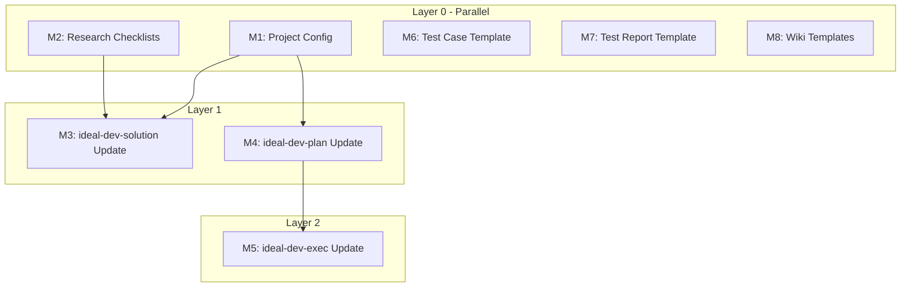

# Skills Enhancement Implementation Plan

> **For Claude:** REQUIRED SUB-SKILL: Use superpowers:executing-plans to implement this plan task-by-task.

**Goal:** Enhance ideal-dev-exec, ideal-dev-solution, ideal-dev-plan skills with project configuration support, parallel execution, and research pre-step. Add missing templates for all skills.

**Architecture:** Create a centralized project-config.md file for project-specific settings (Git branches, commands, tech stack). Add research checklists for different project types. Enhance P5 to include Mermaid dependency graphs. Modify P9 to support parallel execution based on dependency analysis.

**Tech Stack:** Markdown, Mermaid, Claude Code skills system

---

## Module Overview

| Module | Tasks | Dependencies | Execution |
|--------|-------|--------------|-----------|
| M1: Project Config | 3 | None | parallel |
| M2: Research Checklists | 5 | None | parallel |
| M3: ideal-dev-solution Update | 2 | M1, M2 | sequential |
| M4: ideal-dev-plan Update | 2 | M1 | sequential |
| M5: ideal-dev-exec Update | 2 | M1, M4 | sequential |
| M6: Test Case Template | 1 | None | parallel |
| M7: Test Report Template | 1 | None | parallel |
| M8: Wiki Templates | 1 | None | parallel |

**Total:** 17 tasks

---

## Dependency Graph



---

## Execution Strategy

| Module | Dependencies | Strategy |
|--------|--------------|----------|
| M1, M2, M6, M7, M8 | None | parallel (Batch 1) |
| M3, M4 | M1, M2 | sequential after Batch 1 (Batch 2) |
| M5 | M1, M4 | sequential after Batch 2 (Batch 3) |

---

## Module M1: Project Config

### Task M1-T1: Create project-config.md

**Files:**
- Create: `.claude/project-config.md`

**Step 1: Create directory if needed**

```bash
mkdir -p /Users/mathripper/Documents/Sync/Work/电信/理想/工作文档/最佳实践/cc-workflow/.claude
```

**Step 2: Write project-config.md**

Create the file with complete template structure:

```markdown
# 项目配置

## 项目元信息

| 配置项 | 值 |
|--------|-----|
| 项目名称 | CC-Workflow |
| 项目类型 | specification |
| 创建日期 | 2026-02-19 |
| 最后更新 | 2026-02-19 |

---

## Git 配置

### 分支策略

| 配置项 | 值 |
|--------|-----|
| 默认分支 | main |
| 功能分支前缀 | feature/ |
| 修复分支前缀 | fix/ |
| 重构分支前缀 | refactor/ |

### 提交规范

| 配置项 | 值 |
|--------|-----|
| 提交消息格式 | conventional |
| 需要 GPG 签名 | false |

---

## 执行配置

### 命令映射

| 命令类型 | 命令 |
|----------|------|
| 安装依赖 | - |
| 构建 | - |
| 测试 | - |
| Lint | - |
| 格式化 | - |

### 测试配置

| 配置项 | 值 |
|--------|-----|
| 测试框架 | - |
| 覆盖率要求 | - |
| 测试目录 | - |

---

## 技术栈

> ⚠️ 以下内容由 ideal-dev-solution 自动检测填充

### 语言与运行时

| 技术 | 版本 | 用途 |
|------|------|------|
| Markdown | - | 文档编写 |

### 框架与库

| 技术 | 版本 | 用途 |
|------|------|------|
| - | - | - |

### 开发工具

| 工具 | 版本 | 用途 |
|------|------|------|
| Claude Code | - | AI 辅助开发 |
| Obsidian | - | 文档管理 |

---

## 最佳实践

> ⚠️ 以下内容由 ideal-dev-solution 自动检测填充

### 代码规范

- **风格指南**: Markdown 最佳实践
- **Linter 配置**: -
- **格式化配置**: -

### 架构模式

- **分层结构**: docs/ 文档层, .claude/skills/ 技能层
- **模块划分**: 按 16 阶段流程划分
- **设计模式**: Skill-based 工作流

### 测试实践

- **测试策略**: -
- **Mock 方式**: -
- **测试数据**: -

---

## 部署配置

### 环境

| 环境名称 | 分支 | 描述 |
|----------|------|------|
| - | - | - |

### CI/CD

| 配置项 | 值 |
|--------|-----|
| 平台 | - |
| 配置文件 | - |
```

**Step 3: Verify file created**

```bash
ls -la /Users/mathripper/Documents/Sync/Work/电信/理想/工作文档/最佳实践/cc-workflow/.claude/project-config.md
```

Expected: File exists with content

---

### Task M1-T2: Update CLAUDE.md to reference config

**Files:**
- Modify: `CLAUDE.md`

**Step 1: Read current CLAUDE.md**

Read the file to understand current structure.

**Step 2: Add project config reference**

Add after the project overview section:

```markdown
## 项目配置

项目特定配置（Git 分支、执行命令、技术栈等）详见 [.claude/project-config.md](.claude/project-config.md)。
```

---

### Task M1-T3: Commit M1 changes

**Step 1: Stage files**

```bash
git add .claude/project-config.md CLAUDE.md
```

**Step 2: Commit**

```bash
git commit -m "feat(config): add project-config.md for project-specific settings"
```

---

## Module M2: Research Checklists

### Task M2-T1: Create research-checklists directory

**Files:**
- Create: `.claude/skills/ideal-dev-solution/references/research-checklists/`

**Step 1: Create directory**

```bash
mkdir -p /Users/mathripper/Documents/Sync/Work/电信/理想/工作文档/最佳实践/cc-workflow/.claude/skills/ideal-dev-solution/references/research-checklists
```

---

### Task M2-T2: Create development.md checklist

**Files:**
- Create: `.claude/skills/ideal-dev-solution/references/research-checklists/development.md`

**Step 1: Write development checklist**

```markdown
# 开发项目调研清单

## 1. 技术栈识别

### 1.1 语言与运行时
- [ ] 识别主要编程语言
- [ ] 确认语言版本要求
- [ ] 识别运行时环境

### 1.2 框架与库
- [ ] 识别核心框架
- [ ] 列出主要依赖库
- [ ] 确认依赖版本约束

## 2. 代码规范

### 2.1 风格指南
- [ ] 检查 .editorconfig
- [ ] 检查 .prettierrc
- [ ] 检查 .eslintrc / .pylintrc 等

### 2.2 静态分析
- [ ] 识别 Linter 配置
- [ ] 识别类型检查配置
- [ ] 识别代码复杂度工具

## 3. 架构模式

### 3.1 项目结构
- [ ] 分析目录结构
- [ ] 识别分层模式
- [ ] 识别模块边界

### 3.2 设计模式
- [ ] 识别常用设计模式
- [ ] 识别依赖注入方式
- [ ] 识别状态管理模式

## 4. 测试实践

### 4.1 测试框架
- [ ] 识别测试框架
- [ ] 确认测试目录结构
- [ ] 识别测试命名约定

### 4.2 测试配置
- [ ] 检查覆盖率要求
- [ ] 检查 Mock 策略
- [ ] 检查测试数据管理

## 5. 部署配置

### 5.1 CI/CD
- [ ] 检查 CI/CD 配置
- [ ] 识别部署流程
- [ ] 识别环境变量管理

### 5.2 容器化
- [ ] 检查 Dockerfile
- [ ] 检查 docker-compose
- [ ] 检查 Kubernetes 配置（如有）
```

---

### Task M2-T3: Create documentation.md checklist

**Files:**
- Create: `.claude/skills/ideal-dev-solution/references/research-checklists/documentation.md`

**Step 1: Write documentation checklist**

```markdown
# 文档项目调研清单

## 1. 文档结构

### 1.1 目录组织
- [ ] 识别文档根目录
- [ ] 分析目录层次结构
- [ ] 识别索引文件命名

### 1.2 文件格式
- [ ] 确认文档格式（Markdown/AsciiDoc 等）
- [ ] 识别文件命名约定
- [ ] 检查资源文件组织

## 2. 写作规范

### 2.1 风格指南
- [ ] 检查写作风格文档
- [ ] 识别术语表
- [ ] 确认语言风格（正式/非正式）

### 2.2 格式规范
- [ ] 检查标题层级规范
- [ ] 检查代码块格式
- [ ] 检查链接格式

## 3. 工具链

### 3.1 构建工具
- [ ] 识别文档构建工具
- [ ] 检查构建配置
- [ ] 确认输出格式

### 3.2 发布流程
- [ ] 识别发布平台
- [ ] 检查发布配置
- [ ] 确认版本管理方式

## 4. 质量保证

### 4.1 校验工具
- [ ] 检查拼写检查配置
- [ ] 检查链接检查工具
- [ ] 检查格式校验工具

### 4.2 评审流程
- [ ] 识别文档评审流程
- [ ] 检查评审标准
- [ ] 确认评审工具
```

---

### Task M2-T4: Create specification.md checklist

**Files:**
- Create: `.claude/skills/ideal-dev-solution/references/research-checklists/specification.md`

**Step 1: Write specification checklist**

```markdown
# 规范项目调研清单

## 1. 规范结构

### 1.1 文档组织
- [ ] 识别规范文档根目录
- [ ] 分析规范分类方式
- [ ] 识别索引和导航结构

### 1.2 文件格式
- [ ] 确认规范文档格式
- [ ] 识别模板文件位置
- [ ] 检查示例文件组织

## 2. 编写规范

### 2.1 内容标准
- [ ] 检查规范编写指南
- [ ] 识别术语定义方式
- [ ] 确认引用格式

### 2.2 格式要求
- [ ] 检查章节结构规范
- [ ] 检查列表和表格格式
- [ ] 检查代码示例格式

## 3. 评审流程

### 3.1 评审标准
- [ ] 识别规范评审标准
- [ ] 检查评审检查清单
- [ ] 确认评审角色分工

### 3.2 评审工具
- [ ] 识别评审工具
- [ ] 检查反馈收集方式
- [ ] 确认版本控制方式

## 4. 发布管理

### 4.1 版本管理
- [ ] 识别版本号规则
- [ ] 检查变更日志格式
- [ ] 确认归档策略

### 4.2 分发方式
- [ ] 识别规范分发渠道
- [ ] 检查访问权限管理
- [ ] 确认更新通知方式
```

---

### Task M2-T5: Create research.md checklist

**Files:**
- Create: `.claude/skills/ideal-dev-solution/references/research-checklists/research.md`

**Step 1: Write research checklist**

```markdown
# 研究项目调研清单

## 1. 研究范围

### 1.1 研究主题
- [ ] 明确研究问题和目标
- [ ] 确定研究边界
- [ ] 识别相关领域

### 1.2 信息来源
- [ ] 识别主要信息来源
- [ ] 评估来源可信度
- [ ] 确定数据获取方式

## 2. 研究方法

### 2.1 方法论
- [ ] 确定研究方法（定性/定量/混合）
- [ ] 设计研究流程
- [ ] 确定样本范围

### 2.2 工具选择
- [ ] 识别数据分析工具
- [ ] 确定可视化工具
- [ ] 选择协作工具

## 3. 输出格式

### 3.1 报告结构
- [ ] 确定报告章节结构
- [ ] 检查图表和表格规范
- [ ] 确认引用格式

### 3.2 交付物
- [ ] 识别必要交付物
- [ ] 确定格式要求
- [ ] 明确验收标准

## 4. 质量控制

### 4.1 验证方式
- [ ] 确定数据验证方法
- [ ] 识别同行评审流程
- [ ] 设定质量标准

### 4.2 时间管理
- [ ] 识别关键里程碑
- [ ] 确定评审节点
- [ ] 规划发布时间
```

---

## Module M3: ideal-dev-solution Update

### Task M3-T1: Update ideal-dev-solution SKILL.md

**Files:**
- Modify: `.claude/skills/ideal-dev-solution/SKILL.md`

**Step 1: Read current SKILL.md**

Read the file to understand current structure.

**Step 2: Add Step 0 section before Step 1**

Insert after "## Step-by-Step Process":

```markdown
### Step 0: 项目调研（新增）

#### 0.1 读取项目配置

1. 读取 `.claude/project-config.md`
2. 获取项目类型（项目元信息.项目类型）
3. 如文件不存在，使用默认类型 `development`

#### 0.2 加载调研清单

根据项目类型加载对应清单：
- development → `references/research-checklists/development.md`
- documentation → `references/research-checklists/documentation.md`
- specification → `references/research-checklists/specification.md`
- research → `references/research-checklists/research.md`

#### 0.3 执行调研

1. 按清单逐项检查项目
2. 收集技术栈信息
3. 收集最佳实践信息
4. 记录发现和约束条件

#### 0.4 更新配置

将调研结果写入 `project-config.md` 的技术栈和最佳实践区块（如果为空）。
```

---

### Task M3-T2: Commit M3 changes

**Step 1: Stage files**

```bash
git add .claude/skills/ideal-dev-solution/
```

**Step 2: Commit**

```bash
git commit -m "feat(solution): add research pre-step with project-type checklists"
```

---

## Module M4: ideal-dev-plan Update

### Task M4-T1: Create plan-template.md

**Files:**
- Create: `.claude/skills/ideal-dev-plan/references/templates/plan-template.md`
- Create directory first if needed

**Step 1: Create templates directory**

```bash
mkdir -p /Users/mathripper/Documents/Sync/Work/电信/理想/工作文档/最佳实践/cc-workflow/.claude/skills/ideal-dev-plan/references/templates
```

**Step 2: Write plan template**

```markdown
# P5-编码计划

## 概述

| 项目 | 内容 |
|------|------|
| 需求名称 | {requirement_name} |
| 技术方案 | P3-技术方案.md |
| 生成日期 | {date} |

---

## 模块总览

| 模块编号 | 模块名称 | 任务数 | 依赖 | 预估时间 |
|----------|----------|--------|------|----------|
| M1 | {name} | {count} | {deps} | {time} |

**总计**: {total_tasks} 个任务，预估 {total_time}

---

## 任务依赖图

```mermaid
flowchart TB
    {mermaid_content}
```

---

## 执行策略

| 模块 | 依赖 | 执行策略 | 预估时间 |
|------|------|----------|----------|
| {module} | {deps} | parallel/sequential | {time} |

**总预估时间**: 串行 {serial_time} → 并行优化后 {parallel_time}

---

## 并行执行计划

| 批次 | 模块 | 说明 |
|------|------|------|
| Batch 1 | {modules} | 无依赖，可并行 |
| Batch 2 | {modules} | 依赖 Batch 1 |

---

## 模块详情

### M1: {模块名称}

**目标**: {一句话描述}

**依赖**: {无 / M{x}, M{y}}

**任务列表**:

#### 任务 M1-T1: {任务名称}

**目标**: {一句话描述}

**步骤**:
1. [ ] 编写失败测试
2. [ ] 运行确认失败
3. [ ] 实现最小代码
4. [ ] 运行确认通过
5. [ ] 提交代码

**验证标准**: {如何验证完成}

**文件范围**:
- 新增: {file_list}
- 修改: {file_list}

---

## 验证计划

### 完整流程验证

1. [ ] 运行所有单元测试
2. [ ] 运行集成测试
3. [ ] 执行手动验收测试
4. [ ] 检查代码覆盖率

### 验收标准

| 编号 | 标准 | 验证方式 |
|------|------|----------|
| AC-1 | {standard} | {method} |

---

## 风险与应对

| 风险 | 影响 | 应对措施 |
|------|------|----------|
| {risk} | {impact} | {mitigation} |
```

---

### Task M4-T2: Update ideal-dev-plan SKILL.md

**Files:**
- Modify: `.claude/skills/ideal-dev-plan/SKILL.md`

**Step 1: Add Dependency Analysis section**

Insert after "## TDD Organization":

```markdown
## Dependency Analysis（新增）

### 依赖识别

1. 分析模块间调用关系
2. 识别共享资源（数据库、API、配置）
3. 确定执行顺序约束

### 依赖图生成

使用 Mermaid flowchart 格式生成依赖图：
- 每个模块为节点
- 箭头表示依赖方向（A --> B 表示 B 依赖 A）
- 使用 subgraph 分组可并行模块

### 执行策略标注

| 策略 | 条件 | 说明 |
|------|------|------|
| parallel | 无依赖 | 可与其他 parallel 任务同时执行 |
| sequential | 有依赖 | 必须等待依赖完成后执行 |

### 时间优化

计算：
1. 串行总时间 = 所有模块时间之和
2. 并行优化时间 = 按拓扑层级累加最大时间
3. 节省时间 = 串行时间 - 并行时间
```

**Step 2: Update References section**

Change:
```markdown
## References

- `references/templates/plan-template.md` - 计划模板
- `references/examples/example-plan.md` - 完整示例
```

To:
```markdown
## References

- `references/templates/plan-template.md` - 计划模板（含依赖图）
- `references/examples/example-plan.md` - 完整示例
```

---

## Module M5: ideal-dev-exec Update

### Task M5-T1: Update ideal-dev-exec SKILL.md

**Files:**
- Modify: `.claude/skills/ideal-dev-exec/SKILL.md`

**Step 1: Add Step 0 for config reading**

Insert after "## Step-by-Step Process" and before "### Step 1":

```markdown
### Step 0: 读取项目配置（新增）

1. 读取 `.claude/project-config.md`
2. 获取 Git 配置：
   - 默认分支
   - 分支前缀
3. 获取执行配置：
   - 测试命令
   - 构建命令
4. 如配置项缺失，使用默认值

**默认值**:
- default_branch: main
- branch_prefix.feature: feature/
- branch_prefix.fix: fix/
- branch_prefix.refactor: refactor/
- test_command: npm test
- build_command: npm run build
```

**Step 2: Update Git Branch Strategy section**

Replace the entire "## Git Branch Strategy" section with:

```markdown
## Git Branch Strategy

从 `project-config.md` 读取分支配置：

```
{default_branch}
  └── {branch_prefix.feature}{需求名称}
        └── [开发提交]
```

**分支命名（可配置）**:
- 功能开发：`{branch_prefix.feature}{需求名称}`
- Bug 修复：`{branch_prefix.fix}{需求名称}`
- 重构：`{branch_prefix.refactor}{需求名称}`

**默认值**:
- branch_prefix.feature: feature/
- branch_prefix.fix: fix/
- branch_prefix.refactor: refactor/
```

**Step 3: Add Execution Strategy section**

Insert after "## Git Branch Strategy":

```markdown
## Execution Strategy（新增）

### 策略决策

从 P5-编码计划.md 读取执行策略：

1. 解析 Mermaid 依赖图
2. 识别并行/串行标注
3. 生成执行批次

### 执行模式

| 模式 | 触发条件 | 实现 |
|------|----------|------|
| team-parallel | Batch 内多个 parallel 任务 | 多 Task 并行调用 |
| subagent-sequential | 单一 sequential 链 | 单 Task 顺序调用 |
| hybrid | 混合依赖 | 按拓扑层级分批执行 |

### 并行执行规则

1. 同一层级的 parallel 任务可同时启动
2. 等待所有同层任务完成后再启动下一层
3. 每个任务完成后验证测试通过
4. 任务失败时暂停，等待人工介入

### 进度跟踪

使用 TodoWrite 跟踪：
- 每个 Batch 作为一个阶段
- 每个任务作为一个 todo item
- 完成时立即标记
```

---

### Task M5-T2: Update execution-strategy.md

**Files:**
- Modify: `.claude/skills/ideal-dev-exec/references/execution-strategy.md`

**Step 1: Read current file**

Read to understand current content.

**Step 2: Add configuration reading section at the beginning**

Add after any existing header:

```markdown
## 1. 配置读取

### 1.1 项目配置

启动时读取 `.claude/project-config.md`：

| 配置项 | 路径 | 默认值 |
|--------|------|--------|
| default_branch | Git 配置.分支策略.默认分支 | main |
| branch_prefix.feature | Git 配置.分支策略.功能分支前缀 | feature/ |
| branch_prefix.fix | Git 配置.分支策略.修复分支前缀 | fix/ |
| test_command | 执行配置.命令映射.测试 | npm test |
| build_command | 执行配置.命令映射.构建 | npm run build |

### 1.2 配置缺失处理

如果 `project-config.md` 不存在或配置项缺失，使用默认值。

## 2. 依赖图解析

### 2.1 Mermaid 解析

从 P5 的 Mermaid flowchart 中提取：

1. 节点列表（模块）
2. 边列表（依赖关系）
3. subgraph 分组（并行组）

### 2.2 拓扑排序

使用 Kahn 算法进行拓扑排序：

1. 计算每个节点的入度
2. 入度为 0 的节点加入当前层
3. 移除当前层节点的出边
4. 重复直到所有节点处理完毕

### 2.3 批次生成

按拓扑层级生成执行批次：
- Layer 0: 所有无依赖的模块
- Layer N: 所有依赖 Layer N-1 的模块

## 3. 并行执行

### 3.1 Task Tool 调用

**单批次多任务**:

在单个响应中发起多个 Task tool 调用，实现真正的并行执行。

### 3.2 结果收集

每个 Task 完成后：
1. 检查返回结果
2. 验证测试通过
3. 更新 TodoWrite
4. 如有失败，暂停并报告

### 3.3 错误处理

| 错误类型 | 处理方式 |
|----------|----------|
| 单任务失败 | 暂停批次，报告错误，等待介入 |
| 依赖失败 | 跳过依赖此任务的所有后续任务 |
| 超时 | 标记超时，报告进度，等待介入 |

## 4. 进度报告

### 4.1 批次报告

每个批次完成后输出执行状态和累计进度。

### 4.2 最终报告

所有任务完成后输出总结报告。
```

---

## Module M6: Test Case Template

### Task M6-T1: Create test-case-template.md

**Files:**
- Create: `.claude/skills/ideal-test-case/references/templates/test-case-template.md`
- Create directory first

**Step 1: Create templates directory**

```bash
mkdir -p /Users/mathripper/Documents/Sync/Work/电信/理想/工作文档/最佳实践/cc-workflow/.claude/skills/ideal-test-case/references/templates
```

**Step 2: Write template**

```markdown
# P7-测试用例

## 概述

| 项目 | 内容 |
|------|------|
| 需求名称 | {requirement_name} |
| 编码计划 | P5-编码计划.md |
| 生成日期 | {date} |

---

## 用例统计

| 类型 | 数量 | 占比 |
|------|------|------|
| 功能测试 | {func_count} | {func_pct}% |
| 边界测试 | {boundary_count} | {boundary_pct}% |
| 异常测试 | {exception_count} | {exception_pct}% |
| **总计** | {total} | 100% |

---

## 功能测试用例

### TC-F-001: {用例名称}

| 项目 | 内容 |
|------|------|
| **用例编号** | TC-F-001 |
| **用例名称** | {name} |
| **优先级** | P0 / P1 / P2 |
| **关联模块** | M{x} |
| **前置条件** | {preconditions} |

**测试步骤**:
1. {step_1}
2. {step_2}

**预期结果**:
- {expected_1}

**测试数据**:
```
{test_data}
```

---

## 边界测试用例

### TC-B-001: {用例名称}

| 项目 | 内容 |
|------|------|
| **用例编号** | TC-B-001 |
| **用例名称** | {name} |
| **优先级** | P0 / P1 / P2 |
| **边界类型** | 输入边界 / 状态边界 / 流程边界 |
| **关联模块** | M{x} |
| **前置条件** | {preconditions} |

**测试步骤**:
1. {step_1}

**预期结果**:
- {expected_1}

**边界值**:
| 参数 | 最小值 | 最大值 | 测试值 |
|------|--------|--------|--------|
| {param} | {min} | {max} | {test} |

---

## 异常测试用例

### TC-E-001: {用例名称}

| 项目 | 内容 |
|------|------|
| **用例编号** | TC-E-001 |
| **用例名称** | {name} |
| **优先级** | P0 / P1 / P2 |
| **异常类型** | 输入错误 / 状态错误 / 外部错误 |
| **关联模块** | M{x} |
| **前置条件** | {preconditions} |

**测试步骤**:
1. {step_1}

**预期结果**:
- 系统返回错误码: {error_code}
- 错误消息: {error_message}
- 系统状态: {expected_state}

---

## 覆盖率报告

### 功能覆盖

| 模块 | 功能点 | 用例数 | 覆盖率 |
|------|--------|--------|--------|
| M1 | {features} | {count} | {rate}% |

### 优先级分布

| 优先级 | 数量 | 说明 |
|--------|------|------|
| P0 | {count} | 核心功能，必须通过 |
| P1 | {count} | 重要功能，应该通过 |
| P2 | {count} | 次要功能，可延后 |
```

---

## Module M7: Test Report Template

### Task M7-T1: Create test-report-template.md

**Files:**
- Create: `.claude/skills/ideal-test-exec/references/templates/test-report-template.md`
- Create directory first

**Step 1: Create templates directory**

```bash
mkdir -p /Users/mathripper/Documents/Sync/Work/电信/理想/工作文档/最佳实践/cc-workflow/.claude/skills/ideal-test-exec/references/templates
```

**Step 2: Write template**

```markdown
# P11-测试报告

## 概述

| 项目 | 内容 |
|------|------|
| 需求名称 | {requirement_name} |
| 测试用例 | P7-测试用例.md |
| 测试日期 | {date} |
| 测试人员 | Claude Code |
| 测试环境 | {environment} |

---

## 测试概况

| 项目 | 数量 |
|------|------|
| 总用例数 | {total} |
| 通过数 | {pass} |
| 失败数 | {fail} |
| 跳过数 | {skip} |
| 阻塞数 | {block} |
| **通过率** | **{rate}%** |

---

## 测试结果详情

### 功能测试

| 用例编号 | 用例名称 | 状态 | 耗时 | 备注 |
|----------|----------|------|------|------|
| TC-F-001 | {name} | ✅ PASS | {time}s | - |

### 边界测试

| 用例编号 | 用例名称 | 状态 | 耗时 | 备注 |
|----------|----------|------|------|------|
| TC-B-001 | {name} | ✅ PASS | {time}s | - |

### 异常测试

| 用例编号 | 用例名称 | 状态 | 耗时 | 备注 |
|----------|----------|------|------|------|
| TC-E-001 | {name} | ✅ PASS | {time}s | - |

---

## 缺陷记录

| 缺陷编号 | 用例编号 | 严重程度 | 描述 | 状态 |
|----------|----------|----------|------|------|
| DEF-001 | TC-F-xxx | 严重/一般/轻微 | {description} | 待修复 |

### 缺陷详情

#### DEF-001: {缺陷标题}

**复现步骤**:
1. {step_1}
2. {step_2}

**预期结果**: {expected}

**实际结果**: {actual}

---

## 测试结论

### 总体评价

| 维度 | 评价 | 说明 |
|------|------|------|
| 功能完整性 | ✅ / ⚠️ / ❌ | {comment} |
| 质量水平 | ✅ / ⚠️ / ❌ | {comment} |
| 上线建议 | ✅ 可上线 / ⚠️ 有条件上线 / ❌ 不可上线 | {comment} |

### 上线条件

**必须满足**:
- [ ] 所有 P0 用例通过
- [ ] 无致命/严重级别缺陷

**建议满足**:
- [ ] 通过率 ≥ 90%
- [ ] 所有 P1 用例通过
```

---

## Module M8: Wiki Templates

### Task M8-T1: Create all wiki templates

**Files:**
- Create: `.claude/skills/ideal-wiki/references/templates/user-doc-template.md`
- Create: `.claude/skills/ideal-wiki/references/templates/dev-doc-template.md`
- Create: `.claude/skills/ideal-wiki/references/templates/api-doc-template.md`
- Create directory first

**Step 1: Create templates directory**

```bash
mkdir -p /Users/mathripper/Documents/Sync/Work/电信/理想/工作文档/最佳实践/cc-workflow/.claude/skills/ideal-wiki/references/templates
```

**Step 2: Write user-doc-template.md**

```markdown
# {功能名称} - 用户指南

## 功能简介

{功能概述，2-3 句话描述功能是什么，解决什么问题}

### 适用场景

- 场景 1: {description}
- 场景 2: {description}

### 功能亮点

- ✨ {highlight_1}
- ✨ {highlight_2}

---

## 使用指南

### 快速开始

**前置条件**:
- {prerequisite_1}

**步骤**:

1. **{step_1_title}**
   ```
   {step_1_content}
   ```

2. **完成** - {completion_message}

---

## 常见问题

### Q1: {question_1}

**A**: {answer_1}

---

## 注意事项

> ⚠️ **重要**: {important_note}

---

## 更新日志

| 版本 | 日期 | 更新内容 |
|------|------|----------|
| v1.0.0 | {date} | 初始版本 |
```

**Step 3: Write dev-doc-template.md**

```markdown
# {功能名称} - 开发文档

## 架构说明

### 系统架构

```
┌─────────────────────────────────────────┐
│              {Layer_Name}                │
├─────────────────────────────────────────┤
│              {Layer_Name}                │
└─────────────────────────────────────────┘
```

### 模块划分

| 模块 | 职责 | 技术栈 |
|------|------|--------|
| {module} | {responsibility} | {tech} |

---

## 环境配置

### 开发环境

**系统要求**:
- 操作系统: {os}
- 运行时: {runtime} {version}

**依赖安装**:
```bash
{install_command}
```

---

## 代码结构

```
{project_name}/
├── src/
│   ├── {module_1}/
│   └── index.ts
├── tests/
└── docs/
```

---

## 核心接口

### {Interface_Name}

```typescript
interface {Interface_Name} {
  {property}: {type};
}
```

---

## 部署指南

### 构建命令

```bash
{build_command}
```

---

## 维护说明

### 常见问题排查

| 现象 | 可能原因 | 解决方案 |
|------|----------|----------|
| {symptom} | {cause} | {solution} |
```

**Step 4: Write api-doc-template.md**

```markdown
# {功能名称} - 接口文档

## 接口概览

| 接口 | 方法 | 路径 | 描述 |
|------|------|------|------|
| {name} | {method} | `{path}` | {desc} |

---

## 接口详情

### {接口名称}

**基本信息**:
| 项目 | 内容 |
|------|------|
| 路径 | `{method} {path}` |
| 描述 | {description} |
| 认证 | {auth_type} |

**请求参数**:

| 参数名 | 位置 | 类型 | 必填 | 描述 |
|--------|------|------|------|------|
| {param} | path/query/body | {type} | 是/否 | {desc} |

**请求示例**:
```json
{
  "{field}": "{value}"
}
```

**成功响应示例**:
```json
{
  "code": 200,
  "data": { },
  "message": "success"
}
```

**错误码**:

| 错误码 | 说明 | 处理建议 |
|--------|------|----------|
| {code} | {desc} | {suggestion} |

---

## 通用说明

### 请求头

| Header | 值 | 说明 |
|--------|------|------|
| Content-Type | application/json | 请求体格式 |

### 响应结构

```json
{
  "code": 200,
  "data": { },
  "message": "success"
}
```
```

---

## Final Commit

### Task Final-1: Commit all remaining changes

**Step 1: Stage all changes**

```bash
git add .claude/skills/
```

**Step 2: Commit**

```bash
git commit -m "feat(skills): add templates for ideal-dev-plan, ideal-test-case, ideal-test-exec, ideal-wiki

- Add plan-template.md with dependency graph support
- Add test-case-template.md for P7
- Add test-report-template.md for P11
- Add user-doc-template.md, dev-doc-template.md, api-doc-template.md for P15"
```

---

## Verification Plan

After all tasks complete:

1. Verify all files exist
2. Verify SKILL.md references are correct
3. Test project-config.md can be read by skills
4. Validate Mermaid syntax in plan template
```
</parameter>
</invoke>