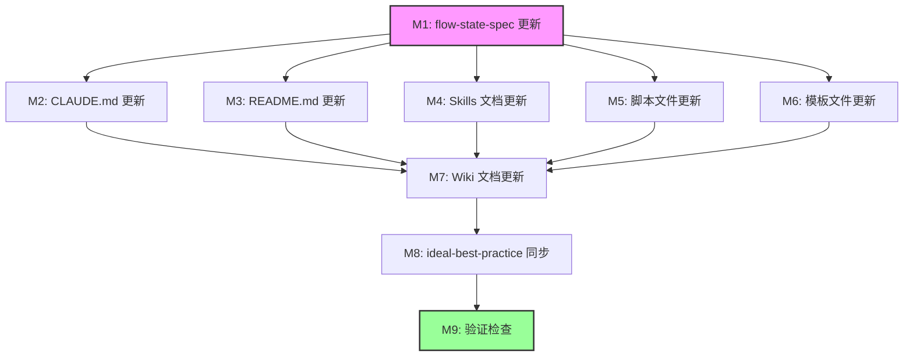

# P5-编码计划

> **For Claude:** REQUIRED SUB-SKILL: Use ideal-dev-exec to implement this plan task-by-task.

**Goal:** 将 CC-Workflow 的 16 阶段流程精简为 15 阶段，更新所有相关文档和脚本中的阶段引用。

**Architecture:** 采用分阶段更新策略，先更新核心规范文件，再并行更新项目文档和 Skills，最后同步 ideal-best-practice 包并验证。

**Tech Stack:** Markdown 文档编辑 + Python 脚本更新 + Grep 全局验证

---

## 模块总览

| 模块 | 名称 | 任务数 | 优先级 | 执行策略 |
|------|------|--------|--------|----------|
| M1 | flow-state-spec 更新 | 4 | P0 | sequential |
| M2 | CLAUDE.md 更新 | 3 | P0 | parallel (依赖 M1) |
| M3 | README.md 更新 | 4 | P0 | parallel (依赖 M1) |
| M4 | Skills 文档更新 | 5 | P0 | parallel (依赖 M1) |
| M5 | 脚本文件更新 | 3 | P0 | parallel (依赖 M1) |
| M6 | 模板文件更新 | 2 | P0 | parallel (依赖 M1) |
| M7 | Wiki 文档更新 | 3 | P1 | sequential (依赖 M2-M6) |
| M8 | ideal-best-practice 同步 | 4 | P1 | sequential (依赖 M7) |
| M9 | 验证检查 | 3 | P0 | sequential (依赖 M8) |

**总任务数**: 31

---

## 依赖关系图

---

## 执行顺序

| 层级 | 模块 | 可并行 |
|------|------|--------|
| 第 1 层 | M1: flow-state-spec 更新 | - |
| 第 2 层 | M2, M3, M4, M5, M6 | ✅ 可并行 |
| 第 3 层 | M7: Wiki 文档更新 | - |
| 第 4 层 | M8: ideal-best-practice 同步 | - |
| 第 5 层 | M9: 验证检查 | - |

---

## 模块详情

### M1: flow-state-spec 更新

**文件**: `.claude/skills/ideal-flow-control/references/flow-state-spec.md`

**依赖**: 无

**任务**:

#### 任务 M1-1: 更新 current_phase 范围
- [ ] 将 `current_phase: P1-P16` 改为 `current_phase: P1-P15`
- **验证**: 文件中无 `P1-P16` 或 `P16` 引用

#### 任务 M1-2: 更新 16 阶段映射表为 15 阶段
- [ ] 删除 P13 上线评审行
- [ ] 删除 P14 部署上线行
- [ ] 将 P15 维基更新改为 P13
- [ ] 将 P16 维基评审改为 P14
- [ ] 新增 P15 成果提交行
- **验证**: 表格包含 15 行阶段定义

#### 任务 M1-3: 更新收尾阶段状态表格
- [ ] 将原 P13-P16 表格改为 P13-P15
- [ ] 内容为：P13 维基更新、P14 维基评审、P15 成果提交
- **验证**: 收尾阶段表格包含 3 行

#### 任务 M1-4: 添加 P15 成果提交阶段详细定义
- [ ] 在文档中添加 P15 成果提交的完整定义
- [ ] 包含：执行者、触发条件、执行内容、输出
- **验证**: P15 定义完整且清晰

---

### M2: CLAUDE.md 更新

**文件**: `CLAUDE.md`

**依赖**: M1

**任务**:

#### 任务 M2-1: 更新阶段流程标题
- [ ] 将 `14 阶段流程（P1-P14）` 改为 `15 阶段流程（P1-P15）`
- **验证**: 标题和描述一致

#### 任务 M2-2: 更新收尾阶段描述
- [ ] 更新收尾阶段列表：P13 维基更新 → P14 维基评审 → P15 成果提交
- **验证**: 收尾阶段描述为 P13-P15

#### 任务 M2-3: 更新注释说明
- [ ] 将 "P14 评审通过后" 改为 "P15 成果提交后"
- [ ] 确保说明与新的阶段编号一致
- **验证**: 注释说明准确

---

### M3: README.md 更新

**文件**: `README.md`

**依赖**: M1

**任务**:

#### 任务 M3-1: 更新阶段总览图
- [ ] 修改 Mermaid 流程图，删除 P13 上线评审和 P14 部署上线
- [ ] 将 P15 维基更新改为 P13
- [ ] 将 P16 维基评审改为 P14
- [ ] 新增 P15 成果提交节点
- **验证**: 流程图显示 15 个阶段

#### 任务 M3-2: 更新阶段详情表格
- [ ] 删除 P13 上线评审行
- [ ] 删除 P14 部署上线行
- [ ] 更新 P15→P13, P16→P14
- [ ] 新增 P15 成果提交行
- **验证**: 表格包含 15 行

#### 任务 M3-3: 更新章节标题
- [ ] 将 `三、阶段流程定义（P1-P16）` 改为 `三、阶段流程定义（P1-P15）`
- **验证**: 标题正确

#### 任务 M3-4: 更新验证方式章节
- [ ] 将 "P1 到 P16 走一遍" 改为 "P1 到 P15 走一遍"
- **验证**: 验证方式描述正确

---

### M4: Skills 文档更新

**文件**:
- `.claude/skills/ideal-wiki/SKILL.md`
- `.claude/skills/ideal-requirement/SKILL.md`
- `.claude/skills/ideal-init/SKILL.md`
- `.claude/skills/ideal-flow-control/SKILL.md`

**依赖**: M1

**任务**:

#### 任务 M4-1: 更新 ideal-wiki/SKILL.md
- [ ] 将阶段引用从 P15 改为 P13
- [ ] 更新相关描述
- **验证**: 文件中 P15 引用已改为 P13

#### 任务 M4-2: 更新 ideal-requirement/SKILL.md
- [ ] 检查并更新阶段引用
- [ ] 更新 P16→P14 相关引用
- **验证**: 阶段引用正确

#### 任务 M4-3: 更新 ideal-init/SKILL.md
- [ ] 检查并更新阶段引用
- **验证**: 阶段引用正确

#### 任务 M4-4: 更新 ideal-flow-control/SKILL.md
- [ ] 更新阶段范围描述
- [ ] 更新 MAX_PHASE 相关描述
- **验证**: 阶段范围正确

#### 任务 M4-5: 更新其他 Skills 中的阶段引用
- [ ] 检查 ideal-dev-solution, ideal-dev-plan, ideal-test-case 等文件
- [ ] 更新必要的阶段引用
- **验证**: 所有 Skills 文档阶段引用正确

---

### M5: 脚本文件更新

**文件**:
- `.claude/skills/ideal-flow-control/scripts/flow-state.py`
- `.claude/skills/ideal-requirement/scripts/generate-flow-status.py`

**依赖**: M1

**任务**:

#### 任务 M5-1: 更新 flow-state.py
- [ ] 将 MAX_PHASE 从 16 改为 15
- [ ] 更新阶段判断逻辑
- [ ] 更新收尾阶段列表
- **验证**: 脚本逻辑正确

#### 任务 M5-2: 更新 generate-flow-status.py
- [ ] 更新生成的流程状态模板
- [ ] 确保生成 P1-P15 的阶段列表
- **验证**: 生成的模板正确

#### 任务 M5-3: 验证脚本功能
- [ ] 运行脚本测试
- [ ] 确认输出正确
- **验证**: 脚本执行无错误

---

### M6: 模板文件更新

**文件**: `.claude/skills/ideal-init/references/templates/flow-status.md.tmpl`

**依赖**: M1

**任务**:

#### 任务 M6-1: 更新流程状态模板
- [ ] 将 P13-P16 改为 P13-P15
- [ ] 更新收尾阶段表格
- **验证**: 模板内容正确

#### 任务 M6-2: 验证模板可用性
- [ ] 检查模板格式
- [ ] 确保变量占位符正确
- **验证**: 模板格式正确

---

### M7: Wiki 文档更新

**文件**:
- `docs/Wiki/用户指南/流程概述.md`
- `docs/Wiki/开发指南/Skills 索引.md`
- `docs/Wiki/开发指南/其他相关文档`

**依赖**: M2, M3, M4, M5, M6

**任务**:

#### 任务 M7-1: 更新流程概述文档
- [ ] 更新阶段流程图
- [ ] 更新阶段描述表格
- **验证**: 流程概述正确

#### 任务 M7-2: 更新 Skills 索引文档
- [ ] 更新各 Skill 对应的阶段编号
- **验证**: 索引信息正确

#### 任务 M7-3: 检查其他 Wiki 文档
- [ ] 搜索并更新所有涉及阶段编号的 Wiki 文档
- **验证**: Wiki 文档一致

---

### M8: ideal-best-practice 同步

**文件**: `ideal-best-practice/packages/ideal-dev/skills/` 目录下相关文件

**依赖**: M7

**任务**:

#### 任务 M8-1: 同步 ideal-flow-control
- [ ] 将 M1 的变更同步到 ideal-best-practice 版本
- **验证**: 两个版本一致

#### 任务 M8-2: 同步 ideal-wiki
- [ ] 将 M4-1 的变更同步到 ideal-best-practice 版本
- **验证**: 两个版本一致

#### 任务 M8-3: 同步 ideal-requirement
- [ ] 将 M4-2 的变更同步到 ideal-best-practice 版本
- **验证**: 两个版本一致

#### 任务 M8-4: 同步 ideal-init
- [ ] 将 M4-3 和 M6 的变更同步到 ideal-best-practice 版本
- **验证**: 两个版本一致

---

### M9: 验证检查

**依赖**: M8

**任务**:

#### 任务 M9-1: 全局搜索验证
- [ ] 执行 `grep -r "P16" --exclude-dir=node_modules --exclude-dir=build`
- [ ] 确认无 P16 引用（排除当前迭代文档）
- **验证**: 无遗漏的 P16 引用

#### 任务 M9-2: 验证 "16 阶段" 引用
- [ ] 执行 `grep -r "16 阶段\|十六阶段" --exclude-dir=node_modules --exclude-dir=build`
- [ ] 确认所有引用已更新为 "15 阶段"
- **验证**: 无遗漏的 "16 阶段" 引用

#### 任务 M9-3: 功能验证
- [ ] 检查流程状态模板生成功能
- [ ] 确认阶段流转逻辑正确
- **验证**: 功能正常

---

## 验证计划

### 完整验证清单

| 检查项 | 命令 | 预期结果 |
|--------|------|----------|
| 无 P16 引用 | `grep -r "P16" . --exclude-dir={node_modules,build,.git}` | 仅当前迭代文档 |
| 无 16 阶段引用 | `grep -r "16 阶段\|十六阶段" . --exclude-dir={node_modules,build,.git}` | 无结果 |
| P15 引用正确 | `grep -r "P15" . --exclude-dir={node_modules,build,.git}` | 仅成果提交相关 |
| flow-state-spec 正确 | 手动检查 | 包含 P1-P15 定义 |
| README 流程图正确 | 手动检查 | 显示 15 阶段 |

---

## 故事文件

本计划拆分为以下故事文件（位于 `stories/` 目录）：

| 故事 | 标题 | 依赖 | 状态 |
|------|------|------|------|
| [001](stories/001-flow-state-spec.md) | 核心规范更新 | - | ⏳ 待开始 |
| [002](stories/002-project-docs.md) | 项目文档更新 | 001 | ⏳ 待开始 |
| [003](stories/003-skills-docs.md) | Skills 文档更新 | 001 | ⏳ 待开始 |
| [004](stories/004-scripts-and-templates.md) | 脚本和模板更新 | 001 | ⏳ 待开始 |
| [005](stories/005-wiki-docs.md) | Wiki 文档更新 | 002,003,004 | ⏳ 待开始 |
| [006](stories/006-ideal-best-practice.md) | ideal-best-practice 同步 | 005 | ⏳ 待开始 |
| [007](stories/007-verification.md) | 验证检查 | 006 | ⏳ 待开始 |

---

*文档版本: v1.0*
*创建时间: 2026-02-23*
*作者: Claude Code*
