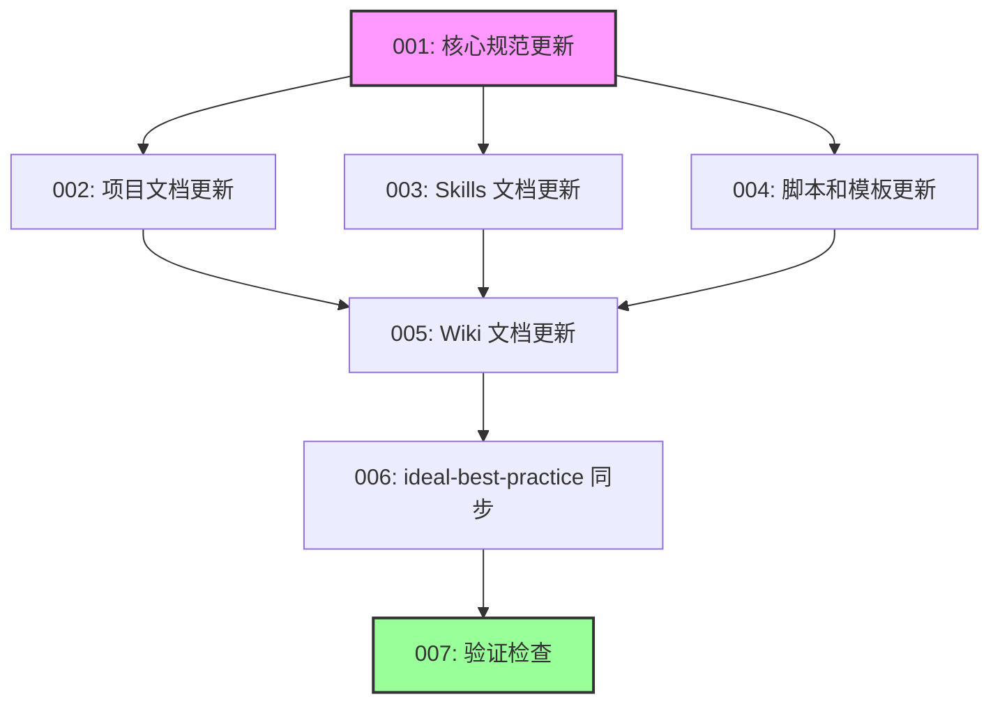

# 故事索引

## 概览

| 故事 | 标题 | 状态 | 依赖 |
|------|------|------|------|
| [001](001-flow-state-spec.md) | 核心规范更新 (flow-state-spec) | ⏳ 待开始 | - |
| [002](002-project-docs.md) | 项目文档更新 (CLAUDE.md, README.md) | ⏳ 待开始 | 001 |
| [003](003-skills-docs.md) | Skills 文档更新 | ⏳ 待开始 | 001 |
| [004](004-scripts-and-templates.md) | 脚本和模板更新 | ⏳ 待开始 | 001 |
| [005](005-wiki-docs.md) | Wiki 文档更新 | ⏳ 待开始 | 002, 003, 004 |
| [006](006-ideal-best-practice.md) | ideal-best-practice 同步 | ⏳ 待开始 | 005 |
| [007](007-verification.md) | 验证检查 | ⏳ 待开始 | 006 |

## 依赖关系

## 执行顺序

### 第 1 层（可开始）
1. **001-核心规范更新** - 无依赖，必须首先完成

### 第 2 层（可并行）
2. **002-项目文档更新**（依赖 001）
3. **003-Skills 文档更新**（依赖 001）
4. **004-脚本和模板更新**（依赖 001）

> 注：002、003、004 可并行执行

### 第 3 层
5. **005-Wiki 文档更新**（依赖 002、003、004）

### 第 4 层
6. **006-ideal-best-practice 同步**（依赖 005）

### 第 5 层
7. **007-验证检查**（依赖 006）

## 状态说明

| 状态 | 符号 | 说明 |
|------|------|------|
| 待开始 | ⏳ | 尚未开始 |
| 进行中 | 🔄 | 正在执行 |
| 已完成 | ✅ | 已完成 |
| 阻塞 | 🚫 | 被阻塞 |
