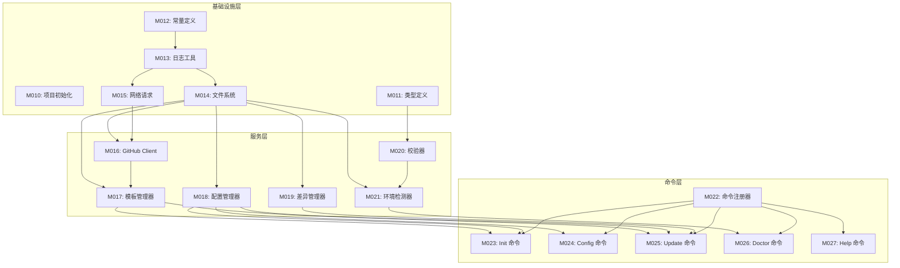

# P5-编码计划

> **For Claude:** REQUIRED SUB-SKILL: Use ideal-dev-exec to implement this plan task-by-task.

**Goal:** 构建 ideal-cli 命令行工具，实现从 ideal-lab 仓库一键初始化开发工作流

**Architecture:** 三层架构（命令层 → 服务层 → 基础设施层），依赖倒置，核心业务逻辑通过接口抽象

**Tech Stack:** Node.js 18+ / TypeScript / Commander.js / Inquirer.js / axios / fs-extra / Vitest

---

## 一、模块总览

| 模块编号 | 模块名称 | 任务数 | 优先级 | 执行策略 |
|----------|----------|--------|--------|----------|
| M010 | 项目初始化 | 4 | P0 | parallel |
| M011 | 基础类型定义 | 3 | P0 | parallel |
| M012 | 常量定义 | 2 | P0 | parallel |
| M013 | 日志工具 | 3 | P0 | parallel |
| M014 | 文件系统工具 | 4 | P0 | sequential |
| M015 | 网络请求工具 | 3 | P0 | sequential |
| M016 | GitHub Client | 5 | P0 | sequential |
| M017 | 模板管理器 | 5 | P0 | sequential |
| M018 | 配置管理器 | 4 | P1 | sequential |
| M019 | 差异管理器 | 4 | P1 | sequential |
| M020 | 校验器 | 3 | P1 | parallel |
| M021 | 环境检测器 | 4 | P1 | sequential |
| M022 | 命令注册器 | 3 | P0 | sequential |
| M023 | Init 命令 | 6 | P0 | sequential |
| M024 | Config 命令 | 4 | P1 | sequential |
| M025 | Update 命令 | 5 | P1 | sequential |
| M026 | Doctor 命令 | 4 | P1 | sequential |
| M027 | Help 命令 | 2 | P0 | parallel |

**任务总数**: 68

---

## 二、依赖关系



---

## 三、执行阶段

### Phase 1: 基础设施（并行）

| 模块 | 执行策略 | 依赖 |
|------|----------|------|
| M010 项目初始化 | parallel | - |
| M011 类型定义 | parallel | - |
| M012 常量定义 | parallel | - |
| M013 日志工具 | parallel | - |

### Phase 2: 文件与网络（顺序）

| 模块 | 执行策略 | 依赖 |
|------|----------|------|
| M014 文件系统 | sequential | M013 |
| M015 网络请求 | sequential | M013 |

### Phase 3: 核心服务（顺序）

| 模块 | 执行策略 | 依赖 |
|------|----------|------|
| M016 GitHub Client | sequential | M014, M015 |
| M017 模板管理器 | sequential | M016 |

### Phase 4: 辅助服务（部分并行）

| 模块 | 执行策略 | 依赖 |
|------|----------|------|
| M020 校验器 | parallel | M011 |
| M018 配置管理器 | sequential | M014 |
| M019 差异管理器 | sequential | M014 |
| M021 环境检测器 | sequential | M014, M020 |

### Phase 5: 命令层（顺序）

| 模块 | 执行策略 | 依赖 |
|------|----------|------|
| M022 命令注册器 | sequential | M013 |
| M027 Help 命令 | parallel | - |
| M023 Init 命令 | sequential | M017, M018, M021 |
| M024 Config 命令 | sequential | M018 |
| M025 Update 命令 | sequential | M017, M018, M019 |
| M026 Doctor 命令 | sequential | M021 |

---

## 四、模块详细设计

### M010: 项目初始化

**目标**: 创建项目基础结构，配置 TypeScript、tsup、Vitest

**任务清单**:

#### 任务 M010-1: 初始化 npm 项目
- [ ] 编写 package.json 测试（验证依赖安装）
- [ ] 运行 `npm init -y`
- [ ] 安装依赖：`npm install commander inquirer axios fs-extra mustache`
- [ ] 安装开发依赖：`npm install -D typescript tsup vitest @types/node`
- [ ] 验证：`npm list --depth=0`

#### 任务 M010-2: 配置 TypeScript
- [ ] 编写 tsconfig.json 测试（验证编译）
- [ ] 创建 tsconfig.json
- [ ] 运行 `npx tsc --noEmit`
- [ ] 验证：无类型错误

#### 任务 M010-3: 配置 tsup 构建
- [ ] 编写 tsup.config.ts 测试
- [ ] 创建 tsup.config.ts
- [ ] 添加 build 脚本到 package.json
- [ ] 运行 `npm run build`
- [ ] 验证：dist/ 目录生成

#### 任务 M010-4: 配置 Vitest
- [ ] 编写 vitest.config.ts 测试
- [ ] 创建 vitest.config.ts
- [ ] 添加 test 脚本到 package.json
- [ ] 创建示例测试文件
- [ ] 运行 `npm test`
- [ ] 验证：测试通过

---

### M011: 基础类型定义

**目标**: 定义核心数据类型和接口

**任务清单**:

#### 任务 M011-1: 定义配置类型
- [ ] 编写类型测试
- [ ] 创建 src/types/config.ts
- [ ] 定义 ProjectConfig, TechStack 类型
- [ ] 运行类型检查
- [ ] 验证：类型正确导出

#### 任务 M011-2: 定义模板类型
- [ ] 编写类型测试
- [ ] 创建 src/types/template.ts
- [ ] 定义 TemplateMeta, TemplateFile 类型
- [ ] 运行类型检查
- [ ] 验证：类型正确导出

#### 任务 M011-3: 定义诊断类型
- [ ] 编写类型测试
- [ ] 创建 src/types/doctor.ts
- [ ] 定义 DoctorResult, CheckResult 类型
- [ ] 创建 src/types/index.ts 导出所有类型
- [ ] 验证：类型正确导出

---

### M012: 常量定义

**目标**: 定义默认值和提示信息常量

**任务清单**:

#### 任务 M012-1: 定义默认值常量
- [ ] 编写常量测试
- [ ] 创建 src/constants/defaults.ts
- [ ] 定义 DEFAULT_REPO, DEFAULT_BRANCH, DEFAULT_TEMPLATE_PATH
- [ ] 验证：常量可正确导入

#### 任务 M012-2: 定义提示信息
- [ ] 编写消息测试
- [ ] 创建 src/constants/messages.ts
- [ ] 定义成功、错误、警告消息模板
- [ ] 创建 src/constants/index.ts 导出
- [ ] 验证：消息格式正确

---

### M013: 日志工具

**目标**: 实现统一的日志输出工具

**任务清单**:

#### 任务 M013-1: 实现 Logger 类
- [ ] 编写 Logger 测试
- [ ] 创建 src/utils/logger.ts
- [ ] 实现 info, success, warn, error 方法
- [ ] 支持 --verbose 模式
- [ ] 验证：日志输出格式正确

#### 任务 M013-2: 实现颜色输出
- [ ] 编写颜色测试
- [ ] 安装 chalk 依赖
- [ ] 实现彩色日志输出
- [ ] 验证：颜色正确显示

#### 任务 M013-3: 实现 Spinner
- [ ] 编写 Spinner 测试
- [ ] 安装 ora 依赖
- [ ] 实现加载动画
- [ ] 验证：Spinner 正常工作

---

### M014: 文件系统工具

**目标**: 封装文件操作工具函数

**任务清单**:

#### 任务 M014-1: 实现目录操作
- [ ] 编写目录操作测试
- [ ] 创建 src/utils/file-system.ts
- [ ] 实现 ensureDir, isEmpty, copyDir 方法
- [ ] 验证：目录操作正确

#### 任务 M014-2: 实现文件读写
- [ ] 编写文件读写测试
- [ ] 实现 readFile, writeFile, fileExists 方法
- [ ] 支持模板变量替换
- [ ] 验证：文件读写正确

#### 任务 M014-3: 实现哈希计算
- [ ] 编写哈希测试
- [ ] 实现 calculateHash 方法（MD5）
- [ ] 验证：哈希值正确

#### 任务 M014-4: 实现路径处理
- [ ] 编写路径测试
- [ ] 实现跨平台路径处理
- [ ] 实现 getProjectRoot 方法
- [ ] 验证：路径处理正确

---

### M015: 网络请求工具

**目标**: 封装 axios 请求工具

**任务清单**:

#### 任务 M015-1: 实现 HTTP 客户端
- [ ] 编写 HTTP 测试（mock）
- [ ] 创建 src/utils/http.ts
- [ ] 配置 axios 实例
- [ ] 实现请求/响应拦截器
- [ ] 验证：请求正常

#### 任务 M015-2: 实现错误处理
- [ ] 编写错误处理测试
- [ ] 实现网络错误统一处理
- [ ] 实现超时处理
- [ ] 验证：错误正确捕获

#### 任务 M015-3: 实现代理支持
- [ ] 编写代理测试
- [ ] 读取 HTTP_PROXY 环境变量
- [ ] 配置代理
- [ ] 验证：代理配置正确

---

### M016: GitHub Client

**目标**: 封装 GitHub API 交互

**任务清单**:

#### 任务 M016-1: 实现基础客户端
- [ ] 编写客户端测试（mock）
- [ ] 创建 src/clients/github-client.ts
- [ ] 实现 GitHubClient 类
- [ ] 验证：类实例化正确

#### 任务 M016-2: 实现获取目录内容
- [ ] 编写 getContents 测试
- [ ] 实现 getContents(owner, repo, path) 方法
- [ ] 处理分页
- [ ] 验证：返回正确数据

#### 任务 M016-3: 实现获取文件内容
- [ ] 编写 getFileContent 测试
- [ ] 实现 getFileContent 方法（base64 解码）
- [ ] 验证：内容正确解码

#### 任务 M016-4: 实现获取版本信息
- [ ] 编写 getVersion 测试
- [ ] 实现 getVersion 方法
- [ ] 解析 version.json
- [ ] 验证：版本信息正确

#### 任务 M016-5: 实现递归获取目录
- [ ] 编写 fetchDirectory 测试
- [ ] 实现 fetchDirectory 方法（递归获取）
- [ ] 返回文件树结构
- [ ] 验证：文件树正确

---

### M017: 模板管理器

**目标**: 实现模板的下载、缓存、应用

**任务清单**:

#### 任务 M017-1: 实现 TemplateManager 类
- [ ] 编写管理器测试
- [ ] 创建 src/services/template-manager.ts
- [ ] 实现 TemplateManager 类
- [ ] 注入 GitHubClient 依赖
- [ ] 验证：类实例化正确

#### 任务 M017-2: 实现 fetchTemplate 方法
- [ ] 编写 fetchTemplate 测试
- [ ] 实现从 GitHub 拉取模板
- [ ] 缓存到本地 ~/.ideal-cli/cache/
- [ ] 验证：模板正确下载

#### 任务 M017-3: 实现 applyTemplate 方法
- [ ] 编写 applyTemplate 测试
- [ ] 实现模板应用到目标目录
- [ ] 处理模板变量替换
- [ ] 验证：文件正确生成

#### 任务 M017-4: 实现 getTemplateVersion 方法
- [ ] 编写 getVersion 测试
- [ ] 实现获取模板版本信息
- [ ] 验证：版本信息正确

#### 任务 M017-5: 实现缓存管理
- [ ] 编写缓存测试
- [ ] 实现缓存清理方法
- [ ] 实现缓存检查方法
- [ ] 验证：缓存管理正确

---

### M018: 配置管理器

**目标**: 实现配置文件读写

**任务清单**:

#### 任务 M018-1: 实现 ConfigManager 类
- [ ] 编写管理器测试
- [ ] 创建 src/services/config-manager.ts
- [ ] 实现 ConfigManager 类
- [ ] 验证：类实例化正确

#### 任务 M018-2: 实现 read 方法
- [ ] 编写 read 测试
- [ ] 实现读取 project-config.md
- [ ] 解析 YAML frontmatter
- [ ] 验证：配置正确读取

#### 任务 M018-3: 实现 write 方法
- [ ] 编写 write 测试
- [ ] 实现写入配置文件
- [ ] 生成 YAML frontmatter
- [ ] 验证：配置正确写入

#### 任务 M018-4: 实现 validate 方法
- [ ] 编写 validate 测试
- [ ] 实现配置校验
- [ ] 返回校验结果
- [ ] 验证：校验逻辑正确

---

### M019: 差异管理器

**目标**: 实现文件差异比对和冲突检测

**任务清单**:

#### 任务 M019-1: 实现 DiffManager 类
- [ ] 编写管理器测试
- [ ] 创建 src/services/diff-manager.ts
- [ ] 实现 DiffManager 类
- [ ] 验证：类实例化正确

#### 任务 M019-2: 实现 compare 方法
- [ ] 编写 compare 测试
- [ ] 实现文件哈希比对
- [ ] 返回差异列表
- [ ] 验证：差异检测正确

#### 任务 M019-3: 实现冲突检测
- [ ] 编写冲突检测测试
- [ ] 实现 isUserModified 方法
- [ ] 读取元数据对比
- [ ] 验证：冲突检测正确

#### 任务 M019-4: 实现元数据管理
- [ ] 编写元数据测试
- [ ] 实现 readMetadata, writeMetadata 方法
- [ ] 验证：元数据读写正确

---

### M020: 校验器

**目标**: 实现数据校验工具

**任务清单**:

#### 任务 M020-1: 实现 Validator 类
- [ ] 编写校验器测试
- [ ] 创建 src/services/validator.ts
- [ ] 实现 Validator 类
- [ ] 验证：类实例化正确

#### 任务 M020-2: 实现配置校验
- [ ] 编写配置校验测试
- [ ] 实现 validateConfig 方法
- [ ] 返回校验结果
- [ ] 验证：校验逻辑正确

#### 任务 M020-3: 实现路径校验
- [ ] 编写路径校验测试
- [ ] 实现 validatePath 方法
- [ ] 验证：路径校验正确

---

### M021: 环境检测器

**目标**: 实现环境检测工具

**任务清单**:

#### 任务 M021-1: 实现 Detector 类
- [ ] 编写检测器测试
- [ ] 创建 src/utils/detector.ts
- [ ] 实现 Detector 类
- [ ] 验证：类实例化正确

#### 任务 M021-2: 实现版本检测
- [ ] 编写版本检测测试
- [ ] 实现 checkNodeVersion, checkPythonVersion 方法
- [ ] 返回版本信息
- [ ] 验证：版本检测正确

#### 任务 M021-3: 实现目录结构检测
- [ ] 编写目录检测测试
- [ ] 实现 checkDirectoryStructure 方法
- [ ] 返回检测结果
- [ ] 验证：检测逻辑正确

#### 任务 M021-4: 实现完整诊断
- [ ] 编写诊断测试
- [ ] 实现 runAllChecks 方法
- [ ] 返回 DoctorResult
- [ ] 验证：诊断结果正确

---

### M022: 命令注册器

**目标**: 实现命令注册和路由

**任务清单**:

#### 任务 M022-1: 实现 CLI 入口
- [ ] 编写入口测试
- [ ] 创建 src/index.ts
- [ ] 配置 Commander 程序
- [ ] 验证：程序可运行

#### 任务 M022-2: 实现命令注册
- [ ] 编写注册测试
- [ ] 创建 src/commands/index.ts
- [ ] 实现命令注册函数
- [ ] 验证：命令正确注册

#### 任务 M022-3: 实现版本和帮助
- [ ] 编写版本测试
- [ ] 配置 --version, --help
- [ ] 验证：帮助信息正确

---

### M023: Init 命令

**目标**: 实现工作流初始化命令

**任务清单**:

#### 任务 M023-1: 实现 InitCommand 类
- [ ] 编写命令测试
- [ ] 创建 src/commands/init.ts
- [ ] 实现 InitCommand 类
- [ ] 注册 ideal init 命令
- [ ] 验证：命令可执行

#### 任务 M023-2: 实现配置检测
- [ ] 编写检测测试
- [ ] 实现 detectExistingConfig 方法
- [ ] 处理覆盖确认
- [ ] 验证：检测逻辑正确

#### 任务 M023-3: 实现交互式引导
- [ ] 编写交互测试
- [ ] 实现 promptConfig 方法
- [ ] 使用 Inquirer.js
- [ ] 验证：交互流程正确

#### 任务 M023-4: 实现目录创建
- [ ] 编写创建测试
- [ ] 实现 createDirectoryStructure 方法
- [ ] 验证：目录结构正确

#### 任务 M023-5: 实现模板应用
- [ ] 编写应用测试
- [ ] 实现 applyTemplate 方法
- [ ] 处理模板变量
- [ ] 验证：模板正确应用

#### 任务 M023-6: 实现完成提示
- [ ] 编写提示测试
- [ ] 实现成功/失败提示
- [ ] 输出下一步指引
- [ ] 验证：提示信息正确

---

### M024: Config 命令

**目标**: 实现配置管理命令

**任务清单**:

#### 任务 M024-1: 实现 ConfigCommand 类
- [ ] 编写命令测试
- [ ] 创建 src/commands/config.ts
- [ ] 实现 ConfigCommand 类
- [ ] 验证：命令可执行

#### 任务 M024-2: 实现 list 子命令
- [ ] 编写 list 测试
- [ ] 实现 config list
- [ ] 格式化输出配置
- [ ] 验证：列表正确

#### 任务 M024-3: 实现 get 子命令
- [ ] 编写 get 测试
- [ ] 实现 config get <key>
- [ ] 验证：获取正确

#### 任务 M024-4: 实现 set 子命令
- [ ] 编写 set 测试
- [ ] 实现 config set <key> <value>
- [ ] 验证：设置正确

---

### M025: Update 命令

**目标**: 实现模板更新命令

**任务清单**:

#### 任务 M025-1: 实现 UpdateCommand 类
- [ ] 编写命令测试
- [ ] 创建 src/commands/update.ts
- [ ] 实现 UpdateCommand 类
- [ ] 验证：命令可执行

#### 任务 M025-2: 实现版本检查
- [ ] 编写检查测试
- [ ] 实现 checkForUpdates 方法
- [ ] 对比本地和远程版本
- [ ] 验证：检查逻辑正确

#### 任务 M025-3: 实现差异检测
- [ ] 编写差异测试
- [ ] 实现 detectChanges 方法
- [ ] 返回变更列表
- [ ] 验证：差异检测正确

#### 任务 M025-4: 实现冲突处理
- [ ] 编写冲突测试
- [ ] 实现 handleConflicts 方法
- [ ] 交互式选择处理策略
- [ ] 验证：冲突处理正确

#### 任务 M025-5: 实现更新执行
- [ ] 编写执行测试
- [ ] 实现 executeUpdate 方法
- [ ] 备份、更新、写元数据
- [ ] 验证：更新流程正确

---

### M026: Doctor 命令

**目标**: 实现环境诊断命令

**任务清单**:

#### 任务 M026-1: 实现 DoctorCommand 类
- [ ] 编写命令测试
- [ ] 创建 src/commands/doctor.ts
- [ ] 实现 DoctorCommand 类
- [ ] 验证：命令可执行

#### 任务 M026-2: 实现检查执行
- [ ] 编写执行测试
- [ ] 实现 runChecks 方法
- [ ] 调用 Detector
- [ ] 验证：检查正确执行

#### 任务 M026-3: 实现结果格式化
- [ ] 编写格式化测试
- [ ] 实现 formatResults 方法
- [ ] 输出 ✓ ⚠ ✗ 符号
- [ ] 验证：格式正确

#### 任务 M026-4: 实现摘要输出
- [ ] 编写摘要测试
- [ ] 实现摘要统计
- [ ] 验证：摘要正确

---

### M027: Help 命令

**目标**: 实现帮助信息命令

**任务清单**:

#### 任务 M027-1: 配置帮助信息
- [ ] 编写帮助测试
- [ ] 配置 Commander 帮助
- [ ] 添加命令描述
- [ ] 验证：帮助信息正确

#### 任务 M027-2: 实现示例输出
- [ ] 编写示例测试
- [ ] 添加使用示例
- [ ] 验证：示例正确

---

## 五、验证计划

### 5.1 单元测试验证

每个任务完成后运行：
```bash
npm test
```

### 5.2 集成测试验证

Phase 完成后运行：
```bash
npm run build
node dist/index.js --help
```

### 5.3 完整流程验证

所有模块完成后：

1. **本地测试**
   ```bash
   npm link
   ideal init --help
   ideal init
   ideal doctor
   ```

2. **真实场景测试**
   - 在空目录执行 `ideal init`
   - 验证目录结构正确
   - 验证配置文件正确
   - 执行 `ideal config list`
   - 执行 `ideal doctor`

---

## 六、时间估算

| 阶段 | 模块数 | 任务数 | 估算 |
|------|--------|--------|------|
| Phase 1 | 4 | 12 | - |
| Phase 2 | 2 | 7 | - |
| Phase 3 | 2 | 10 | - |
| Phase 4 | 4 | 15 | - |
| Phase 5 | 6 | 24 | - |
| **总计** | 18 | 68 | - |

---

*文档版本: v1.0*
*创建时间: 2026-02-23*
*作者: Claude Code*
