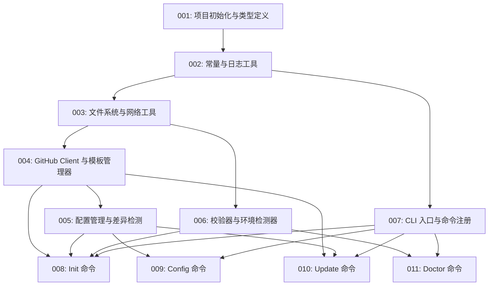

# 故事索引

## 概览

| 故事 | 标题 | 状态 | 依赖 |
|------|------|------|------|
| [001](001-项目初始化与类型定义.md) | 项目初始化与类型定义 | ⏳ 待开始 | - |
| [002](002-常量与日志工具.md) | 常量与日志工具 | ⏳ 待开始 | 001 |
| [003](003-文件系统与网络工具.md) | 文件系统与网络工具 | ⏳ 待开始 | 002 |
| [004](004-GitHub客户端与模板管理器.md) | GitHub Client 与模板管理器 | ⏳ 待开始 | 003 |
| [005](005-配置管理与差异检测.md) | 配置管理与差异检测 | ⏳ 待开始 | 004 |
| [006](006-校验器与环境检测器.md) | 校验器与环境检测器 | ⏳ 待开始 | 003 |
| [007](007-CLI入口与命令注册.md) | CLI 入口与命令注册 | ⏳ 待开始 | 002 |
| [008](008-Init命令.md) | Init 命令 | ⏳ 待开始 | 004, 005, 006, 007 |
| [009](009-Config命令.md) | Config 命令 | ⏳ 待开始 | 005, 007 |
| [010](010-Update命令.md) | Update 命令 | ⏳ 待开始 | 004, 005, 007 |
| [011](011-Doctor命令.md) | Doctor 命令 | ⏳ 待开始 | 006, 007 |

## 依赖关系

## 执行阶段

### Phase 1: 基础设施
1. **001** - 项目初始化与类型定义

### Phase 2: 工具层
2. **002** - 常量与日志工具（依赖 001）

### Phase 3: 核心工具（可并行）
3. **003** - 文件系统与网络工具（依赖 002）
4. **007** - CLI 入口与命令注册（依赖 002）

### Phase 4: 服务层（部分并行）
5. **004** - GitHub Client 与模板管理器（依赖 003）
6. **006** - 校验器与环境检测器（依赖 003）

### Phase 5: 高级服务
7. **005** - 配置管理与差异检测（依赖 004）

### Phase 6: 命令层（部分并行）
8. **008** - Init 命令（依赖 004, 005, 006, 007）
9. **009** - Config 命令（依赖 005, 007）
10. **010** - Update 命令（依赖 004, 005, 007）
11. **011** - Doctor 命令（依赖 006, 007）

## 状态说明

| 状态 | 符号 | 说明 |
|------|------|------|
| 待开始 | ⏳ | 未开始执行 |
| 进行中 | 🔄 | 正在执行 |
| 已完成 | ✅ | 执行完成并验收通过 |
| 已阻塞 | 🚫 | 因依赖未完成而阻塞 |
