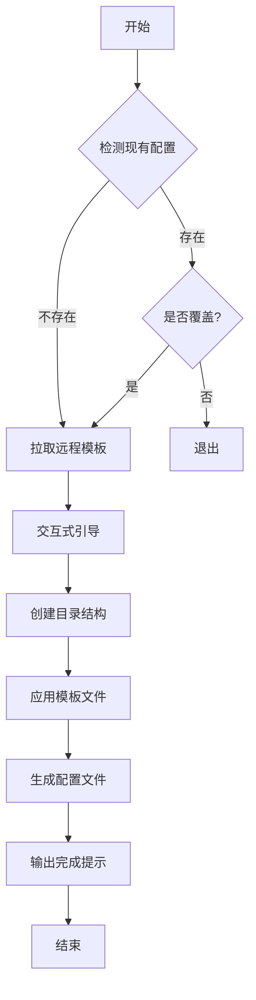
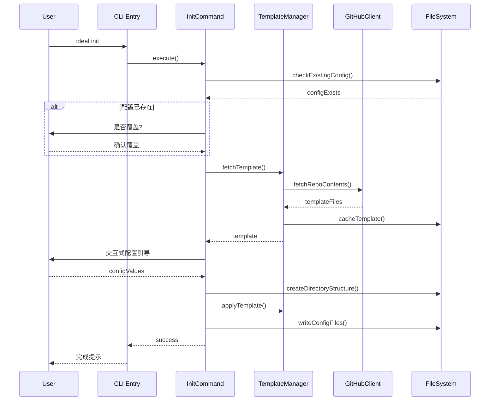
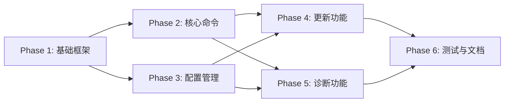

# P3-技术方案：ideal-cli 工作流初始化工具

## 一、方案概述

### 1.1 设计目标

本方案旨在设计并实现 `ideal-cli` 命令行工具，为 CC-Workflow 项目提供一键初始化能力。设计目标如下：

1. **零门槛上手**：用户无需了解内部目录结构，执行一条命令即可完成工作流初始化
2. **跨平台兼容**：支持 macOS、Linux、Windows 三大主流操作系统
3. **版本可控**：支持增量更新，检测冲突并提示用户选择处理策略
4. **可扩展架构**：采用模块化设计，便于后续新增命令和功能

### 1.2 核心设计原则

| 原则 | 说明 |
|------|------|
| 单一职责 | 每个模块只负责一个独立功能，降低耦合度 |
| 依赖倒置 | 核心业务逻辑不依赖具体实现，通过接口抽象实现解耦 |
| 渐进增强 | 核心功能优先，扩展功能迭代完善，不追求一步到位 |
| 防御式编程 | 对外部输入和网络请求进行充分校验，提供清晰的错误提示 |

### 1.3 技术栈选型

| 层级 | 技术选型 | 选型理由 |
|------|----------|----------|
| 运行时 | Node.js 18+ | 需求约束，npm 生态丰富，CLI 工具开发成熟 |
| CLI 框架 | Commander.js | 社区活跃，API 简洁，支持子命令和参数解析 |
| 交互界面 | Inquirer.js | 功能完善，支持多种输入类型，默认值和校验 |
| 模板引擎 | Mustache | 轻量级，语法简单，适合配置文件模板化 |
| 网络请求 | axios | 支持 Promise，拦截器机制便于统一错误处理 |
| 文件操作 | fs-extra | 提供 Promise API，兼容性优于原生 fs |
| 构建工具 | tsup | 基于 esbuild，构建速度快，支持 TypeScript |
| 测试框架 | Vitest | 与 Vite 生态一致，启动快，支持 ESM |

---

## 二、系统架构

### 2.1 整体架构图

```
┌─────────────────────────────────────────────────────────────────┐
│                        CLI Entry (index.ts)                      │
│                     命令行入口，注册所有命令                        │
└─────────────────────────────────────────────────────────────────┘
                                 │
        ┌────────────────────────┼────────────────────────┐
        │                        │                        │
        ▼                        ▼                        ▼
┌───────────────┐      ┌───────────────┐      ┌───────────────┐
│  InitCommand  │      │ ConfigCommand │      │ UpdateCommand │
│   初始化命令   │      │   配置命令     │      │   更新命令     │
└───────────────┘      └───────────────┘      └───────────────┘
        │                        │                        │
        │              ┌─────────┴─────────┐              │
        │              ▼                   ▼              │
        │      ┌───────────────┐  ┌───────────────┐      │
        │      │ DoctorCommand │  │  HelpCommand  │      │
        │      │   诊断命令     │  │   帮助命令     │      │
        │      └───────────────┘  └───────────────┘      │
        │                                                 │
        └─────────────────────┬───────────────────────────┘
                              │
                              ▼
┌─────────────────────────────────────────────────────────────────┐
│                        Core Services Layer                        │
├─────────────────────────────────────────────────────────────────┤
│  ┌─────────────┐  ┌─────────────┐  ┌─────────────┐              │
│  │TemplateMgr  │  │ ConfigMgr   │  │  DiffMgr    │              │
│  │ 模板管理器   │  │ 配置管理器   │  │ 差异管理器   │              │
│  └─────────────┘  └─────────────┘  └─────────────┘              │
│  ┌─────────────┐  ┌─────────────┐  ┌─────────────┐              │
│  │GitHubClient │  │  Validator  │  │  Detector   │              │
│  │ GitHub客户端│  │  校验器      │  │  环境检测器  │              │
│  └─────────────┘  └─────────────┘  └─────────────┘              │
└─────────────────────────────────────────────────────────────────┘
                              │
                              ▼
┌─────────────────────────────────────────────────────────────────┐
│                        Infrastructure Layer                       │
├─────────────────────────────────────────────────────────────────┤
│  ┌─────────────┐  ┌─────────────┐  ┌─────────────┐              │
│  │ FileSystem  │  │   Network   │  │    Logger   │              │
│  │  文件系统    │  │   网络模块   │  │    日志     │              │
│  └─────────────┘  └─────────────┘  └─────────────┘              │
└─────────────────────────────────────────────────────────────────┘
```

### 2.2 目录结构设计

```
ideal-cli/
├── package.json
├── tsconfig.json
├── tsup.config.ts              # 构建配置
├── README.md
├── src/
│   ├── index.ts                # CLI 入口
│   ├── commands/               # 命令模块
│   │   ├── index.ts            # 命令注册
│   │   ├── init.ts             # ideal init
│   │   ├── config.ts           # ideal config
│   │   ├── update.ts           # ideal update
│   │   ├── doctor.ts           # ideal doctor
│   │   └── help.ts             # ideal --help
│   ├── services/               # 核心服务
│   │   ├── template-manager.ts # 模板管理
│   │   ├── config-manager.ts   # 配置管理
│   │   ├── diff-manager.ts     # 差异比对
│   │   └── validator.ts        # 校验服务
│   ├── clients/                # 外部客户端
│   │   └── github-client.ts    # GitHub API 封装
│   ├── utils/                  # 工具函数
│   │   ├── file-system.ts      # 文件操作
│   │   ├── logger.ts           # 日志输出
│   │   └── detector.ts         # 环境检测
│   ├── types/                  # 类型定义
│   │   ├── config.ts           # 配置类型
│   │   ├── template.ts         # 模板类型
│   │   └── index.ts            # 类型导出
│   └── constants/              # 常量定义
│       ├── defaults.ts         # 默认值
│       └── messages.ts         # 提示信息
├── templates/                  # 内置模板（可选离线场景）
│   └── ...
└── tests/                      # 测试文件
    ├── commands/
    ├── services/
    └── utils/
```

---

## 三、功能模块设计

### 3.1 模块总览

| 模块编号 | 模块名称 | 功能描述 | 优先级 |
|----------|----------|----------|--------|
| M001 | Command Registry | 命令注册与路由分发 | P0 |
| M002 | Init Command | 执行工作流初始化流程 | P0 |
| M003 | Config Command | 配置查看与修改 | P1 |
| M004 | Update Command | 模板更新与冲突检测 | P1 |
| M005 | Doctor Command | 环境诊断与检查 | P1 |
| M006 | Template Manager | 模板下载、缓存、应用 | P0 |
| M007 | Config Manager | 配置文件读写与校验 | P1 |
| M008 | Diff Manager | 文件差异比对与冲突检测 | P1 |
| M009 | GitHub Client | GitHub API 交互 | P0 |

### 3.2 模块详细设计

#### M002 Init Command

**职责**：执行完整的工作流初始化流程

**执行流程**：



**交互配置项**：

| 配置项 | 类型 | 默认值 | 必填 |
|--------|------|--------|------|
| projectName | string | 当前目录名 | 是 |
| gitBranch | string | main | 否 |
| techStack | select | Node.js | 否 |
| createExample | confirm | false | 否 |

#### M003 Config Command

**职责**：管理项目配置信息

**子命令设计**：

| 命令 | 功能 | 参数 |
|------|------|------|
| `config list` | 显示所有配置 | 无 |
| `config get <key>` | 获取指定配置 | key: 配置键名 |
| `config set <key> <value>` | 设置配置值 | key, value |

**配置存储位置**：`.claude/project-config.md` 的 YAML frontmatter

#### M004 Update Command

**职责**：同步最新模板，处理冲突

**冲突检测算法**：

1. 计算本地文件的 MD5 哈希值
2. 对比远程版本哈希
3. 若哈希相同 → 无变更，跳过
4. 若哈希不同 → 检查本地是否被用户修改
5. 若被修改 → 提示用户选择处理策略

**冲突处理策略**：

| 选项 | 说明 |
|------|------|
| keep | 保留本地修改，跳过该文件 |
| overwrite | 使用远程版本覆盖本地 |
| merge | 尝试自动合并（简单场景） |
| abort | 中止更新操作 |

#### M005 Doctor Command

**职责**：检查工作流配置完整性

**检查项清单**：

| 检查项 | 检查内容 | 级别 |
|--------|----------|------|
| directory-structure | 必需目录是否存在 | error |
| config-format | CLAUDE.md 格式是否正确 | error |
| project-config | project-config.md 是否存在 | warning |
| node-version | Node.js 版本 >= 18 | warning |
| python-version | Python 版本 >= 3.10 | info |
| version-compat | 模板版本与 CLI 兼容性 | warning |

**输出格式**：

```
✓ directory-structure: 目录结构完整
✓ config-format: 配置文件格式正确
⚠ python-version: Python 版本过低 (3.8 < 3.10)
✓ version-compat: 版本兼容

诊断结果: 3 项通过, 1 项警告
```

#### M006 Template Manager

**职责**：模板的生命周期管理

**核心方法**：

| 方法 | 功能 | 参数 |
|------|------|------|
| `fetchTemplate()` | 从远程拉取模板 | repo, branch |
| `cacheTemplate()` | 缓存模板到本地 | template |
| `applyTemplate()` | 应用模板到目标目录 | template, targetDir |
| `getTemplateVersion()` | 获取模板版本信息 | 无 |

**远程仓库结构**：

仓库地址：`github.com/{owner}/ideal-lab`

```
ideal-lab/                          # 理想实验室（单一仓库）
│
├── best-practices/                 # 最佳实践集合
│   │
│   └── dev-workflow/               # 开发流程最佳实践（当前实现）
│       ├── version.json            # 版本信息
│       ├── agents/                 # Agent 定义（CLI 拉取）
│       │   ├── pm.md
│       │   ├── architect.md
│       │   ├── dev.md
│       │   ├── qa.md
│       │   ├── analyst.md
│       │   └── tech-writer.md
│       ├── skills/                 # Skill 定义（CLI 拉取）
│       │   ├── ideal-requirement/
│       │   │   └── SKILL.md
│       │   ├── ideal-dev-solution/
│       │   │   └── SKILL.md
│       │   ├── ideal-dev-plan/
│       │   │   └── SKILL.md
│       │   ├── ideal-test-case/
│       │   │   └── SKILL.md
│       │   ├── ideal-dev-exec/
│       │   │   └── SKILL.md
│       │   ├── ideal-code-review/
│       │   │   └── SKILL.md
│       │   ├── ideal-test-exec/
│       │   │   └── SKILL.md
│       │   ├── ideal-wiki/
│       │   │   └── SKILL.md
│       │   ├── ideal-flow-control/
│       │   │   └── SKILL.md
│       │   └── ideal-debugging/
│       │       └── SKILL.md
│       ├── configs/                # 配置模板（CLI 拉取）
│       │   ├── CLAUDE.md.tmpl
│       │   └── project-config.md.tmpl
│       ├── scripts/                # 可选：Python 脚本
│       │   └── ...
│       └── README.md
│
├── code-review/                    # 未来扩展：代码审查最佳实践
├── testing/                        # 未来扩展：测试最佳实践
│
└── README.md
```

**CLI 拉取路径**：`ideal-lab/best-practices/dev-workflow/`

**version.json 格式规范**：

```json
{
  "version": "1.0.0",
  "releasedAt": "2026-02-23",
  "changelog": "初始版本发布",
  "minCliVersion": "1.0.0",
  "files": [
    {
      "path": "agents/pm.md",
      "hash": "abc123...",
      "type": "agent"
    }
  ]
}
```

| 字段 | 类型 | 必需 | 说明 |
|------|------|------|------|
| version | string | 是 | 语义化版本号 |
| releasedAt | string | 是 | 发布日期 (YYYY-MM-DD) |
| changelog | string | 否 | 版本变更说明 |
| minCliVersion | string | 是 | 最低兼容 CLI 版本 |
| files | array | 否 | 文件清单（可选，用于增量更新） |

**模板变量说明**：

配置模板（.tmpl 文件）支持以下 Mustache 变量：

| 变量 | 说明 | 示例值 |
|------|------|--------|
| `{{projectName}}` | 项目名称 | my-project |
| `{{gitBranch}}` | Git 主分支 | main |
| `{{techStack}}` | 技术栈类型 | Node.js |
| `{{initializedAt}}` | 初始化时间 | 2026-02-23 |

#### M008 Diff Manager

**职责**：文件差异比对与冲突检测

**差异检测策略**：

1. **原始文件追踪**：记录初始化时模板文件的哈希值
2. **变更检测**：对比当前文件哈希与原始哈希
3. **用户修改判断**：若当前哈希 ≠ 原始哈希，则判定为用户修改

**元数据存储**（`.claude/.metadata.json`）：

```json
{
  "version": "1.0.0",
  "initializedAt": "2026-02-23T10:00:00Z",
  "templateVersion": "1.2.0",
  "files": {
    ".claude/agents/pm.md": {
      "originalHash": "abc123",
      "remoteVersion": "1.2.0"
    }
  }
}
```

---

## 四、数据模型

### 4.1 核心数据模型

#### ProjectConfig

```typescript
interface ProjectConfig {
  // 项目基本信息
  projectName: string;
  gitBranch: string;
  techStack: TechStack;

  // 工作流配置
  workflow: {
    templateRepo: string;
    templateBranch: string;
    lastUpdated: string;
  };

  // 初始化时间
  initializedAt: string;
}

type TechStack = 'React' | 'Vue' | 'Node.js' | 'Python' | 'Other';
```

#### TemplateMeta

```typescript
interface TemplateMeta {
  version: string;
  releasedAt: string;
  changelog?: string;
  files: TemplateFile[];
}

interface TemplateFile {
  path: string;           // 相对于项目根目录
  hash: string;           // MD5 哈希
  size: number;           // 文件大小（字节）
  type: 'agent' | 'skill' | 'config';
}
```

#### DoctorResult

```typescript
interface DoctorResult {
  checks: CheckResult[];
  summary: {
    passed: number;
    warnings: number;
    errors: number;
  };
}

interface CheckResult {
  name: string;
  status: 'pass' | 'warning' | 'error';
  message: string;
  details?: string;
}
```

### 4.2 数据流设计

#### 初始化流程数据流



---

## 五、接口设计

### 5.1 内部接口

| 接口编号 | 接口名称 | 输入 | 输出 | 说明 |
|----------|----------|------|------|------|
| I001 | ICommand.execute | args, options | Promise<void> | 命令执行接口 |
| I002 | ITemplateManager.fetch | repoUrl, branch | Promise<Template> | 获取模板 |
| I003 | ITemplateManager.apply | template, targetDir | Promise<void> | 应用模板 |
| I004 | IConfigManager.read | filePath | Promise<ProjectConfig> | 读取配置 |
| I005 | IConfigManager.write | filePath, config | Promise<void> | 写入配置 |
| I006 | IDiffManager.compare | local, remote | Promise<DiffResult> | 比对差异 |
| I007 | IValidator.validate | data, schema | ValidationResult | 数据校验 |
| I008 | IDetector.checkEnv | 无 | Promise<DoctorResult> | 环境检测 |
| I009 | IGitHubClient.getContents | owner, repo, path | Promise<GitHubFile[]> | 获取仓库内容 |
| I010 | IGitHubClient.getRelease | owner, repo | Promise<ReleaseInfo> | 获取版本信息 |

### 5.2 外部接口

#### GitHub API

| API | 用途 | 认证 |
|-----|------|------|
| `GET /repos/{owner}/{repo}/contents/{path}` | 获取目录内容 | 无需认证（公开仓库） |
| `GET /repos/{owner}/{repo}/releases/latest` | 获取最新版本 | 无需认证 |
| `GET /repos/{owner}/{repo}/git/blobs/{sha}` | 获取文件内容 | 无需认证 |

**限流说明**：GitHub API 对未认证请求限制 60 次/小时，初始化场景下足够使用。

---

## 六、风险分析与应对

### 6.1 主要风险

| 风险项 | 影响程度 | 发生概率 | 应对措施 |
|--------|----------|----------|----------|
| GitHub 访问受限 | 高 | 中 | 支持配置镜像源，提供 Gitee 备选 |
| 模板文件格式变更 | 中 | 低 | 版本兼容性检查，提示用户升级 CLI |
| 跨平台路径问题 | 中 | 中 | 使用 path 模块处理路径，充分测试 |
| 用户数据丢失 | 高 | 低 | 更新前备份，提供回滚机制 |
| npm 安装失败 | 低 | 中 | 提供详细的安装文档和故障排除指南 |

### 6.2 风险应对策略

#### GitHub 访问受限应对

1. **镜像源配置**：支持通过 `--mirror` 参数指定镜像源
2. **内置缓存**：首次成功后缓存模板，后续可离线使用部分功能
3. **代理支持**：支持通过环境变量 `HTTP_PROXY` 配置代理

```bash
# 使用镜像源
ideal init --mirror gitee

# 使用代理
HTTP_PROXY=http://127.0.0.1:7890 ideal init
```

#### 用户数据保护策略

1. **更新前备份**：自动备份被覆盖的文件到 `.claude/.backup/`
2. **确认提示**：涉及文件覆盖时强制用户确认
3. **回滚机制**：提供 `ideal update --rollback` 回滚到上一版本

---

## 七、实施计划

### 7.1 阶段划分

| 阶段 | 内容 | 说明 |
|------|------|------|
| Phase 1 | 基础框架搭建 | CLI 入口、命令注册、日志模块 |
| Phase 2 | 核心命令实现 | init、help 命令 |
| Phase 3 | 配置管理实现 | config 命令、配置文件读写 |
| Phase 4 | 更新功能实现 | update 命令、差异比对、冲突检测 |
| Phase 5 | 诊断功能实现 | doctor 命令、环境检测 |
| Phase 6 | 测试与文档 | 单元测试、集成测试、README 编写 |

### 7.2 依赖关系



---

## 八、参考资料

- [Commander.js 文档](https://github.com/tj/commander.js#readme)
- [Inquirer.js 文档](https://github.com/SBoudrias/Inquirer.js#readme)
- [GitHub REST API](https://docs.github.com/en/rest)
- [Node.js fs 模块](https://nodejs.org/api/fs.html)
- [tsup 构建工具](https://tsup.egoist.dev/)

---

*文档版本: v1.0*
*创建时间: 2026-02-23*
*作者: Claude Code*
