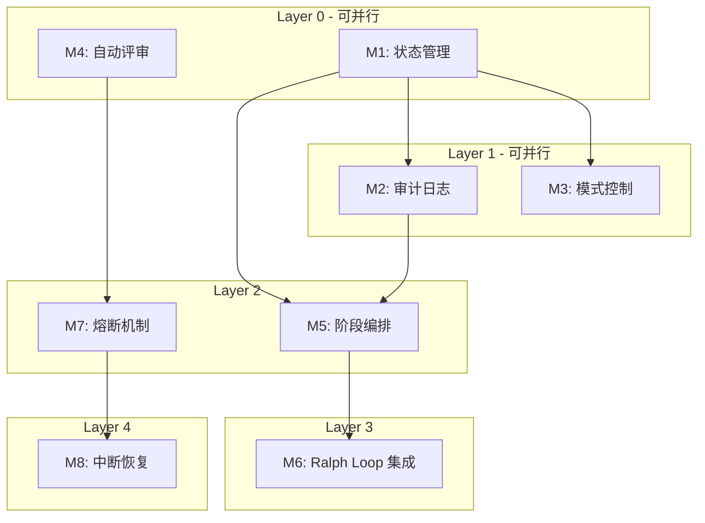

# P5-编码计划

> **For Claude:** REQUIRED SUB-SKILL: Use ideal-dev-exec to implement this plan task-by-task.

**Goal:** 实现 YOLO 模式，支持 P2 评审通过后自动执行 P3-P14 阶段，包含自动评审、熔断机制和中断恢复。

**Architecture:** 新增 ideal-yolo Skill 作为编排层，复用现有 Skills 作为执行层。Ralph Loop 项目内嵌入作为执行引擎，流程状态.md 扩展 YOLO 模式字段。

**Tech Stack:** Shell/Bash (Ralph Loop), Python (状态管理脚本), Markdown (文档和日志), YAML (状态文件)

---

## 概述

| 项目 | 内容 |
|------|------|
| 需求名称 | YOLO 模式 - 自动化全流程执行 |
| 技术方案 | P3-技术方案.md |
| 生成日期 | 2026-02-24 |

---

## 模块总览

| 模块编号 | 模块名称 | 任务数 | 依赖 | 执行策略 | 预估时间 |
|----------|----------|--------|------|----------|----------|
| M1 | 状态管理 (M003) | 4 | - | parallel | 20min |
| M2 | 审计日志 (M006) | 3 | M1 | parallel | 15min |
| M3 | 模式控制 (M001) | 3 | M1 | parallel | 15min |
| M4 | 自动评审 (M005) | 4 | - | parallel | 20min |
| M5 | 阶段编排 (M002) | 4 | M1, M2 | sequential | 25min |
| M6 | Ralph Loop 集成 (M004) | 4 | M5 | sequential | 25min |
| M7 | 熔断机制 (M007) | 3 | M4 | sequential | 20min |
| M8 | 中断恢复 (M008) | 3 | M7 | sequential | 15min |

**总计**: 28 个任务

**时间预估**: 串行 155min → 并行优化后 95min

---

## 任务依赖图



---

## 并行执行计划

| 批次 | 模块 | 说明 |
|------|------|------|
| Batch 1 | M1, M4 | 无依赖，可并行 |
| Batch 2 | M2, M3 | 依赖 M1，可并行 |
| Batch 3 | M5, M7 | 依赖前批次，可并行 |
| Batch 4 | M6 | 依赖 M5 |
| Batch 5 | M8 | 依赖 M7 |

---

## 模块详情

### M1: 状态管理

**目标**: 实现流程状态文件的读写和 YOLO 模式字段扩展

**依赖**: 无

**执行策略**: parallel

**文件范围**:
- 新增: `.claude/skills/ideal-yolo/scripts/yolo-state.py`
- 新增: `.claude/skills/ideal-yolo/references/yolo-state-schema.md`
- 修改: `docs/迭代/*/流程状态.md` (扩展字段)

**任务列表**:

---

#### 任务 M1-T1: 定义 YOLO 模式状态 Schema

**目标**: 定义 yolo_mode 字段的 YAML Schema

**Step 1: 编写失败测试**

```python
# tests/test_yolo_state.py

import pytest
from yolo_state import YoloStateSchema

def test_yolo_state_schema_required_fields():
    """测试 Schema 必填字段验证"""
    schema = YoloStateSchema()
    invalid_data = {"enabled": True}  # 缺少必填字段

    with pytest.raises(ValidationError):
        schema.validate(invalid_data)
```

**Step 2: 运行确认失败**

Run: `pytest tests/test_yolo_state.py -v`
Expected: FAIL with "ValidationError" or "ModuleNotFoundError"

**Step 3: 实现最小代码**

```python
# .claude/skills/ideal-yolo/scripts/yolo_state.py

from dataclasses import dataclass
from typing import List, Optional
from datetime import datetime
from enum import Enum

class YoloStatus(Enum):
    PENDING = "pending"
    IN_PROGRESS = "in_progress"
    PAUSED = "paused"
    COMPLETED = "completed"
    ERROR = "error"

@dataclass
class CircuitBreakerState:
    triggered: bool = False
    reason: Optional[str] = None
    retry_count: int = 0
    triggered_at: Optional[datetime] = None

@dataclass
class AuditLogEntry:
    phase: str
    log_file: str
    status: str
    created_at: Optional[datetime] = None

@dataclass
class YoloModeConfig:
    enabled: bool = False
    status: YoloStatus = YoloStatus.PENDING
    start_time: Optional[datetime] = None
    last_update: Optional[datetime] = None
    completed_phases: List[str] = None
    current_phase: Optional[str] = None
    current_attempt: int = 0
    circuit_breaker: CircuitBreakerState = None
    audit_logs: List[AuditLogEntry] = None

    def __post_init__(self):
        if self.completed_phases is None:
            self.completed_phases = []
        if self.circuit_breaker is None:
            self.circuit_breaker = CircuitBreakerState()
        if self.audit_logs is None:
            self.audit_logs = []
```

**Step 4: 运行确认通过**

Run: `pytest tests/test_yolo_state.py -v`
Expected: PASS

**Step 5: 提交代码**

```bash
git add .claude/skills/ideal-yolo/scripts/yolo_state.py tests/test_yolo_state.py
git commit -m "feat(yolo): add YoloModeConfig schema definition"
```

**验证标准**: Schema 类可正常实例化，必填字段验证通过

---

#### 任务 M1-T2: 实现状态读取函数

**目标**: 从流程状态.md 读取 YOLO 模式配置

**Step 1: 编写失败测试**

```python
# tests/test_yolo_state.py

def test_load_yolo_state_from_file(tmp_path):
    """测试从文件加载 YOLO 状态"""
    state_file = tmp_path / "流程状态.md"
    state_file.write_text("""---
yolo_mode:
  enabled: true
  status: in_progress
  completed_phases: [P3, P4]
---
""")

    from yolo_state import load_yolo_state
    config = load_yolo_state(str(state_file))

    assert config.enabled == True
    assert config.status == YoloStatus.IN_PROGRESS
    assert config.completed_phases == ["P3", "P4"]
```

**Step 2: 运行确认失败**

Run: `pytest tests/test_yolo_state.py::test_load_yolo_state_from_file -v`
Expected: FAIL

**Step 3: 实现最小代码**

```python
# .claude/skills/ideal-yolo/scripts/yolo_state.py (续)

import yaml
from pathlib import Path

def load_yolo_state(file_path: str) -> YoloModeConfig:
    """从流程状态文件加载 YOLO 模式配置"""
    path = Path(file_path)
    if not path.exists():
        return YoloModeConfig()

    content = path.read_text(encoding='utf-8')

    # 解析 YAML frontmatter
    if content.startswith('---'):
        parts = content.split('---', 2)
        if len(parts) >= 3:
            frontmatter = yaml.safe_load(parts[1])
            yolo_data = frontmatter.get('yolo_mode', {})

            return YoloModeConfig(
                enabled=yolo_data.get('enabled', False),
                status=YoloStatus(yolo_data.get('status', 'pending')),
                start_time=_parse_datetime(yolo_data.get('start_time')),
                last_update=_parse_datetime(yolo_data.get('last_update')),
                completed_phases=yolo_data.get('completed_phases', []),
                current_phase=yolo_data.get('current_phase'),
                current_attempt=yolo_data.get('current_attempt', 0),
            )

    return YoloModeConfig()

def _parse_datetime(value):
    if value:
        return datetime.fromisoformat(value.replace('Z', '+00:00'))
    return None
```

**Step 4: 运行确认通过**

Run: `pytest tests/test_yolo_state.py::test_load_yolo_state_from_file -v`
Expected: PASS

**Step 5: 提交代码**

```bash
git add .claude/skills/ideal-yolo/scripts/yolo_state.py tests/test_yolo_state.py
git commit -m "feat(yolo): implement load_yolo_state function"
```

**验证标准**: 可从流程状态.md 正确读取 YOLO 模式配置

---

#### 任务 M1-T3: 实现状态写入函数

**目标**: 将 YOLO 模式配置写入流程状态.md

**Step 1: 编写失败测试**

```python
# tests/test_yolo_state.py

def test_save_yolo_state_to_file(tmp_path):
    """测试保存 YOLO 状态到文件"""
    state_file = tmp_path / "流程状态.md"
    state_file.write_text("""---
current_phase: P2
---
""")

    from yolo_state import save_yolo_state, YoloModeConfig, YoloStatus
    config = YoloModeConfig(
        enabled=True,
        status=YoloStatus.IN_PROGRESS,
        completed_phases=["P3"]
    )

    save_yolo_state(str(state_file), config)

    # 重新加载验证
    loaded = load_yolo_state(str(state_file))
    assert loaded.enabled == True
    assert loaded.status == YoloStatus.IN_PROGRESS
```

**Step 2: 运行确认失败**

Run: `pytest tests/test_yolo_state.py::test_save_yolo_state_to_file -v`
Expected: FAIL

**Step 3: 实现最小代码**

```python
# .claude/skills/ideal-yolo/scripts/yolo_state.py (续)

def save_yolo_state(file_path: str, config: YoloModeConfig) -> bool:
    """保存 YOLO 模式配置到流程状态文件"""
    path = Path(file_path)

    if not path.exists():
        return False

    content = path.read_text(encoding='utf-8')

    # 构建 YOLO 模式 YAML
    yolo_yaml = {
        'yolo_mode': {
            'enabled': config.enabled,
            'status': config.status.value,
            'start_time': _format_datetime(config.start_time),
            'last_update': _format_datetime(datetime.now()),
            'completed_phases': config.completed_phases,
            'current_phase': config.current_phase,
            'current_attempt': config.current_attempt,
            'circuit_breaker': {
                'triggered': config.circuit_breaker.triggered,
                'reason': config.circuit_breaker.reason,
                'retry_count': config.circuit_breaker.retry_count,
            },
            'audit_logs': [
                {'phase': log.phase, 'log_file': log.log_file, 'status': log.status}
                for log in config.audit_logs
            ]
        }
    }

    # 更新 frontmatter
    if content.startswith('---'):
        parts = content.split('---', 2)
        if len(parts) >= 3:
            frontmatter = yaml.safe_load(parts[1]) or {}
            frontmatter.update(yolo_yaml)
            new_content = f"---\n{yaml.dump(frontmatter, allow_unicode=True, default_flow_style=False)}---\n{parts[2]}"
            path.write_text(new_content, encoding='utf-8')
            return True

    return False

def _format_datetime(value):
    if value:
        return value.isoformat().replace('+00:00', 'Z')
    return None
```

**Step 4: 运行确认通过**

Run: `pytest tests/test_yolo_state.py::test_save_yolo_state_to_file -v`
Expected: PASS

**Step 5: 提交代码**

```bash
git add .claude/skills/ideal-yolo/scripts/yolo_state.py tests/test_yolo_state.py
git commit -m "feat(yolo): implement save_yolo_state function"
```

**验证标准**: 可将 YOLO 配置正确写入流程状态.md

---

#### 任务 M1-T4: 实现状态更新便捷函数

**目标**: 提供便捷的状态更新接口

**Step 1: 编写失败测试**

```python
# tests/test_yolo_state.py

def test_update_yolo_phase(tmp_path):
    """测试更新阶段状态"""
    state_file = tmp_path / "流程状态.md"
    # ... setup

    from yolo_state import update_phase_status, YoloStatus

    update_phase_status(str(state_file), "P5", completed=True)

    config = load_yolo_state(str(state_file))
    assert "P5" in config.completed_phases
```

**Step 2: 运行确认失败**

Run: `pytest tests/test_yolo_state.py::test_update_yolo_phase -v`
Expected: FAIL

**Step 3: 实现最小代码**

```python
# .claude/skills/ideal-yolo/scripts/yolo_state.py (续)

def update_phase_status(file_path: str, phase: str, completed: bool = False) -> bool:
    """更新阶段完成状态"""
    config = load_yolo_state(file_path)

    if completed:
        if phase not in config.completed_phases:
            config.completed_phases.append(phase)
    else:
        if phase in config.completed_phases:
            config.completed_phases.remove(phase)

    config.current_phase = phase
    return save_yolo_state(file_path, config)

def set_yolo_status(file_path: str, status: YoloStatus) -> bool:
    """设置 YOLO 模式状态"""
    config = load_yolo_state(file_path)
    config.status = status
    return save_yolo_state(file_path, config)
```

**Step 4: 运行确认通过**

Run: `pytest tests/test_yolo_state.py::test_update_yolo_phase -v`
Expected: PASS

**Step 5: 提交代码**

```bash
git add .claude/skills/ideal-yolo/scripts/yolo_state.py
git commit -m "feat(yolo): add convenience functions for state updates"
```

**验证标准**: update_phase_status 和 set_yolo_status 函数正常工作

---

### M2: 审计日志

**目标**: 实现执行过程日志记录

**依赖**: M1

**执行策略**: parallel (after M1)

**文件范围**:
- 新增: `.claude/skills/ideal-yolo/scripts/yolo-logger.py`
- 新增: `.claude/skills/ideal-yolo/templates/audit-log.md`

**任务列表**:

---

#### 任务 M2-T1: 定义审计日志格式

**目标**: 定义审计日志的数据结构和文件格式

**Step 1: 编写失败测试**

```python
# tests/test_yolo_logger.py

import pytest
from yolo_logger import AuditLogEntry, LogType

def test_audit_log_entry_creation():
    """测试审计日志条目创建"""
    entry = AuditLogEntry(
        phase="P3",
        phase_name="技术方案",
        log_type=LogType.PHASE,
        status="success"
    )

    assert entry.phase == "P3"
    assert entry.log_type == LogType.PHASE
```

**Step 2: 运行确认失败**

Run: `pytest tests/test_yolo_logger.py -v`
Expected: FAIL

**Step 3: 实现最小代码**

```python
# .claude/skills/ideal-yolo/scripts/yolo_logger.py

from dataclasses import dataclass, field
from typing import List, Optional
from datetime import datetime
from enum import Enum

class LogType(Enum):
    PHASE = "phase"
    REVIEW = "review"
    ERROR = "error"

@dataclass
class AuditLogEntry:
    phase: str
    phase_name: str
    log_type: LogType
    status: str  # success, failure, skipped

    start_time: Optional[datetime] = None
    end_time: Optional[datetime] = None
    duration: int = 0

    skill_used: Optional[str] = None
    agent_used: Optional[str] = None
    token_count: int = 0

    output_files: List[str] = field(default_factory=list)

    # 评审专用字段
    review_passed: Optional[bool] = None
    review_comments: List[str] = field(default_factory=list)
    review_suggestions: List[str] = field(default_factory=list)
```

**Step 4: 运行确认通过**

Run: `pytest tests/test_yolo_logger.py -v`
Expected: PASS

**Step 5: 提交代码**

```bash
git add .claude/skills/ideal-yolo/scripts/yolo_logger.py tests/test_yolo_logger.py
git commit -m "feat(yolo): define AuditLogEntry data structure"
```

**验证标准**: AuditLogEntry 可正常实例化

---

#### 任务 M2-T2: 实现日志写入函数

**目标**: 将日志条目写入 Markdown 文件

**Step 1: 编写失败测试**

```python
# tests/test_yolo_logger.py

def test_write_audit_log(tmp_path):
    """测试写入审计日志"""
    from yolo_logger import write_audit_log, AuditLogEntry, LogType

    log_dir = tmp_path / "yolo-logs"
    log_dir.mkdir()

    entry = AuditLogEntry(
        phase="P3",
        phase_name="技术方案",
        log_type=LogType.PHASE,
        status="success",
        skill_used="ideal-dev-solution"
    )

    log_file = write_audit_log(str(log_dir), entry)

    assert log_file.exists()
    content = log_file.read_text()
    assert "P3" in content
    assert "技术方案" in content
```

**Step 2: 运行确认失败**

Run: `pytest tests/test_yolo_logger.py::test_write_audit_log -v`
Expected: FAIL

**Step 3: 实现最小代码**

```python
# .claude/skills/ideal-yolo/scripts/yolo_logger.py (续)

from pathlib import Path

def write_audit_log(log_dir: str, entry: AuditLogEntry) -> Path:
    """写入审计日志到 Markdown 文件"""
    log_path = Path(log_dir)
    log_path.mkdir(parents=True, exist_ok=True)

    # 确定日志文件名
    if entry.log_type == LogType.REVIEW:
        filename = f"review-{entry.phase}.log"
    else:
        filename = f"phase-{entry.phase}.log"

    log_file = log_path / filename

    # 生成 Markdown 内容
    content = f"""# YOLO 执行日志 - {entry.phase_name}

## 执行信息
- 阶段编号: {entry.phase}
- 日志类型: {entry.log_type.value}
- 开始时间: {entry.start_time or 'N/A'}
- 结束时间: {entry.end_time or 'N/A'}
- 执行耗时: {entry.duration} 秒
- Token 消耗: {entry.token_count}

## 执行过程
- 使用 Skill: {entry.skill_used or 'N/A'}
- 使用 Agent: {entry.agent_used or 'N/A'}

## 输出
- 状态: {entry.status}
- 输出文件: {', '.join(entry.output_files) or '无'}
"""

    # 评审专用内容
    if entry.log_type == LogType.REVIEW:
        content += f"""
## 评审结果
- 是否通过: {'是' if entry.review_passed else '否'}
- 评审意见:
{chr(10).join(f'  - {c}' for c in entry.review_comments) if entry.review_comments else '  - 无'}
- 修改建议:
{chr(10).join(f'  - {s}' for s in entry.review_suggestions) if entry.review_suggestions else '  - 无'}
"""

    log_file.write_text(content, encoding='utf-8')
    return log_file
```

**Step 4: 运行确认通过**

Run: `pytest tests/test_yolo_logger.py::test_write_audit_log -v`
Expected: PASS

**Step 5: 提交代码**

```bash
git add .claude/skills/ideal-yolo/scripts/yolo_logger.py tests/test_yolo_logger.py
git commit -m "feat(yolo): implement write_audit_log function"
```

**验证标准**: 日志可正确写入 Markdown 文件

---

#### 任务 M2-T3: 实现日志摘要生成

**目标**: 生成 YOLO 执行摘要日志

**Step 1: 编写失败测试**

```python
# tests/test_yolo_logger.py

def test_generate_summary_log(tmp_path):
    """测试生成摘要日志"""
    from yolo_logger import generate_summary_log

    log_dir = tmp_path / "yolo-logs"
    log_dir.mkdir()

    # 创建一些日志文件
    (log_dir / "phase-P3.log").write_text("# P3")
    (log_dir / "review-P4.log").write_text("# P4")

    summary_file = generate_summary_log(str(log_dir), completed_phases=["P3", "P4"])

    assert summary_file.exists()
    content = summary_file.read_text()
    assert "P3" in content
    assert "P4" in content
```

**Step 2: 运行确认失败**

Run: `pytest tests/test_yolo_logger.py::test_generate_summary_log -v`
Expected: FAIL

**Step 3: 实现最小代码**

```python
# .claude/skills/ideal-yolo/scripts/yolo_logger.py (续)

from typing import List

def generate_summary_log(log_dir: str, completed_phases: List[str]) -> Path:
    """生成 YOLO 执行摘要"""
    log_path = Path(log_dir)
    summary_file = log_path / "summary.log"

    content = f"""# YOLO 模式执行摘要

## 执行概览
- 已完成阶段: {', '.join(completed_phases) or '无'}
- 总阶段数: {len(completed_phases)}

## 阶段详情

| 阶段 | 状态 | 日志文件 |
|------|------|----------|
"""

    for phase in completed_phases:
        phase_log = log_path / f"phase-{phase}.log"
        review_log = log_path / f"review-{phase}.log"

        phase_status = "✅" if phase_log.exists() else "❌"
        review_status = "✅" if review_log.exists() else "❌"

        content += f"| {phase} | {phase_status} 执行 / {review_status} 评审 | phase-{phase}.log |\n"

    content += f"""
## 生成时间
{datetime.now().isoformat()}
"""

    summary_file.write_text(content, encoding='utf-8')
    return summary_file
```

**Step 4: 运行确认通过**

Run: `pytest tests/test_yolo_logger.py::test_generate_summary_log -v`
Expected: PASS

**Step 5: 提交代码**

```bash
git add .claude/skills/ideal-yolo/scripts/yolo_logger.py tests/test_yolo_logger.py
git commit -m "feat(yolo): implement generate_summary_log function"
```

**验证标准**: 摘要日志可正确生成

---

### M3: 模式控制

**目标**: 实现 YOLO 模式启用/禁用/切换

**依赖**: M1

**执行策略**: parallel (after M1)

**文件范围**:
- 新增: `.claude/skills/ideal-yolo/SKILL.md`
- 新增: `.claude/skills/ideal-yolo/scripts/yolo-control.py`

**任务列表**:

---

#### 任务 M3-T1: 实现 enable_yolo 函数

**目标**: 启用 YOLO 模式

**验证标准**: 调用 enable_yolo 后，流程状态.md 中 yolo_mode.enabled 为 true

---

#### 任务 M3-T2: 实现 disable_yolo 函数

**目标**: 禁用 YOLO 模式（降级）

**验证标准**: 调用 disable_yolo 后，流程状态.md 中 yolo_mode.enabled 为 false

---

#### 任务 M3-T3: 实现 check_yolo_status 函数

**目标**: 检查 YOLO 模式状态

**验证标准**: 返回当前 YOLO 模式的完整状态信息

---

### M4: 自动评审

**目标**: 实现各阶段自动评审逻辑

**依赖**: 无

**执行策略**: parallel

**文件范围**:
- 新增: `.claude/skills/ideal-yolo/scripts/yolo-review.py`
- 新增: `.claude/skills/ideal-yolo/references/review-standards.md`

**任务列表**:

---

#### 任务 M4-T1: 定义评审标准数据结构

**目标**: 定义各阶段评审标准

**验证标准**: 评审标准可按阶段查询

---

#### 任务 M4-T2: 实现 auto_review 函数

**目标**: 执行自动评审

**验证标准**: 返回评审结果（通过/不通过 + 意见 + 建议）

---

#### 任务 M4-T3: 实现评审检查清单应用

**目标**: 应用评审检查清单

**验证标准**: 检查清单项逐项验证

---

#### 任务 M4-T4: 实现评审结果生成

**目标**: 生成评审日志

**验证标准**: 评审日志格式正确

---

### M5: 阶段编排

**目标**: 实现 P3-P14 阶段调度

**依赖**: M1, M2

**执行策略**: sequential (after M1, M2)

**文件范围**:
- 新增: `.claude/skills/ideal-yolo/scripts/yolo-orchestrator.py`
- 新增: `.claude/skills/ideal-yolo/references/phase-orchestrator.md`

**任务列表**:

---

#### 任务 M5-T1: 定义阶段编排规则

**目标**: 定义 P3-P14 执行顺序和依赖

**验证标准**: 编排规则可配置

---

#### 任务 M5-T2: 实现 execute_phase 函数

**目标**: 执行单个阶段

**验证标准**: 正确调用对应 Skill

---

#### 任务 M5-T3: 实现阶段链式执行

**目标**: 按顺序执行多个阶段

**验证标准**: 阶段按序执行，评审不通过可重试

---

#### 任务 M5-T4: 实现执行上下文传递

**目标**: 在阶段间传递上下文

**验证标准**: 上下文正确传递

---

### M6: Ralph Loop 集成

**目标**: 嵌入执行引擎

**依赖**: M5

**执行策略**: sequential (after M5)

**文件范围**:
- 新增: `.claude/ralph/ralph-loop.sh`
- 新增: `.claude/ralph/PROMPT.md` (模板)
- 新增: `.claude/ralph/hooks/pre-phase.sh`
- 新增: `.claude/ralph/hooks/post-phase.sh`
- 新增: `.claude/ralph/hooks/on-error.sh`

**任务列表**:

---

#### 任务 M6-T1: 创建 Ralph Loop 基础脚本

**目标**: 实现基础循环执行逻辑

**验证标准**: 脚本可启动并循环执行

---

#### 任务 M6-T2: 实现 PROMPT 模板生成

**目标**: 动态生成执行提示

**验证标准**: PROMPT.md 包含当前需求信息

---

#### 任务 M6-T3: 实现阶段钩子

**目标**: 实现前置/后置/错误钩子

**验证标准**: 钩子在正确时机触发

---

#### 任务 M6-T4: 实现执行监控

**目标**: 监控执行状态

**验证标准**: 可检测执行完成/失败/超时

---

### M7: 熔断机制

**目标**: 实现异常检测和暂停

**依赖**: M4

**执行策略**: sequential (after M4)

**文件范围**:
- 新增: `.claude/skills/ideal-yolo/scripts/yolo-circuit.py`
- 新增: `.claude/skills/ideal-yolo/references/circuit-breaker.md`

**任务列表**:

---

#### 任务 M7-T1: 定义熔断条件

**目标**: 定义触发熔断的阈值

**验证标准**: 熔断条件可配置

---

#### 任务 M7-T2: 实现 check_circuit 函数

**目标**: 检查是否应触发熔断

**验证标准**: 正确检测熔断条件

---

#### 任务 M7-T3: 实现熔断处理

**目标**: 触发熔断后的处理逻辑

**验证标准**: 熔断后正确暂停并记录

---

### M8: 中断恢复

**目标**: 实现断点续传

**依赖**: M7

**执行策略**: sequential (after M7)

**文件范围**:
- 新增: `.claude/skills/ideal-yolo/scripts/yolo-resume.py`
- 新增: `.claude/skills/ideal-yolo/references/recovery-protocol.md`

**任务列表**:

---

#### 任务 M8-T1: 实现中断检测

**目标**: 检测执行中断

**验证标准**: 可识别中断状态

---

#### 任务 M8-T2: 实现状态验证

**目标**: 验证已完成阶段的完整性

**验证标准**: 可检测不完整状态

---

#### 任务 M8-T3: 实现恢复执行

**目标**: 从中断点恢复执行

**验证标准**: 可从中断点继续

---

## 最终验证

**所有批次完成后必须验证**：

```bash
# 运行完整测试套件
pytest tests/ -v

# 预期：所有测试通过（exit 0）
```

**验证清单**：
- [ ] 所有测试通过（有输出证据）
- [ ] 所有任务已完成
- [ ] 代码已提交

---

## 验收标准

| 编号 | 标准 | 验证方式 |
|------|------|----------|
| AC-1 | P2 评审通过后可启用 YOLO 模式 | 手动测试 |
| AC-2 | YOLO 模式可自动执行 P3-P14 | 集成测试 |
| AC-3 | 自动评审生成完整日志 | 检查日志文件 |
| AC-4 | 熔断机制正确触发 | 单元测试 |
| AC-5 | 中断后可恢复执行 | 集成测试 |
| AC-6 | 状态正确持久化 | 检查流程状态.md |

---

## 风险与应对

| 风险 | 影响 | 应对措施 |
|------|------|----------|
| Ralph Loop 不稳定 | 高 | 准备降级方案，支持手动模式 |
| 测试覆盖不足 | 中 | 每个模块必须有单元测试 |
| 集成复杂度高 | 中 | 分批实现，逐步集成 |

---

## 执行交接

计划已完成。选择执行方式：

**选项 1: Subagent-Driven (当前会话)**
- 每任务派遣子代理
- 任务间两阶段审查（规范合规 + 代码质量）
- 快速迭代

**选项 2: Parallel Session (独立会话)**
- 打开新会话
- 调用 ideal-dev-exec 批量执行
- 批次间检查点
