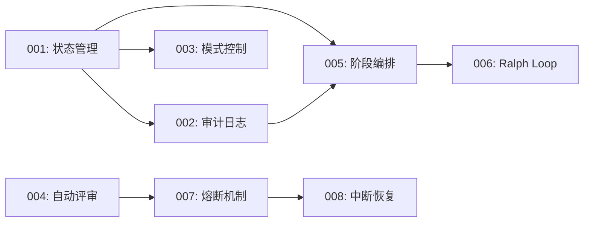

# 故事索引

## 概览

| 故事 | 标题 | 状态 | 依赖 | 预估时间 |
|------|------|------|------|----------|
| [001](001-state-management.md) | 状态管理模块 | ⏳ 待开始 | - | 20min |
| [002](002-audit-logging.md) | 审计日志模块 | ⏳ 待开始 | 001 | 15min |
| [003](003-mode-control.md) | 模式控制模块 | ⏳ 待开始 | 001 | 15min |
| [004](004-auto-review.md) | 自动评审模块 | ⏳ 待开始 | - | 20min |
| [005](005-phase-orchestrator.md) | 阶段编排模块 | ⏳ 待开始 | 001, 002 | 25min |
| [006](006-ralph-loop-integration.md) | Ralph Loop 集成模块 | ⏳ 待开始 | 005 | 25min |
| [007](007-circuit-breaker.md) | 熔断机制模块 | ⏳ 待开始 | 004 | 20min |
| [008](008-interrupt-recovery.md) | 中断恢复模块 | ⏳ 待开始 | 007 | 15min |

**总预估时间**: 串行 155min → 并行优化后 95min

## 依赖关系

## 执行顺序

### Batch 1 (可并行)
- 001: 状态管理模块
- 004: 自动评审模块

### Batch 2 (可并行)
- 002: 审计日志模块
- 003: 模式控制模块

### Batch 3 (可并行)
- 005: 阶段编排模块
- 007: 熔断机制模块

### Batch 4 (串行)
- 006: Ralph Loop 集成模块

### Batch 5 (串行)
- 008: 中断恢复模块

## 状态说明

- ⏳ 待开始：尚未开始
- 🔄 进行中：正在开发
- ✅ 已完成：开发和测试完成
- ❌ 已阻塞：遇到问题需要解决
